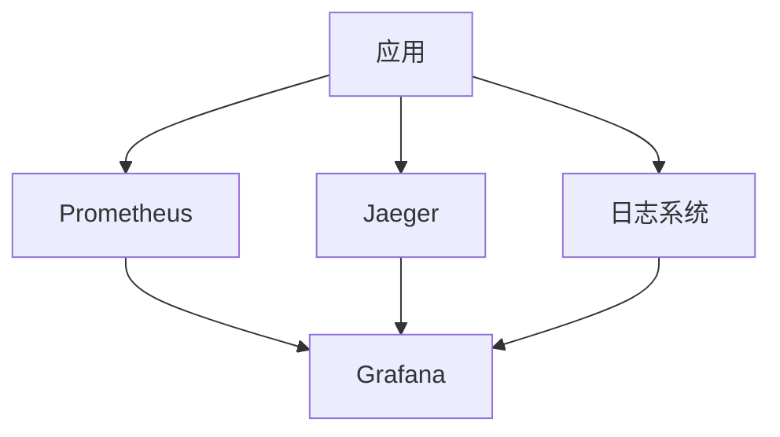
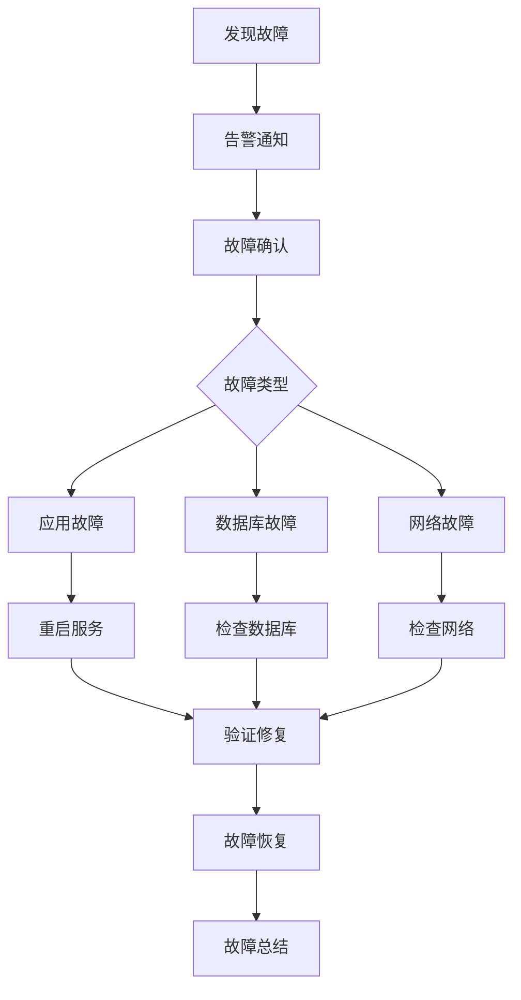

# 运维文档

## 📋 文档信息

- **项目名称**：企业级AI综合管理平台
- **文档版本**：v1.0
- **创建日期**：2026-01-13
- **文档类型**：运维文档

---

## 1. 系统监控方案

### 1.1 监控架构



### 1.2 监控指标

| 指标类型 | 监控项 | 告警阈值 |
|---------|--------|---------|
| **应用指标** | QPS、响应时间、错误率 | QPS<100、响应时间>500ms、错误率>1% |
| **系统指标** | CPU、内存、磁盘、网络 | CPU>80%、内存>85%、磁盘>90% |
| **数据库指标** | 连接数、慢查询、主从延迟 | 连接数>80%、慢查询>1s、主从延迟>100ms |
| **缓存指标** | 命中率、内存使用、连接数 | 命中率<80%、内存使用>85% |

---

## 2. 日志管理方案

### 2.1 日志分类

| 日志类型 | 存储位置 | 保留时间 | 日志级别 |
|---------|---------|---------|---------|
| **应用日志** | /var/log/app/ | 30天 | DEBUG/INFO/WARNING/ERROR |
| **访问日志** | /var/log/nginx/ | 30天 | INFO |
| **错误日志** | /var/log/error/ | 90天 | ERROR |
| **审计日志** | /var/log/audit/ | 180天 | INFO |

### 2.2 日志配置

```python
# utils/logger.py
import sys
from loguru import logger
from pathlib import Path

# 配置日志
logger.remove()
logger.add(
    sys.stderr,
    level="DEBUG",
    format="<green>{time:YYYY-MM-DD HH:mm:ss}</green> | <level>{level: <8}</level> | <cyan>{name}</cyan>:<cyan>{function}</cyan>:<cyan>{line}</cyan> - <level>{message}</level>"
)

# 文件日志
logger.add(
    "logs/app.log",
    rotation="100 MB",
    retention="30 days",
    level="INFO",
    format="{time:YYYY-MM-DD HH:mm:ss} | {level: <8} | {name}:{function}:{line} - {message}"
)

# 错误日志
logger.add(
    "logs/error.log",
    rotation="50 MB",
    retention="90 days",
    level="ERROR",
    format="{time:YYYY-MM-DD HH:mm:ss} | {level: <8} | {name}:{function}:{line} - {message}"
)
```

---

## 3. 告警配置

### 3.1 告警规则

| 告警级别 | 触发条件 | 通知方式 |
|---------|---------|---------|
| **紧急** | 应用宕机、数据库不可用 | 电话+短信+邮件 |
| **重要** | 响应时间>1s、错误率>5% | 短信+邮件 |
| **一般** | CPU>80%、内存>85% | 邮件 |

### 3.2 告警通知

```yaml
# prometheus/alerts.yml
groups:
  - name: 应用告警
    rules:
      - alert: 应用错误率过高
        expr: rate(http_requests_total{status=~"5.."}[5m]) > 0.05
        for: 2m
        labels:
          severity: 重要
        annotations:
          summary: "应用错误率过高"
          description: "应用{{ $labels.instance }} 错误率超过5%"

      - alert: 应用响应时间过长
        expr: histogram_quantile(0.95, http_request_duration_seconds_bucket) > 1
        for: 5m
        labels:
          severity: 一般
        annotations:
          summary: "应用响应时间过长"
          description: "应用{{ $labels.instance }} 95%分位响应时间超过1秒"
```

---

## 4. 故障处理流程

### 4.1 故障处理流程图



### 4.2 故障处理清单

- [ ] 确认故障现象
- [ ] 检查日志
- [ ] 检查监控指标
- [ ] 定位故障原因
- [ ] 制定修复方案
- [ ] 执行修复操作
- [ ] 验证修复结果
- [ ] 编写故障报告

---

## 5. 备份恢复策略

### 5.1 备份策略

| 备份类型 | 备份内容 | 备份频率 | 保留时间 |
|---------|---------|---------|---------|
| **数据库备份** | MySQL数据 | 每天 | 30天 |
| **配置备份** | 配置文件 | 每周 | 90天 |
| **日志备份** | 日志文件 | 每天 | 30天 |

### 5.2 备份脚本

```bash
#!/bin/bash

# backup.sh

# 数据库备份
mysqldump -h localhost -u root -p12345678 mcp_platform > backup/mcp_platform_$(date +%Y%m%d).sql

# 配置文件备份
tar -czf backup/config_$(date +%Y%m%d).tar.gz config/

# 日志备份
tar -czf backup/logs_$(date +%Y%m%d).tar.gz logs/

# 清理30天前的备份
find backup -name "*.sql" -mtime +30 -delete
find backup -name "*.tar.gz" -mtime +30 -delete
```

### 5.3 恢复流程

```bash
# 数据库恢复
mysql -h localhost -u root -p12345678 mcp_platform < backup/mcp_platform_20260113.sql

# 配置文件恢复
tar -xzf backup/config_20260113.tar.gz -C /

# 日志恢复
tar -xzf backup/logs_20260113.tar.gz -C /
```

---

## 6. 性能调优指南

### 6.1 数据库优化

```sql
-- 慢查询分析
SELECT * FROM slow_query_log ORDER BY query_time DESC LIMIT 10;

-- 索引优化
CREATE INDEX idx_username ON users(username);
CREATE INDEX idx_email ON users(email);

-- 查询优化
EXPLAIN SELECT * FROM users WHERE username = 'admin';
```

### 6.2 应用优化

```python
# 使用连接池
from sqlalchemy.pool import QueuePool

engine = create_engine(
    DATABASE_URL,
    poolclass=QueuePool,
    pool_size=10,
    max_overflow=20,
    pool_timeout=30,
    pool_recycle=3600
)

# 使用缓存
from functools import lru_cache

@lru_cache(maxsize=128)
def get_user_info(user_id: str):
    # 缓存用户信息
    pass
```

---

## 7. 日常巡检清单

### 7.1 每日巡检

- [ ] 检查服务状态
- [ ] 检查错误日志
- [ ] 检查监控指标
- [ ] 检查磁盘空间
- [ ] 检查备份状态

### 7.2 每周巡检

- [ ] 检查系统更新
- [ ] 检查安全漏洞
- [ ] 检查性能趋势
- [ ] 检查日志归档
- [ ] 检查备份完整性

### 7.3 每月巡检

- [ ] 容量规划评估
- [ ] 性能测试
- [ ] 灾备恢复演练
- [ ] 安全审计
- [ ] 运维文档更新

---

## 🔗 相关文档

- [部署文档](./8-部署文档.md)
- [安全文档](./11-安全文档.md)
- [性能优化文档](./12-性能优化文档.md)

---

## 💡 注意事项

1. **监控告警**：及时响应告警，避免问题扩大
2. **日志管理**：定期清理日志，避免磁盘占满
3. **备份验证**：定期验证备份的可用性
4. **故障总结**：每次故障后编写故障报告
5. **文档更新**：及时更新运维文档

---

**文档版本历史**：

| 版本 | 日期 | 作者 | 变更说明 |
|-----|------|------|---------|
| v1.0 | 2026-01-13 | AI助手 | 初始版本 |

---