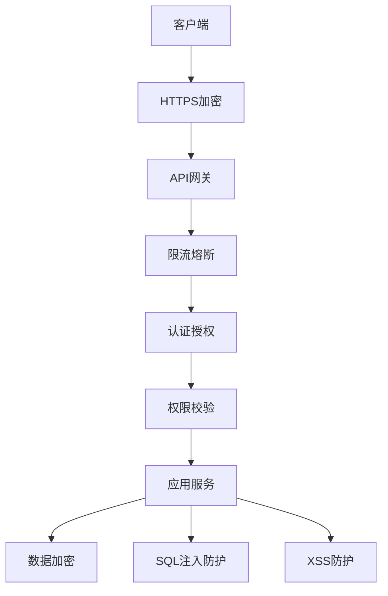

# 安全文档

## 📋 文档信息

- **项目名称**：企业级AI综合管理平台
- **文档版本**：v1.0
- **创建日期**：2026-01-13
- **文档类型**：安全文档

---

## 1. 安全架构设计

### 1.1 安全架构图



### 1.2 安全层次

| 层次 | 安全措施 |
|-----|---------|
| **传输层** | HTTPS/TLS 1.3 |
| **网关层** | 限流熔断、IP白名单 |
| **认证层** | JWT + API Key双认证 |
| **授权层** | RBAC + ABAC权限模型 |
| **应用层** | 参数验证、数据加密 |
| **数据层** | 敏感数据加密、SQL注入防护 |

---

## 2. 认证授权机制

### 2.1 JWT认证

```python
# auth/jwt_handler.py
from datetime import datetime, timedelta
from jose import JWTError, jwt
from passlib.context import CryptContext

pwd_context = CryptContext(schemes=["bcrypt"], deprecated="auto")

SECRET_KEY = "your-secret-key-here"
ALGORITHM = "HS256"
ACCESS_TOKEN_EXPIRE_MINUTES = 1440

def create_access_token(data: dict):
    """创建访问令牌"""
    to_encode = data.copy()
    expire = datetime.utcnow() + timedelta(minutes=ACCESS_TOKEN_EXPIRE_MINUTES)
    to_encode.update({"exp": expire})
    encoded_jwt = jwt.encode(to_encode, SECRET_KEY, algorithm=ALGORITHM)
    return encoded_jwt

def verify_token(token: str):
    """验证令牌"""
    try:
        payload = jwt.decode(token, SECRET_KEY, algorithms=[ALGORITHM])
        return payload
    except JWTError:
        return None

def get_password_hash(password: str):
    """获取密码哈希"""
    return pwd_context.hash(password)

def verify_password(plain_password: str, hashed_password: str):
    """验证密码"""
    return pwd_context.verify(plain_password, hashed_password)
```

### 2.2 API Key认证

```python
# auth/api_key_handler.py
import secrets
from typing import Optional
from sqlalchemy.orm import Session
from app.models.api_key import ApiKey

def generate_api_key(prefix: str = "agent") -> str:
    """生成API Key"""
    random_part = secrets.token_urlsafe(32)
    return f"{prefix}_{random_part}"

def verify_api_key(api_key: str, db: Session) -> Optional[dict]:
    """验证API Key"""
    key_obj = db.query(ApiKey).filter(
        ApiKey.key == api_key,
        ApiKey.is_active == True
    ).first()
    
    if not key_obj:
        return None
    
    if key_obj.is_expired():
        return None
    
    return {
        "id": key_obj.id,
        "user_id": key_obj.user_id,
        "scopes": key_obj.scopes
    }
```

---

## 3. 数据加密方案

### 3.1 敏感数据加密

```python
# utils/crypto.py
from cryptography.fernet import Fernet
from cryptography.hazmat.primitives import hashes
from cryptography.hazmat.primitives.kdf.pbkdf2 import PBKDF2HMAC
import base64

# 加密密钥
ENCRYPTION_KEY = b'your-encryption-key-here-32-bytes-long'

# 创建加密器
cipher_suite = Fernet(ENCRYPTION_KEY)

def encrypt_data(data: str) -> str:
    """加密数据"""
    encrypted = cipher_suite.encrypt(data.encode())
    return base64.urlsafe_b64encode(encrypted).decode()

def decrypt_data(encrypted_data: str) -> str:
    """解密数据"""
    encrypted = base64.urlsafe_b64decode(encrypted_data.encode())
    decrypted = cipher_suite.decrypt(encrypted)
    return decrypted.decode()

# 密码加密
def hash_password(password: str) -> str:
    """密码哈希"""
    import bcrypt
    return bcrypt.hashpw(password.encode(), bcrypt.gensalt()).decode()

def verify_password(plain: str, hashed: str) -> bool:
    """验证密码"""
    import bcrypt
    return bcrypt.checkpw(plain.encode(), hashed.encode())
```

### 3.2 传输加密

```python
# 配置HTTPS
from fastapi import FastAPI
from fastapi.middleware.httpsredirect import HTTPSRedirectMiddleware

app = FastAPI()

# 强制HTTPS
app.add_middleware(HTTPSRedirectMiddleware)

# 配置SSL/TLS
# 在生产环境配置有效的SSL证书
```

---

## 4. SQL注入防护

### 4.1 参数化查询

```python
# 错误示例（易受SQL注入）
def get_user_by_username(username: str):
    query = f"SELECT * FROM users WHERE username = '{username}'"
    # 如果username包含恶意SQL代码，会导致SQL注入

# 正确示例（参数化查询）
def get_user_by_username(username: str):
    from sqlalchemy import text
    query = text("SELECT * FROM users WHERE username = :username")
    result = db.execute(query, {"username": username})
    return result.fetchall()

# 使用ORM
def get_user_by_username(username: str):
    user = db.query(User).filter(User.username == username).first()
    return user
```

### 4.2 输入验证

```python
from pydantic import validator, BaseModel

class UserCreateRequest(BaseModel):
    username: str
    email: str
    password: str
    
    @validator('username')
    def validate_username(cls, v):
        if not v.isalnum():
            raise ValueError('用户名只能包含字母和数字')
        if len(v) < 3 or len(v) > 50:
            raise ValueError('用户名长度必须在3-50之间')
        return v
    
    @validator('email')
    def validate_email(cls, v):
        import re
        email_regex = r'^[a-zA-Z0-9._%+-]+@[a-zA-Z0-9.-]+\.[a-zA-Z]{2,}$'
        if not re.match(email_regex, v):
            raise ValueError('邮箱格式不正确')
        return v
    
    @validator('password')
    def validate_password(cls, v):
        if len(v) < 8:
            raise ValueError('密码长度不能少于8位')
        if not any(c.isupper() for c in v):
            raise ValueError('密码必须包含大写字母')
        if not any(c.islower() for c in v):
            raise ValueError('密码必须包含小写字母')
        if not any(c.isdigit() for c in v):
            raise ValueError('密码必须包含数字')
        return v
```

---

## 5. XSS防护

### 5.1 输出编码

```python
from html import escape

def render_user_comment(comment: str) -> str:
    """渲染用户评论，防止XSS攻击"""
    # 转义HTML特殊字符
    safe_comment = escape(comment)
    return safe_comment
```

### 5.2 CSP策略

```python
# 配置Content Security Policy
from fastapi.middleware.cors import CORSMiddleware
from fastapi.middleware.trustedhost import TrustedHostMiddleware

app = FastAPI()

# CSP头
@app.middleware("http")
async def add_security_headers(request, call_next):
    response = await call_next(request)
    response.headers["X-Content-Type-Options"] = "nosniff"
    response.headers["X-Frame-Options"] = "DENY"
    response.headers["X-XSS-Protection"] = "1; mode=block"
    response.headers["Content-Security-Policy"] = "default-src 'self'"
    return response
```

---

## 6. CSRF防护

### 6.1 CSRF Token

```python
from fastapi import Depends, HTTPException, Request
from starlette.middleware.base import BaseHTTPMiddleware
import secrets

class CSRFMiddleware(BaseHTTPMiddleware):
    async def dispatch(self, request, request.call_next):
        if request.method in ["POST", "PUT", "DELETE", "PATCH"]:
            csrf_token = request.cookies.get("csrf_token")
            if not csrf_token:
                raise HTTPException(status_code=403, detail="CSRF token missing")
            
            # 验证CSRF token
            if not secrets.compare_digest(
                csrf_token,
                request.headers.get("X-CSRF-Token", "")
            ):
                raise HTTPException(status_code=403, detail="Invalid CSRF token")
        
        response = await request.call_next(request)
        return response

app.add_middleware(CSRFMiddleware)
```

---

## 7. API安全规范

### 7.1 限流防护

```python
from slowapi import Limiter, _rate_for
from fastapi import Request, HTTPException
from fastapi.responses import JSONResponse

limiter = Limiter(key_func=_rate_for)

@app.get("/api/v1/users")
@limiter.limit("100/minute")
async def get_users(request: Request):
    """获取用户列表，限流：每分钟100次"""
    users = user_service.get_users()
    return JSONResponse(content=users)
```

### 7.2 请求大小限制

```python
from fastapi import FastAPI, HTTPException

app = FastAPI()

@app.middleware("http")
async def limit_request_size(request: Request, call_next):
    content_length = request.headers.get("content-length")
    if content_length and int(content_length) > 10 * 1024 * 1024:  # 10MB
        raise HTTPException(status_code=413, detail="请求体过大")
    return await call_next(request)
```

---

## 8. 安全审计日志

### 8.1 审计日志记录

```python
# utils/audit_logger.py
from loguru import logger
from datetime import datetime

class AuditLogger:
    @staticmethod
    def log_operation(
        user_id: str,
        tenant_id: str,
        operation: str,
        resource: str,
        result: str,
        details: dict = None
    ):
        """记录操作日志"""
        log_data = {
            "timestamp": datetime.now().isoformat(),
            "user_id": user_id,
            "tenant_id": tenant_id,
            "operation": operation,
            "resource": resource,
            "result": result,
            "details": details or {}
        }
        logger.info(f"AUDIT: {log_data}")
        
        # 保存到数据库
        # audit_log_service.create(log_data)
```

---

## 🔗 相关文档

- [技术架构设计文档](./2-技术架构设计文档.md)
- [运维文档](./10-运维文档.md)
- [性能优化文档](./12-性能优化文档.md)

---

## 💡 注意事项

1. **密钥管理**：不要在代码中硬编码密钥，使用环境变量
2. **定期更新**：定期更新依赖库，修复安全漏洞
3. **安全审计**：定期进行安全审计和渗透测试
4. **权限最小化**：遵循最小权限原则
5. **安全培训**：定期进行安全培训和意识教育

---

**文档版本历史**：

| 版本 | 日期 | 作者 | 变更说明 |
|-----|------|------|---------|
| v1.0 | 2026-01-13 | AI助手 | 初始版本 |

---