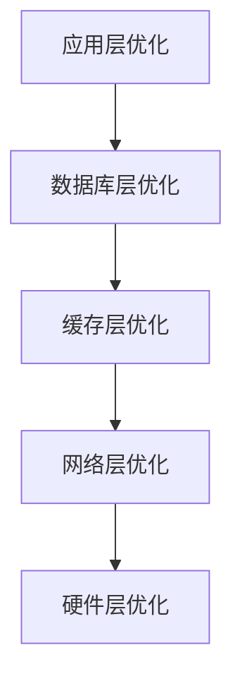

# 性能优化文档

## 📋 文档信息

- **项目名称**：企业级AI综合管理平台
- **文档版本**：v1.0
- **创建日期**：2026-01-13
- **文档类型**：性能优化文档

---

## 1. 性能优化策略

### 1.1 性能优化层次



### 1.2 优化目标

| 指标 | 当前值 | 目标值 | 优化方法 |
|-----|--------|--------|---------|
| **响应时间** | 500ms | <200ms | 缓存、异步、优化查询 |
| **吞吐量** | 500 TPS | >1000 TPS | 连接池、异步处理 |
| **并发用户** | 500 | >1000 | 水平扩展、负载均衡 |

---

## 2. 数据库优化方案

### 2.1 索引优化

```sql
-- 查询慢查询
SELECT * FROM slow_query_log ORDER BY query_time DESC LIMIT 10;

-- 添加索引
CREATE INDEX idx_username ON users(username);
CREATE INDEX idx_email ON users(email);
CREATE INDEX idx_tenant_id ON users(tenant_id);
CREATE INDEX idx_status ON users(status);

-- 复合索引
CREATE INDEX idx_tenant_status ON users(tenant_id, status);

-- 删除无用索引
DROP INDEX idx_unused_index;
```

### 2.2 查询优化

```python
# 错误示例：N+1查询
def get_users_with_roles():
    users = db.query(User).all()
    result = []
    for user in users:
        roles = db.query(Role).filter(Role.user_id == user.id).all()
        result.append({
            "user": user,
            "roles": roles
        })
    return result

# 正确示例：使用JOIN
def get_users_with_roles():
    result = db.query(User).join(UserRole).join(Role).all()
    return result

# 使用批量插入
def batch_create_users(users: List[dict]):
    db.bulk_insert_mappings(User, users)
    db.commit()
```

### 2.3 连接池优化

```python
# 配置连接池
from sqlalchemy.pool import QueuePool

engine = create_engine(
    DATABASE_URL,
    poolclass=QueuePool,
    pool_size=10,          # 连接池大小
    max_overflow=20,       # 最大溢出连接数
    pool_timeout=30,       # 连接超时时间（秒）
    pool_recycle=3600,     # 连接回收时间（秒）
    pool_pre_ping=True,     # 连接前检查
    echo=False             # 生产环境关闭SQL日志
)
```

---

## 3. 缓存优化方案

### 3.1 多级缓存

```python
# utils/cache.py
from functools import lru_cache
from typing import Any, Optional

class CacheManager:
    def __init__(self):
        self.local_cache = {}  # L1缓存
        self.redis_client = None  # L2缓存
    
    async def get(self, key: str) -> Optional[Any]:
        # L1缓存
        if key in self.local_cache:
            return self.local_cache[key]
        
        # L2缓存
        if self.redis_client:
            value = await self.redis_client.get(key)
            if value:
                self.local_cache[key] = value
                return value
        
        return None
    
    async def set(self, key: str, value: Any, ttl: int = 3600):
        # L1缓存
        self.local_cache[key] = value
        
        # L2缓存
        if self.redis_client:
            await self.redis_client.setex(key, ttl, value)
    
    async def delete(self, key: str):
        # 删除L1缓存
        if key in self.local_cache:
            del self.local_cache[key]
        
        # 删除L2缓存
        if self.redis_client:
            await self.redis_client.delete(key)
    
    async def clear(self):
        # 清空L1缓存
        self.local_cache.clear()
        
        # 清空L2缓存
        if self.redis_client:
            await self.redis_client.flushdb()

# 使用缓存装饰器
def cache_result(ttl: int = 3600):
    def decorator(func):
        async def wrapper(*args, **kwargs):
            cache_key = f"{func.__name__}:{str(args)}:{str(kwargs)}"
            cached = await cache_manager.get(cache_key)
            if cached:
                return cached
            
            result = await func(*args, **kwargs)
            await cache_manager.set(cache_key, result, ttl)
            return result
        return wrapper
    return decorator
```

### 3.2 缓存策略

| 数据类型 | 缓存时间 | 更新策略 |
|---------|---------|---------|
| **用户信息** | 30分钟 | 用户更新时清空 |
| **权限数据** | 1小时 | 权限变更时清空 |
| **字典数据** | 24小时 | 字典更新时清空 |
| **菜单数据** | 1小时 | 菜单变更时清空 |
| **统计数据** | 5分钟 | 定时刷新 |

---

## 4. 接口优化方案

### 4.1 异步处理

```python
from fastapi import FastAPI
import asyncio

app = FastAPI()

@app.post("/api/v1/users/batch")
async def batch_create_users(users: List[dict]):
    """批量创建用户（异步）"""
    tasks = []
    for user_data in users:
        task = asyncio.create_task(create_user_async(user_data))
        tasks.append(task)
    
    results = await asyncio.gather(*tasks)
    return {"success": True, "data": results}

async def create_user_async(user_data: dict):
    """异步创建用户"""
    # 模拟异步操作
    await asyncio.sleep(0.1)
    return {"id": "1", **user_data}
```

### 4.2 分页优化

```python
@app.get("/api/v1/users")
async def get_users(page: int = 1, size: int = 10):
    """获取用户列表（优化分页）"""
    # 使用游标分页，避免OFFSET
    if page > 1:
        last_id = get_last_id(page, size)
        users = db.query(User).filter(
            User.id > last_id
        ).limit(size).all()
    else:
        users = db.query(User).limit(size).all()
    
    return {
        "items": users,
        "page": page,
        "size": size
    }
```

---

## 5. 前端性能优化

### 5.1 路由懒加载

```typescript
// router/index.ts
const routes = [
  {
    path: '/dashboard',
    component: () => import('@/views/dashboard/Index.vue')
  },
  {
    path: '/system/user',
    component: () => import('@/views/system/User.vue')
  }
]
```

### 5.2 组件懒加载

```vue
<script setup lang="ts">
import { defineAsyncComponent } from 'vue'

const HeavyComponent = defineAsyncComponent(() =>
  import('./HeavyComponent.vue')
)
</script>
```

### 5.3 打包优化

```typescript
// vite.config.ts
export default defineConfig({
  build: {
    rollupOptions: {
      output: {
        manualChunks: {
          'vue-vendor': ['vue', 'vue-router', 'pinia'],
          'element-plus': ['element-plus'],
          'axios': ['axios']
        }
      }
    },
    chunkSizeWarningLimit: 1000
  }
})
```

---

## 6. 性能测试方案

### 6.1 性能测试工具

| 工具 | 用途 |
|-----|------|
| **JMeter** | 压力测试、性能测试 |
| **Locust** | 分布式负载测试 |
| **Pytest-benchmark** | Python代码性能测试 |
| **Lighthouse** | 前端性能测试 |

### 6.2 性能测试脚本

```python
# tests/benchmark/test_user_query.py
import pytest
import time
from app.services.user_service import UserService

def benchmark_get_user(benchmark):
    """性能测试：查询用户"""
    user_service = UserService()
    
    # 预热
    user_service.get_user("1")
    
    # 测试
    start_time = time.time()
    for _ in range(1000):
        user_service.get_user("1")
    end_time = time.time()
    
    return end_time - start_time
```

---

## 7. 性能监控指标

### 7.1 关键指标

| 指标 | 目标值 | 监控工具 |
|-----|--------|---------|
| **P95响应时间** | <200ms | Prometheus |
| **P99响应时间** | <500ms | Prometheus |
| **错误率** | <1% | Prometheus |
| **吞吐量** | >1000 TPS | Prometheus |
| **CPU使用率** | <70% | Prometheus |
| **内存使用率** | <80% | Prometheus |

### 7.2 Grafana仪表板

```json
{
  "dashboard": {
    "title": "应用性能监控",
    "panels": [
      {
        "title": "QPS",
        "targets": [
          {
            "expr": "rate(http_requests_total[1m])"
          }
        ]
      },
      {
        "title": "响应时间",
        "targets": [
          {
            "expr": "histogram_quantile(0.95, http_request_duration_seconds_bucket)"
          }
        ]
      },
      {
        "title": "错误率",
        "targets": [
          {
            "expr": "rate(http_requests_total{status=~\"5..\"}[1m]) / rate(http_requests_total[1m])"
          }
        ]
      }
    ]
  }
}
```

---

## 8. 性能优化案例

### 8.1 案例1：用户查询优化

**问题**：用户查询响应时间500ms

**分析**：N+1查询问题

**优化**：
1. 使用JOIN替代多次查询
2. 添加索引
3. 使用缓存

**结果**：响应时间降低到50ms

### 8.2 案例2：权限校验优化

**问题**：权限校验每次都查询数据库

**优化**：
1. 使用多级缓存
2. 权限变更时清空缓存
3. 使用本地缓存+Redis缓存

**结果**：响应时间降低到10ms

---

## 🔗 相关文档

- [技术架构设计文档](./2-技术架构设计文档.md)
- [运维文档](./10-运维文档.md)
- [安全文档](./11-安全文档.md)

---

## 💡 注意事项

1. **性能测试**：定期进行性能测试，及时发现性能问题
2. **监控告警**：配置性能监控告警，及时发现问题
3. **优化验证**：优化后进行性能测试，验证优化效果
4. **持续优化**：性能优化是持续的过程，需要持续改进
5. **文档更新**：优化后及时更新性能文档

---

**文档版本历史**：

| 版本 | 日期 | 作者 | 变更说明 |
|-----|------|------|---------|
| v1.0 | 2026-01-13 | AI助手 | 初始版本 |

---