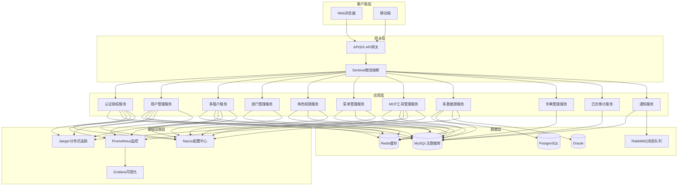
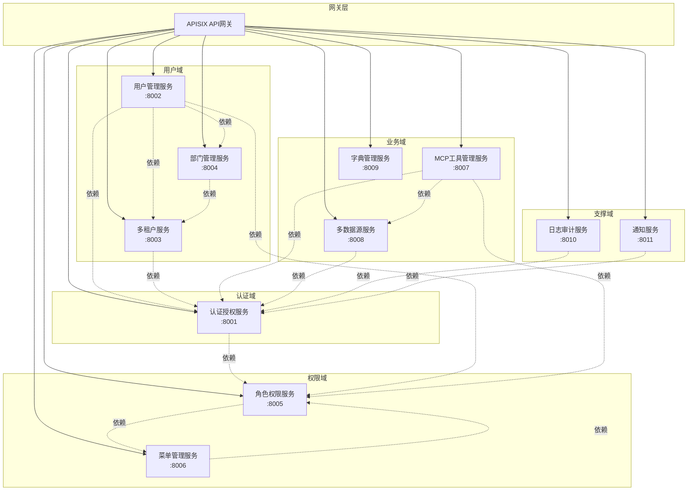
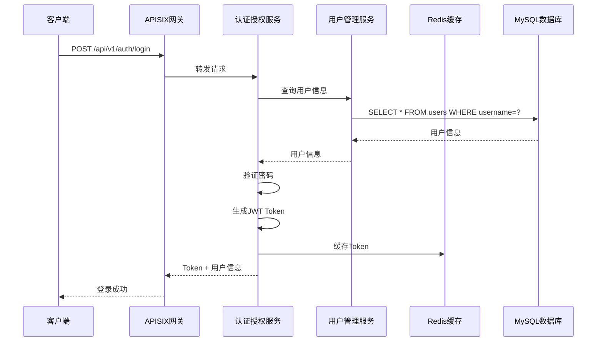
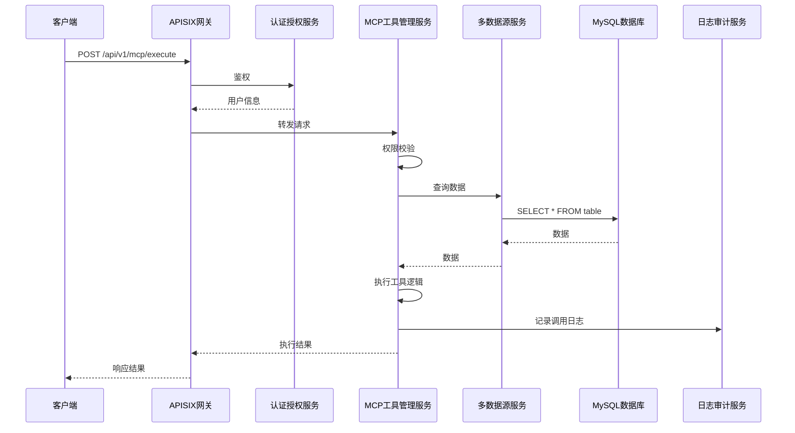
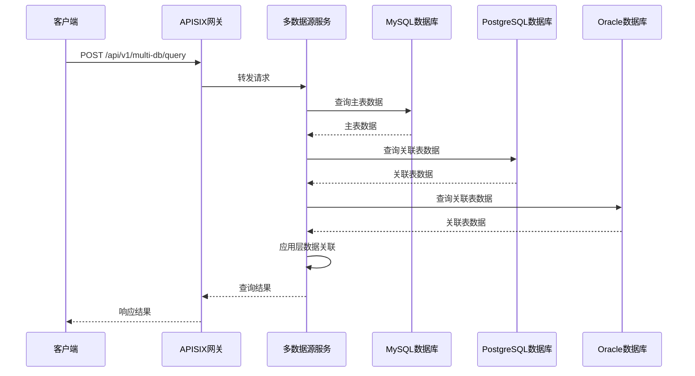
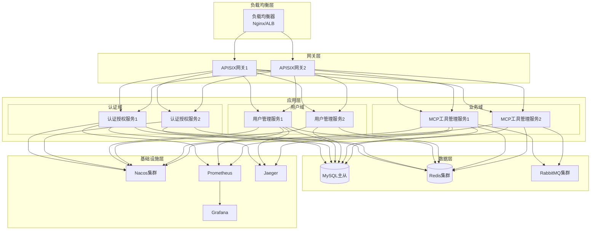

# 技术架构设计文档

## 📋 文档信息

- **项目名称**：企业级AI综合管理平台
- **文档版本**：v1.0
- **创建日期**：2026-01-13
- **文档类型**：技术架构设计文档

---

## 1. 系统架构设计

### 1.1 整体架构

本系统采用**微服务架构**，将系统拆分为多个独立的服务，每个服务负责特定的业务功能。服务之间通过API进行通信，支持独立部署、独立扩展。

### 1.2 系统架构图



### 1.3 架构分层

| 层级 | 职责 | 技术选型 |
|-----|------|---------|
| **客户端层** | 用户交互界面 | Vue 3 + TypeScript + Element Plus |
| **网关层** | 统一入口、限流、路由 | APISIX + Sentinel |
| **应用层** | 业务逻辑处理 | FastAPI + Python 3.13 |
| **数据层** | 数据存储、缓存 | MySQL + PostgreSQL + Oracle + Redis |
| **基础设施层** | 配置、监控、追踪 | Nacos + Prometheus + Jaeger |

---

## 2. 微服务架构划分

### 2.1 微服务划分

本系统将业务拆分为以下微服务：

| 服务名称 | 职责 | 端口 | 数据库 |
|---------|------|------|--------|
| **认证授权服务** | 用户认证、权限校验、Token管理 | 8001 | MySQL |
| **用户管理服务** | 用户CRUD、用户状态管理 | 8002 | MySQL |
| **多租户服务** | 租户管理、租户套餐、资源配额 | 8003 | MySQL |
| **部门管理服务** | 部门CRUD、层级管理 | 8004 | MySQL |
| **角色权限服务** | 角色管理、权限分配、权限校验 | 8005 | MySQL |
| **菜单管理服务** | 菜单CRUD、动态加载 | 8006 | MySQL |
| **MCP工具管理服务** | MCP工具注册、调用、监控 | 8007 | MySQL |
| **多数据源服务** | 多数据源管理、跨库查询 | 8008 | MySQL + PostgreSQL + Oracle |
| **字典管理服务** | 字典CRUD、分组管理 | 8009 | MySQL |
| **日志审计服务** | 日志记录、日志查询 | 8010 | MySQL |
| **通知服务** | 站内信、通知公告 | 8011 | MySQL |

### 2.2 微服务架构图



### 2.3 服务间通信

| 通信方式 | 适用场景 | 技术选型 |
|---------|---------|---------|
| **同步调用** | 实时查询、事务操作 | HTTP/REST + FastAPI |
| **异步调用** | 异步任务、消息通知 | RabbitMQ |
| **事件驱动** | 事件发布订阅 | RabbitMQ |

---

## 3. 技术栈选型说明

### 3.1 后端技术栈

| 技术组件 | 选型 | 版本 | 选型理由 |
|---------|------|------|---------|
| **Web框架** | FastAPI | 0.104+ | 高性能异步、自动文档、类型提示 |
| **ORM** | SQLAlchemy | 2.0+ | 功能强大、多数据库支持、异步支持 |
| **鉴权** | PyJWT + python-jose | 2.8+ | 轻量级、灵活、支持多种算法 |
| **配置中心** | Nacos | 2.2+ | 功能完整、支持动态配置、服务发现 |
| **消息队列** | RabbitMQ | 3.12+ | 功能强大、可靠性高 |
| **缓存** | Redis | 7.0+ | 功能强大、性能高 |
| **API网关** | APISIX | 3.5+ | 高性能、云原生、动态路由 |
| **限流熔断** | Sentinel | 1.8+ | 功能强大、可视化界面 |
| **分布式追踪** | Jaeger | 1.50+ | 功能强大、可视化界面 |
| **监控** | Prometheus + Grafana | 2.45+ / 10.0+ | 功能强大、可视化好 |
| **日志** | loguru | 0.7+ | 简单易用、功能强大 |
| **数据库迁移** | Alembic | 1.12+ | SQLAlchemy官方工具 |
| **容器化** | Docker | 24.0+ | 轻量级、易用 |
| **CI/CD** | GitHub Actions | - | 易用、免费、集成度高 |

### 3.2 前端技术栈

| 技术组件 | 选型 | 版本 | 选型理由 |
|---------|------|------|---------|
| **框架** | Vue | 3.3+ | 渐进式框架、生态成熟 |
| **语言** | TypeScript | 5.0+ | 类型安全、开发体验好 |
| **构建工具** | Vite | 5.0+ | 快速、现代化 |
| **路由** | Vue Router | 4.2+ | 官方路由、功能完善 |
| **状态管理** | Pinia | 2.1+ | 官方状态管理、简单易用 |
| **UI组件库** | Element Plus | 2.4+ | 功能完善、设计美观 |
| **HTTP客户端** | Axios | 1.6+ | 功能强大、易用 |
| **代码规范** | ESLint + Prettier | 最新 | 代码质量保证 |

### 3.3 数据库技术栈

| 数据库 | 版本 | 用途 | 选型理由 |
|-------|------|------|---------|
| **MySQL** | 8.0+ | 主数据库 | 成熟稳定、性能好、生态完善 |
| **PostgreSQL** | 15+ | 可选数据库 | 功能强大、支持复杂查询 |
| **Oracle** | 19c+ | 可选数据库 | 企业级、功能强大 |

---

## 4. 模块划分与职责

### 4.1 认证授权模块

**职责**：
- 用户认证（JWT、API Key）
- 权限校验（RBAC + ABAC）
- Token管理（生成、刷新、吊销）
- 会话管理

**核心功能**：
- 用户登录/登出
- Token生成与验证
- 权限校验装饰器
- API Key管理

### 4.2 用户管理模块

**职责**：
- 用户CRUD操作
- 用户状态管理
- 用户与部门/角色关联
- 用户信息查询

**核心功能**：
- 用户创建/修改/删除
- 用户查询（分页、搜索）
- 用户状态管理（启用/禁用）
- 用户角色分配

### 4.3 多租户模块

**职责**：
- 租户管理
- 租户套餐配置
- 资源配额管理
- 租户数据隔离

**核心功能**：
- 租户创建/修改/删除
- 租户套餐配置
- 资源配额设置
- 租户数据隔离

### 4.4 部门管理模块

**职责**：
- 部门CRUD操作
- 部门层级管理
- 部门编码自动生成
- 部门成员管理

**核心功能**：
- 部门创建/修改/删除
- 部门树结构管理
- 部门编码自动生成
- 部门成员查询

### 4.5 角色权限模块

**职责**：
- 角色管理
- 权限分配
- 权限继承
- 数据范围权限

**核心功能**：
- 角色创建/修改/删除
- 权限分配（菜单、操作、数据）
- 权限继承链
- 数据范围权限配置

### 4.6 菜单管理模块

**职责**：
- 菜单CRUD操作
- 菜单层级管理
- 菜单权限绑定
- 动态菜单加载

**核心功能**：
- 菜单创建/修改/删除
- 菜单树结构管理
- 菜单权限绑定
- 动态菜单加载（基于用户权限）

### 4.7 MCP工具管理模块

**职责**：
- MCP工具注册
- MCP工具调用
- MCP工具监控
- MCP工具权限控制

**核心功能**：
- 工具注册（API端点 → MCP工具）
- 工具调用（权限校验、超时控制、重试机制）
- 工具监控（调用日志、成功率、响应时间）
- 工具权限控制

### 4.8 多数据源模块

**职责**：
- 多数据源管理
- 跨数据库查询
- 数据源路由
- 数据源健康检查

**核心功能**：
- 数据源配置（MySQL、PostgreSQL、Oracle）
- 跨数据库查询
- 数据源自动路由
- 数据源健康检查

### 4.9 字典管理模块

**职责**：
- 字典CRUD操作
- 字典分组管理
- 字典缓存

**核心功能**：
- 字典创建/修改/删除
- 字典分组管理
- 字典缓存
- 字典查询

### 4.10 日志审计模块

**职责**：
- 登录日志记录
- 操作日志记录
- 日志查询
- 日志分包

**核心功能**：
- 登录日志记录
- 操作日志记录
- 日志查询（分页、搜索）
- 日志分包（按日期/大小）

### 4.11 通知模块

**职责**：
- 站内信管理
- 通知公告管理
- 消息队列集成
- 异步发送

**核心功能**：
- 站内信创建/发送
- 通知公告发布
- 消息队列集成（RabbitMQ）
- 异步发送

---

## 5. 数据流向设计

### 5.1 用户登录流程



### 5.2 MCP工具调用流程



### 5.3 跨数据源查询流程



---

## 6. 部署架构设计

### 6.1 部署架构图



### 6.2 部署方案

#### 6.2.1 开发环境部署

**部署方式**：单机部署
**部署组件**：
- MySQL（单实例）
- Redis（单实例）
- 所有微服务（单实例）
- 无负载均衡、无集群

#### 6.2.2 测试环境部署

**部署方式**：容器化部署
**部署组件**：
- MySQL（主从）
- Redis（单实例）
- RabbitMQ（单实例）
- Nacos（单实例）
- 所有微服务（多实例）
- APISIX（单实例）

#### 6.2.3 生产环境部署

**部署方式**：Kubernetes集群部署
**部署组件**：
- MySQL（主从 + 读写分离）
- Redis（集群）
- RabbitMQ（集群）
- Nacos（集群）
- 所有微服务（多实例 + 自动扩缩容）
- APISIX（多实例 + 负载均衡）
- Prometheus + Grafana（监控）
- Jaeger（分布式追踪）
- Nginx/ALB（负载均衡）

### 6.3 容器编排图

```mermaid
graph TB
    subgraph "Kubernetes集群"
        subgraph "Namespace: mcp-platform"
            subgraph "Deployment: apisix"
                APISIX[APISIX Pod]
            end
            
            subgraph "Deployment: auth-service"
                Auth1[Auth Pod 1]
                Auth2[Auth Pod 2]
            end
            
            subgraph "Deployment: user-service"
                User1[User Pod 1]
                User2[User Pod 2]
            end
            
            subgraph "Deployment: mcp-service"
                MCP1[MCP Pod 1]
                MCP2[MCP Pod 2]
            end
            
            subgraph "Service"
                SvcAuth[auth-service]
                SvcUser[user-service]
                SvcMCP[mcp-service]
            end
            
            subgraph "Ingress"
                Ingress[Ingress Controller]
            end
        end
        
        subgraph "Namespace: monitoring"
            Prometheus[Prometheus]
            Grafana[Grafana]
            Jaeger[Jaeger]
        end
        
        subgraph "Namespace: infrastructure"
            MySQL[(MySQL StatefulSet)]
            Redis[(Redis StatefulSet)]
            RabbitMQ[RabbitMQ StatefulSet]
            Nacos[Nacos StatefulSet]
        end
    end
    
    Ingress --> SvcAuth
    Ingress --> SvcUser
    Ingress --> SvcMCP
    
    SvcAuth --> Auth1
    SvcAuth --> Auth2
    
    SvcUser --> User1
    SvcUser --> User2
    
    SvcMCP --> MCP1
    SvcMCP --> MCP2
    
    Auth1 --> MySQL
    Auth2 --> MySQL
    User1 --> MySQL
    User2 --> MySQL
    MCP1 --> MySQL
    MCP2 --> MySQL
    
    Auth1 --> Redis
    Auth2 --> Redis
    User1 --> Redis
    User2 --> Redis
    MCP1 --> Redis
    MCP2 --> Redis
    
    MCP1 --> RabbitMQ
    MCP2 --> RabbitMQ
    
    Auth1 --> Nacos
    Auth2 --> Nacos
    User1 --> Nacos
    User2 --> Nacos
    MCP1 --> Nacos
    MCP2 --> Nacos
```

---

## 7. 技术架构优势

### 7.1 可扩展性

- ✅ **水平扩展**：微服务可以独立扩展，根据负载动态调整实例数量
- ✅ **垂直扩展**：可以增加单个实例的资源（CPU、内存）
- ✅ **功能扩展**：新增功能只需添加新的微服务，不影响现有服务

### 7.2 可维护性

- ✅ **模块化**：每个微服务职责单一，便于理解和维护
- ✅ **独立部署**：微服务可以独立部署、独立升级
- ✅ **故障隔离**：单个微服务故障不会影响整个系统

### 7.3 高可用性

- ✅ **集群部署**：关键服务部署多个实例，避免单点故障
- ✅ **负载均衡**：通过负载均衡分发请求，提高系统可用性
- ✅ **健康检查**：定期检查服务健康状态，自动剔除不健康实例

### 7.4 性能优化

- ✅ **缓存**：使用Redis缓存热点数据，减少数据库压力
- ✅ **异步处理**：使用消息队列处理异步任务，提高响应速度
- ✅ **连接池**：使用数据库连接池，提高数据库访问效率

### 7.5 安全性

- ✅ **认证授权**：统一的认证授权机制，细粒度的权限控制
- ✅ **数据加密**：敏感数据加密存储，传输层使用HTTPS
- ✅ **审计日志**：完整的审计日志，便于追踪和审计

---

## 🔗 相关文档

- [数据库设计文档](./3-数据库设计文档.md)
- [API接口设计文档](./4-API接口设计文档.md)
- [前端架构设计文档](./5-前端架构设计文档.md)
- [部署文档](./8-部署文档.md)
- [外部软件服务需求清单](./0-外部软件服务需求清单.md)

---

## 💡 注意事项

1. **服务拆分**：微服务拆分要合理，避免过度拆分或拆分不足
2. **服务通信**：尽量使用同步调用，异步调用仅用于非实时场景
3. **数据一致性**：跨服务事务使用最终一致性，避免分布式事务
4. **监控告警**：完善的监控告警体系，及时发现和处理问题
5. **文档更新**：架构变更时及时更新文档，保持文档与代码同步

---

**文档版本历史**：

| 版本 | 日期 | 作者 | 变更说明 |
|-----|------|------|---------|
| v1.0 | 2026-01-13 | AI助手 | 初始版本 |

---

**下一步**：开始生成[数据库设计文档](./3-数据库设计文档.md)