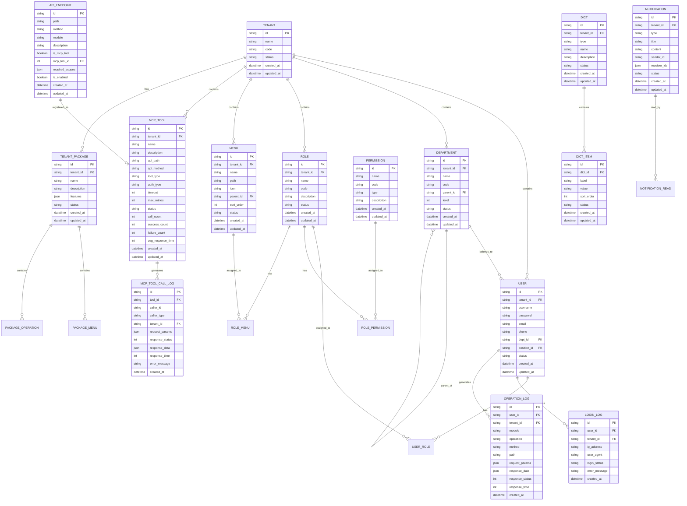

# 数据库设计文档

## 📋 文档信息

- **项目名称**：企业级AI综合管理平台
- **文档版本**：v1.0
- **创建日期**：2026-01-13
- **文档类型**：数据库设计文档

---

## 1. 数据库选型说明

### 1.1 主数据库：MySQL

**选型理由**：
- ✅ 成熟稳定，广泛使用
- ✅ 性能优秀，支持高并发
- ✅ 生态完善，工具丰富
- ✅ 支持事务、索引、存储过程
- ✅ 开源免费，成本低

**版本要求**：MySQL 8.0+

### 1.2 可选数据库

| 数据库 | 版本 | 用途 | 选型理由 |
|-------|------|------|---------|
| **PostgreSQL** | 15+ | 多数据源支持 | 功能强大、支持复杂查询、开源 |
| **Oracle** | 19c+ | 多数据源支持 | 企业级、功能强大、适合大型企业 |

---

## 2. ER图设计



---

## 3. 表结构设计

### 3.1 租户表（tenants）

| 字段名 | 类型 | 长度 | 允许空 | 默认值 | 说明 |
|-------|------|------|--------|--------|------|
| id | VARCHAR | 50 | NO | - | 租户ID（主键） |
| name | VARCHAR | 100 | NO | - | 租户名称 |
| code | VARCHAR | 50 | NO | - | 租户编码（唯一） |
| status | VARCHAR | 20 | NO | active | 状态（active/inactive） |
| description | TEXT | - | YES | NULL | 描述 |
| created_at | DATETIME | - | NO | CURRENT_TIMESTAMP | 创建时间 |
| updated_at | DATETIME | - | NO | CURRENT_TIMESTAMP ON UPDATE | 更新时间 |

**索引**：
- PRIMARY KEY (id)
- UNIQUE KEY uk_code (code)
- INDEX idx_status (status)

### 3.2 用户表（users）

| 字段名 | 类型 | 长度 | 允许空 | 默认值 | 说明 |
|-------|------|------|--------|--------|------|
| id | VARCHAR | 50 | NO | - | 用户ID（主键） |
| tenant_id | VARCHAR | 50 | NO | - | 租户ID（外键） |
| username | VARCHAR | 50 | NO | - | 用户名（唯一） |
| password | VARCHAR | 255 | NO | - | 密码（加密） |
| email | VARCHAR | 100 | YES | NULL | 邮箱 |
| phone | VARCHAR | 20 | YES | NULL | 手机号 |
| dept_id | VARCHAR | 50 | YES | NULL | 部门ID（外键） |
| position_id | VARCHAR | 50 | YES | NULL | 岗位ID（外键） |
| status | VARCHAR | 20 | NO | active | 状态（active/inactive/locked） |
| last_login_at | DATETIME | - | YES | NULL | 最后登录时间 |
| last_login_ip | VARCHAR | 50 | YES | NULL | 最后登录IP |
| created_at | DATETIME | - | NO | CURRENT_TIMESTAMP | 创建时间 |
| updated_at | DATETIME | - | NO | CURRENT_TIMESTAMP ON UPDATE | 更新时间 |

**索引**：
- PRIMARY KEY (id)
- UNIQUE KEY uk_tenant_username (tenant_id, username)
- INDEX idx_tenant_id (tenant_id)
- INDEX idx_dept_id (dept_id)
- INDEX idx_status (status)

**外键**：
- FOREIGN KEY (tenant_id) REFERENCES tenants(id)
- FOREIGN KEY (dept_id) REFERENCES departments(id)

### 3.3 部门表（departments）

| 字段名 | 类型 | 长度 | 允许空 | 默认值 | 说明 |
|-------|------|------|--------|--------|------|
| id | VARCHAR | 50 | NO | - | 部门ID（主键） |
| tenant_id | VARCHAR | 50 | NO | - | 租户ID（外键） |
| name | VARCHAR | 100 | NO | - | 部门名称 |
| code | VARCHAR | 100 | NO | - | 部门编码（如dept001/child002） |
| parent_id | VARCHAR | 50 | YES | NULL | 父部门ID（外键） |
| level | INT | - | NO | 1 | 层级（1-5） |
| sort_order | INT | - | NO | 0 | 排序 |
| status | VARCHAR | 20 | NO | active | 状态（active/inactive） |
| created_at | DATETIME | - | NO | CURRENT_TIMESTAMP | 创建时间 |
| updated_at | DATETIME | - | NO | CURRENT_TIMESTAMP ON UPDATE | 更新时间 |

**索引**：
- PRIMARY KEY (id)
- UNIQUE KEY uk_tenant_code (tenant_id, code)
- INDEX idx_tenant_id (tenant_id)
- INDEX idx_parent_id (parent_id)
- INDEX idx_level (level)

**外键**：
- FOREIGN KEY (tenant_id) REFERENCES tenants(id)
- FOREIGN KEY (parent_id) REFERENCES departments(id)

### 3.4 角色表（roles）

| 字段名 | 类型 | 长度 | 允许空 | 默认值 | 说明 |
|-------|------|------|--------|--------|------|
| id | VARCHAR | 50 | NO | - | 角色ID（主键） |
| tenant_id | VARCHAR | 50 | NO | - | 租户ID（外键） |
| name | VARCHAR | 100 | NO | - | 角色名称 |
| code | VARCHAR | 50 | NO | - | 角色编码（唯一） |
| description | TEXT | - | YES | NULL | 描述 |
| is_system | BOOLEAN | - | NO | FALSE | 是否系统角色 |
| status | VARCHAR | 20 | NO | active | 状态（active/inactive） |
| created_at | DATETIME | - | NO | CURRENT_TIMESTAMP | 创建时间 |
| updated_at | DATETIME | - | NO | CURRENT_TIMESTAMP ON UPDATE | 更新时间 |

**索引**：
- PRIMARY KEY (id)
- UNIQUE KEY uk_tenant_code (tenant_id, code)
- INDEX idx_tenant_id (tenant_id)
- INDEX idx_is_system (is_system)

**外键**：
- FOREIGN KEY (tenant_id) REFERENCES tenants(id)

### 3.5 权限表（permissions）

| 字段名 | 类型 | 长度 | 允许空 | 默认值 | 说明 |
|-------|------|------|--------|--------|------|
| id | VARCHAR | 50 | NO | - | 权限ID（主键） |
| name | VARCHAR | 100 | NO | - | 权限名称 |
| code | VARCHAR | 100 | NO | - | 权限编码（如user:create） |
| type | VARCHAR | 20 | NO | - | 类型（menu/operation/button） |
| description | TEXT | - | YES | NULL | 描述 |
| created_at | DATETIME | - | NO | CURRENT_TIMESTAMP | 创建时间 |
| updated_at | DATETIME | - | NO | CURRENT_TIMESTAMP ON UPDATE | 更新时间 |

**索引**：
- PRIMARY KEY (id)
- UNIQUE KEY uk_code (code)
- INDEX idx_type (type)

### 3.6 菜单表（menus）

| 字段名 | 类型 | 长度 | 允许空 | 默认值 | 说明 |
|-------|------|------|--------|--------|------|
| id | VARCHAR | 50 | NO | - | 菜单ID（主键） |
| tenant_id | VARCHAR | 50 | NO | - | 租户ID（外键） |
| name | VARCHAR | 100 | NO | - | 菜单名称 |
| path | VARCHAR | 255 | YES | NULL | 菜单路径 |
| icon | VARCHAR | 100 | YES | NULL | 菜单图标 |
| parent_id | VARCHAR | 50 | YES | NULL | 父菜单ID（外键） |
| sort_order | INT | - | NO | 0 | 排序 |
| is_visible | BOOLEAN | - | NO | TRUE | 是否可见 |
| status | VARCHAR | 20 | NO | active | 状态（active/inactive） |
| created_at | DATETIME | - | NO | CURRENT_TIMESTAMP | 创建时间 |
| updated_at | DATETIME | - | NO | CURRENT_TIMESTAMP ON UPDATE | 更新时间 |

**索引**：
- PRIMARY KEY (id)
- INDEX idx_tenant_id (tenant_id)
- INDEX idx_parent_id (parent_id)
- INDEX idx_sort_order (sort_order)

**外键**：
- FOREIGN KEY (tenant_id) REFERENCES tenants(id)
- FOREIGN KEY (parent_id) REFERENCES menus(id)

### 3.7 MCP工具表（mcp_tools）

| 字段名 | 类型 | 长度 | 允许空 | 默认值 | 说明 |
|-------|------|------|--------|--------|------|
| id | INT | - | NO | AUTO_INCREMENT | 工具ID（主键） |
| tenant_id | VARCHAR | 50 | NO | - | 租户ID（外键） |
| name | VARCHAR | 100 | NO | - | 工具名称 |
| description | TEXT | - | YES | NULL | 工具描述 |
| api_path | VARCHAR | 255 | NO | - | API路径 |
| api_method | VARCHAR | 10 | NO | - | API方法（GET/POST/PUT/DELETE） |
| api_module | VARCHAR | 100 | YES | NULL | API所属模块 |
| tool_type | VARCHAR | 50 | YES | NULL | 工具类型（api/external/script） |
| external_url | VARCHAR | 500 | YES | NULL | 外部URL |
| auth_type | VARCHAR | 50 | YES | NULL | 鉴权方式（none/bearer/api_key/oauth） |
| auth_config | JSON | - | YES | NULL | 鉴权配置 |
| timeout | INT | - | NO | 30 | 超时时间（秒） |
| max_retries | INT | - | NO | 3 | 最大重试次数 |
| is_enabled | BOOLEAN | - | NO | TRUE | 是否启用 |
| is_public | BOOLEAN | - | NO | FALSE | 是否公开 |
| call_count | INT | - | NO | 0 | 调用次数 |
| success_count | INT | - | NO | 0 | 成功次数 |
| failure_count | INT | - | NO | 0 | 失败次数 |
| avg_response_time | INT | - | NO | 0 | 平均响应时间（毫秒） |
| created_at | DATETIME | - | NO | CURRENT_TIMESTAMP | 创建时间 |
| updated_at | DATETIME | - | NO | CURRENT_TIMESTAMP ON UPDATE | 更新时间 |

**索引**：
- PRIMARY KEY (id)
- INDEX idx_tenant_id (tenant_id)
- INDEX idx_api_path (api_path, api_method)
- INDEX idx_is_enabled (is_enabled)

**外键**：
- FOREIGN KEY (tenant_id) REFERENCES tenants(id)

### 3.8 MCP工具调用日志表（mcp_tool_call_logs）

| 字段名 | 类型 | 长度 | 允许空 | 默认值 | 说明 |
|-------|------|------|--------|--------|------|
| id | BIGINT | - | NO | AUTO_INCREMENT | 日志ID（主键） |
| tool_id | INT | - | NO | - | 工具ID（外键） |
| caller_id | VARCHAR | 50 | NO | - | 调用者ID |
| caller_type | VARCHAR | 20 | NO | - | 调用者类型（user/api_key） |
| tenant_id | VARCHAR | 50 | NO | - | 租户ID（外键） |
| request_params | JSON | - | YES | NULL | 请求参数 |
| request_headers | JSON | - | YES | NULL | 请求头 |
| response_status | INT | - | YES | NULL | 响应状态码 |
| response_data | JSON | - | YES | NULL | 响应数据 |
| response_time | INT | - | YES | NULL | 响应时间（毫秒） |
| error_message | TEXT | - | YES | NULL | 错误信息 |
| error_stack | TEXT | - | YES | NULL | 错误堆栈 |
| created_at | DATETIME | - | NO | CURRENT_TIMESTAMP | 调用时间 |

**索引**：
- PRIMARY KEY (id)
- INDEX idx_tool_id (tool_id)
- INDEX idx_caller_id (caller_id)
- INDEX idx_tenant_id (tenant_id)
- INDEX idx_created_at (created_at)

**外键**：
- FOREIGN KEY (tool_id) REFERENCES mcp_tools(id)

### 3.9 登录日志表（login_logs）

| 字段名 | 类型 | 长度 | 允许空 | 默认值 | 说明 |
|-------|------|------|--------|--------|------|
| id | BIGINT | - | NO | AUTO_INCREMENT | 日志ID（主键） |
| user_id | VARCHAR | 50 | NO | - | 用户ID（外键） |
| tenant_id | VARCHAR | 50 | NO | - | 租户ID（外键） |
| ip_address | VARCHAR | 50 | NO | - | IP地址 |
| user_agent | VARCHAR | 500 | YES | NULL | 用户代理 |
| login_status | VARCHAR | 20 | NO | - | 登录状态（success/failed） |
| error_message | TEXT | - | YES | NULL | 错误信息 |
| created_at | DATETIME | - | NO | CURRENT_TIMESTAMP | 登录时间 |

**索引**：
- PRIMARY KEY (id)
- INDEX idx_user_id (user_id)
- INDEX idx_tenant_id (tenant_id)
- INDEX idx_ip_address (ip_address)
- INDEX idx_created_at (created_at)

**外键**：
- FOREIGN KEY (user_id) REFERENCES users(id)
- FOREIGN KEY (tenant_id) REFERENCES tenants(id)

### 3.10 操作日志表（operation_logs）

| 字段名 | 类型 | 长度 | 允许空 | 默认值 | 说明 |
|-------|------|------|--------|--------|------|
| id | BIGINT | - | NO | AUTO_INCREMENT | 日志ID（主键） |
| user_id | VARCHAR | 50 | NO | - | 用户ID（外键） |
| tenant_id | VARCHAR | 50 | NO | - | 租户ID（外键） |
| module | VARCHAR | 50 | NO | - | 模块 |
| operation | VARCHAR | 50 | NO | - | 操作 |
| method | VARCHAR | 10 | NO | - | 请求方法 |
| path | VARCHAR | 255 | NO | - | 请求路径 |
| request_params | JSON | - | YES | NULL | 请求参数 |
| response_data | JSON | - | YES | NULL | 响应数据 |
| response_status | INT | - | NO | - | 响应状态码 |
| response_time | INT | - | YES | NULL | 响应时间（毫秒） |
| created_at | DATETIME | - | NO | CURRENT_TIMESTAMP | 操作时间 |

**索引**：
- PRIMARY KEY (id)
- INDEX idx_user_id (user_id)
- INDEX idx_tenant_id (tenant_id)
- INDEX idx_module (module)
- INDEX idx_created_at (created_at)

**外键**：
- FOREIGN KEY (user_id) REFERENCES users(id)
- FOREIGN KEY (tenant_id) REFERENCES tenants(id)

### 3.11 字典表（dicts）

| 字段名 | 类型 | 长度 | 允许空 | 默认值 | 说明 |
|-------|------|------|--------|--------|------|
| id | VARCHAR | 50 | NO | - | 字典ID（主键） |
| tenant_id | VARCHAR | 50 | NO | - | 租户ID（外键） |
| type | VARCHAR | 50 | NO | - | 字典类型 |
| name | VARCHAR | 100 | NO | - | 字典名称 |
| description | TEXT | - | YES | NULL | 描述 |
| status | VARCHAR | 20 | NO | active | 状态（active/inactive） |
| created_at | DATETIME | - | NO | CURRENT_TIMESTAMP | 创建时间 |
| updated_at | DATETIME | - | NO | CURRENT_TIMESTAMP ON UPDATE | 更新时间 |

**索引**：
- PRIMARY KEY (id)
- UNIQUE KEY uk_tenant_type (tenant_id, type)
- INDEX idx_tenant_id (tenant_id)

**外键**：
- FOREIGN KEY (tenant_id) REFERENCES tenants(id)

### 3.12 字典项表（dict_items）

| 字段名 | 类型 | 长度 | 允许空 | 默认值 | 说明 |
|-------|------|------|--------|--------|------|
| id | VARCHAR | 50 | NO | - | 字典项ID（主键） |
| dict_id | VARCHAR | 50 | NO | - | 字典ID（外键） |
| label | VARCHAR | 100 | NO | - | 标签 |
| value | VARCHAR | 100 | NO | - | 值 |
| sort_order | INT | - | NO | 0 | 排序 |
| status | VARCHAR | 20 | NO | active | 状态（active/inactive） |
| created_at | DATETIME | - | NO | CURRENT_TIMESTAMP | 创建时间 |
| updated_at | DATETIME | - | NO | CURRENT_TIMESTAMP ON UPDATE | 更新时间 |

**索引**：
- PRIMARY KEY (id)
- INDEX idx_dict_id (dict_id)
- INDEX idx_sort_order (sort_order)

**外键**：
- FOREIGN KEY (dict_id) REFERENCES dicts(id)

### 3.13 API端点表（api_endpoints）

| 字段名 | 类型 | 长度 | 允许空 | 默认值 | 说明 |
|-------|------|------|--------|--------|------|
| id | INT | - | NO | AUTO_INCREMENT | 端点ID（主键） |
| path | VARCHAR | 255 | NO | - | API路径 |
| method | VARCHAR | 10 | NO | - | API方法 |
| module | VARCHAR | 100 | YES | NULL | 所属模块 |
| description | TEXT | - | YES | NULL | 接口描述 |
| is_mcp_tool | BOOLEAN | - | NO | FALSE | 是否注册为MCP工具 |
| mcp_tool_id | INT | - | YES | NULL | 关联的MCP工具ID |
| required_scopes | JSON | - | YES | NULL | 所需权限scopes |
| is_enabled | BOOLEAN | - | NO | TRUE | 是否启用 |
| created_at | DATETIME | - | NO | CURRENT_TIMESTAMP | 创建时间 |
| updated_at | DATETIME | - | NO | CURRENT_TIMESTAMP ON UPDATE | 更新时间 |

**索引**：
- PRIMARY KEY (id)
- UNIQUE KEY uk_path_method (path, method)
- INDEX idx_module (module)

**外键**：
- FOREIGN KEY (mcp_tool_id) REFERENCES mcp_tools(id)

### 3.14 通知表（notifications）

| 字段名 | 类型 | 长度 | 允许空 | 默认值 | 说明 |
|-------|------|------|--------|--------|------|
| id | VARCHAR | 50 | NO | - | 通知ID（主键） |
| tenant_id | VARCHAR | 50 | NO | - | 租户ID（外键） |
| type | VARCHAR | 50 | NO | - | 通知类型 |
| title | VARCHAR | 200 | NO | - | 通知标题 |
| content | TEXT | - | NO | - | 通知内容 |
| sender_id | VARCHAR | 50 | YES | NULL | 发送者ID |
| receiver_ids | JSON | - | NO | - | 接收者ID列表 |
| status | VARCHAR | 20 | NO | active | 状态（active/archived） |
| created_at | DATETIME | - | NO | CURRENT_TIMESTAMP | 创建时间 |
| updated_at | DATETIME | - | NO | CURRENT_TIMESTAMP ON UPDATE | 更新时间 |

**索引**：
- PRIMARY KEY (id)
- INDEX idx_tenant_id (tenant_id)
- INDEX idx_type (type)
- INDEX idx_created_at (created_at)

**外键**：
- FOREIGN KEY (tenant_id) REFERENCES tenants(id)

---

## 4. 多数据源设计

### 4.1 数据源配置

```python
DATA_SOURCES = {
    "primary": {
        "type": "mysql",
        "host": "localhost",
        "port": 3306,
        "database": "mcp_platform",
        "username": "root",
        "password": "12345678",
        "is_primary": True
    },
    "oracle_db": {
        "type": "oracle",
        "host": "192.168.1.100",
        "port": 1521,
        "database": "ORCL",
        "username": "oracle_user",
        "password": "oracle_password"
    },
    "postgres_db": {
        "type": "postgresql",
        "host": "192.168.1.101",
        "port": 5432,
        "database": "mcp_platform",
        "username": "postgres_user",
        "password": "postgres_password"
    }
}
```

### 4.2 数据源路由

```python
TABLE_ROUTING = {
    # 主数据源表
    "users": "primary",
    "roles": "primary",
    "permissions": "primary",
    "tenants": "primary",
    "departments": "primary",
    "menus": "primary",
    "mcp_tools": "primary",
    
    # Oracle数据源表
    "legacy_orders": "oracle_db",
    "legacy_products": "oracle_db",
    
    # PostgreSQL数据源表
    "analytics_data": "postgres_db",
    "report_data": "postgres_db",
}
```

---

## 5. 数据库迁移策略

### 5.1 迁移工具

使用 **Alembic** 进行数据库版本管理和迁移。

### 5.2 迁移流程


### 5.3 迁移命令

```bash
# 初始化Alembic
alembic init alembic

# 生成迁移脚本
alembic revision --autogenerate -m "描述"

# 执行迁移
alembic upgrade head

# 回滚迁移
alembic downgrade -1
```

---

## 6. 性能优化建议

### 6.1 索引优化

- ✅ 为常用查询字段创建索引
- ✅ 为外键字段创建索引
- ✅ 为排序字段创建索引
- ✅ 避免过多索引，影响写入性能

### 6.2 查询优化

- ✅ 使用EXPLAIN分析查询计划
- ✅ 避免SELECT *，只查询需要的字段
- ✅ 使用JOIN代替子查询
- ✅ 使用LIMIT限制返回结果数量

### 6.3 连接池优化

```python
# 连接池配置
pool_size = 10          # 连接池大小
max_overflow = 20       # 最大溢出连接数
pool_timeout = 30       # 连接超时时间（秒）
pool_recycle = 3600     # 连接回收时间（秒）
```

### 6.4 分区策略

对于大表（如mcp_tool_call_logs、operation_logs），建议按时间分区：

```sql
-- 按月分区
CREATE TABLE mcp_tool_call_logs (
    id BIGINT,
    created_at DATETIME,
    ...
) PARTITION BY RANGE (YEAR(created_at) * 100 + MONTH(created_at)) (
    PARTITION p202401 VALUES LESS THAN (202402),
    PARTITION p202402 VALUES LESS THAN (202403),
    ...
);
```

---

## 🔗 相关文档

- [技术架构设计文档](./2-技术架构设计文档.md)
- [API接口设计文档](./4-API接口设计文档.md)
- [环境配置文档](./7-环境配置文档.md)

---

## 💡 注意事项

1. **索引策略**：合理创建索引，避免过多索引影响性能
2. **数据类型**：选择合适的数据类型，避免浪费空间
3. **外键约束**：合理使用外键，保证数据完整性
4. **字符集**：统一使用utf8mb4字符集，支持emoji
5. **时区**：统一使用UTC时区，避免时区问题

---

**文档版本历史**：

| 版本 | 日期 | 作者 | 变更说明 |
|-----|------|------|---------|
| v1.0 | 2026-01-13 | AI助手 | 初始版本 |

---