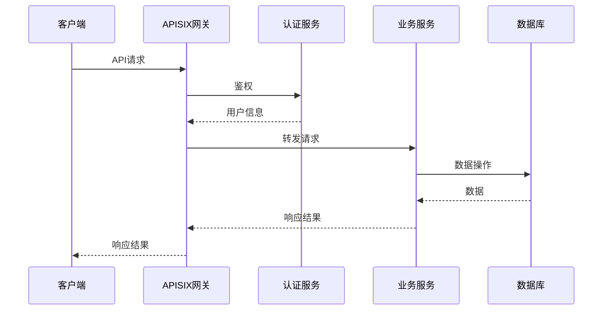

```mermaid
graph TB
    API[API接口] --> Auth[认证授权]
    API --> User[用户管理]
    API --> Tenant[多租户]
    API --> Dept[部门管理]
    API --> Role[角色权限]
    API --> Menu[菜单管理]
    API --> MCP[MCP工具管理]
    API --> MultiDB[多数据源]
    API --> Dict[字典管理]
    API --> Log[日志审计]
    API --> Notify[通知]
    
    Auth --> Auth1[登录/登出]
    Auth --> Auth2[Token管理]
    
    User --> User1[CRUD操作]
    User --> User2[状态管理]
    User --> User3[密码重置]
    
    Tenant --> Tenant1[租户管理]
    Tenant --> Tenant2[租户套餐]
    
    Dept --> Dept1[部门树]
    Dept --> Dept2[CRUD操作]
    Dept --> Dept3[部门移动]
    
    Role --> Role1[角色管理]
    Role --> Role2[权限分配]
    Role --> Role3[菜单分配]
    
    Menu --> Menu1[菜单树]
    Menu --> Menu2[用户菜单]
    Menu --> Menu3[CRUD操作]
    
    MCP --> MCP1[工具注册]
    MCP --> MCP2[工具调用]
    MCP --> MCP3[工具监控]
    
    MultiDB --> MultiDB1[单库查询]
    MultiDB --> MultiDB2[多库查询]
    MultiDB --> MultiDB3[跨库关联]
    MultiDB --> MultiDB4[事务管理]
    
    Dict --> Dict1[字典管理]
    Dict --> Dict2[字典项管理]
    
    Log --> Log1[登录日志]
    Log --> Log2[操作日志]
    
    Notify --> Notify1[通知查询]
    Notify --> Notify2[通知创建]
    Notify --> Notify3[已读标记]
```

# API接口设计文档

## 📋 文档信息

- **项目名称**：企业级AI综合管理平台
- **文档版本**：v1.0
- **创建日期**：2026-01-13
- **文档类型**：API接口设计文档

---

## 1. API设计规范

### 1.1 RESTful API规范

本系统遵循RESTful API设计规范，使用HTTP动词表示操作类型：

| HTTP方法 | 说明 | 示例 |
|---------|------|------|
| GET | 查询资源 | GET /api/v1/users |
| POST | 创建资源 | POST /api/v1/users |
| PUT | 更新资源（全量） | PUT /api/v1/users/{id} |
| PATCH | 更新资源（部分） | PATCH /api/v1/users/{id} |
| DELETE | 删除资源 | DELETE /api/v1/users/{id} |

### 1.2 URL规范

**URL格式**：`/api/v{version}/{module}/{resource}`

**示例**：
```
/api/v1/users          # 用户管理
/api/v1/roles          # 角色管理
/api/v1/mcp-tools      # MCP工具管理
```

### 1.3 HTTP状态码规范

| 状态码 | 说明 | 使用场景 |
|-------|------|---------|
| 200 | OK | 请求成功 |
| 201 | Created | 资源创建成功 |
| 204 | No Content | 请求成功，无返回内容 |
| 400 | Bad Request | 请求参数错误 |
| 401 | Unauthorized | 未授权 |
| 403 | Forbidden | 无权限 |
| 404 | Not Found | 资源不存在 |
| 409 | Conflict | 资源冲突 |
| 500 | Internal Server Error | 服务器内部错误 |

---

## 2. 接口命名规范

### 2.1 资源命名

- ✅ 使用复数名词：`/users`、`/roles`
- ✅ 使用小写字母：`/mcp-tools`
- ✅ 使用连字符分隔：`/user-roles`

### 2.2 操作命名

- ✅ 查询列表：`GET /users`
- ✅ 查询详情：`GET /users/{id}`
- ✅ 创建资源：`POST /users`
- ✅ 更新资源：`PUT /users/{id}`
- ✅ 删除资源：`DELETE /users/{id}`
- ✅ 批量操作：`POST /users/batch`

---

## 3. 请求/响应格式规范

### 3.1 请求格式

**Query参数**：
```
GET /api/v1/users?page=1&size=10&keyword=admin
```

**JSON Body**：
```json
{
  "username": "admin",
  "email": "admin@example.com",
  "password": "123456"
}
```

### 3.2 响应格式

**成功响应**：
```json
{
  "success": true,
  "code": 200,
  "message": "操作成功",
  "data": {
    "id": "1",
    "username": "admin",
    "email": "admin@example.com"
  },
  "timestamp": "2026-01-13T10:00:00Z"
}
```

**分页响应**：
```json
{
  "success": true,
  "code": 200,
  "message": "查询成功",
  "data": {
    "items": [...],
    "total": 100,
    "page": 1,
    "size": 10,
    "pages": 10
  }
}
```

**错误响应**：
```json
{
  "success": false,
  "code": 400,
  "message": "参数错误",
  "errors": [
    {
      "field": "username",
      "message": "用户名不能为空"
    }
  ],
  "timestamp": "2026-01-13T10:00:00Z"
}
```

---

## 4. 错误码规范

### 4.1 错误码格式

错误码格式：`{模块}{错误类型}{错误编号}`

- **模块**：2位数字（01=用户，02=角色，03=权限...）
- **错误类型**：1位数字（1=参数错误，2=业务错误，3=系统错误）
- **错误编号**：3位数字

### 4.2 通用错误码

| 错误码 | 说明 |
|-------|------|
| 00001 | 未知错误 |
| 00002 | 参数错误 |
| 00003 | 未授权 |
| 00004 | 无权限 |
| 00005 | 资源不存在 |
| 00006 | 资源已存在 |
| 00007 | 操作失败 |

---

## 5. 分页规范

### 5.1 分页参数

| 参数 | 类型 | 必填 | 说明 |
|-----|------|------|------|
| page | INT | 否 | 页码，默认1 |
| size | INT | 否 | 每页数量，默认10，最大100 |

### 5.2 分页响应

```json
{
  "success": true,
  "data": {
    "items": [...],
    "total": 100,
    "page": 1,
    "size": 10,
    "pages": 10
  }
}
```

---

## 6. 接口认证方式

### 6.1 JWT认证

**请求头**：
```
Authorization: Bearer {token}
```

### 6.2 API Key认证

**请求头**：
```
X-API-Key: {api_key}
```

---

## 7. 接口列表

### 7.1 认证域服务接口（端口8001）

| 接口 | 方法 | 路径 | 说明 |
|-----|------|------|------|
| 用户登录 | POST | /api/v1/auth/login | 用户登录，返回JWT Token |
| 用户登出 | POST | /api/v1/auth/logout | 用户登出，吊销Token |
| 刷新Token | POST | /api/v1/auth/refresh | 刷新JWT Token |
| 获取用户信息 | GET | /api/v1/auth/me | 获取当前登录用户信息 |
| 创建API Key | POST | /api/v1/auth/api-keys | 创建API Key |
| 删除API Key | DELETE | /api/v1/auth/api-keys/{id} | 删除API Key |
| 验证权限 | POST | /api/v1/auth/verify | 验证用户权限 |

### 7.2 用户域服务接口（端口8002）

#### 7.2.1 用户管理

| 接口 | 方法 | 路径 | 说明 |
|-----|------|------|------|
| 查询用户列表 | GET | /api/v1/users | 分页查询用户列表 |
| 查询用户详情 | GET | /api/v1/users/{id} | 查询用户详情 |
| 创建用户 | POST | /api/v1/users | 创建新用户 |
| 更新用户 | PUT | /api/v1/users/{id} | 更新用户信息 |
| 删除用户 | DELETE | /api/v1/users/{id} | 删除用户 |
| 启用/禁用用户 | PATCH | /api/v1/users/{id}/status | 启用或禁用用户 |
| 重置密码 | POST | /api/v1/users/{id}/reset-password | 重置用户密码 |
| 分配角色 | POST | /api/v1/users/{id}/roles | 为用户分配角色 |

#### 7.2.2 部门管理

| 接口 | 方法 | 路径 | 说明 |
|-----|------|------|------|
| 查询部门树 | GET | /api/v1/departments/tree | 查询部门树结构 |
| 查询部门列表 | GET | /api/v1/departments | 分页查询部门列表 |
| 查询部门详情 | GET | /api/v1/departments/{id} | 查询部门详情 |
| 创建部门 | POST | /api/v1/departments | 创建新部门 |
| 更新部门 | PUT | /api/v1/departments/{id} | 更新部门信息 |
| 删除部门 | DELETE | /api/v1/departments/{id} | 删除部门 |
| 移动部门 | POST | /api/v1/departments/{id}/move | 移动部门位置 |

#### 7.2.3 租户管理

| 接口 | 方法 | 路径 | 说明 |
|-----|------|------|------|
| 查询租户列表 | GET | /api/v1/tenants | 分页查询租户列表 |
| 查询租户详情 | GET | /api/v1/tenants/{id} | 查询租户详情 |
| 创建租户 | POST | /api/v1/tenants | 创建新租户 |
| 更新租户 | PUT | /api/v1/tenants/{id} | 更新租户信息 |
| 删除租户 | DELETE | /api/v1/tenants/{id} | 删除租户 |
| 配置租户套餐 | POST | /api/v1/tenants/{id}/package | 配置租户套餐 |

#### 7.2.4 岗位管理

| 接口 | 方法 | 路径 | 说明 |
|-----|------|------|------|
| 查询岗位列表 | GET | /api/v1/positions | 分页查询岗位列表 |
| 查询岗位详情 | GET | /api/v1/positions/{id} | 查询岗位详情 |
| 创建岗位 | POST | /api/v1/positions | 创建新岗位 |
| 更新岗位 | PUT | /api/v1/positions/{id} | 更新岗位信息 |
| 删除岗位 | DELETE | /api/v1/positions/{id} | 删除岗位 |

### 7.3 权限域服务接口（端口8003）

#### 7.3.1 角色管理

| 接口 | 方法 | 路径 | 说明 |
|-----|------|------|------|
| 查询角色列表 | GET | /api/v1/roles | 分页查询角色列表 |
| 查询角色详情 | GET | /api/v1/roles/{id} | 查询角色详情 |
| 创建角色 | POST | /api/v1/roles | 创建新角色 |
| 更新角色 | PUT | /api/v1/roles/{id} | 更新角色信息 |
| 删除角色 | DELETE | /api/v1/roles/{id} | 删除角色 |
| 分配权限 | POST | /api/v1/roles/{id}/permissions | 为角色分配权限 |
| 分配菜单 | POST | /api/v1/roles/{id}/menus | 为角色分配菜单 |

#### 7.3.2 权限管理

| 接口 | 方法 | 路径 | 说明 |
|-----|------|------|------|
| 查询权限列表 | GET | /api/v1/permissions | 分页查询权限列表 |
| 查询权限详情 | GET | /api/v1/permissions/{id} | 查询权限详情 |
| 创建权限 | POST | /api/v1/permissions | 创建新权限 |
| 更新权限 | PUT | /api/v1/permissions/{id} | 更新权限信息 |
| 删除权限 | DELETE | /api/v1/permissions/{id} | 删除权限 |

#### 7.3.3 菜单管理

| 接口 | 方法 | 路径 | 说明 |
|-----|------|------|------|
| 查询菜单树 | GET | /api/v1/menus/tree | 查询菜单树结构 |
| 查询用户菜单 | GET | /api/v1/menus/user | 查询当前用户可访问的菜单 |
| 查询菜单列表 | GET | /api/v1/menus | 分页查询菜单列表 |
| 查询菜单详情 | GET | /api/v1/menus/{id} | 查询菜单详情 |
| 创建菜单 | POST | /api/v1/menus | 创建新菜单 |
| 更新菜单 | PUT | /api/v1/menus/{id} | 更新菜单信息 |
| 删除菜单 | DELETE | /api/v1/menus/{id} | 删除菜单 |

### 7.4 系统域服务接口（端口8004）

#### 7.4.1 MCP工具管理

| 接口 | 方法 | 路径 | 说明 |
|-----|------|------|------|
| 查询API端点列表 | GET | /api/v1/mcp-tools/endpoints | 查询可注册为MCP工具的API端点 |
| 查询MCP工具列表 | GET | /api/v1/mcp-tools | 分页查询MCP工具列表 |
| 查询MCP工具详情 | GET | /api/v1/mcp-tools/{id} | 查询MCP工具详情 |
| 注册MCP工具 | POST | /api/v1/mcp-tools/register | 将API端点注册为MCP工具 |
| 取消注册MCP工具 | DELETE | /api/v1/mcp-tools/unregister/{path}/{method} | 取消MCP工具注册 |
| 执行MCP工具 | POST | /api/v1/mcp-tools/execute | 执行MCP工具 |
| 查询工具调用日志 | GET | /api/v1/mcp-tools/{id}/logs | 查询工具调用日志 |

#### 7.4.2 多数据源管理

| 接口 | 方法 | 路径 | 说明 |
|-----|------|------|------|
| 查询单个数据源 | POST | /api/v1/multi-db/query | 查询单个数据源 |
| 查询多个数据源 | POST | /api/v1/multi-db/query-multiple | 同时查询多个数据源 |
| 跨数据源关联查询 | POST | /api/v1/multi-db/query-join | 跨数据源关联查询 |
| 执行自定义SQL | POST | /api/v1/multi-db/execute-sql | 执行自定义SQL |
| 执行跨数据源事务 | POST | /api/v1/multi-db/transaction | 执行跨数据源事务 |
| 数据源健康检查 | GET | /api/v1/multi-db/health-check | 检查数据源健康状态 |

#### 7.4.3 字典管理

| 接口 | 方法 | 路径 | 说明 |
|-----|------|------|------|
| 查询字典列表 | GET | /api/v1/dicts | 分页查询字典列表 |
| 查询字典详情 | GET | /api/v1/dicts/{id} | 查询字典详情 |
| 创建字典 | POST | /api/v1/dicts | 创建新字典 |
| 更新字典 | PUT | /api/v1/dicts/{id} | 更新字典信息 |
| 删除字典 | DELETE | /api/v1/dicts/{id} | 删除字典 |
| 查询字典项列表 | GET | /api/v1/dicts/{id}/items | 查询字典项列表 |
| 创建字典项 | POST | /api/v1/dicts/{id}/items | 创建字典项 |
| 更新字典项 | PUT | /api/v1/dicts/{id}/items/{item_id} | 更新字典项 |
| 删除字典项 | DELETE | /api/v1/dicts/{id}/items/{item_id} | 删除字典项 |

#### 7.4.4 系统配置

| 接口 | 方法 | 路径 | 说明 |
|-----|------|------|------|
| 查询系统配置 | GET | /api/v1/system/config | 查询系统配置 |
| 更新系统配置 | PUT | /api/v1/system/config | 更新系统配置 |

#### 7.4.5 错误码管理

| 接口 | 方法 | 路径 | 说明 |
|-----|------|------|------|
| 查询错误码列表 | GET | /api/v1/error-codes | 分页查询错误码列表 |
| 创建错误码 | POST | /api/v1/error-codes | 创建错误码 |
| 更新错误码 | PUT | /api/v1/error-codes/{id} | 更新错误码 |
| 删除错误码 | DELETE | /api/v1/error-codes/{id} | 删除错误码 |

### 7.5 支撑域服务接口（端口8005）

#### 7.5.1 日志审计

| 接口 | 方法 | 路径 | 说明 |
|-----|------|------|------|
| 查询登录日志 | GET | /api/v1/logs/login | 分页查询登录日志 |
| 查询操作日志 | GET | /api/v1/logs/operation | 分页查询操作日志 |

#### 7.5.2 通知管理

| 接口 | 方法 | 路径 | 说明 |
|-----|------|------|------|
| 查询通知列表 | GET | /api/v1/notifications | 分页查询通知列表 |
| 查询未读通知数 | GET | /api/v1/notifications/unread-count | 查询未读通知数量 |
| 标记通知已读 | POST | /api/v1/notifications/{id}/read | 标记通知已读 |
| 批量标记已读 | POST | /api/v1/notifications/read-all | 批量标记通知已读 |
| 创建通知 | POST | /api/v1/notifications | 创建通知 |

#### 7.5.3 敏感词管理

| 接口 | 方法 | 路径 | 说明 |
|-----|------|------|------|
| 查询敏感词列表 | GET | /api/v1/sensitive-words | 分页查询敏感词列表 |
| 创建敏感词 | POST | /api/v1/sensitive-words | 创建敏感词 |
| 更新敏感词 | PUT | /api/v1/sensitive-words/{id} | 更新敏感词 |
| 删除敏感词 | DELETE | /api/v1/sensitive-words/{id} | 删除敏感词 |

#### 7.5.4 地区管理

| 接口 | 方法 | 路径 | 说明 |
|-----|------|------|------|
| 查询省份列表 | GET | /api/v1/regions/provinces | 查询省份列表 |
| 查询城市列表 | GET | /api/v1/regions/cities/{province_id} | 查询城市列表 |
| 查询区镇列表 | GET | /api/v1/regions/districts/{city_id} | 查询区镇列表 |

### 7.6 业务域服务接口（端口8006，空壳）

| 接口 | 方法 | 路径 | 说明 |
|-----|------|------|------|
| 订单管理 | - | /api/v1/business/orders | 预留：订单管理接口 |
| 商品管理 | - | /api/v1/business/products | 预留：商品管理接口 |
| 报表统计 | - | /api/v1/business/reports | 预留：报表统计接口 |
| 业务流程 | - | /api/v1/business/workflows | 预留：业务流程接口 |

**说明**：业务域服务目前为空壳，后续根据业务需求添加具体接口。

---

## 8. API接口分类图
|-----|------|------|------|
| 查询单个数据源 | POST | /api/v1/multi-db/query | 查询单个数据源 |
| 查询多个数据源 | POST | /api/v1/multi-db/query-multiple | 同时查询多个数据源 |
| 跨数据源关联查询 | POST | /api/v1/multi-db/query-join | 跨数据源关联查询 |
| 执行自定义SQL | POST | /api/v1/multi-db/execute-sql | 执行自定义SQL |
| 执行跨数据源事务 | POST | /api/v1/multi-db/transaction | 执行跨数据源事务 |
| 数据源健康检查 | GET | /api/v1/multi-db/health-check | 检查数据源健康状态 |

### 7.9 字典管理接口

| 接口 | 方法 | 路径 | 说明 |
|-----|------|------|------|
| 查询字典列表 | GET | /api/v1/dicts | 分页查询字典列表 |
| 查询字典详情 | GET | /api/v1/dicts/{id} | 查询字典详情 |
| 创建字典 | POST | /api/v1/dicts | 创建新字典 |
| 更新字典 | PUT | /api/v1/dicts/{id} | 更新字典信息 |
| 删除字典 | DELETE | /api/v1/dicts/{id} | 删除字典 |
| 查询字典项列表 | GET | /api/v1/dicts/{id}/items | 查询字典项列表 |
| 创建字典项 | POST | /api/v1/dicts/{id}/items | 创建字典项 |
| 更新字典项 | PUT | /api/v1/dicts/{id}/items/{item_id} | 更新字典项 |
| 删除字典项 | DELETE | /api/v1/dicts/{id}/items/{item_id} | 删除字典项 |

### 7.10 日志审计接口

| 接口 | 方法 | 路径 | 说明 |
|-----|------|------|------|
| 查询登录日志 | GET | /api/v1/logs/login | 分页查询登录日志 |
| 查询操作日志 | GET | /api/v1/logs/operation | 分页查询操作日志 |

### 7.11 通知接口

| 接口 | 方法 | 路径 | 说明 |
|-----|------|------|------|
| 查询通知列表 | GET | /api/v1/notifications | 分页查询通知列表 |
| 查询未读通知数 | GET | /api/v1/notifications/unread-count | 查询未读通知数量 |
| 标记通知已读 | POST | /api/v1/notifications/{id}/read | 标记通知已读 |
| 批量标记已读 | POST | /api/v1/notifications/read-all | 批量标记通知已读 |
| 创建通知 | POST | /api/v1/notifications | 创建通知 |

---

## 8. API接口分类图



---

## 9. 请求流程图



---

## 🔗 相关文档

- [技术架构设计文档](./2-技术架构设计文档.md)
- [数据库设计文档](./3-数据库设计文档.md)
- [前端架构设计文档](./5-前端架构设计文档.md)

---

## 💡 注意事项

1. **接口版本**：使用URL路径版本控制（/api/v1/）
2. **幂等性**：GET、PUT、DELETE操作必须保证幂等性
3. **安全性**：所有接口必须进行鉴权，公开接口除外
4. **限流**：对高频接口进行限流，防止滥用
5. **文档更新**：接口变更时及时更新文档

---

**文档版本历史**：

| 版本 | 日期 | 作者 | 变更说明 |
|-----|------|------|---------|
| v1.0 | 2026-01-13 | AI助手 | 初始版本 |

---