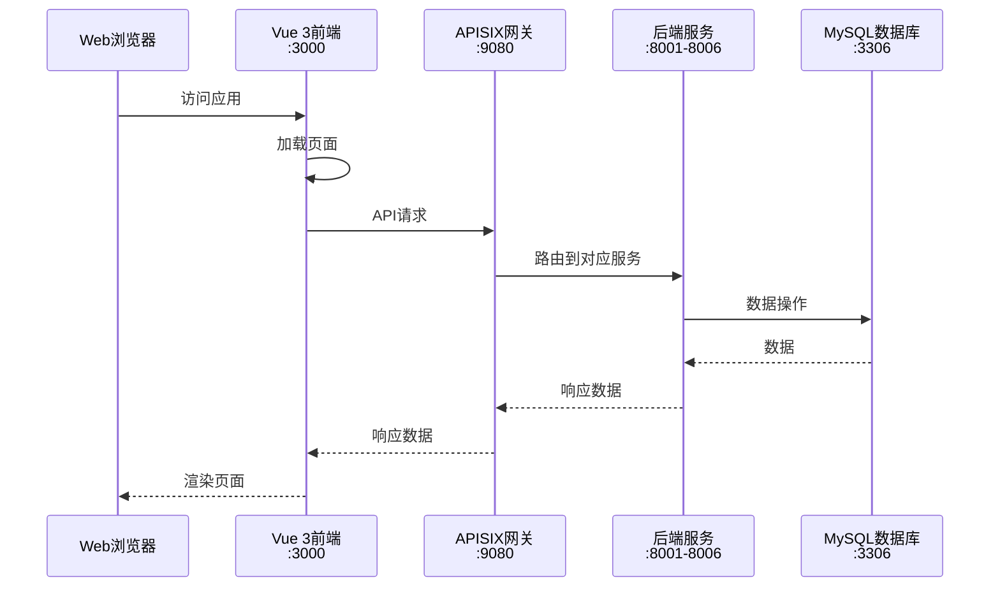
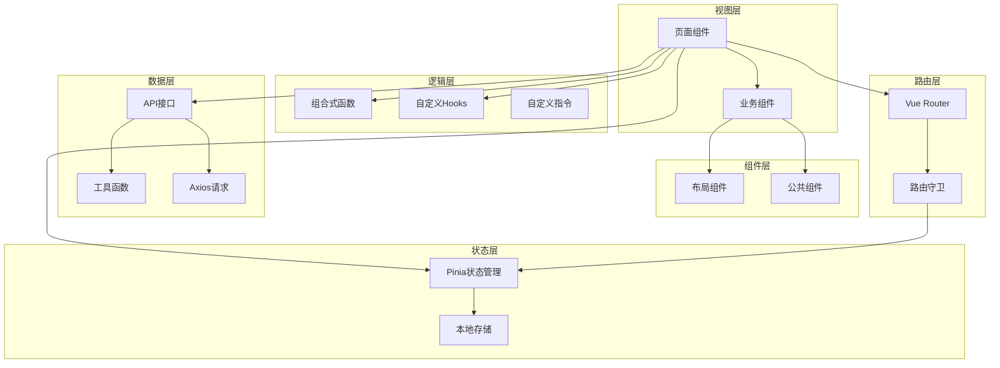
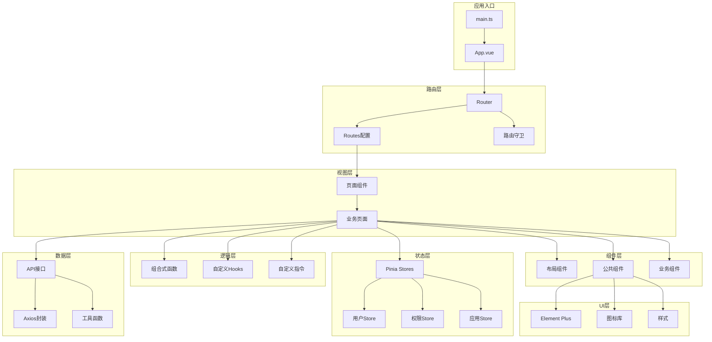
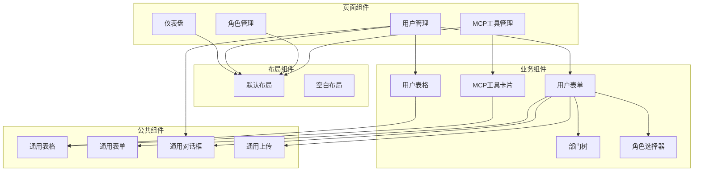
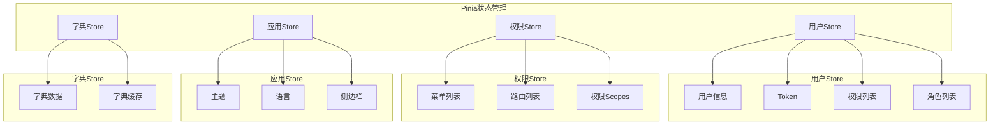

# 前端架构设计文档

## 📋 文档信息

- **项目名称**：企业级AI综合管理平台
- **文档版本**：v1.0
- **创建日期**：2026-01-13
- **文档类型**：前端架构设计文档

---

## 0. 前后端分离架构说明

### 0.1 架构概述

本系统采用**前后端分离架构**，前端和后端完全独立开发和部署：

| 类型 | 应用 | 技术栈 | 端口 | 职责 |
|-----|------|--------|------|------|
| **前端** | Vue 3前端应用 | Vue 3 + TypeScript + Element Plus | 3000 | 用户界面、交互逻辑 |
| **后端** | 6个微服务 | FastAPI + Python 3.13 | 8001-8006 | 业务逻辑处理、数据存储 |

### 0.2 前后端交互流程



### 0.3 前端端口配置

| 环境 | 端口 | 说明 |
|-----|------|------|
| **开发环境** | 3000 | Vite开发服务器 |
| **生产环境** | 3000 | Nginx静态资源服务 |

### 0.4 后端服务端口

| 服务 | 端口 | 说明 |
|-----|------|------|
| 认证域服务 | 8001 | 认证授权 |
| 用户域服务 | 8002 | 用户、部门、租户管理 |
| 权限域服务 | 8003 | 角色、权限、菜单管理 |
| 系统域服务 | 8004 | MCP工具、多数据源、字典管理 |
| 支撑域服务 | 8005 | 日志、通知管理 |
| 业务域服务 | 8006 | 业务逻辑（空壳） |

### 0.5 API网关配置

前端通过APISIX网关访问后端服务，网关统一处理：
- 路由转发
- 限流熔断
- 认证鉴权
- 日志记录

**开发环境配置**：
```bash
VITE_API_BASE_URL=http://localhost:9080/api/v1
```

**生产环境配置**：
```bash
VITE_API_BASE_URL=https://api.example.com/api/v1
```

---

## 1. Vue技术栈说明

### 1.1 技术选型

| 技术组件 | 选型 | 版本 | 选型理由 |
|---------|------|------|---------|
| **框架** | Vue | 3.3+ | 渐进式框架、生态成熟、性能优秀 |
| **语言** | TypeScript | 5.0+ | 类型安全、开发体验好、减少错误 |
| **构建工具** | Vite | 5.0+ | 快速、现代化、支持热更新 |
| **路由** | Vue Router | 4.2+ | 官方路由、功能完善、支持动态路由 |
| **状态管理** | Pinia | 2.1+ | 官方状态管理、简单易用、支持TypeScript |
| **UI组件库** | Element Plus | 2.4+ | 功能完善、设计美观、TypeScript支持 |
| **HTTP客户端** | Axios | 1.6+ | 功能强大、易用、支持拦截器 |
| **代码规范** | ESLint + Prettier | 最新 | 代码质量保证、格式统一 |
| **CSS预处理** | SCSS | 最新 | 功能强大、支持变量、嵌套 |

---

## 2. 前端架构设计

### 2.1 整体架构



---

## 3. 组件设计规范

### 3.1 组件分类

#### 3.1.1 布局组件（layouts/）

- **DefaultLayout**：默认布局（侧边栏、顶部导航、内容区）
- **BlankLayout**：空白布局（登录页、错误页）

#### 3.1.2 公共组件（components/common/）

- **Table**：通用表格组件
- **Form**：通用表单组件
- **Dialog**：通用对话框组件
- **Upload**：通用上传组件
- **Tree**：通用树形组件

#### 3.1.3 业务组件（components/business/）

- **UserSelect**：用户选择器
- **DeptTree**：部门树选择器
- **RoleSelect**：角色选择器
- **MenuTree**：菜单树选择器

---

## 4. 状态管理（Pinia）

### 4.1 Store结构

```typescript
// stores/user.ts
export const useUserStore = defineStore('user', () => {
  // State
  const token = ref<string>('')
  const userInfo = ref<UserInfo | null>(null)
  
  // Getters
  const isLoggedIn = computed(() => !!token.value)
  const username = computed(() => userInfo.value?.username || '')
  
  // Actions
  async function login(credentials: LoginRequest) {
    // 登录逻辑
  }
  
  async function logout() {
    // 登出逻辑
  }
  
  return {
    token,
    userInfo,
    isLoggedIn,
    username,
    login,
    logout
  }
})
```

### 4.2 Store列表

| Store | 职责 |
|-------|------|
| **user** | 用户信息、登录状态 |
| **permission** | 权限、菜单、角色 |
| **app** | 应用配置、主题、语言 |
| **dict** | 字典数据缓存 |

---

## 5. 路由设计（Vue Router）

### 5.1 路由配置

```typescript
// router/index.ts
const routes: RouteRecordRaw[] = [
  {
    path: '/login',
    name: 'Login',
    component: () => import('@/views/auth/Login.vue'),
    meta: { title: '登录', requiresAuth: false }
  },
  {
    path: '/',
    component: DefaultLayout,
    meta: { requiresAuth: true },
    children: [
      {
        path: 'dashboard',
        name: 'Dashboard',
        component: () => import('@/views/dashboard/Index.vue'),
        meta: { title: '仪表盘', icon: 'dashboard' }
      },
      {
        path: 'system',
        name: 'System',
        redirect: '/system/user',
        meta: { title: '系统管理', icon: 'setting' },
        children: [
          {
            path: 'user',
            name: 'User',
            component: () => import('@/views/system/User.vue'),
            meta: { title: '用户管理', permission: 'user:read' }
          }
        ]
      }
    ]
  }
]
```

### 5.2 路由守卫

```typescript
// router/guards.ts
router.beforeEach(async (to, from, next) => {
  const userStore = useUserStore()
  const permissionStore = usePermissionStore()
  
  // 检查是否需要登录
  if (to.meta.requiresAuth !== false && !userStore.isLoggedIn) {
    return next({ name: 'Login', query: { redirect: to.fullPath } })
  }
  
  // 检查权限
  if (to.meta.permission && !permissionStore.hasPermission(to.meta.permission)) {
    return next({ name: 'Forbidden' })
  }
  
  next()
})
```

---

## 6. UI组件库选型（Element Plus）

### 6.1 为什么选择Element Plus

- ✅ Vue 3官方推荐
- ✅ TypeScript支持完善
- ✅ 组件丰富，功能完善
- ✅ 设计美观，易于定制
- ✅ 文档完善，社区活跃

### 6.2 常用组件

| 组件 | 用途 |
|-----|------|
| **el-table** | 表格展示 |
| **el-form** | 表单提交 |
| **el-dialog** | 对话框 |
| **el-tree** | 树形结构 |
| **el-select** | 下拉选择 |
| **el-date-picker** | 日期选择 |
| **el-upload** | 文件上传 |

---

## 7. 前后端交互规范

### 7.1 API接口封装

```typescript
// utils/request.ts
import axios from 'axios'
import { ElMessage } from 'element-plus'
import { useUserStore } from '@/stores/user'

const request = axios.create({
  baseURL: import.meta.env.VITE_API_BASE_URL,
  timeout: 30000
})

// 请求拦截器
request.interceptors.request.use(
  (config) => {
    const userStore = useUserStore()
    if (userStore.token) {
      config.headers.Authorization = `Bearer ${userStore.token}`
    }
    return config
  },
  (error) => {
    return Promise.reject(error)
  }
)

// 响应拦截器
request.interceptors.response.use(
  (response) => {
    const { success, data, message } = response.data
    if (success) {
      return data
    } else {
      ElMessage.error(message || '请求失败')
      return Promise.reject(new Error(message))
    }
  },
  (error) => {
    if (error.response?.status === 401) {
      // 跳转到登录页
    }
    ElMessage.error(error.message || '网络错误')
    return Promise.reject(error)
  }
)

export default request
```

---

## 8. 性能优化策略

### 8.1 路由懒加载

```typescript
const routes = [
  {
    path: '/dashboard',
    component: () => import('@/views/dashboard/Index.vue')
  }
]
```

### 8.2 组件懒加载

```typescript
const AsyncComponent = defineAsyncComponent(() => import('./HeavyComponent.vue'))
```

### 8.3 打包优化

```typescript
// vite.config.ts
export default defineConfig({
  build: {
    rollupOptions: {
      output: {
        manualChunks: {
          'element-plus': ['element-plus'],
          'vue-vendor': ['vue', 'vue-router', 'pinia']
        }
      }
    }
  }
})
```

---

## 9. 前端架构图



---

## 10. 组件层次图



---

## 11. 状态管理图



---

## 🔗 相关文档

- [技术架构设计文档](./2-技术架构设计文档.md)
- [API接口设计文档](./4-API接口设计文档.md)
- [开发规范文档](./6-开发规范文档.md)

---

## 💡 注意事项

1. **TypeScript**：严格使用TypeScript，避免使用any
2. **组件复用**：提取公共组件，提高复用性
3. **性能优化**：使用懒加载、按需加载、缓存优化
4. **代码规范**：遵循ESLint和Prettier规范
5. **文档注释**：为组件、函数、接口添加注释

---

**文档版本历史**：

| 版本 | 日期 | 作者 | 变更说明 |
|-----|------|------|---------|
| v1.0 | 2026-01-13 | AI助手 | 初始版本 |

---