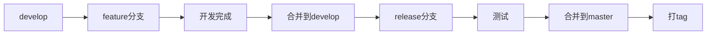

# 开发规范文档

## 📋 文档信息

- **项目名称**：企业级AI综合管理平台
- **文档版本**：v1.0
- **创建日期**：2026-01-13
- **文档类型**：开发规范文档

---

## 1. 代码规范（Python）

### 1.1 命名规范

| 类型 | 规范 | 示例 |
|-----|------|------|
| **变量** | 小写字母+下划线 | `user_name`, `is_active` |
| **常量** | 大写字母+下划线 | `MAX_RETRY_COUNT`, `API_BASE_URL` |
| **函数** | 小写字母+下划线 | `get_user_info()`, `validate_password()` |
| **类** | 大驼峰 | `UserService`, `DatabaseManager` |
| **模块** | 小写字母+下划线 | `user_service.py`, `database_manager.py` |
| **私有变量** | 下划线前缀 | `_internal_var`, `__private_var` |

### 1.2 代码格式

**缩进**：使用4个空格缩进

**行长**：每行不超过100个字符

**空行**：
- 函数之间空2行
- 类之间空2行
- 方法之间空1行

**导入顺序**：
1. 标准库导入
2. 第三方库导入
3. 本地模块导入

```python
# 标准库
import os
import sys

# 第三方库
from fastapi import FastAPI
from sqlalchemy import create_engine

# 本地模块
from app.models import User
from app.utils import helper
```

### 1.3 类型注解

```python
from typing import List, Optional, Dict, Any

def get_user(user_id: str) -> Optional[Dict[str, Any]]:
    """获取用户信息
    
    Args:
        user_id: 用户ID
        
    Returns:
        用户信息字典，如果不存在返回None
    """
    pass

def create_users(users: List[Dict[str, Any]]) -> bool:
    """批量创建用户
    
    Args:
        users: 用户列表
        
    Returns:
        是否创建成功
    """
    pass
```

### 1.4 文档字符串

```python
def calculate_discount(price: float, discount_rate: float) -> float:
    """计算折扣后的价格
    
    Args:
        price: 原价
        discount_rate: 折扣率（0-1）
        
    Returns:
        折扣后的价格
        
    Raises:
        ValueError: 如果参数不合法
        
    Examples:
        >>> calculate_discount(100, 0.1)
        90.0
    """
    if not 0 <= discount_rate <= 1:
        raise ValueError("折扣率必须在0-1之间")
    return price * (1 - discount_rate)
```

---

## 2. 代码规范（TypeScript）

### 2.1 命名规范

| 类型 | 规范 | 示例 |
|-----|------|------|
| **变量** | 小驼峰 | `userName`, `isActive` |
| **常量** | 大写字母+下划线 | `MAX_RETRY_COUNT`, `API_BASE_URL` |
| **函数** | 小驼峰 | `getUserInfo()`, `validatePassword()` |
| **类** | 大驼峰 | `UserService`, `DatabaseManager` |
| **接口** | 大驼峰+I前缀 | `IUserService`, `IDatabaseManager` |
| **类型** | 大驼峰 | `UserInfo`, `ApiResponse` |
| **枚举** | 大驼峰 | `UserRole`, `UserStatus` |

### 2.2 代码格式

**缩进**：使用2个空格缩进

**行长**：每行不超过100个字符

**空行**：
- 函数之间空2行
- 类之间空2行
- 方法之间空1行

**导入顺序**：
1. Vue相关导入
2. 第三方库导入
3. 本地模块导入
4. 类型导入

```typescript
// Vue相关
import { ref, computed } from 'vue'
import { useRouter } from 'vue-router'

// 第三方库
import axios from 'axios'
import { ElMessage } from 'element-plus'

// 本地模块
import { useUserStore } from '@/stores/user'
import { formatDate } from '@/utils/date'

// 类型导入
import type { UserInfo, ApiResponse } from '@/types'
```

### 2.3 类型定义

```typescript
// 接口定义
interface UserInfo {
  id: string
  username: string
  email: string
  phone?: string
  status: UserStatus
}

// 类型定义
type UserStatus = 'active' | 'inactive' | 'locked'

// 枚举定义
enum UserRole {
  ADMIN = 'admin',
  USER = 'user',
  GUEST = 'guest'
}

// 泛型类型
interface ApiResponse<T = any> {
  success: boolean
  code: number
  message: string
  data: T
  timestamp: string
}
```

### 2.4 组件定义

```vue
<script setup lang="ts">
import { ref, computed, onMounted } from 'vue'
import { useRouter } from 'vue-router'
import { ElMessage } from 'element-plus'
import type { UserInfo } from '@/types'

// Props
interface Props {
  userId?: string
  loading?: boolean
}

const props = withDefaults(defineProps<Props>(), {
  loading: false
})

// Emits
interface Emits {
  (e: 'update:modelValue', value: string): void
  (e: 'change', value: UserInfo): void
}

const emit = defineEmits<Emits>()

// State
const userInfo = ref<UserInfo | null>(null)
const loading = ref(false)

// Computed
const isUserLoaded = computed(() => !!userInfo.value)

// Methods
async function loadUserInfo() {
  loading.value = true
  try {
    const response = await api.getUserInfo(props.userId!)
    userInfo.value = response.data
    emit('change', response.data)
  } catch (error) {
    ElMessage.error('加载用户信息失败')
  } finally {
    loading.value = false
  }
}

// Lifecycle
onMounted(() => {
  if (props.userId) {
    loadUserInfo()
  }
})
</script>
```

---

## 3. Git提交规范

### 3.1 提交信息格式

```
<type>(<scope>): <subject>

<body>

<footer>
```

### 3.2 Type类型

| Type | 说明 |
|------|------|
| **feat** | 新功能 |
| **fix** | 修复bug |
| **docs** | 文档更新 |
| **style** | 代码格式调整（不影响功能） |
| **refactor** | 重构（不是新增功能，也不是修复bug） |
| **perf** | 性能优化 |
| **test** | 测试相关 |
| **chore** | 构建过程或辅助工具的变动 |
| **revert** | 回滚之前的提交 |

### 3.3 Scope范围

| Scope | 说明 |
|-------|------|
| **auth** | 认证授权模块 |
| **user** | 用户管理模块 |
| **tenant** | 多租户模块 |
| **mcp** | MCP工具管理模块 |
| **api** | API接口 |
| **ui** | 前端UI |
| **db** | 数据库相关 |

### 3.4 提交示例

```bash
# 新功能
git commit -m "feat(user): 添加用户批量导入功能"

# 修复bug
git commit -m "fix(auth): 修复Token刷新失败的问题"

# 文档更新
git commit -m "docs: 更新API接口文档"

# 重构
git commit -m "refactor(user): 重构用户查询逻辑，提高性能"
```

---

## 4. 分支管理策略

### 4.1 分支类型

| 分支 | 说明 | 命名规范 |
|-----|------|---------|
| **master** | 主分支，生产环境代码 | - |
| **develop** | 开发分支，开发环境代码 | - |
| **feature/** | 功能分支 | feature/user-import |
| **bugfix/** | 修复分支 | bugfix/token-refresh |
| **hotfix/** | 紧急修复分支 | hotfix/security-patch |
| **release/** | 发布分支 | release/v1.0.0 |

### 4.2 分支流程



### 4.3 分支操作

```bash
# 创建功能分支
git checkout -b feature/user-import develop

# 合并到develop
git checkout develop
git merge --no-ff feature/user-import

# 创建发布分支
git checkout -b release/v1.0.0 develop

# 合并到master
git checkout master
git merge --no-ff release/v1.0.0

# 打tag
git tag -a v1.0.0 -m "发布版本1.0.0"
```

---

## 5. 代码审查规范

### 5.1 审查清单

**功能性**：
- [ ] 代码实现了预期功能
- [ ] 代码逻辑正确
- [ ] 边界条件处理正确

**代码质量**：
- [ ] 代码可读性好
- [ ] 代码复用性好
- [ ] 代码性能合理
- [ ] 代码符合规范

**安全性**：
- [ ] 没有安全漏洞
- [ ] 输入验证完善
- [ ] 输出编码正确

**测试**：
- [ ] 有单元测试
- [ ] 测试覆盖率达标
- [ ] 测试用例完善

**文档**：
- [ ] 有代码注释
- [ ] 有API文档
- [ ] 有README

### 5.2 审查流程

1. 创建Pull Request
2. 指定审查者
3. 审查者进行代码审查
4. 根据审查意见修改代码
5. 审查通过后合并代码

---

## 6. 文档编写规范

### 6.1 代码注释

**行内注释**：
```python
# 计算折扣后的价格
discounted_price = price * (1 - discount_rate)
```

**块注释**：
```python
"""
用户服务类

提供用户相关的业务逻辑，包括用户创建、查询、更新、删除等操作。
"""
```

**函数注释**：
```python
def get_user(user_id: str) -> Optional[Dict[str, Any]]:
    """获取用户信息
    
    Args:
        user_id: 用户ID
        
    Returns:
        用户信息字典，如果不存在返回None
        
    Raises:
        ValueError: 如果user_id为空
        
    Examples:
        >>> get_user("123")
        {"id": "123", "username": "admin"}
    """
    pass
```

### 6.2 API文档

```python
@router.get("/users/{user_id}", response_model=UserResponse)
async def get_user(
    user_id: str,
    current_user: dict = Depends(get_current_user)
):
    """获取用户详情
    
    Args:
        user_id: 用户ID
        current_user: 当前登录用户（通过依赖注入）
        
    Returns:
        用户详情
        
    Raises:
        404: 用户不存在
        403: 无权限访问
    """
    pass
```

### 6.3 README文档

```markdown
# 项目名称

## 简介
简要描述项目

## 功能特性
- 功能1
- 功能2

## 安装
\`\`\`bash
pip install -r requirements.txt
\`\`\`

## 使用
\`\`\`python
python main.py
\`\`\`

## 贡献
欢迎贡献代码

## 许可证
MIT
```

---

## 🔗 相关文档

- [技术架构设计文档](./2-技术架构设计文档.md)
- [前端架构设计文档](./5-前端架构设计文档.md)
- [API接口设计文档](./4-API接口设计文档.md)

---

## 💡 注意事项

1. **代码规范**：严格遵循代码规范，保持代码风格一致
2. **类型安全**：TypeScript中避免使用any，Python中添加类型注解
3. **注释规范**：为复杂逻辑添加注释，提高代码可读性
4. **Git规范**：遵循Git提交规范，提交信息清晰明确
5. **代码审查**：所有代码必须经过审查后才能合并

---

**文档版本历史**：

| 版本 | 日期 | 作者 | 变更说明 |
|-----|------|------|---------|
| v1.0 | 2026-01-13 | AI助手 | 初始版本 |

---