# 部署文档

## 📋 文档信息

- **项目名称**：企业级AI综合管理平台
- **文档版本**：v1.0
- **创建日期**：2026-01-13
- **文档类型**：部署文档

---

## 1. Docker部署方案

### 1.1 后端Dockerfile

```dockerfile
# 后端Dockerfile
FROM python:3.13-slim

WORKDIR /app

# 安装系统依赖
RUN apt-get update && apt-get install -y \
    gcc \
    g++ \
    && rm -rf /var/lib/apt/lists/*

# 复制依赖文件
COPY requirements.txt .

# 安装Python依赖
RUN pip install --no-cache-dir -r requirements.txt

# 复制应用代码
COPY . .

# 暴露端口
EXPOSE 8000

# 启动命令
CMD ["uvicorn", "main:app", "--host", "0.0.0.0", "--port", "8000"]
```

### 1.2 前端Dockerfile

```dockerfile
# 前端Dockerfile（多阶段构建）
FROM node:18-alpine AS builder

WORKDIR /app

# 复制依赖文件
COPY package*.json ./

# 安装依赖
RUN npm ci

# 复制源代码
COPY . .

# 构建
RUN npm run build

# 生产镜像
FROM nginx:alpine

# 复制构建产物
COPY --from=builder /app/dist /usr/share/nginx/html

# 复制nginx配置
COPY nginx.conf /etc/nginx/conf.d/default.conf

# 暴露端口
EXPOSE 80

# 启动nginx
CMD ["nginx", "-g", "daemon off;"]
```

### 1.3 docker-compose.yml

```yaml
version: '3.8'

services:
  # MySQL数据库
  mysql:
    image: mysql:8.0
    container_name: mcp-mysql
    environment:
      MYSQL_ROOT_PASSWORD: 12345678
      MYSQL_DATABASE: mcp_platform
    ports:
      - "3306:3306"
    volumes:
      - mysql-data:/var/lib/mysql
    networks:
      - mcp-network

  # Redis缓存
  redis:
    image: redis:7.0
    container_name: mcp-redis
    ports:
      - "6379:6379"
    volumes:
      - redis-data:/data
    networks:
      - mcp-network

  # Nacos配置中心
  nacos:
    image: nacos/nacos-server:v2.2.0
    container_name: mcp-nacos
    environment:
      MODE: standalone
    ports:
      - "8848:8848"
      - "9848:9848"
    networks:
      - mcp-network

  # RabbitMQ消息队列
  rabbitmq:
    image: rabbitmq:3.12-management
    container_name: mcp-rabbitmq
    environment:
      RABBITMQ_DEFAULT_USER: admin
      RABBITMQ_DEFAULT_PASS: admin123
    ports:
      - "5672:5672"
      - "15672:15672"
    networks:
      - mcp-network

  # 前端服务
  frontend:
    build: ./frontend
    container_name: mcp-frontend
    ports:
      - "3000:80"
    depends_on:
      - apisix
    networks:
      - mcp-network

  # APISIX网关
  apisix:
    image: apache/apisix:3.5.0-debian
    container_name: mcp-apisix
    ports:
      - "9080:9080"
      - "9443:9443"
      - "9180:9180"
    volumes:
      - ./apisix/config.yaml:/usr/local/apisix/conf/config.yaml:ro
    depends_on:
      - etcd
    networks:
      - mcp-network

  # etcd（APISIX依赖）
  etcd:
    image: bitnami/etcd:3.5
    container_name: mcp-etcd
    environment:
      - ALLOW_NONE_AUTHENTICATION=yes
      - ETCD_ADVERTISE_CLIENT_URLS=http://etcd:2379
    ports:
      - "2379:2379"
    networks:
      - mcp-network

  # 认证域服务
  auth-service:
    build: ./services/auth-service
    container_name: mcp-auth-service
    ports:
      - "8001:8001"
    environment:
      - DB_HOST=mysql
      - DB_PORT=3306
      - DB_NAME=mcp_platform
      - DB_USER=root
      - DB_PASSWORD=12345678
      - REDIS_HOST=redis
      - REDIS_PORT=6379
      - NACOS_HOST=nacos
      - NACOS_PORT=8848
      - USE_NACOS=False
    depends_on:
      - mysql
      - redis
      - nacos
    networks:
      - mcp-network

  # 用户域服务
  user-service:
    build: ./services/user-service
    container_name: mcp-user-service
    ports:
      - "8002:8002"
    environment:
      - DB_HOST=mysql
      - DB_PORT=3306
      - DB_NAME=mcp_platform
      - DB_USER=root
      - DB_PASSWORD=12345678
      - REDIS_HOST=redis
      - REDIS_PORT=6379
      - NACOS_HOST=nacos
      - NACOS_PORT=8848
      - USE_NACOS=False
    depends_on:
      - mysql
      - redis
      - nacos
    networks:
      - mcp-network

  # 权限域服务
  permission-service:
    build: ./services/permission-service
    container_name: mcp-permission-service
    ports:
      - "8003:8003"
    environment:
      - DB_HOST=mysql
      - DB_PORT=3306
      - DB_NAME=mcp_platform
      - DB_USER=root
      - DB_PASSWORD=12345678
      - REDIS_HOST=redis
      - REDIS_PORT=6379
      - NACOS_HOST=nacos
      - NACOS_PORT=8848
      - USE_NACOS=False
    depends_on:
      - mysql
      - redis
      - nacos
    networks:
      - mcp-network

  # 系统域服务
  system-service:
    build: ./services/system-service
    container_name: mcp-system-service
    ports:
      - "8004:8004"
    environment:
      - DB_HOST=mysql
      - DB_PORT=3306
      - DB_NAME=mcp_platform
      - DB_USER=root
      - DB_PASSWORD=12345678
      - REDIS_HOST=redis
      - REDIS_PORT=6379
      - NACOS_HOST=nacos
      - NACOS_PORT=8848
      - RABBITMQ_HOST=rabbitmq
      - RABBITMQ_PORT=5672
      - RABBITMQ_USERNAME=admin
      - RABBITMQ_PASSWORD=admin123
      - USE_NACOS=False
      - USE_RABBITMQ=False
    depends_on:
      - mysql
      - redis
      - nacos
      - rabbitmq
    networks:
      - mcp-network

  # 支撑域服务
  support-service:
    build: ./services/support-service
    container_name: mcp-support-service
    ports:
      - "8005:8005"
    environment:
      - DB_HOST=mysql
      - DB_PORT=3306
      - DB_NAME=mcp_platform
      - DB_USER=root
      - DB_PASSWORD=12345678
      - REDIS_HOST=redis
      - REDIS_PORT=6379
      - NACOS_HOST=nacos
      - NACOS_PORT=8848
      - RABBITMQ_HOST=rabbitmq
      - RABBITMQ_PORT=5672
      - RABBITMQ_USERNAME=admin
      - RABBITMQ_PASSWORD=admin123
      - USE_NACOS=False
      - USE_RABBITMQ=False
    depends_on:
      - mysql
      - redis
      - nacos
      - rabbitmq
    networks:
      - mcp-network

  # 业务域服务（空壳）
  business-service:
    build: ./services/business-service
    container_name: mcp-business-service
    ports:
      - "8006:8006"
    environment:
      - DB_HOST=mysql
      - DB_PORT=3306
      - DB_NAME=mcp_platform
      - DB_USER=root
      - DB_PASSWORD=12345678
      - REDIS_HOST=redis
      - REDIS_PORT=6379
      - NACOS_HOST=nacos
      - NACOS_PORT=8848
      - USE_NACOS=False
    depends_on:
      - mysql
      - redis
      - nacos
    networks:
      - mcp-network

volumes:
  mysql-data:
  redis-data:

networks:
  mcp-network:
    driver: bridge
```
      - NACOS_PORT=8848
      - RABBITMQ_HOST=rabbitmq
      - RABBITMQ_PORT=5672
    depends_on:
      - mysql
      - redis
      - nacos
      - rabbitmq
    networks:
      - mcp-network

  # 前端服务
  frontend:
    build: ./frontend
    container_name: mcp-frontend
    ports:
      - "80:80"
    depends_on:
      - backend
    networks:
      - mcp-network

volumes:
  mysql-data:
  redis-data:

networks:
  mcp-network:
    driver: bridge
```

### 1.4 部署流程图

```mermaid
graph LR
    A[编写Dockerfile] --> B[编写docker-compose.yml]
    B --> C[构建镜像]
    C --> D[启动容器]
    D --> E[验证部署]
    E --> F[配置负载均衡]
```



---

## 2. Kubernetes部署方案

### 2.1 后端部署配置

```yaml
# backend-deployment.yaml
apiVersion: apps/v1
kind: Deployment
metadata:
  name: backend
  namespace: mcp-platform
spec:
  replicas: 3
  selector:
    matchLabels:
      app: backend
  template:
    metadata:
      labels:
        app: backend
    spec:
      containers:
      - name: backend
        image: mcp-platform/backend:latest
        ports:
        - containerPort: 8000
        env:
        - name: DB_HOST
          valueFrom:
            configMapKeyRef:
              name: backend-config
              key: DB_HOST
        - name: DB_PASSWORD
          valueFrom:
            secretKeyRef:
              name: backend-secret
              key: DB_PASSWORD
        resources:
          requests:
            memory: "256Mi"
            cpu: "250m"
          limits:
            memory: "512Mi"
            cpu: "500m"
        livenessProbe:
          httpGet:
            path: /health
            port: 8000
          initialDelaySeconds: 30
          periodSeconds: 10
        readinessProbe:
          httpGet:
            path: /ready
            port: 8000
          initialDelaySeconds: 10
          periodSeconds: 5
---
apiVersion: v1
kind: Service
metadata:
  name: backend-service
  namespace: mcp-platform
spec:
  selector:
    app: backend
  ports:
  - port: 80
    targetPort: 8000
  type: ClusterIP
```

### 2.2 前端部署配置

```yaml
# frontend-deployment.yaml
apiVersion: apps/v1
kind: Deployment
metadata:
  name: frontend
  namespace: mcp-platform
spec:
  replicas: 2
  selector:
    matchLabels:
      app: frontend
  template:
    metadata:
      labels:
        app: frontend
    spec:
      containers:
      - name: frontend
        image: mcp-platform/frontend:latest
        ports:
        - containerPort: 80
        resources:
          requests:
            memory: "128Mi"
            cpu: "100m"
          limits:
            memory: "256Mi"
            cpu: "200m"
---
apiVersion: v1
kind: Service
metadata:
  name: frontend-service
  namespace: mcp-platform
spec:
  selector:
    app: frontend
  ports:
  - port: 80
    targetPort: 80
  type: ClusterIP
---
apiVersion: networking.k8s.io/v1
kind: Ingress
metadata:
  name: mcp-ingress
  namespace: mcp-platform
spec:
  rules:
  - host: mcp.example.com
    http:
      paths:
      - path: /
        pathType: Prefix
        backend:
          service:
            name: frontend-service
            port:
              number: 80
```

---

## 3. 部署流程说明

### 3.1 Docker部署流程

```bash
# 1. 构建镜像
docker-compose build

# 2. 启动服务
docker-compose up -d

# 3. 查看日志
docker-compose logs -f

# 4. 停止服务
docker-compose down
```

### 3.2 Kubernetes部署流程

```bash
# 1. 创建命名空间
kubectl create namespace mcp-platform

# 2. 创建ConfigMap
kubectl apply -f k8s/configmap.yaml

# 3. 创建Secret
kubectl apply -f k8s/secret.yaml

# 4. 部署应用
kubectl apply -f k8s/

# 5. 查看状态
kubectl get pods -n mcp-platform

# 6. 查看服务
kubectl get svc -n mcp-platform

# 7. 查看日志
kubectl logs -f deployment/backend -n mcp-platform
```

---

## 4. 部署脚本示例

### 4.1 一键部署脚本

```bash
#!/bin/bash

# deploy.sh

echo "开始部署企业级AI综合管理平台..."

# 检查Docker是否安装
if ! command -v docker &> /dev/null; then
    echo "Docker未安装，请先安装Docker"
    exit 1
fi

# 检查docker-compose是否安装
if ! command -v docker-compose &> /dev/null; then
    echo "docker-compose未安装，请先安装docker-compose"
    exit 1
fi

# 构建镜像
echo "构建Docker镜像..."
docker-compose build

# 启动服务
echo "启动服务..."
docker-compose up -d

# 等待服务启动
echo "等待服务启动..."
sleep 10

# 检查服务状态
echo "检查服务状态..."
docker-compose ps

echo "部署完成！"
echo "访问地址："
echo "  前端：http://localhost"
echo "  后端：http://localhost:8000"
```

---

## 5. 健康检查配置

### 5.1 后端健康检查

```python
# main.py
from fastapi import FastAPI

app = FastAPI()

@app.get("/health")
async def health_check():
    """健康检查接口"""
    return {
        "status": "healthy",
        "service": "mcp-platform-backend",
        "version": "1.0.0"
    }

@app.get("/ready")
async def readiness_check():
    """就绪检查接口"""
    # 检查数据库连接
    # 检查Redis连接
    # 检查RabbitMQ连接
    return {
        "status": "ready",
        "checks": {
            "database": "ok",
            "redis": "ok",
            "rabbitmq": "ok"
        }
    }
```

---

## 6. 回滚策略

### 6.1 Docker回滚

```bash
# 查看镜像版本
docker images | grep mcp-platform

# 回滚到上一个版本
docker-compose down
docker-compose up -d --scale backend=2 --scale frontend=2

# 使用指定版本
docker tag mcp-platform/backend:v1.0.1 mcp-platform/backend:latest
docker-compose up -d
```

### 6.2 Kubernetes回滚

```bash
# 查看部署历史
kubectl rollout history deployment/backend -n mcp-platform

# 回滚到上一个版本
kubectl rollout undo deployment/backend -n mcp-platform

# 回滚到指定版本
kubectl rollout undo deployment/backend --to-revision=2 -n mcp-platform
```

---

## 🔗 相关文档

- [环境配置文档](./7-环境配置文档.md)
- [运维文档](./10-运维文档.md)
- [外部软件服务需求清单](./0-外部软件服务需求清单.md)

---

## 💡 注意事项

1. **镜像管理**：使用镜像版本标签，避免使用latest标签
2. **资源限制**：合理设置资源限制，避免资源耗尽
3. **健康检查**：配置健康检查，自动重启异常容器
4. **日志收集**：配置日志收集，便于问题排查
5. **备份策略**：定期备份数据和配置

---

**文档版本历史**：

| 版本 | 日期 | 作者 | 变更说明 |
|-----|------|------|---------|
| v1.0 | 2026-01-13 | AI助手 | 初始版本 |

---