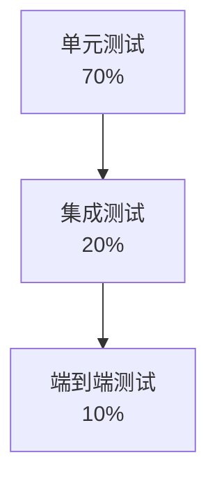
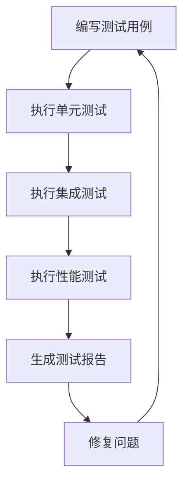

# 测试文档

## 📋 文档信息

- **项目名称**：企业级AI综合管理平台
- **文档版本**：v1.0
- **创建日期**：2026-01-13
- **文档类型**：测试文档

---

## 1. 测试策略

### 1.1 测试金字塔



### 1.2 测试类型

| 测试类型 | 覆盖率 | 负责人 | 工具 |
|---------|--------|--------|------|
| **单元测试** | >80% | 开发人员 | pytest |
| **集成测试** | >60% | 测试人员 | pytest |
| **性能测试** | - | 测试人员 | JMeter |
| **安全测试** | - | 安全专家 | OWASP ZAP |

---

## 2. 单元测试规范

### 2.1 Python单元测试

```python
# tests/test_user_service.py
import pytest
from app.services.user_service import UserService
from app.models.user import User

def test_create_user():
    """测试创建用户"""
    user_service = UserService()
    user_data = {
        "username": "test_user",
        "email": "test@example.com",
        "password": "password123"
    }
    user = user_service.create_user(user_data)
    assert user.id is not None
    assert user.username == "test_user"

def test_get_user_by_id():
    """测试根据ID获取用户"""
    user_service = UserService()
    user = user_service.get_user_by_id("1")
    assert user is not None
    assert user.id == "1"

def test_update_user():
    """测试更新用户"""
    user_service = UserService()
    update_data = {"email": "newemail@example.com"}
    user = user_service.update_user("1", update_data)
    assert user.email == "newemail@example.com"

def test_delete_user():
    """测试删除用户"""
    user_service = UserService()
    result = user_service.delete_user("1")
    assert result is True
```

### 2.2 TypeScript单元测试

```typescript
// tests/userStore.spec.ts
import { setActivePinia, createPinia } from 'pinia'
import { describe, it, expect, beforeEach } from 'vitest'
import { useUserStore } from '@/stores/user'

describe('User Store', () => {
  beforeEach(() => {
    setActivePinia(createPinia())
  })

  it('should set user info', () => {
    const userStore = useUserStore()
    userStore.setUserInfo({
      id: '1',
      username: 'admin',
      email: 'admin@example.com'
    })
    expect(userStore.userInfo).toBeDefined()
    expect(userStore.userInfo?.username).toBe('admin')
  })

  it('should clear user info', () => {
    const userStore = useUserStore()
    userStore.clearUserInfo()
    expect(userStore.userInfo).toBeNull()
  })
})
```

---

## 3. 集成测试规范

### 3.1 API集成测试

```python
# tests/test_api/test_user_api.py
import pytest
from httpx import AsyncClient
from main import app

@pytest.mark.asyncio
async def test_create_user_api():
    """测试创建用户API"""
    async with AsyncClient(app=app, base_url="http://test") as ac:
        response = await ac.post(
            "/api/v1/users",
            json={
                "username": "test_user",
                "email": "test@example.com",
                "password": "password123"
            }
        )
        assert response.status_code == 201
        data = response.json()
        assert data["success"] is True
        assert data["data"]["username"] == "test_user"

@pytest.mark.asyncio
async def test_get_user_list_api():
    """测试获取用户列表API"""
    async with AsyncClient(app=app, base_url="http://test") as ac:
        response = await ac.get("/api/v1/users?page=1&size=10")
        assert response.status_code == 200
        data = response.json()
        assert data["success"] is True
        assert "items" in data["data"]
        assert "total" in data["data"]
```

---

## 4. 性能测试规范

### 4.1 性能测试指标

| 指标 | 目标值 | 测试工具 |
|-----|--------|---------|
| **响应时间** | < 200ms (95%) | JMeter |
| **吞吐量** | > 1000 TPS | JMeter |
| **并发用户** | > 1000 | JMeter |
| **可用性** | > 99.9% | JMeter |

### 4.2 JMeter测试计划

```xml
<?xml version="1.0" encoding="UTF-8"?>
<jmeterTestPlan version="1.2" properties="5.0">
  <hashTree>
    <TestPlan guiclass="TestPlan" testclass="TestPlan" testname="性能测试计划">
      <elementProp name="TestPlan.comments" elementType="string"/>
      <stringProp name="TestPlan.user_define_classpath"/>
      <boolProp name="TestPlan.functional_mode" value="false"/>
      <boolProp name="TestPlan.serialize_threadgroups" value="false"/>
      <elementProp name="TestPlan.user_defined_variables" elementType="Arguments">
        <collectionProp name="Arguments.arguments">
          <elementProp name="BASE_URL" elementType="Argument">
            <stringProp name="Argument.value">http://localhost:8000</stringProp>
          </elementProp>
        </collectionProp>
      </elementProp>
      <ThreadGroup guiclass="ThreadGroup" testclass="ThreadGroup" testname="用户查询接口">
        <stringProp name="ThreadGroup.num_threads">100</stringProp>
        <stringProp name="ThreadGroup.ramp_time">10</stringProp>
        <stringProp name="ThreadGroup.duration">60</stringProp>
        <boolProp name="ThreadGroup.scheduler">true</boolProp>
        <elementProp name="ThreadGroup.main_controller" elementType="ThreadGroup"/>
        <LoopController guiclass="LoopController" testclass="LoopController" testname="循环控制器"/>
        <HTTPSamplerProxy guiclass="HTTPSamplerProxy" testclass="HTTPSamplerProxy" testname="HTTP请求">
          <stringProp name="HTTPSampler.domain">localhost</stringProp>
          <stringProp name="HTTPSampler.port">8000</stringProp>
          <stringProp name="HTTPSampler.path">/api/v1/users</stringProp>
          <stringProp name="HTTPSampler.method">GET</stringProp>
        </HTTPSamplerProxy>
      </ThreadGroup>
    </TestPlan>
  </hashTree>
</jmeterTestPlan>
```

---

## 5. 测试流程图



---

## 6. 测试覆盖率要求

| 模块 | 覆盖率要求 |
|-----|-----------|
| **用户模块** | >85% |
| **权限模块** | >85% |
| **MCP工具模块** | >85% |
| **多数据源模块** | >80% |
| **整体** | >80% |

---

## 🔗 相关文档

- [开发规范文档](./6-开发规范文档.md)
- [部署文档](./8-部署文档.md)
- [API接口设计文档](./4-API接口设计文档.md)

---

## 💡 注意事项

1. **测试独立**：测试环境与开发环境隔离
2. **测试数据**：使用测试数据，避免影响生产数据
3. **测试清理**：测试完成后清理测试数据
4. **测试文档**：及时更新测试文档
5. **自动化测试**：集成到CI/CD流程

---

**文档版本历史**：

| 版本 | 日期 | 作者 | 变更说明 |
|-----|------|------|---------|
| v1.0 | 2026-01-13 | AI助手 | 初始版本 |

---