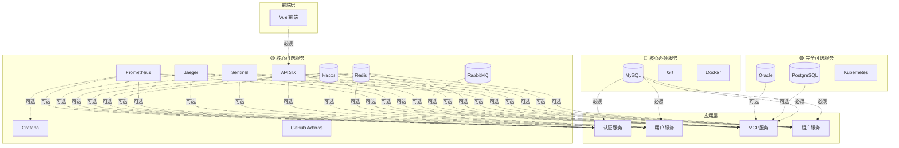

# 外部软件/服务需求清单

## 📋 说明

本文档列出项目所需的所有外部软件和服务，按重要性分类：

- **🔴 核心必须**：项目无法运行，必须部署
- **🟡 核心可选**：有默认值或降级方案，未配置时使用替代方案
- **🟢 完全可选**：不影响核心功能，按需部署

---

## 🔴 核心必须服务（项目无法运行）

### 1. 数据库服务

| 服务名称 | 版本要求 | 用途 | 需要配置项 | 状态 |
|---------|---------|------|-----------|------|
| **MySQL** | 8.0+ | 主数据库（必须） | IP地址、端口、用户名、密码、数据库名 | ✅ 已确认（8.0.43） |

**MySQL配置信息：**
```
IP地址：localhost
端口：3306（默认3306）
用户名：root
密码：12345678
数据库名：mcp-platform
字符集：utf8mb4
```

**说明**：MySQL是项目的主数据库，必须部署。如果未配置，项目无法启动。

---

### 2. 版本控制

| 服务名称 | 版本要求 | 用途 | 需要配置项 | 状态 |
|---------|---------|------|-----------|------|
| **Git** | 2.40+ | 版本控制 | 仓库地址 | ✅ 已确认（2.52.0.windows.1） |

**Git配置信息：**
```
Git仓库地址：git@github.com:klpk961224/mcp-platform.git   /   https://github.com/klpk961224/mcp-platform.git
分支名称：master
```

**说明**：Git是版本控制工具，必须安装。如果未配置，无法进行代码管理。

---

### 3. 容器化

| 服务名称 | 版本要求 | 用途 | 需要配置项 | 状态 |
|---------|---------|------|-----------|------|
| **Docker** | 24.0+ | 容器化部署 | Docker Hub账号（可选） | ✅ 已确认（29.1.3） |

**Docker配置信息：**
```
Docker版本：4.55.0
Docker Hub账号：_____________（可选）
```

**说明**：Docker是容器化工具，必须安装。如果未安装，无法使用Docker部署。

---

## 🟡 核心可选服务（有降级方案）

### 1. 配置中心

| 服务名称 | 版本要求 | 用途 | 需要配置项 | 状态 |
|---------|---------|------|-----------|------|
| **Nacos** | 2.2+ | 配置中心 + 服务注册发现 | IP地址、端口、命名空间、命名空间ID | ✅ 已确认（运行中） |

**Nacos配置信息：**
```
IP地址：127.0.0.1
端口：18848（默认8848）
管理控制台端口：18080（默认8080）
命名空间：mcp-platform
命名空间ID：mcp-platform
用户名：nacos（如需认证）
密码：nacos（如需认证）
```

**降级方案**：
- ✅ **未配置时**：使用本地配置文件（`.env`）和本地服务注册
- ✅ **配置后**：使用Nacos动态配置和服务发现
- 📝 **配置文件**：`config/settings.py` 中的 `USE_NACOS=False` 时降级

---

### 2. 消息队列

| 服务名称 | 版本要求 | 用途 | 需要配置项 | 状态 |
|---------|---------|------|-----------|------|
| **RabbitMQ** | 3.12+ | 异步消息队列 | IP地址、端口、用户名、密码、虚拟主机 | ✅ 已确认（运行中） |

**RabbitMQ配置信息：**
```
IP地址：localhost
端口：5672（默认5672）
管理端口：15672（默认15672）
用户名：admin
密码：admin123
虚拟主机：____________________（默认/）
```

**降级方案**：
- ✅ **未配置时**：异步任务降级为同步执行，通知功能降级为直接发送
- ✅ **配置后**：使用RabbitMQ进行异步消息处理
- 📝 **配置文件**：`config/settings.py` 中的 `USE_RABBITMQ=False` 时降级

---

### 3. API网关

| 服务名称 | 版本要求 | 用途 | 需要配置项 | 状态 |
|---------|---------|------|-----------|------|
| **APISIX** | 3.5+ | API网关、限流、路由 | IP地址、端口、Admin Key | ❌ 未部署 |

**APISIX配置信息：**
```
IP地址：________________________
HTTP端口：____________________（默认9080）
HTTPS端口：___________________（默认9443）
Admin端口：___________________（默认9180）
Admin Key：__________________
```

**降级方案**：
- ✅ **未配置时**：客户端直连后端服务，无网关层
- ✅ **配置后**：通过APISIX进行统一入口、限流、路由
- 📝 **配置文件**：`config/settings.py` 中的 `USE_APISIX=False` 时降级

---

### 4. 限流熔断

| 服务名称 | 版本要求 | 用途 | 需要配置项 | 状态 |
|---------|---------|------|-----------|------|
| **Sentinel** | 1.8+ | 限流熔断 | IP地址、端口 | ❌ 未部署 |

**Sentinel配置信息：**
```
IP地址：________________________
控制台端口：__________________（默认8080）
客户端端口：__________________（默认8719）
```

**降级方案**：
- ✅ **未配置时**：无限流熔断保护，全量请求通过
- ✅ **配置后**：使用Sentinel进行流量控制和熔断保护
- 📝 **配置文件**：`config/settings.py` 中的 `USE_SENTINEL=False` 时降级

---

### 5. 分布式追踪

| 服务名称 | 版本要求 | 用途 | 需要配置项 | 状态 |
|---------|---------|------|-----------|------|
| **Jaeger** | 1.50+ | 分布式链路追踪 | IP地址、端口 | ❌ 未部署 |

**Jaeger配置信息：**
```
IP地址：________________________
UI端口：_______________________（默认16686）
Collector端口：_______________（默认14268）
Agent端口：___________________（默认6831 UDP）
```

**降级方案**：
- ✅ **未配置时**：无分布式追踪，使用本地日志记录
- ✅ **配置后**：使用Jaeger进行分布式链路追踪
- 📝 **配置文件**：`config/settings.py` 中的 `USE_JAEGER=False` 时降级

---

### 6. 监控系统

| 服务名称 | 版本要求 | 用途 | 需要配置项 | 状态 |
|---------|---------|------|-----------|------|
| **Prometheus** | 2.45+ | 数据采集与存储 | IP地址、端口 | ❌ 未部署 |
| **Grafana** | 10.0+ | 数据可视化 | IP地址、端口、管理员密码 | ❌ 未部署 |

**Prometheus配置信息：**
```
IP地址：________________________
端口：________________________（默认9090）
数据存储路径：________________
```

**Grafana配置信息：**
```
IP地址：________________________
端口：________________________（默认3000）
管理员用户名：________________（默认admin）
管理员密码：__________________
```

**降级方案**：
- ✅ **未配置时**：无监控数据采集和可视化
- ✅ **配置后**：使用Prometheus + Grafana进行监控
- 📝 **配置文件**：`config/settings.py` 中的 `USE_MONITORING=False` 时降级

---

### 7. 缓存服务

| 服务名称 | 版本要求 | 用途 | 需要配置项 | 状态 |
|---------|---------|------|-----------|------|
| **Redis** | 7.0+ | 分布式缓存 | IP地址、端口、密码 | ✅ 已确认（运行中） |

**Redis配置信息：**
```
IP地址：____127.0.0.1_______
端口：________6379_______（默认6379）
密码：________________________（可选）
数据库编号：__________________（默认0）
最大连接数：__________________（默认50）
```

**降级方案**：
- ✅ **未配置时**：使用本地内存缓存（TTLCache）
- ✅ **配置后**：使用Redis分布式缓存
- 📝 **配置文件**：`config/settings.py` 中的 `CACHE_ENABLED=False` 或 `CACHE_TYPE=local` 时降级

---

### 8. CI/CD

| 服务名称 | 版本要求 | 用途 | 需要配置项 | 状态 |
|---------|---------|------|-----------|------|
| **GitHub Actions** | 无需部署 | 持续集成/持续部署 | GitHub仓库、Access Token | ❌ 未配置 |

**GitHub Actions配置信息：**
```
GitHub仓库地址：______________
Access Token：________________
```

**降级方案**：
- ✅ **未配置时**：手动构建和部署
- ✅ **配置后**：使用GitHub Actions自动CI/CD
- 📝 **配置文件**：`.github/workflows/` 目录中的workflow文件

---

## 🟢 完全可选服务（不影响核心功能）

### 1. 其他数据库

| 服务名称 | 版本要求 | 用途 | 需要配置项 | 状态 |
|---------|---------|------|-----------|------|
| **PostgreSQL** | 15+ | 多数据源支持 | IP地址、端口、用户名、密码、数据库名 | ⬜ 待确认 |
| **Oracle** | 19c+ | 多数据源支持 | IP地址、端口、服务名、用户名、密码 | ⬜ 待确认 |
| **SQLite** | 3.x | 开发环境备用 | 文件路径 | ⬜ 待确认 |

**PostgreSQL配置信息：**
```
IP地址：________________________
端口：________________________（默认5432）
用户名：______________________
密码：________________________
数据库名：____________________
```

**Oracle配置信息：**
```
IP地址：________________________
端口：________________________（默认1521）
服务名：______________________
用户名：______________________
密码：________________________
```

**SQLite配置信息：**
```
文件路径：____________________
```

**说明**：这些数据库用于多数据源支持，不影响核心功能。未配置时只使用MySQL。

---

### 2. 容器编排

| 服务名称 | 版本要求 | 用途 | 需要配置项 | 状态 |
|---------|---------|------|-----------|------|
| **Kubernetes** | 1.28+ | 生产环境容器编排 | API Server地址、Token | ⬜ 待确认 |

**Kubernetes配置信息：**
```
API Server地址：_______________
Token：________________________
Namespace：___________________
```

**说明**：Kubernetes用于生产环境容器编排，开发环境使用Docker即可。

---

## 📊 服务优先级总结

### 最小化启动（仅核心必须）

| 服务名称 | 必须性 | 说明 |
|---------|-------|------|
| MySQL | 🔴 必须 | 主数据库 |
| Git | 🔴 必须 | 版本控制 |
| Docker | 🔴 必须 | 容器化 |

**功能**：基础CRUD、用户管理、权限管理、MCP工具管理

---

### 标准配置（核心必须 + 核心可选推荐）

| 服务名称 | 必须性 | 推荐度 | 说明 |
|---------|-------|-------|------|
| MySQL | 🔴 必须 | ⭐⭐⭐⭐⭐ | 主数据库 |
| Git | 🔴 必须 | ⭐⭐⭐⭐⭐ | 版本控制 |
| Docker | 🔴 必须 | ⭐⭐⭐⭐⭐ | 容器化 |
| Redis | 🟡 推荐 | ⭐⭐⭐⭐⭐ | 缓存（默认本地缓存，推荐Redis） |
| Nacos | 🟡 推荐 | ⭐⭐⭐⭐ | 配置中心（默认本地配置） |
| RabbitMQ | 🟡 推荐 | ⭐⭐⭐⭐ | 消息队列（默认同步执行） |

**功能**：完整功能 + 性能优化 + 动态配置

---

### 生产配置（所有核心服务）

| 服务名称 | 必须性 | 推荐度 | 说明 |
|---------|-------|-------|------|
| MySQL | 🔴 必须 | ⭐⭐⭐⭐⭐ | 主数据库 |
| Git | 🔴 必须 | ⭐⭐⭐⭐⭐ | 版本控制 |
| Docker | 🔴 必须 | ⭐⭐⭐⭐⭐ | 容器化 |
| Redis | 🟡 必须 | ⭐⭐⭐⭐⭐ | 缓存 |
| Nacos | 🟡 必须 | ⭐⭐⭐⭐⭐ | 配置中心 |
| RabbitMQ | 🟡 必须 | ⭐⭐⭐⭐ | 消息队列 |
| APISIX | 🟡 必须 | ⭐⭐⭐⭐ | API网关 |
| Sentinel | 🟡 必须 | ⭐⭐⭐⭐ | 限流熔断 |
| Jaeger | 🟡 必须 | ⭐⭐⭐ | 分布式追踪 |
| Prometheus | 🟡 必须 | ⭐⭐⭐⭐ | 监控 |
| Grafana | 🟡 必须 | ⭐⭐⭐⭐ | 可视化 |
| GitHub Actions | 🟡 必须 | ⭐⭐⭐⭐⭐ | CI/CD |

**功能**：生产级稳定性 + 监控告警 + 自动化部署

---

## 📝 配置降级对照表

| 功能模块 | 配置参数 | 默认值 | 降级方案 |
|---------|---------|-------|---------|
| 配置中心 | `USE_NACOS` | `False` | 使用本地`.env`配置文件 |
| 消息队列 | `USE_RABBITMQ` | `False` | 同步执行，无异步 |
| API网关 | `USE_APISIX` | `False` | 直连后端服务 |
| 限流熔断 | `USE_SENTINEL` | `False` | 无限流保护 |
| 分布式追踪 | `USE_JAEGER` | `False` | 使用本地日志 |
| 监控系统 | `USE_MONITORING` | `False` | 无监控数据 |
| 缓存服务 | `CACHE_ENABLED` | `False` | 无缓存 |
| 缓存类型 | `CACHE_TYPE` | `local` | 本地缓存（`redis`时需配置Redis） |

---

## 📊 部署架构图



---

## ✅ 确认清单

### 核心必须服务确认（必须部署）
- [ ] MySQL配置已确认
- [ ] Git配置已确认
- [ ] Docker配置已确认

### 核心可选服务确认（推荐部署）
- [ ] Redis配置已确认（推荐）
- [ ] Nacos配置已确认（推荐）
- [ ] RabbitMQ配置已确认（推荐）
- [ ] APISIX配置已确认（生产环境）
- [ ] Sentinel配置已确认（生产环境）
- [ ] Jaeger配置已确认（生产环境）
- [ ] Prometheus配置已确认（生产环境）
- [ ] Grafana配置已确认（生产环境）
- [ ] GitHub Actions配置已确认（推荐）

### 完全可选服务确认（按需部署）
- [ ] PostgreSQL配置已确认（如需多数据源）
- [ ] Oracle配置已确认（如需多数据源）
- [ ] Kubernetes配置已确认（生产环境）

---

## 📝 快速启动指南

### 开发环境（最小化配置）

**必须部署**：
1. MySQL
2. Git
3. Docker

**配置文件**：
```bash
# .env
USE_NACOS=False
USE_RABBITMQ=False
USE_APISIX=False
USE_SENTINEL=False
USE_JAEGER=False
USE_MONITORING=False
CACHE_ENABLED=False
```

**功能**：基础功能完整，无性能优化和监控

---

### 测试环境（标准配置）

**必须部署**：
1. MySQL
2. Git
3. Docker
4. Redis
5. Nacos
6. RabbitMQ
7. GitHub Actions

**配置文件**：
```bash
# .env
USE_NACOS=True
USE_RABBITMQ=True
USE_APISIX=False
USE_SENTINEL=False
USE_JAEGER=False
USE_MONITORING=False
CACHE_ENABLED=True
CACHE_TYPE=redis
```

**功能**：完整功能 + 性能优化 + 动态配置 + CI/CD

---

### 生产环境（完整配置）

**必须部署**：
1. MySQL
2. Git
3. Docker
4. Redis
5. Nacos
6. RabbitMQ
7. APISIX
8. Sentinel
9. Jaeger
10. Prometheus
11. Grafana
12. GitHub Actions
13. Kubernetes（可选）

**配置文件**：
```bash
# .env
USE_NACOS=True
USE_RABBITMQ=True
USE_APISIX=True
USE_SENTINEL=True
USE_JAEGER=True
USE_MONITORING=True
CACHE_ENABLED=True
CACHE_TYPE=redis
```

**功能**：生产级稳定性 + 监控告警 + 自动化部署 + 容器编排

---

## 🔗 相关文档

- [技术架构设计文档](./2-技术架构设计文档.md)
- [环境配置文档](./7-环境配置文档.md)
- [部署文档](./8-部署文档.md)

---

## 💡 注意事项

1. **降级原则**：所有核心可选服务都有降级方案，未配置时系统仍可正常运行
2. **配置优先级**：环境变量 > 配置文件 > 默认值
3. **最小化启动**：开发环境只需部署3个核心必须服务即可启动
4. **逐步升级**：可以从最小化配置逐步升级到完整配置
5. **监控建议**：生产环境建议部署所有监控相关服务
6. **备份策略**：定期备份MySQL数据库和配置文件

---

**请确认以上配置信息，确认后我将开始生成项目全流程文档。**