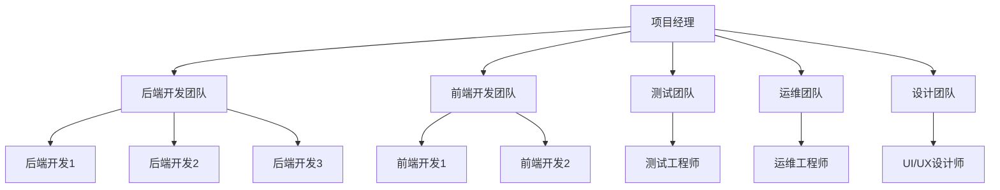
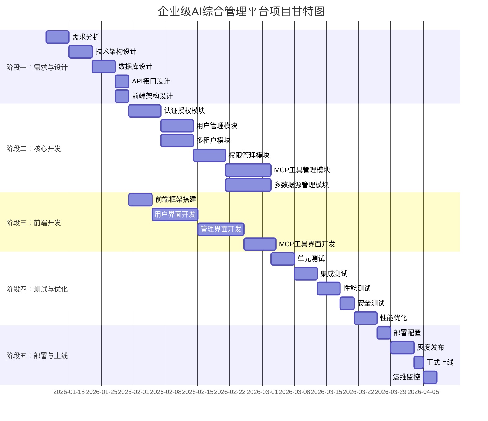

# 项目启动文档

## 📋 文档信息

- **项目名称**：企业级AI综合管理平台
- **文档版本**：v1.0
- **创建日期**：2026-01-13
- **文档类型**：项目启动文档

---

## 1. 项目背景与目标

### 1.1 项目背景

随着人工智能技术的快速发展，企业对AI工具的管理和调用需求日益增长。传统的人工管理方式效率低下，难以满足企业级场景下的多租户、多权限、多数据源等复杂需求。因此，我们需要构建一个**安全、灵活、可扩展**的综合管理平台，整合MCP（Model Context Protocol）工具调用网关及多MCP工具管理能力。

### 1.2 项目目标

**核心目标**：
- ✅ 构建企业级AI工具管理平台
- ✅ 支持多租户隔离和SaaS场景
- ✅ 实现细粒度的RBAC权限控制
- ✅ 支持多数据源管理（MySQL、PostgreSQL、Oracle）
- ✅ 提供MCP工具注册、调用、监控能力
- ✅ 支持动态配置和热更新
- ✅ 提供完整的用户、部门、角色、菜单管理

**技术目标**：
- ✅ 采用微服务架构，支持独立部署和扩展
- ✅ 使用FastAPI构建高性能后端服务
- ✅ 使用Vue 3构建现代化前端界面
- ✅ 支持容器化部署（Docker + Kubernetes）
- ✅ 实现完整的监控、日志、告警体系
- ✅ 提供CI/CD自动化部署能力

**业务目标**：
- ✅ 支持多租户SaaS场景
- ✅ 支持企业级权限管理
- ✅ 支持MCP工具的统一管理和调用
- ✅ 支持跨数据库的数据查询和整合
- ✅ 提供完善的审计和日志功能

---

## 2. 需求分析

### 2.1 功能需求

#### 2.1.1 核心功能（P0）

| 功能模块 | 功能描述 | 优先级 |
|---------|---------|--------|
| **认证授权** | 支持JWT和API Key双鉴权方式 | P0 |
| **用户管理** | 用户注册、登录、状态管理、部门/角色分配 | P0 |
| **多租户管理** | 租户配置、租户套餐、资源配额、数据隔离 | P0 |
| **部门管理** | 5级部门层级、树结构、自动编码 | P0 |
| **角色管理** | 角色创建、权限分配、权限继承 | P0 |
| **权限管理** | RBAC + ABAC权限模型、动态权限控制 | P0 |
| **菜单管理** | 菜单配置、权限绑定、动态加载 | P0 |
| **MCP工具管理** | 工具注册、调用、监控、权限控制 | P0 |
| **多数据源管理** | 支持MySQL、PostgreSQL、Oracle多数据源 | P0 |

#### 2.1.2 重要功能（P1）

| 功能模块 | 功能描述 | 优先级 |
|---------|---------|--------|
| **岗位管理** | 岗位配置、岗位与部门/角色关联 | P1 |
| **字典管理** | 系统字典维护、分组管理 | P1 |
| **错误码管理** | 错误码配置、在线修改错误提示 | P1 |
| **日志审计** | 登录日志、操作日志、日志分包 | P1 |
| **权限缓存** | 多级缓存、缓存失效策略 | P1 |
| **通知系统** | 站内信、通知公告、消息队列 | P1 |
| **待办任务管理** | 个人待办任务、每日计划、任务提醒、任务完成统计 | P1 |
| **工作流管理** | 预置审批模板、可视化设计器、审批流程配置、审批任务管理、流程监控、首页看板集成 | P1 |

**待办任务管理详细功能**：
- **个人待办任务**：创建、编辑、删除待办任务，标记完成，设置优先级（高/中/低），设置截止时间，添加标签，添加附件
- **每日计划**：创建每日计划，查看今日计划，完成每日计划任务，每日计划统计（完成率），每日计划历史记录
- **待办任务列表**：待办任务列表（分页、搜索、筛选），已完成任务列表，过期任务列表，按优先级排序，按截止时间排序
- **任务提醒**：任务到期提醒，任务超时提醒，每日计划提醒，通知推送（站内信、邮件）

**工作流管理详细功能**：
- **预置审批模板**：人事审批（请假、加班、离职）、权限审批（权限开放、数据访问、API调用）、财务审批（报销、预算、采购）、IT审批（资源、账号、网络）
- **可视化设计器**：拖拽式节点编辑，流程图展示，节点配置（开始、结束、表单、审批、条件、并行、动作、等待、循环、MCP工具、子流程），节点连接线配置
- **审批流程配置**：支持单人审批，支持多人审批（会签/或签），支持条件分支，支持并行节点，支持审批操作（同意、驳回、转交）
- **审批任务管理**：待办审批任务列表，已办审批任务列表，抄送任务列表，审批任务详情查看，审批任务处理（同意、驳回、转交），审批评论
- **流程监控**：实时监控工作流状态，节点进度展示（流程图高亮），执行日志记录，异常处理和重试，工作流历史记录
- **首页看板集成**：待办任务列表（排第一），工作流统计卡片（运行中、已完成、待处理、异常），工作流统计数据API，待办审批任务API

#### 2.1.3 可选功能（P2）

| 功能模块 | 功能描述 | 优先级 |
|---------|---------|--------|
| **敏感词管理** | 敏感词配置、标签分组 | P2 |
| **地区管理** | 省份、城市、区镇信息、IP对应城市 | P2 |
| **文件管理** | 文件上传/下载、权限校验 | P2 |
| **配置中心** | Nacos集成、动态配置、热更新 | P2 |

### 2.2 非功能需求

#### 2.2.1 性能需求

| 指标 | 要求 | 说明 |
|-----|------|------|
| **响应时间** | < 200ms | 95%的API请求响应时间 |
| **并发用户** | > 1000 | 支持同时在线用户数 |
| **吞吐量** | > 1000 TPS | 每秒事务处理量 |
| **可用性** | > 99.9% | 系统可用性 |

#### 2.2.2 安全需求

| 指标 | 要求 | 说明 |
|-----|------|------|
| **数据加密** | AES-256 | 敏感数据加密存储 |
| **传输加密** | HTTPS | 所有API请求使用HTTPS |
| **认证方式** | JWT + API Key | 支持多种认证方式 |
| **权限控制** | RBAC + ABAC | 细粒度权限控制 |
| **审计日志** | 完整记录 | 所有关键操作记录日志 |

#### 2.2.3 可扩展性需求

| 指标 | 要求 | 说明 |
|-----|------|------|
| **水平扩展** | 支持 | 服务可水平扩展 |
| **垂直扩展** | 支持 | 服务可垂直扩展 |
| **多租户** | 支持 | 支持多租户隔离 |
| **多数据库** | 支持 | 支持多数据源切换 |

#### 2.2.4 可维护性需求

| 指标 | 要求 | 说明 |
|-----|------|------|
| **日志管理** | 完善的日志 | 支持日志查询、分析 |
| **监控告警** | 实时监控 | 支持性能监控、异常告警 |
| **部署方式** | 容器化 | 支持Docker、K8s部署 |
| **文档完善** | 完整文档 | 提供开发、部署、运维文档 |

---

## 3. 项目范围与边界

### 3.1 项目范围

**包含范围**：
- ✅ 用户管理、部门管理、角色管理、权限管理
- ✅ 多租户管理、租户套餐、资源配额
- ✅ MCP工具管理、工具注册、调用、监控
- ✅ 多数据源管理、跨数据库查询
- ✅ 菜单管理、动态权限、权限缓存
- ✅ 日志审计、操作日志、登录日志
- ✅ 通知系统、站内信、通知公告
- ✅ 字典管理、错误码管理、岗位管理

**不包含范围**：
- ❌ AI模型训练和推理
- ❌ 第三方AI平台集成（除非通过MCP工具）
- ❌ 复杂的工作流引擎（简单的待办任务除外）
- ❌ 数据挖掘和数据分析功能
- ❌ 移动端应用（仅Web端）

### 3.2 项目边界

**技术边界**：
- 后端使用FastAPI + Python 3.13+
- 前端使用Vue 3 + TypeScript
- 数据库使用MySQL（主）+ PostgreSQL/Oracle（可选）
- 缓存使用Redis（可选，默认本地缓存）
- 部署使用Docker + Kubernetes（可选）

**业务边界**：
- 仅支持企业级SaaS场景
- 仅支持Web端访问
- 仅支持MCP协议的工具调用
- 仅支持关系型数据库

---

## 4. 团队规划

### 4.1 团队角色分工

| 角色 | 职责 | 人数 |
|-----|------|------|
| **项目经理** | 项目管理、进度控制、风险管理 | 1人 |
| **后端开发** | 后端服务开发、API设计、数据库设计 | 2-3人 |
| **前端开发** | 前端界面开发、组件开发、交互设计 | 2人 |
| **测试工程师** | 测试用例设计、自动化测试、性能测试 | 1人 |
| **运维工程师** | 部署运维、监控告警、故障处理 | 1人 |
| **UI/UX设计师** | 界面设计、交互设计、用户体验优化 | 1人 |

**总人数**：8-9人

### 4.2 项目组织架构图

### 4.3 沟通机制

| 沟通方式 | 频率 | 参与人 | 内容 |
|---------|------|-------|------|
| **每日站会** | 每天 | 全体成员 | 进度同步、问题反馈 |
| **周例会** | 每周 | 全体成员 | 周报、下周计划、风险评估 |
| **技术评审** | 按需 | 技术团队 | 技术方案评审、代码审查 |
| **需求评审** | 按需 | 产品+开发 | 需求评审、需求变更 |
| **项目复盘** | 每个阶段 | 全体成员 | 阶段总结、经验分享 |

---

## 5. 风险评估

### 5.1 技术风险

| 风险 | 等级 | 影响 | 应对措施 |
|-----|------|------|---------|
| **多数据源兼容性** | 高 | 跨数据库查询可能存在兼容性问题 | 提前测试、使用ORM抽象层、编写兼容性测试 |
| **性能瓶颈** | 中 | 高并发场景下性能可能不达标 | 性能测试、缓存优化、数据库优化、水平扩展 |
| **MCP协议集成** | 中 | MCP协议可能存在不确定性 | 提前调研、预留扩展接口、版本控制 |
| **分布式事务** | 高 | 跨数据源事务一致性难以保证 | 使用应用层事务、最终一致性、补偿机制 |

### 5.2 进度风险

| 风险 | 等级 | 影响 | 应对措施 |
|-----|------|------|---------|
| **需求变更** | 中 | 需求变更可能导致延期 | 需求冻结、变更评审、优先级调整 |
| **人员变动** | 中 | 人员变动可能影响进度 | 知识共享、代码文档化、交叉培训 |
| **技术难点** | 中 | 技术难点可能影响进度 | 提前调研、技术预研、外部支持 |

### 5.3 资源风险

| 风险 | 等级 | 影响 | 应对措施 |
|-----|------|------|---------|
| **服务器资源** | 低 | 服务器资源不足 | 资源规划、弹性扩展、云服务 |
| **第三方服务** | 中 | 第三方服务不稳定 | 降级方案、备用方案、服务监控 |

### 5.4 安全风险

| 风险 | 等级 | 影响 | 应对措施 |
|-----|------|------|---------|
| **数据泄露** | 高 | 敏感数据泄露 | 数据加密、访问控制、审计日志 |
| **SQL注入** | 高 | SQL注入攻击 | 参数化查询、ORM、安全审计 |
| **XSS攻击** | 中 | XSS攻击 | 输入验证、输出编码、CSP策略 |

---

## 6. 里程碑规划

### 6.1 项目甘特图

### 6.2 里程碑节点

| 阶段 | 里程碑 | 时间节点 | 交付物 |
|-----|-------|---------|--------|
| **需求与设计** | 需求评审完成 | 2026-01-18 | 需求文档、设计文档 |
| **需求与设计** | 技术方案评审完成 | 2026-01-25 | 技术架构文档、数据库设计文档 |
| **核心开发** | 认证授权模块完成 | 2026-02-10 | 认证授权模块代码、测试用例 |
| **核心开发** | 用户管理模块完成 | 2026-02-20 | 用户管理模块代码、测试用例 |
| **核心开发** | MCP工具管理模块完成 | 2026-03-10 | MCP工具管理模块代码、测试用例 |
| **前端开发** | 前端界面开发完成 | 2026-03-20 | 前端代码、UI设计稿 |
| **测试与优化** | 测试完成 | 2026-04-10 | 测试报告、性能测试报告 |
| **部署与上线** | 正式上线 | 2026-04-20 | 部署文档、运维文档 |

### 6.3 时间规划

| 阶段 | 工作量 | 时间 | 人员 |
|-----|-------|------|------|
| **需求与设计** | 18人天 | 3周 | 全员 |
| **核心开发** | 84人天 | 6周 | 后端3人 |
| **前端开发** | 50人天 | 5周 | 前端2人 |
| **测试与优化** | 36人天 | 4周 | 测试1人+后端1人 |
| **部署与上线** | 13人天 | 2周 | 运维1人+后端1人 |
| **总计** | 201人天 | 20周 | 8-9人 |

---

## 7. 成功标准

### 7.1 功能标准

- ✅ 所有P0功能模块全部实现
- ✅ 所有P1功能模块全部实现
- ✅ 至少80%的P2功能模块实现
- ✅ 所有功能模块通过测试

### 7.2 性能标准

- ✅ 95%的API请求响应时间 < 200ms
- ✅ 支持同时在线用户数 > 1000
- ✅ 系统吞吐量 > 1000 TPS
- ✅ 系统可用性 > 99.9%

### 7.3 质量标准

- ✅ 代码测试覆盖率 > 80%
- ✅ 无严重Bug（P0、P1级别）
- ✅ 所有安全漏洞修复
- ✅ 文档完整准确

### 7.4 交付标准

- ✅ 完整的源代码
- ✅ 完整的文档（开发文档、部署文档、运维文档）
- ✅ 完整的测试报告
- ✅ 完整的部署方案
- ✅ 完整的培训材料

---

## 8. 项目假设与约束

### 8.1 项目假设

- ✅ 项目团队成员稳定，无重大人员变动
- ✅ 第三方服务（MySQL、Redis、Nacos等）稳定可用
- ✅ 需求在项目启动后2周内冻结
- ✅ 技术方案在项目启动后1周内确定
- ✅ 测试环境和生产环境按时提供

### 8.2 项目约束

- ✅ 项目预算有限，需控制成本
- ✅ 项目时间有限，需按时交付
- ✅ 技术栈已确定，不能随意更改
- ✅ 需遵循公司开发规范和安全规范
- ✅ 需兼容现有的基础设施

---

## 9. 项目成功因素

### 9.1 关键成功因素

1. **明确的需求**：需求清晰、稳定、可验证
2. **合理的技术方案**：技术方案可行、可扩展、可维护
3. **高效的团队协作**：团队沟通顺畅、分工明确
4. **严格的质量控制**：代码审查、测试覆盖、性能优化
5. **完善的风险管理**：风险识别、风险评估、风险应对

### 9.2 项目关键路径

1. 需求分析 → 技术架构设计 → 数据库设计 → API接口设计
2. 认证授权模块 → 用户管理模块 → 权限管理模块 → MCP工具管理模块
3. 前端框架搭建 → 用户界面开发 → 管理界面开发 → MCP工具界面开发
4. 单元测试 → 集成测试 → 性能测试 → 安全测试
5. 部署配置 → 灰度发布 → 正式上线 → 运维监控

---

## 10. 项目交付物清单

### 10.1 文档交付物

- [x] 项目启动文档（本文档）
- [ ] 技术架构设计文档
- [ ] 数据库设计文档
- [ ] API接口设计文档
- [ ] 前端架构设计文档
- [ ] 开发规范文档
- [ ] 环境配置文档
- [ ] 部署文档
- [ ] 测试文档
- [ ] 运维文档
- [ ] 安全文档
- [ ] 性能优化文档

### 10.2 代码交付物

- [ ] 后端源代码
- [ ] 前端源代码
- [ ] 数据库迁移脚本
- [ ] 部署脚本
- [ ] CI/CD配置文件

### 10.3 测试交付物

- [ ] 测试用例
- [ ] 测试报告
- [ ] 性能测试报告
- [ ] 安全测试报告

---

## 🔗 相关文档

- [技术架构设计文档](./2-技术架构设计文档.md)
- [数据库设计文档](./3-数据库设计文档.md)
- [API接口设计文档](./4-API接口设计文档.md)
- [前端架构设计文档](./5-前端架构设计文档.md)
- [外部软件服务需求清单](./0-外部软件服务需求清单.md)

---

## 💡 注意事项

1. **需求变更**：需求变更需经过评审，评估影响后执行
2. **进度控制**：每周进行进度评估，及时调整计划
3. **质量控制**：每个阶段完成后进行质量评审
4. **风险监控**：每周进行风险评估，及时采取应对措施
5. **沟通机制**：保持团队沟通顺畅，及时解决问题
6. **文档管理**：及时更新文档，保持文档与代码同步

---

**文档版本历史**：

| 版本 | 日期 | 作者 | 变更说明 |
|-----|------|------|---------|
| v1.0 | 2026-01-13 | AI助手 | 初始版本 |

---

**下一步**：开始生成[技术架构设计文档](./2-技术架构设计文档.md)