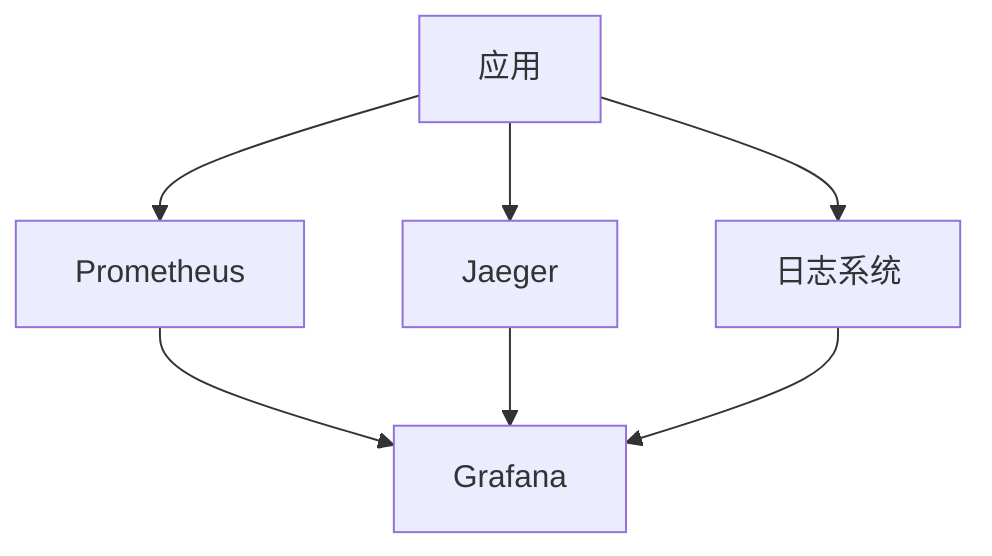
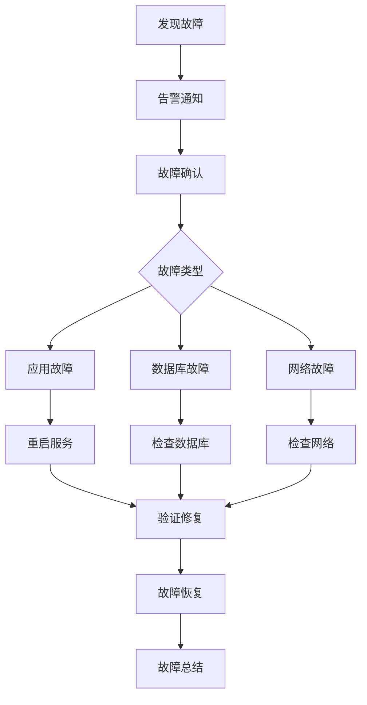
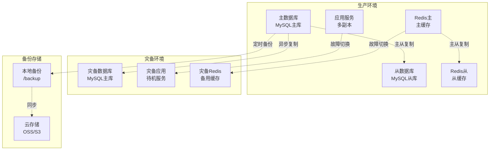
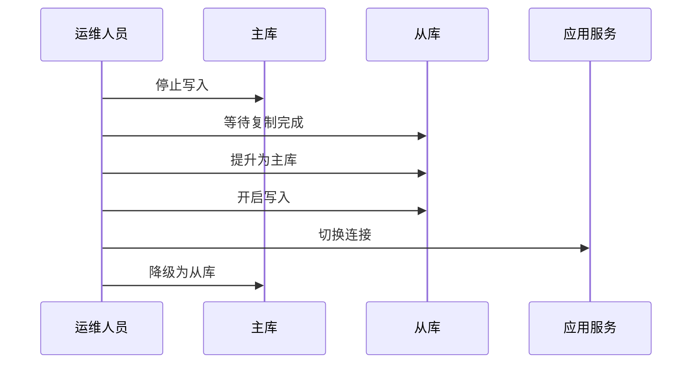
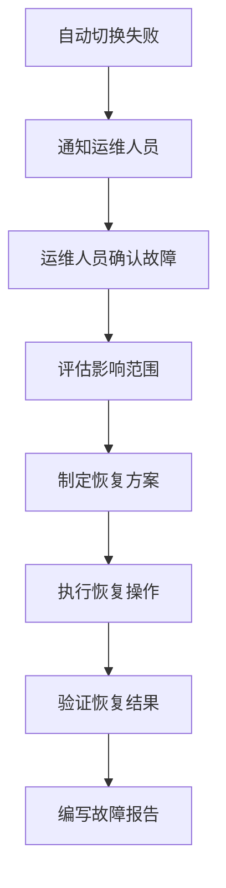
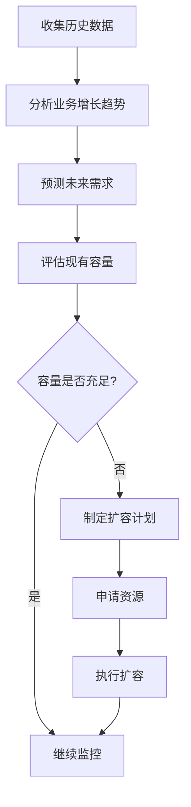

# 运维文档

## 📋 文档信息

- **项目名称**：企业级AI综合管理平台
- **文档版本**：v1.0
- **创建日期**：2026-01-13
- **文档类型**：运维文档

---

## 1. 系统监控方案

### 1.1 监控架构



### 1.2 监控指标

| 指标类型 | 监控项 | 告警阈值 |
|---------|--------|---------|
| **应用指标** | QPS、响应时间、错误率 | QPS<100、响应时间>500ms、错误率>1% |
| **系统指标** | CPU、内存、磁盘、网络 | CPU>80%、内存>85%、磁盘>90% |
| **数据库指标** | 连接数、慢查询、主从延迟 | 连接数>80%、慢查询>1s、主从延迟>100ms |
| **缓存指标** | 命中率、内存使用、连接数 | 命中率<80%、内存使用>85% |

---

## 2. 日志管理方案

### 2.1 日志分类

| 日志类型 | 存储位置 | 保留时间 | 日志级别 |
|---------|---------|---------|---------|
| **应用日志** | /var/log/app/ | 30天 | DEBUG/INFO/WARNING/ERROR |
| **访问日志** | /var/log/nginx/ | 30天 | INFO |
| **错误日志** | /var/log/error/ | 90天 | ERROR |
| **审计日志** | /var/log/audit/ | 180天 | INFO |

### 2.2 日志配置

```python
# utils/logger.py
import sys
from loguru import logger
from pathlib import Path

# 配置日志
logger.remove()
logger.add(
    sys.stderr,
    level="DEBUG",
    format="<green>{time:YYYY-MM-DD HH:mm:ss}</green> | <level>{level: <8}</level> | <cyan>{name}</cyan>:<cyan>{function}</cyan>:<cyan>{line}</cyan> - <level>{message}</level>"
)

# 文件日志
logger.add(
    "logs/app.log",
    rotation="100 MB",
    retention="30 days",
    level="INFO",
    format="{time:YYYY-MM-DD HH:mm:ss} | {level: <8} | {name}:{function}:{line} - {message}"
)

# 错误日志
logger.add(
    "logs/error.log",
    rotation="50 MB",
    retention="90 days",
    level="ERROR",
    format="{time:YYYY-MM-DD HH:mm:ss} | {level: <8} | {name}:{function}:{line} - {message}"
)
```

---

## 3. 告警配置

### 3.1 告警规则

| 告警级别 | 触发条件 | 通知方式 |
|---------|---------|---------|
| **紧急** | 应用宕机、数据库不可用 | 电话+短信+邮件 |
| **重要** | 响应时间>1s、错误率>5% | 短信+邮件 |
| **一般** | CPU>80%、内存>85% | 邮件 |

### 3.2 告警通知

```yaml
# prometheus/alerts.yml
groups:
  - name: 应用告警
    rules:
      - alert: 应用错误率过高
        expr: rate(http_requests_total{status=~"5.."}[5m]) > 0.05
        for: 2m
        labels:
          severity: 重要
        annotations:
          summary: "应用错误率过高"
          description: "应用{{ $labels.instance }} 错误率超过5%"

      - alert: 应用响应时间过长
        expr: histogram_quantile(0.95, http_request_duration_seconds_bucket) > 1
        for: 5m
        labels:
          severity: 一般
        annotations:
          summary: "应用响应时间过长"
          description: "应用{{ $labels.instance }} 95%分位响应时间超过1秒"
```

---

## 4. 故障处理流程

### 4.1 故障处理流程图



### 4.2 故障处理清单

- [ ] 确认故障现象
- [ ] 检查日志
- [ ] 检查监控指标
- [ ] 定位故障原因
- [ ] 制定修复方案
- [ ] 执行修复操作
- [ ] 验证修复结果
- [ ] 编写故障报告

---

## 5. 备份恢复策略

### 5.1 备份策略

| 备份类型 | 备份内容 | 备份频率 | 保留时间 |
|---------|---------|---------|---------|
| **数据库备份** | MySQL数据 | 每天 | 30天 |
| **配置备份** | 配置文件 | 每周 | 90天 |
| **日志备份** | 日志文件 | 每天 | 30天 |

### 5.2 备份脚本

```bash
#!/bin/bash

# backup.sh

# 数据库备份
mysqldump -h localhost -u root -p12345678 mcp_platform > backup/mcp_platform_$(date +%Y%m%d).sql

# 配置文件备份
tar -czf backup/config_$(date +%Y%m%d).tar.gz config/

# 日志备份
tar -czf backup/logs_$(date +%Y%m%d).tar.gz logs/

# 清理30天前的备份
find backup -name "*.sql" -mtime +30 -delete
find backup -name "*.tar.gz" -mtime +30 -delete
```

### 5.3 恢复流程

```bash
# 数据库恢复
mysql -h localhost -u root -p12345678 mcp_platform < backup/mcp_platform_20260113.sql

# 配置文件恢复
tar -xzf backup/config_20260113.tar.gz -C /

# 日志恢复
tar -xzf backup/logs_20260113.tar.gz -C /
```

---

## 6. 灾备方案

### 6.1 灾备架构设计

**灾备架构图**：


**灾备级别**：
- **RPO（恢复点目标）**：< 1小时
- **RTO（恢复时间目标）**：< 4小时
- **数据丢失容忍度**：< 1小时

### 6.2 数据库备份策略

#### 6.2.1 备份类型

| 备份类型 | 频率 | 保留时间 | 存储位置 | 说明 |
|---------|------|---------|---------|------|
| **全量备份** | 每天 02:00 | 30天 | 本地 + 云存储 | 完整数据库备份 |
| **增量备份** | 每小时 | 7天 | 本地 | Binlog增量备份 |
| **Binlog备份** | 实时 | 7天 | 本地 + 云存储 | 实时事务日志 |
| **结构备份** | 每周 | 90天 | 云存储 | 数据库结构备份 |

#### 6.2.2 备份脚本

**全量备份脚本**：
```bash
#!/bin/bash
# backup_full.sh

BACKUP_DIR="/data/backup/mysql/full"
DATE=$(date +%Y%m%d_%H%M%S)
BACKUP_FILE="mcp_platform_full_${DATE}.sql"

# 创建备份目录
mkdir -p ${BACKUP_DIR}

# 执行全量备份
mysqldump \
  -h localhost \
  -u root \
  -p${MYSQL_PASSWORD} \
  --single-transaction \
  --routines \
  --triggers \
  --events \
  --master-data=2 \
  --flush-logs \
  mcp_platform > ${BACKUP_DIR}/${BACKUP_FILE}

# 压缩备份文件
gzip ${BACKUP_DIR}/${BACKUP_FILE}

# 上传到云存储（示例：阿里云OSS）
ossutil cp ${BACKUP_DIR}/${BACKUP_FILE}.gz oss://mcp-platform-backup/mysql/full/

# 清理30天前的备份
find ${BACKUP_DIR} -name "*.sql.gz" -mtime +30 -delete

# 记录备份日志
echo "$(date '+%Y-%m-%d %H:%M:%S') 全量备份完成: ${BACKUP_FILE}.gz" >> /var/log/backup.log
```

**增量备份脚本**：
```bash
#!/bin/bash
# backup_incremental.sh

BACKUP_DIR="/data/backup/mysql/incremental"
DATE=$(date +%Y%m%d_%H%M%S)

# 创建备份目录
mkdir -p ${BACKUP_DIR}

# 刷新Binlog
mysql -h localhost -u root -p${MYSQL_PASSWORD} -e "FLUSH LOGS;"

# 复制Binlog文件
BINLOG_FILE=$(mysql -h localhost -u root -p${MYSQL_PASSWORD} -e "SHOW MASTER STATUS;" | awk 'NR==2 {print $1}')
cp /var/lib/mysql/${BINLOG_FILE} ${BACKUP_DIR}/${BINLOG_FILE}_${DATE}

# 上传到云存储
ossutil cp ${BACKUP_DIR}/${BINLOG_FILE}_${DATE} oss://mcp-platform-backup/mysql/incremental/

# 清理7天前的备份
find ${BACKUP_DIR} -name "*_*" -mtime +7 -delete

# 记录备份日志
echo "$(date '+%Y-%m-%d %H:%M:%S') 增量备份完成: ${BINLOG_FILE}_${DATE}" >> /var/log/backup.log
```

**Binlog实时备份**：
```bash
#!/bin/bash
# backup_binlog.sh

# 使用Binlog Server实时同步Binlog
mysqlbinlog \
  --read-from-remote-server \
  --host=master-db \
  --port=3306 \
  --raw \
  --stop-never \
  --result-file=/data/backup/mysql/binlog/ \
  mysql-bin.000001
```

#### 6.2.3 备份验证

**备份完整性检查**：
```bash
#!/bin/bash
# verify_backup.sh

BACKUP_FILE=$1

# 检查备份文件是否存在
if [ ! -f "${BACKUP_FILE}" ]; then
    echo "备份文件不存在: ${BACKUP_FILE}"
    exit 1
fi

# 解压备份文件
TEMP_DIR=$(mktemp -d)
gunzip -c ${BACKUP_FILE} > ${TEMP_DIR}/backup.sql

# 验证SQL语法
mysql --check-upgrade ${TEMP_DIR}/backup.sql

if [ $? -eq 0 ]; then
    echo "备份文件验证通过: ${BACKUP_FILE}"
    rm -rf ${TEMP_DIR}
    exit 0
else
    echo "备份文件验证失败: ${BACKUP_FILE}"
    rm -rf ${TEMP_DIR}
    exit 1
fi
```

**数据恢复测试**：
```bash
#!/bin/bash
# test_restore.sh

# 创建测试数据库
mysql -h localhost -u root -p${MYSQL_PASSWORD} -e "DROP DATABASE IF EXISTS mcp_platform_test; CREATE DATABASE mcp_platform_test;"

# 恢复备份到测试数据库
gunzip -c /data/backup/mysql/full/mcp_platform_full_20260113.sql.gz | mysql -h localhost -u root -p${MYSQL_PASSWORD} mcp_platform_test

# 验证数据完整性
TABLE_COUNT=$(mysql -h localhost -u root -p${MYSQL_PASSWORD} -e "SELECT COUNT(*) FROM information_schema.tables WHERE table_schema='mcp_platform_test';" | tail -1)

if [ ${TABLE_COUNT} -gt 0 ]; then
    echo "数据恢复测试成功，共 ${TABLE_COUNT} 张表"
    mysql -h localhost -u root -p${MYSQL_PASSWORD} -e "DROP DATABASE IF EXISTS mcp_platform_test;"
    exit 0
else
    echo "数据恢复测试失败"
    mysql -h localhost -u root -p${MYSQL_PASSWORD} -e "DROP DATABASE IF EXISTS mcp_platform_test;"
    exit 1
fi
```

### 6.3 数据库高可用方案

#### 6.3.1 MySQL主从复制

**架构图**：


**配置示例**：
```sql
-- 主库配置
[mysqld]
server-id = 1
log-bin = mysql-bin
binlog-format = ROW
binlog-do-db = mcp_platform
sync-binlog = 1

-- 从库配置
[mysqld]
server-id = 2
relay-log = relay-bin
read-only = 1
replicate-do-db = mcp_platform
```

**主从复制监控**：
```python
# 监控主从复制延迟
def check_replication_lag():
    """检查主从复制延迟"""
    result = execute_sql("SHOW SLAVE STATUS")
    lag = result['Seconds_Behind_Master']
    
    if lag > 60:
        send_alert(f"主从复制延迟过高: {lag}秒")
    
    return lag
```

#### 6.3.2 MySQL主从切换

**切换流程**：


**切换脚本**：
```bash
#!/bin/bash
# failover.sh

# 1. 停止主库写入
mysql -h master-db -u root -p${MYSQL_PASSWORD} -e "SET GLOBAL read_only = ON;"

# 2. 等待从库同步完成
while true; do
    LAG=$(mysql -h slave-db -u root -p${MYSQL_PASSWORD} -e "SHOW SLAVE STATUS\G" | grep "Seconds_Behind_Master" | awk '{print $2}')
    if [ "${LAG}" == "0" ]; then
        break
    fi
    echo "等待同步完成，当前延迟: ${LAG}秒"
    sleep 5
done

# 3. 停止从库复制
mysql -h slave-db -u root -p${MYSQL_PASSWORD} -e "STOP SLAVE;"

# 4. 提升从库为主库
mysql -h slave-db -u root -p${MYSQL_PASSWORD} -e "RESET SLAVE ALL; SET GLOBAL read_only = OFF;"

# 5. 更新应用配置
sed -i 's/master-db/slave-db/g' /app/config/database.yaml

# 6. 重启应用服务
systemctl restart mcp-platform

# 7. 将原主库降级为从库
mysql -h master-db -u root -p${MYSQL_PASSWORD} -e "CHANGE MASTER TO MASTER_HOST='slave-db', MASTER_USER='repl', MASTER_PASSWORD='repl_password'; START SLAVE;"

echo "故障切换完成"
```

### 6.4 服务容灾方案

#### 6.4.1 多副本部署

**Kubernetes部署配置**：
```yaml
apiVersion: apps/v1
kind: Deployment
metadata:
  name: mcp-platform
spec:
  replicas: 3  # 3个副本
  selector:
    matchLabels:
      app: mcp-platform
  template:
    metadata:
      labels:
        app: mcp-platform
    spec:
      containers:
      - name: mcp-platform
        image: mcp-platform:latest
        ports:
        - containerPort: 8000
        resources:
          requests:
            memory: "512Mi"
            cpu: "500m"
          limits:
            memory: "1Gi"
            cpu: "1000m"
        livenessProbe:
          httpGet:
            path: /health
            port: 8000
          initialDelaySeconds: 30
          periodSeconds: 10
        readinessProbe:
          httpGet:
            path: /ready
            port: 8000
          initialDelaySeconds: 5
          periodSeconds: 5
```

#### 6.4.2 自动故障转移

**健康检查配置**：
```python
# 健康检查端点
@app.get("/health")
async def health_check():
    """健康检查"""
    try:
        # 检查数据库连接
        db.execute("SELECT 1")
        
        # 检查Redis连接
        redis.ping()
        
        return {"status": "healthy"}
    except Exception as e:
        logger.error(f"健康检查失败: {e}")
        raise HTTPException(status_code=503, detail="Service unavailable")
```

**自动重启策略**：
```yaml
# Kubernetes重启策略
apiVersion: apps/v1
kind: Deployment
metadata:
  name: mcp-platform
spec:
  template:
    spec:
      containers:
      - name: mcp-platform
        image: mcp-platform:latest
        livenessProbe:
          httpGet:
            path: /health
            port: 8000
          initialDelaySeconds: 30
          periodSeconds: 10
          timeoutSeconds: 5
          failureThreshold: 3  # 连续3次失败后重启
```

#### 6.4.3 服务降级

**降级策略**：
```python
# 服务降级装饰器
def circuit_breaker(failure_threshold=5, timeout=60):
    """熔断器装饰器"""
    def decorator(func):
        failure_count = 0
        last_failure_time = None
        
        def wrapper(*args, **kwargs):
            nonlocal failure_count, last_failure_time
            
            # 检查是否在熔断状态
            if failure_count >= failure_threshold:
                if time.time() - last_failure_time < timeout:
                    # 返回降级数据
                    return get_fallback_data()
                else:
                    # 超过超时时间，重置计数器
                    failure_count = 0
            
            try:
                result = func(*args, **kwargs)
                # 成功，重置计数器
                failure_count = 0
                return result
            except Exception as e:
                # 失败，增加计数器
                failure_count += 1
                last_failure_time = time.time()
                logger.error(f"服务调用失败: {e}")
                # 返回降级数据
                return get_fallback_data()
        
        return wrapper
    return decorator

# 使用示例
@circuit_breaker(failure_threshold=5, timeout=60)
def get_user_data(user_id: str):
    """获取用户数据"""
    return user_service.get(user_id)

def get_fallback_data():
    """获取降级数据"""
    return {"status": "degraded", "message": "服务暂时不可用"}
```

### 6.5 故障切换流程

#### 6.5.1 故障检测

**监控指标**：
```python
# 故障检测脚本
def check_service_health():
    """检查服务健康状态"""
    services = {
        'auth-service': 'http://auth-service:8001/health',
        'user-service': 'http://user-service:8002/health',
        'permission-service': 'http://permission-service:8003/health',
        'system-service': 'http://system-service:8004/health',
        'support-service': 'http://support-service:8005/health',
        'business-service': 'http://business-service:8006/health',
    }
    
    failed_services = []
    
    for service_name, health_url in services.items():
        try:
            response = requests.get(health_url, timeout=5)
            if response.status_code != 200:
                failed_services.append(service_name)
        except Exception as e:
            failed_services.append(service_name)
    
    if failed_services:
        send_alert(f"以下服务不可用: {', '.join(failed_services)}")
    
    return failed_services
```

#### 6.5.2 自动切换

**自动切换脚本**：
```bash
#!/bin/bash
# auto_failover.sh

# 检查主库是否可用
if ! mysql -h master-db -u root -p${MYSQL_PASSWORD} -e "SELECT 1" > /dev/null 2>&1; then
    echo "主库不可用，开始故障切换"
    
    # 检查从库是否可用
    if mysql -h slave-db -u root -p${MYSQL_PASSWORD} -e "SELECT 1" > /dev/null 2>&1; then
        echo "从库可用，执行故障切换"
        
        # 执行故障切换
        ./failover.sh
        
        # 发送通知
        send_alert "数据库故障切换完成，新主库: slave-db"
    else
        echo "从库也不可用，需要人工介入"
        send_alert "数据库故障切换失败，需要人工介入"
    fi
fi
```

#### 6.5.3 人工介入

**人工介入流程**：


### 6.6 数据恢复流程

#### 6.6.1 恢复准备

```bash
#!/bin/bash
# prepare_restore.sh

BACKUP_FILE=$1

# 1. 验证备份文件
./verify_backup.sh ${BACKUP_FILE}

if [ $? -ne 0 ]; then
    echo "备份文件验证失败，无法恢复"
    exit 1
fi

# 2. 停止应用服务
systemctl stop mcp-platform

# 3. 备份当前数据库（以防万一）
mysqldump -h localhost -u root -p${MYSQL_PASSWORD} mcp_platform > /tmp/mcp_platform_before_restore.sql

# 4. 删除当前数据库
mysql -h localhost -u root -p${MYSQL_PASSWORD} -e "DROP DATABASE IF EXISTS mcp_platform;"

# 5. 创建空数据库
mysql -h localhost -u root -p${MYSQL_PASSWORD} -e "CREATE DATABASE mcp_platform;"

echo "恢复准备完成"
```

#### 6.6.2 执行恢复

```bash
#!/bin/bash
# execute_restore.sh

BACKUP_FILE=$1

# 1. 解压备份文件
TEMP_DIR=$(mktemp -d)
gunzip -c ${BACKUP_FILE} > ${TEMP_DIR}/backup.sql

# 2. 恢复数据库
mysql -h localhost -u root -p${MYSQL_PASSWORD} mcp_platform < ${TEMP_DIR}/backup.sql

# 3. 清理临时文件
rm -rf ${TEMP_DIR}

# 4. 启动应用服务
systemctl start mcp-platform

# 5. 验证恢复结果
./test_restore.sh

if [ $? -eq 0 ]; then
    echo "数据恢复成功"
else
    echo "数据恢复失败，请检查日志"
    exit 1
fi
```

#### 6.6.3 恢复验证

```bash
#!/bin/bash
# verify_restore.sh

# 1. 检查数据库连接
mysql -h localhost -u root -p${MYSQL_PASSWORD} -e "SELECT 1" > /dev/null 2>&1

if [ $? -ne 0 ]; then
    echo "数据库连接失败"
    exit 1
fi

# 2. 检查表数量
TABLE_COUNT=$(mysql -h localhost -u root -p${MYSQL_PASSWORD} -e "SELECT COUNT(*) FROM information_schema.tables WHERE table_schema='mcp_platform';" | tail -1)

if [ ${TABLE_COUNT} -lt 10 ]; then
    echo "表数量异常: ${TABLE_COUNT}"
    exit 1
fi

# 3. 检查关键数据
USER_COUNT=$(mysql -h localhost -u root -p${MYSQL_PASSWORD} -e "SELECT COUNT(*) FROM mcp_platform.users;" | tail -1)

if [ ${USER_COUNT} -eq 0 ]; then
    echo "用户数据异常: ${USER_COUNT}"
    exit 1
fi

echo "恢复验证通过，表数量: ${TABLE_COUNT}, 用户数量: ${USER_COUNT}"
```

### 6.7 灾备演练

#### 6.7.1 演练计划

| 演练类型 | 频率 | 演练内容 | 验证目标 |
|---------|------|---------|---------|
| **备份验证** | 每周 | 验证备份文件完整性 | 备份可用性 |
| **恢复测试** | 每月 | 在测试环境恢复备份 | 恢复流程正确性 |
| **故障切换** | 每季度 | 模拟主库故障，切换到从库 | 切换流程可行性 |
| **灾难恢复** | 每半年 | 模拟机房故障，切换到灾备环境 | 灾备环境可用性 |

#### 6.7.2 演练检查清单

**备份验证演练**：
- [ ] 选取最新的全量备份
- [ ] 验证备份文件完整性
- [ ] 检查备份文件大小
- [ ] 记录验证结果
- [ ] 编写验证报告

**恢复测试演练**：
- [ ] 准备测试环境
- [ ] 停止测试环境服务
- [ ] 执行数据恢复
- [ ] 启动测试环境服务
- [ ] 验证数据完整性
- [ ] 记录恢复时间
- [ ] 编写演练报告

**故障切换演练**：
- [ ] 通知相关人员
- [ ] 记录切换前状态
- [ ] 执行故障切换
- [ ] 验证服务可用性
- [ ] 验证数据一致性
- [ ] 记录切换时间
- [ ] 编写演练报告

**灾难恢复演练**：
- [ ] 激活灾备环境
- [ ] 切换DNS解析
- [ ] 验证服务可用性
- [ ] 验证数据完整性
- [ ] 测试关键功能
- [ ] 记录恢复时间
- [ ] 编写演练报告

### 6.8 灾备最佳实践

**备份最佳实践**：
- ✅ 定期验证备份文件的完整性
- ✅ 备份文件存储在多个位置（本地 + 云存储）
- ✅ 定期进行恢复测试
- ✅ 备份文件加密存储
- ✅ 记录备份操作日志

**高可用最佳实践**：
- ✅ 部署多副本，避免单点故障
- ✅ 实现自动故障转移
- ✅ 配置健康检查
- ✅ 实现服务降级
- ✅ 监控服务状态

**恢复最佳实践**：
- ✅ 制定详细的恢复流程
- ✅ 定期进行灾备演练
- ✅ 记录恢复操作日志
- ✅ 验证恢复结果
- ✅ 编写恢复报告

---

## 7. 性能调优指南

### 6.1 数据库优化

```sql
-- 慢查询分析
SELECT * FROM slow_query_log ORDER BY query_time DESC LIMIT 10;

-- 索引优化
CREATE INDEX idx_username ON users(username);
CREATE INDEX idx_email ON users(email);

-- 查询优化
EXPLAIN SELECT * FROM users WHERE username = 'admin';
```

### 6.2 应用优化

```python
# 使用连接池
from sqlalchemy.pool import QueuePool

engine = create_engine(
    DATABASE_URL,
    poolclass=QueuePool,
    pool_size=10,
    max_overflow=20,
    pool_timeout=30,
    pool_recycle=3600
)

# 使用缓存
from functools import lru_cache

@lru_cache(maxsize=128)
def get_user_info(user_id: str):
    # 缓存用户信息
    pass
```

---

## 8. 容量规划

### 8.1 容量规划概述

**容量规划目标**：
- 确保系统性能满足业务需求
- 优化资源使用，降低成本
- 预测未来需求，提前规划
- 避免资源浪费或不足

**容量规划原则**：
- ✅ 基于实际业务需求
- ✅ 考虑业务增长趋势
- ✅ 预留一定的冗余空间
- ✅ 定期评估和调整

### 8.2 服务器配置建议

#### 8.2.1 开发环境配置

**单机部署（适合小团队）**：

| 组件 | 配置 | 数量 | 用途 |
|-----|------|------|------|
| **应用服务器** | 4核8G | 1 | 运行所有后端服务 |
| **数据库服务器** | 4核8G | 1 | MySQL数据库 |
| **Redis服务器** | 2核4G | 1 | Redis缓存 |
| **Nacos服务器** | 2核4G | 1 | 服务注册与发现 |
| **RabbitMQ服务器** | 2核4G | 1 | 消息队列 |
| **Nginx服务器** | 2核4G | 1 | 反向代理 |
| **前端服务器** | 2核4G | 1 | 静态资源托管 |

**总资源**：18核36G

**适用场景**：
- 团队规模：< 10人
- 用户规模：< 1000
- QPS：< 100

#### 8.2.2 测试环境配置

**分离部署（适合中型团队）**：

| 组件 | 配置 | 数量 | 用途 |
|-----|------|------|------|
| **应用服务器** | 4核8G | 2 | 后端服务（负载均衡） |
| **数据库服务器** | 8核16G | 1 | MySQL数据库（主从） |
| **Redis服务器** | 4核8G | 1 | Redis缓存（主从） |
| **Nacos服务器** | 2核4G | 2 | 服务注册与发现（集群） |
| **RabbitMQ服务器** | 4核8G | 1 | 消息队列（集群） |
| **Nginx服务器** | 2核4G | 2 | 反向代理（负载均衡） |
| **前端服务器** | 2核4G | 1 | 静态资源托管 |
| **监控服务器** | 2核4G | 1 | Prometheus + Grafana |

**总资源**：30核60G

**适用场景**：
- 团队规模：10-50人
- 用户规模：1000-10000
- QPS：100-1000

#### 8.2.3 生产环境配置

**高可用部署（适合大型团队）**：

| 组件 | 配置 | 数量 | 用途 |
|-----|------|------|------|
| **应用服务器** | 8核16G | 4 | 后端服务（负载均衡） |
| **数据库服务器** | 16核32G | 2 | MySQL数据库（主从） |
| **Redis服务器** | 8核16G | 2 | Redis缓存（主从） |
| **Nacos服务器** | 4核8G | 3 | 服务注册与发现（集群） |
| **RabbitMQ服务器** | 8核16G | 2 | 消息队列（集群） |
| **Nginx服务器** | 4核8G | 2 | 反向代理（负载均衡） |
| **前端服务器** | 4核8G | 2 | 静态资源托管（CDN） |
| **监控服务器** | 4核8G | 2 | Prometheus + Grafana（高可用） |
| **日志服务器** | 4核8G | 1 | ELK日志收集 |
| **备份服务器** | 8核16G | 1 | 数据备份 |

**总资源**：72核144G

**适用场景**：
- 团队规模：> 50人
- 用户规模：> 10000
- QPS：> 1000

### 8.3 扩容策略

#### 8.3.1 水平扩容（推荐）

**定义**：增加服务器数量，提高并发处理能力

**适用场景**：
- 应用服务器负载过高
- 需要提高并发处理能力
- 需要提高可用性

**扩容流程**：


**Kubernetes自动扩容**：
```yaml
# deployment.yaml
apiVersion: autoscaling/v2
kind: HorizontalPodAutoscaler
metadata:
  name: mcp-platform-hpa
spec:
  scaleTargetRef:
    apiVersion: apps/v1
    kind: Deployment
    name: mcp-platform
  minReplicas: 2
  maxReplicas: 10
  metrics:
  - type: Resource
    resource:
      name: cpu
      target:
        type: Utilization
        averageUtilization: 70
  - type: Resource
    resource:
      name: memory
      target:
        type: Utilization
        averageUtilization: 80
```

**手动扩容命令**：
```bash
# 扩容到5个副本
kubectl scale deployment mcp-platform --replicas=5

# 查看扩容状态
kubectl get pods -l app=mcp-platform
```

#### 8.3.2 垂直扩容

**定义**：增加服务器配置（CPU、内存、磁盘），提高单机性能

**适用场景**：
- 单机性能瓶颈
- 数据库性能瓶颈
- 无法水平拆分的场景

**扩容流程**：


**扩容建议**：
- ✅ CPU：从4核升级到8核或16核
- ✅ 内存：从8G升级到16G或32G
- ✅ 磁盘：从100G升级到500G或1T
- ✅ 网络：从1Gbps升级到10Gbps

**注意事项**：
- ❌ 需要停机维护
- ❌ 可能需要数据迁移
- ❌ 扩容成本较高
- ✅ 适合数据库等无法水平拆分的场景

#### 8.3.3 自动扩容

**Kubernetes HPA（Horizontal Pod Autoscaler）**：
```yaml
# 自动扩容配置
apiVersion: autoscaling/v2
kind: HorizontalPodAutoscaler
metadata:
  name: mcp-platform-hpa
spec:
  scaleTargetRef:
    apiVersion: apps/v1
    kind: Deployment
    name: mcp-platform
  minReplicas: 2
  maxReplicas: 10
  metrics:
  - type: Resource
    resource:
      name: cpu
      target:
        type: Utilization
        averageUtilization: 70
  - type: Resource
    resource:
      name: memory
      target:
        type: Utilization
        averageUtilization: 80
  behavior:
    scaleDown:
      stabilizationWindowSeconds: 300
      policies:
      - type: Percent
        value: 50
        periodSeconds: 60
    scaleUp:
      stabilizationWindowSeconds: 60
      policies:
      - type: Percent
        value: 100
        periodSeconds: 60
      - type: Pods
        value: 2
        periodSeconds: 60
      selectPolicy: Max
```

**云服务商自动扩容**：
```python
# AWS Auto Scaling Group
import boto3

client = boto3.client('autoscaling')

# 创建自动扩容策略
response = client.put_scaling_policy(
    AutoScalingGroupName='mcp-platform-asg',
    PolicyName='cpu-utilization-policy',
    PolicyType='TargetTrackingScaling',
    TargetTrackingConfiguration={
        'PredefinedMetricSpecification': {
            'PredefinedMetricType': 'ASGAverageCPUUtilization'
        },
        'TargetValue': 70.0,
        'DisableScaleIn': False
    }
)
```

### 8.4 成本估算

#### 8.4.1 服务器成本（按月）

**开发环境（云服务器）**：

| 组件 | 配置 | 数量 | 单价（元/月） | 小计（元/月） |
|-----|------|------|--------------|--------------|
| 应用服务器 | 4核8G | 1 | 200 | 200 |
| 数据库服务器 | 4核8G | 1 | 200 | 200 |
| Redis服务器 | 2核4G | 1 | 100 | 100 |
| Nacos服务器 | 2核4G | 1 | 100 | 100 |
| RabbitMQ服务器 | 2核4G | 1 | 100 | 100 |
| Nginx服务器 | 2核4G | 1 | 100 | 100 |
| 前端服务器 | 2核4G | 1 | 100 | 100 |
| **总计** | - | - | - | **900** |

**测试环境（云服务器）**：

| 组件 | 配置 | 数量 | 单价（元/月） | 小计（元/月） |
|-----|------|------|--------------|--------------|
| 应用服务器 | 4核8G | 2 | 200 | 400 |
| 数据库服务器 | 8核16G | 1 | 400 | 400 |
| Redis服务器 | 4核8G | 1 | 200 | 200 |
| Nacos服务器 | 2核4G | 2 | 100 | 200 |
| RabbitMQ服务器 | 4核8G | 1 | 200 | 200 |
| Nginx服务器 | 2核4G | 2 | 100 | 200 |
| 前端服务器 | 2核4G | 1 | 100 | 100 |
| 监控服务器 | 2核4G | 1 | 100 | 100 |
| **总计** | - | - | - | **1800** |

**生产环境（云服务器）**：

| 组件 | 配置 | 数量 | 单价（元/月） | 小计（元/月） |
|-----|------|------|--------------|--------------|
| 应用服务器 | 8核16G | 4 | 400 | 1600 |
| 数据库服务器 | 16核32G | 2 | 800 | 1600 |
| Redis服务器 | 8核16G | 2 | 400 | 800 |
| Nacos服务器 | 4核8G | 3 | 200 | 600 |
| RabbitMQ服务器 | 8核16G | 2 | 400 | 800 |
| Nginx服务器 | 4核8G | 2 | 200 | 400 |
| 前端服务器 | 4核8G | 2 | 200 | 400 |
| 监控服务器 | 4核8G | 2 | 200 | 400 |
| 日志服务器 | 4核8G | 1 | 200 | 200 |
| 备份服务器 | 8核16G | 1 | 400 | 400 |
| **总计** | - | - | - | **7200** |

#### 8.4.2 存储成本（按月）

**云存储成本**：

| 存储类型 | 容量 | 单价（元/GB/月） | 小计（元/月） |
|---------|------|-----------------|--------------|
| 数据库存储 | 500G | 0.5 | 250 |
| 日志存储 | 200G | 0.3 | 60 |
| 备份存储 | 500G | 0.2 | 100 |
| 静态资源存储 | 100G | 0.2 | 20 |
| CDN流量 | 1TB | 0.2 | 200 |
| **总计** | - | - | **630** |

#### 8.4.3 网络成本（按月）

**网络带宽成本**：

| 带宽类型 | 带宽 | 单价（元/Mbps/月） | 小计（元/月） |
|---------|------|-------------------|--------------|
| 公网带宽 | 100Mbps | 10 | 1000 |
| 内网带宽 | 1Gbps | 5 | 5000 |
| **总计** | - | - | **6000** |

#### 8.4.4 总成本估算

**月度总成本**：

| 环境 | 服务器成本 | 存储成本 | 网络成本 | 总计（元/月） |
|-----|-----------|---------|---------|--------------|
| 开发环境 | 900 | 100 | 100 | 1100 |
| 测试环境 | 1800 | 200 | 200 | 2200 |
| 生产环境 | 7200 | 630 | 6000 | 13830 |
| **总计** | **9900** | **930** | **6300** | **17130** |

**年度总成本**：17130 × 12 = **205,560元**

### 8.5 容量监控

#### 8.5.1 资源使用监控

**Prometheus监控指标**：
```yaml
# prometheus.yml
global:
  scrape_interval: 15s

scrape_configs:
  - job_name: 'node-exporter'
    static_configs:
      - targets: ['localhost:9100']
  
  - job_name: 'mysql-exporter'
    static_configs:
      - targets: ['localhost:9104']
  
  - job_name: 'redis-exporter'
    static_configs:
      - targets: ['localhost:9121']
```

**Grafana仪表板**：
```json
{
  "dashboard": {
    "title": "容量监控",
    "panels": [
      {
        "title": "CPU使用率",
        "targets": [
          {
            "expr": "100 - (avg by(instance) (irate(node_cpu_seconds_total{mode='idle'}[5m])) * 100)"
          }
        ]
      },
      {
        "title": "内存使用率",
        "targets": [
          {
            "expr": "(1 - (node_memory_MemAvailable_bytes / node_memory_MemTotal_bytes)) * 100"
          }
        ]
      },
      {
        "title": "磁盘使用率",
        "targets": [
          {
            "expr": "(node_filesystem_size_bytes - node_filesystem_free_bytes) / node_filesystem_size_bytes * 100"
          }
        ]
      },
      {
        "title": "网络带宽",
        "targets": [
          {
            "expr": "rate(node_network_receive_bytes_total[5m]) * 8"
          }
        ]
      }
    ]
  }
}
```

#### 8.5.2 容量预警

**预警规则**：
```yaml
# prometheus/alerts.yml
groups:
  - name: 容量预警
    rules:
      - alert: CPU使用率过高
        expr: 100 - (avg by(instance) (irate(node_cpu_seconds_total{mode='idle'}[5m])) * 100) > 80
        for: 5m
        labels:
          severity: 警告
        annotations:
          summary: "CPU使用率过高"
          description: "实例 {{ $labels.instance }} CPU使用率超过80%"
      
      - alert: 内存使用率过高
        expr: (1 - (node_memory_MemAvailable_bytes / node_memory_MemTotal_bytes)) * 100 > 85
        for: 5m
        labels:
          severity: 警告
        annotations:
          summary: "内存使用率过高"
          description: "实例 {{ $labels.instance }} 内存使用率超过85%"
      
      - alert: 磁盘使用率过高
        expr: (node_filesystem_size_bytes - node_filesystem_free_bytes) / node_filesystem_size_bytes * 100 > 90
        for: 5m
        labels:
          severity: 严重
        annotations:
          summary: "磁盘使用率过高"
          description: "实例 {{ $labels.instance }} 磁盘使用率超过90%"
      
      - alert: 数据库连接数过高
        expr: mysql_global_status_threads_connected / mysql_global_variables_max_connections * 100 > 80
        for: 5m
        labels:
          severity: 警告
        annotations:
          summary: "数据库连接数过高"
          description: "数据库连接数使用率超过80%"
```

#### 8.5.3 容量规划

**容量规划流程**：


**容量规划脚本**：
```python
# capacity_planning.py
import pandas as pd
from datetime import datetime, timedelta

def predict_capacity(historical_data, days_ahead=30):
    """预测未来容量需求"""
    # 加载历史数据
    df = pd.DataFrame(historical_data)
    df['date'] = pd.to_datetime(df['date'])
    
    # 计算增长率
    df['growth_rate'] = df['value'].pct_change()
    avg_growth_rate = df['growth_rate'].mean()
    
    # 预测未来数据
    last_value = df['value'].iloc[-1]
    predictions = []
    
    for i in range(days_ahead):
        predicted_value = last_value * (1 + avg_growth_rate)
        predictions.append({
            'date': datetime.now() + timedelta(days=i+1),
            'predicted_value': predicted_value
        })
        last_value = predicted_value
    
    return predictions

# 使用示例
historical_data = [
    {'date': '2024-01-01', 'value': 1000},
    {'date': '2024-01-02', 'value': 1020},
    {'date': '2024-01-03', 'value': 1040},
    # ... 更多历史数据
]

predictions = predict_capacity(historical_data, days_ahead=30)
print(predictions)
```

### 8.6 容量规划最佳实践

**容量规划原则**：
- ✅ 基于实际业务需求，避免过度配置
- ✅ 考虑业务增长趋势，预留扩展空间
- ✅ 定期评估和调整容量配置
- ✅ 优先使用水平扩容，提高可用性

**容量监控最佳实践**：
- ✅ 监控关键资源指标（CPU、内存、磁盘、网络）
- ✅ 设置合理的预警阈值
- ✅ 定期分析容量使用趋势
- ✅ 建立容量预警机制

**成本优化最佳实践**：
- ✅ 使用按需付费模式，避免资源浪费
- ✅ 合理使用预留实例和竞价实例
- ✅ 定期清理闲置资源
- ✅ 优化存储和网络成本

---

## 9. 日常巡检清单

### 9.1 每日巡检

- [ ] 检查服务状态
- [ ] 检查错误日志
- [ ] 检查监控指标
- [ ] 检查磁盘空间
- [ ] 检查备份状态

### 9.2 每周巡检

- [ ] 检查系统更新
- [ ] 检查安全漏洞
- [ ] 检查性能趋势
- [ ] 检查日志归档
- [ ] 检查备份完整性

### 9.3 每月巡检

- [ ] 容量规划评估
- [ ] 性能测试
- [ ] 灾备恢复演练
- [ ] 安全审计
- [ ] 运维文档更新

---

## 🔗 相关文档

- [部署文档](./8-部署文档.md)
- [安全文档](./11-安全文档.md)
- [性能优化文档](./12-性能优化文档.md)

---

## 💡 注意事项

1. **监控告警**：及时响应告警，避免问题扩大
2. **日志管理**：定期清理日志，避免磁盘占满
3. **备份验证**：定期验证备份的可用性
4. **故障总结**：每次故障后编写故障报告
5. **文档更新**：及时更新运维文档

---

**文档版本历史**：

| 版本 | 日期 | 作者 | 变更说明 |
|-----|------|------|---------|
| v1.0 | 2026-01-13 | AI助手 | 初始版本 |

---