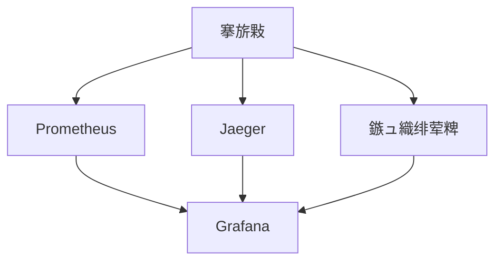

# 杩愮淮鏂囨。

## 馃搵 鏂囨。淇℃伅

- **椤圭洰鍚嶇О**锛氫紒涓氱骇AI缁煎悎绠＄悊骞冲彴
- **鏂囨。鐗堟湰**锛歷1.0
- **鍒涘缓鏃ユ湡**锛?026-01-13
- **鏈€鍚庢洿鏂?*锛?026-01-16
- **鏂囨。绫诲瀷**锛氳繍缁存枃妗?- **褰撳墠鐘舵€?*锛氬悗绔笟鍔″姛鑳藉紑鍙戝畬鎴愶紙100%锛夛紝鍑嗗寮€濮嬫祴璇曞拰鍓嶇寮€鍙?
---

## 1. 绯荤粺鐩戞帶鏂规

### 1.1 鐩戞帶鏋舵瀯



### 1.2 鐩戞帶鎸囨爣

| 鎸囨爣绫诲瀷 | 鐩戞帶椤?| 鍛婅闃堝€?|
|---------|--------|---------|
| **搴旂敤鎸囨爣** | QPS銆佸搷搴旀椂闂淬€侀敊璇巼 | QPS<100銆佸搷搴旀椂闂?500ms銆侀敊璇巼>1% |
| **绯荤粺鎸囨爣** | CPU銆佸唴瀛樸€佺鐩樸€佺綉缁?| CPU>80%銆佸唴瀛?85%銆佺鐩?90% |
| **鏁版嵁搴撴寚鏍?* | 杩炴帴鏁般€佹參鏌ヨ銆佷富浠庡欢杩?| 杩炴帴鏁?80%銆佹參鏌ヨ>1s銆佷富浠庡欢杩?100ms |
| **缂撳瓨鎸囨爣** | 鍛戒腑鐜囥€佸唴瀛樹娇鐢ㄣ€佽繛鎺ユ暟 | 鍛戒腑鐜?80%銆佸唴瀛樹娇鐢?85% |

---

## 2. 鏃ュ織绠＄悊鏂规

### 2.1 鏃ュ織鍒嗙被

| 鏃ュ織绫诲瀷 | 瀛樺偍浣嶇疆 | 淇濈暀鏃堕棿 | 鏃ュ織绾у埆 |
|---------|---------|---------|---------|
| **搴旂敤鏃ュ織** | /var/log/app/ | 30澶?| DEBUG/INFO/WARNING/ERROR |
| **璁块棶鏃ュ織** | /var/log/nginx/ | 30澶?| INFO |
| **閿欒鏃ュ織** | /var/log/error/ | 90澶?| ERROR |
| **瀹¤鏃ュ織** | /var/log/audit/ | 180澶?| INFO |

### 2.2 鏃ュ織閰嶇疆

```python
# utils/logger.py
import sys
from loguru import logger
from pathlib import Path

# 閰嶇疆鏃ュ織
logger.remove()
logger.add(
    sys.stderr,
    level="DEBUG",
    format="<green>{time:YYYY-MM-DD HH:mm:ss}</green> | <level>{level: <8}</level> | <cyan>{name}</cyan>:<cyan>{function}</cyan>:<cyan>{line}</cyan> - <level>{message}</level>"
)

# 鏂囦欢鏃ュ織
logger.add(
    "logs/app.log",
    rotation="100 MB",
    retention="30 days",
    level="INFO",
    format="{time:YYYY-MM-DD HH:mm:ss} | {level: <8} | {name}:{function}:{line} - {message}"
)

# 閿欒鏃ュ織
logger.add(
    "logs/error.log",
    rotation="50 MB",
    retention="90 days",
    level="ERROR",
    format="{time:YYYY-MM-DD HH:mm:ss} | {level: <8} | {name}:{function}:{line} - {message}"
)
```

---

## 3. 鍛婅閰嶇疆

### 3.1 鍛婅瑙勫垯

| 鍛婅绾у埆 | 瑙﹀彂鏉′欢 | 閫氱煡鏂瑰紡 |
|---------|---------|---------|
| **绱ф€?* | 搴旂敤瀹曟満銆佹暟鎹簱涓嶅彲鐢?| 鐢佃瘽+鐭俊+閭欢 |
| **閲嶈** | 鍝嶅簲鏃堕棿>1s銆侀敊璇巼>5% | 鐭俊+閭欢 |
| **涓€鑸?* | CPU>80%銆佸唴瀛?85% | 閭欢 |

### 3.2 鍛婅閫氱煡

```yaml
# prometheus/alerts.yml
groups:
  - name: 搴旂敤鍛婅
    rules:
      - alert: 搴旂敤閿欒鐜囪繃楂?        expr: rate(http_requests_total{status=~"5.."}[5m]) > 0.05
        for: 2m
        labels:
          severity: 閲嶈
        annotations:
          summary: "搴旂敤閿欒鐜囪繃楂?
          description: "搴旂敤{{ $labels.instance }} 閿欒鐜囪秴杩?%"

      - alert: 搴旂敤鍝嶅簲鏃堕棿杩囬暱
        expr: histogram_quantile(0.95, http_request_duration_seconds_bucket) > 1
        for: 5m
        labels:
          severity: 涓€鑸?        annotations:
          summary: "搴旂敤鍝嶅簲鏃堕棿杩囬暱"
          description: "搴旂敤{{ $labels.instance }} 95%鍒嗕綅鍝嶅簲鏃堕棿瓒呰繃1绉?
```

---

## 4. 鏁呴殰澶勭悊娴佺▼

### 4.1 鏁呴殰澶勭悊娴佺▼鍥?
```mermaid
graph TD
    A[鍙戠幇鏁呴殰] --> B[鍛婅閫氱煡]
    B --> C[鏁呴殰纭]
    C --> D{鏁呴殰绫诲瀷}
    D --> E[搴旂敤鏁呴殰]
    D --> F[鏁版嵁搴撴晠闅淽
    D --> G[缃戠粶鏁呴殰]
    E --> H[閲嶅惎鏈嶅姟]
    F --> I[妫€鏌ユ暟鎹簱]
    G --> J[妫€鏌ョ綉缁淽
    H --> K[楠岃瘉淇]
    I --> K
    J --> K
    K --> L[鏁呴殰鎭㈠]
    L --> M[鏁呴殰鎬荤粨]
```

### 4.2 鏁呴殰澶勭悊娓呭崟

- [ ] 纭鏁呴殰鐜拌薄
- [ ] 妫€鏌ユ棩蹇?- [ ] 妫€鏌ョ洃鎺ф寚鏍?- [ ] 瀹氫綅鏁呴殰鍘熷洜
- [ ] 鍒跺畾淇鏂规
- [ ] 鎵ц淇鎿嶄綔
- [ ] 楠岃瘉淇缁撴灉
- [ ] 缂栧啓鏁呴殰鎶ュ憡

---

## 5. 澶囦唤鎭㈠绛栫暐

### 5.1 澶囦唤绛栫暐

| 澶囦唤绫诲瀷 | 澶囦唤鍐呭 | 澶囦唤棰戠巼 | 淇濈暀鏃堕棿 |
|---------|---------|---------|---------|
| **鏁版嵁搴撳浠?* | MySQL鏁版嵁 | 姣忓ぉ | 30澶?|
| **閰嶇疆澶囦唤** | 閰嶇疆鏂囦欢 | 姣忓懆 | 90澶?|
| **鏃ュ織澶囦唤** | 鏃ュ織鏂囦欢 | 姣忓ぉ | 30澶?|

### 5.2 澶囦唤鑴氭湰

```bash
#!/bin/bash

# backup.sh

# 鏁版嵁搴撳浠?mysqldump -h localhost -u root -p12345678 mcp_platform > backup/mcp_platform_$(date +%Y%m%d).sql

# 閰嶇疆鏂囦欢澶囦唤
tar -czf backup/config_$(date +%Y%m%d).tar.gz config/

# 鏃ュ織澶囦唤
tar -czf backup/logs_$(date +%Y%m%d).tar.gz logs/

# 娓呯悊30澶╁墠鐨勫浠?find backup -name "*.sql" -mtime +30 -delete
find backup -name "*.tar.gz" -mtime +30 -delete
```

### 5.3 鎭㈠娴佺▼

```bash
# 鏁版嵁搴撴仮澶?mysql -h localhost -u root -p12345678 mcp_platform < backup/mcp_platform_20260113.sql

# 閰嶇疆鏂囦欢鎭㈠
tar -xzf backup/config_20260113.tar.gz -C /

# 鏃ュ織鎭㈠
tar -xzf backup/logs_20260113.tar.gz -C /
```

---

## 6. 鐏惧鏂规

### 6.1 鐏惧鏋舵瀯璁捐

**鐏惧鏋舵瀯鍥?*锛?```mermaid
graph TB
    subgraph "鐢熶骇鐜"
        A[涓绘暟鎹簱<br/>MySQL涓诲簱]
        B[浠庢暟鎹簱<br/>MySQL浠庡簱]
        C[搴旂敤鏈嶅姟<br/>澶氬壇鏈琞
        D[Redis涓?br/>涓荤紦瀛榏
        E[Redis浠?br/>浠庣紦瀛榏
    end
    
    subgraph "鐏惧鐜"
        F[鐏惧鏁版嵁搴?br/>MySQL涓诲簱]
        G[鐏惧搴旂敤<br/>寰呮満鏈嶅姟]
        H[鐏惧Redis<br/>澶囩敤缂撳瓨]
    end
    
    subgraph "澶囦唤瀛樺偍"
        I[鏈湴澶囦唤<br/>/backup]
        J[浜戝瓨鍌?br/>OSS/S3]
    end
    
    A -.涓讳粠澶嶅埗.-> B
    D -.涓讳粠澶嶅埗.-> E
    A -.瀹氭椂澶囦唤.-> I
    I -.鍚屾.-> J
    A -.寮傛澶嶅埗.-> F
    C -.鏁呴殰鍒囨崲.-> G
    D -.鏁呴殰鍒囨崲.-> H
```

**鐏惧绾у埆**锛?- **RPO锛堟仮澶嶇偣鐩爣锛?*锛? 1灏忔椂
- **RTO锛堟仮澶嶆椂闂寸洰鏍囷級**锛? 4灏忔椂
- **鏁版嵁涓㈠け瀹瑰繊搴?*锛? 1灏忔椂

### 6.2 鏁版嵁搴撳浠界瓥鐣?
#### 6.2.1 澶囦唤绫诲瀷

| 澶囦唤绫诲瀷 | 棰戠巼 | 淇濈暀鏃堕棿 | 瀛樺偍浣嶇疆 | 璇存槑 |
|---------|------|---------|---------|------|
| **鍏ㄩ噺澶囦唤** | 姣忓ぉ 02:00 | 30澶?| 鏈湴 + 浜戝瓨鍌?| 瀹屾暣鏁版嵁搴撳浠?|
| **澧為噺澶囦唤** | 姣忓皬鏃?| 7澶?| 鏈湴 | Binlog澧為噺澶囦唤 |
| **Binlog澶囦唤** | 瀹炴椂 | 7澶?| 鏈湴 + 浜戝瓨鍌?| 瀹炴椂浜嬪姟鏃ュ織 |
| **缁撴瀯澶囦唤** | 姣忓懆 | 90澶?| 浜戝瓨鍌?| 鏁版嵁搴撶粨鏋勫浠?|

#### 6.2.2 澶囦唤鑴氭湰

**鍏ㄩ噺澶囦唤鑴氭湰**锛?```bash
#!/bin/bash
# backup_full.sh

BACKUP_DIR="/data/backup/mysql/full"
DATE=$(date +%Y%m%d_%H%M%S)
BACKUP_FILE="mcp_platform_full_${DATE}.sql"

# 鍒涘缓澶囦唤鐩綍
mkdir -p ${BACKUP_DIR}

# 鎵ц鍏ㄩ噺澶囦唤
mysqldump \
  -h localhost \
  -u root \
  -p${MYSQL_PASSWORD} \
  --single-transaction \
  --routines \
  --triggers \
  --events \
  --master-data=2 \
  --flush-logs \
  mcp_platform > ${BACKUP_DIR}/${BACKUP_FILE}

# 鍘嬬缉澶囦唤鏂囦欢
gzip ${BACKUP_DIR}/${BACKUP_FILE}

# 涓婁紶鍒颁簯瀛樺偍锛堢ず渚嬶細闃块噷浜慜SS锛?ossutil cp ${BACKUP_DIR}/${BACKUP_FILE}.gz oss://mcp-platform-backup/mysql/full/

# 娓呯悊30澶╁墠鐨勫浠?find ${BACKUP_DIR} -name "*.sql.gz" -mtime +30 -delete

# 璁板綍澶囦唤鏃ュ織
echo "$(date '+%Y-%m-%d %H:%M:%S') 鍏ㄩ噺澶囦唤瀹屾垚: ${BACKUP_FILE}.gz" >> /var/log/backup.log
```

**澧為噺澶囦唤鑴氭湰**锛?```bash
#!/bin/bash
# backup_incremental.sh

BACKUP_DIR="/data/backup/mysql/incremental"
DATE=$(date +%Y%m%d_%H%M%S)

# 鍒涘缓澶囦唤鐩綍
mkdir -p ${BACKUP_DIR}

# 鍒锋柊Binlog
mysql -h localhost -u root -p${MYSQL_PASSWORD} -e "FLUSH LOGS;"

# 澶嶅埗Binlog鏂囦欢
BINLOG_FILE=$(mysql -h localhost -u root -p${MYSQL_PASSWORD} -e "SHOW MASTER STATUS;" | awk 'NR==2 {print $1}')
cp /var/lib/mysql/${BINLOG_FILE} ${BACKUP_DIR}/${BINLOG_FILE}_${DATE}

# 涓婁紶鍒颁簯瀛樺偍
ossutil cp ${BACKUP_DIR}/${BINLOG_FILE}_${DATE} oss://mcp-platform-backup/mysql/incremental/

# 娓呯悊7澶╁墠鐨勫浠?find ${BACKUP_DIR} -name "*_*" -mtime +7 -delete

# 璁板綍澶囦唤鏃ュ織
echo "$(date '+%Y-%m-%d %H:%M:%S') 澧為噺澶囦唤瀹屾垚: ${BINLOG_FILE}_${DATE}" >> /var/log/backup.log
```

**Binlog瀹炴椂澶囦唤**锛?```bash
#!/bin/bash
# backup_binlog.sh

# 浣跨敤Binlog Server瀹炴椂鍚屾Binlog
mysqlbinlog \
  --read-from-remote-server \
  --host=master-db \
  --port=3306 \
  --raw \
  --stop-never \
  --result-file=/data/backup/mysql/binlog/ \
  mysql-bin.000001
```

#### 6.2.3 澶囦唤楠岃瘉

**澶囦唤瀹屾暣鎬ф鏌?*锛?```bash
#!/bin/bash
# verify_backup.sh

BACKUP_FILE=$1

# 妫€鏌ュ浠芥枃浠舵槸鍚﹀瓨鍦?if [ ! -f "${BACKUP_FILE}" ]; then
    echo "澶囦唤鏂囦欢涓嶅瓨鍦? ${BACKUP_FILE}"
    exit 1
fi

# 瑙ｅ帇澶囦唤鏂囦欢
TEMP_DIR=$(mktemp -d)
gunzip -c ${BACKUP_FILE} > ${TEMP_DIR}/backup.sql

# 楠岃瘉SQL璇硶
mysql --check-upgrade ${TEMP_DIR}/backup.sql

if [ $? -eq 0 ]; then
    echo "澶囦唤鏂囦欢楠岃瘉閫氳繃: ${BACKUP_FILE}"
    rm -rf ${TEMP_DIR}
    exit 0
else
    echo "澶囦唤鏂囦欢楠岃瘉澶辫触: ${BACKUP_FILE}"
    rm -rf ${TEMP_DIR}
    exit 1
fi
```

**鏁版嵁鎭㈠娴嬭瘯**锛?```bash
#!/bin/bash
# test_restore.sh

# 鍒涘缓娴嬭瘯鏁版嵁搴?mysql -h localhost -u root -p${MYSQL_PASSWORD} -e "DROP DATABASE IF EXISTS mcp_platform_test; CREATE DATABASE mcp_platform_test;"

# 鎭㈠澶囦唤鍒版祴璇曟暟鎹簱
gunzip -c /data/backup/mysql/full/mcp_platform_full_20260113.sql.gz | mysql -h localhost -u root -p${MYSQL_PASSWORD} mcp_platform_test

# 楠岃瘉鏁版嵁瀹屾暣鎬?TABLE_COUNT=$(mysql -h localhost -u root -p${MYSQL_PASSWORD} -e "SELECT COUNT(*) FROM information_schema.tables WHERE table_schema='mcp_platform_test';" | tail -1)

if [ ${TABLE_COUNT} -gt 0 ]; then
    echo "鏁版嵁鎭㈠娴嬭瘯鎴愬姛锛屽叡 ${TABLE_COUNT} 寮犺〃"
    mysql -h localhost -u root -p${MYSQL_PASSWORD} -e "DROP DATABASE IF EXISTS mcp_platform_test;"
    exit 0
else
    echo "鏁版嵁鎭㈠娴嬭瘯澶辫触"
    mysql -h localhost -u root -p${MYSQL_PASSWORD} -e "DROP DATABASE IF EXISTS mcp_platform_test;"
    exit 1
fi
```

### 6.3 鏁版嵁搴撻珮鍙敤鏂规

#### 6.3.1 MySQL涓讳粠澶嶅埗

**鏋舵瀯鍥?*锛?```mermaid
graph LR
    A[搴旂敤鏈嶅姟] --> B[MySQL涓诲簱<br/>璇诲啓]
    A --> C[MySQL浠庡簱<br/>鍙]
    B -.Binlog.-> C
```

**閰嶇疆绀轰緥**锛?```sql
-- 涓诲簱閰嶇疆
[mysqld]
server-id = 1
log-bin = mysql-bin
binlog-format = ROW
binlog-do-db = mcp_platform
sync-binlog = 1

-- 浠庡簱閰嶇疆
[mysqld]
server-id = 2
relay-log = relay-bin
read-only = 1
replicate-do-db = mcp_platform
```

**涓讳粠澶嶅埗鐩戞帶**锛?```python
# 鐩戞帶涓讳粠澶嶅埗寤惰繜
def check_replication_lag():
    """妫€鏌ヤ富浠庡鍒跺欢杩?""
    result = execute_sql("SHOW SLAVE STATUS")
    lag = result['Seconds_Behind_Master']
    
    if lag > 60:
        send_alert(f"涓讳粠澶嶅埗寤惰繜杩囬珮: {lag}绉?)
    
    return lag
```

#### 6.3.2 MySQL涓讳粠鍒囨崲

**鍒囨崲娴佺▼**锛?```mermaid
sequenceDiagram
    participant Admin as 杩愮淮浜哄憳
    participant Master as 涓诲簱
    participant Slave as 浠庡簱
    participant App as 搴旂敤鏈嶅姟
    
    Admin->>Master: 鍋滄鍐欏叆
    Admin->>Slave: 绛夊緟澶嶅埗瀹屾垚
    Admin->>Slave: 鎻愬崌涓轰富搴?    Admin->>Slave: 寮€鍚啓鍏?    Admin->>App: 鍒囨崲杩炴帴
    Admin->>Master: 闄嶇骇涓轰粠搴?```

**鍒囨崲鑴氭湰**锛?```bash
#!/bin/bash
# failover.sh

# 1. 鍋滄涓诲簱鍐欏叆
mysql -h master-db -u root -p${MYSQL_PASSWORD} -e "SET GLOBAL read_only = ON;"

# 2. 绛夊緟浠庡簱鍚屾瀹屾垚
while true; do
    LAG=$(mysql -h slave-db -u root -p${MYSQL_PASSWORD} -e "SHOW SLAVE STATUS\G" | grep "Seconds_Behind_Master" | awk '{print $2}')
    if [ "${LAG}" == "0" ]; then
        break
    fi
    echo "绛夊緟鍚屾瀹屾垚锛屽綋鍓嶅欢杩? ${LAG}绉?
    sleep 5
done

# 3. 鍋滄浠庡簱澶嶅埗
mysql -h slave-db -u root -p${MYSQL_PASSWORD} -e "STOP SLAVE;"

# 4. 鎻愬崌浠庡簱涓轰富搴?mysql -h slave-db -u root -p${MYSQL_PASSWORD} -e "RESET SLAVE ALL; SET GLOBAL read_only = OFF;"

# 5. 鏇存柊搴旂敤閰嶇疆
sed -i 's/master-db/slave-db/g' /app/config/database.yaml

# 6. 閲嶅惎搴旂敤鏈嶅姟
systemctl restart mcp-platform

# 7. 灏嗗師涓诲簱闄嶇骇涓轰粠搴?mysql -h master-db -u root -p${MYSQL_PASSWORD} -e "CHANGE MASTER TO MASTER_HOST='slave-db', MASTER_USER='repl', MASTER_PASSWORD='repl_password'; START SLAVE;"

echo "鏁呴殰鍒囨崲瀹屾垚"
```

### 6.4 鏈嶅姟瀹圭伨鏂规

#### 6.4.1 澶氬壇鏈儴缃?
**Kubernetes閮ㄧ讲閰嶇疆**锛?```yaml
apiVersion: apps/v1
kind: Deployment
metadata:
  name: mcp-platform
spec:
  replicas: 3  # 3涓壇鏈?  selector:
    matchLabels:
      app: mcp-platform
  template:
    metadata:
      labels:
        app: mcp-platform
    spec:
      containers:
      - name: mcp-platform
        image: mcp-platform:latest
        ports:
        - containerPort: 8000
        resources:
          requests:
            memory: "512Mi"
            cpu: "500m"
          limits:
            memory: "1Gi"
            cpu: "1000m"
        livenessProbe:
          httpGet:
            path: /health
            port: 8000
          initialDelaySeconds: 30
          periodSeconds: 10
        readinessProbe:
          httpGet:
            path: /ready
            port: 8000
          initialDelaySeconds: 5
          periodSeconds: 5
```

#### 6.4.2 鑷姩鏁呴殰杞Щ

**鍋ュ悍妫€鏌ラ厤缃?*锛?```python
# 鍋ュ悍妫€鏌ョ鐐?@app.get("/health")
async def health_check():
    """鍋ュ悍妫€鏌?""
    try:
        # 妫€鏌ユ暟鎹簱杩炴帴
        db.execute("SELECT 1")
        
        # 妫€鏌edis杩炴帴
        redis.ping()
        
        return {"status": "healthy"}
    except Exception as e:
        logger.error(f"鍋ュ悍妫€鏌ュけ璐? {e}")
        raise HTTPException(status_code=503, detail="Service unavailable")
```

**鑷姩閲嶅惎绛栫暐**锛?```yaml
# Kubernetes閲嶅惎绛栫暐
apiVersion: apps/v1
kind: Deployment
metadata:
  name: mcp-platform
spec:
  template:
    spec:
      containers:
      - name: mcp-platform
        image: mcp-platform:latest
        livenessProbe:
          httpGet:
            path: /health
            port: 8000
          initialDelaySeconds: 30
          periodSeconds: 10
          timeoutSeconds: 5
          failureThreshold: 3  # 杩炵画3娆″け璐ュ悗閲嶅惎
```

#### 6.4.3 鏈嶅姟闄嶇骇

**闄嶇骇绛栫暐**锛?```python
# 鏈嶅姟闄嶇骇瑁呴グ鍣?def circuit_breaker(failure_threshold=5, timeout=60):
    """鐔旀柇鍣ㄨ楗板櫒"""
    def decorator(func):
        failure_count = 0
        last_failure_time = None
        
        def wrapper(*args, **kwargs):
            nonlocal failure_count, last_failure_time
            
            # 妫€鏌ユ槸鍚﹀湪鐔旀柇鐘舵€?            if failure_count >= failure_threshold:
                if time.time() - last_failure_time < timeout:
                    # 杩斿洖闄嶇骇鏁版嵁
                    return get_fallback_data()
                else:
                    # 瓒呰繃瓒呮椂鏃堕棿锛岄噸缃鏁板櫒
                    failure_count = 0
            
            try:
                result = func(*args, **kwargs)
                # 鎴愬姛锛岄噸缃鏁板櫒
                failure_count = 0
                return result
            except Exception as e:
                # 澶辫触锛屽鍔犺鏁板櫒
                failure_count += 1
                last_failure_time = time.time()
                logger.error(f"鏈嶅姟璋冪敤澶辫触: {e}")
                # 杩斿洖闄嶇骇鏁版嵁
                return get_fallback_data()
        
        return wrapper
    return decorator

# 浣跨敤绀轰緥
@circuit_breaker(failure_threshold=5, timeout=60)
def get_user_data(user_id: str):
    """鑾峰彇鐢ㄦ埛鏁版嵁"""
    return user_service.get(user_id)

def get_fallback_data():
    """鑾峰彇闄嶇骇鏁版嵁"""
    return {"status": "degraded", "message": "鏈嶅姟鏆傛椂涓嶅彲鐢?}
```

### 6.5 鏁呴殰鍒囨崲娴佺▼

#### 6.5.1 鏁呴殰妫€娴?
**鐩戞帶鎸囨爣**锛?```python
# 鏁呴殰妫€娴嬭剼鏈?def check_service_health():
    """妫€鏌ユ湇鍔″仴搴风姸鎬?""
    services = {
        'auth-service': 'http://auth-service:28001/health',
        'user-service': 'http://user-service:28002/health',
        'permission-service': 'http://permission-service:28003/health',
        'system-service': 'http://system-service:28004/health',
        'support-service': 'http://support-service:28005/health',
        'business-service': 'http://business-service:28006/health',
    }
    
    failed_services = []
    
    for service_name, health_url in services.items():
        try:
            response = requests.get(health_url, timeout=5)
            if response.status_code != 200:
                failed_services.append(service_name)
        except Exception as e:
            failed_services.append(service_name)
    
    if failed_services:
        send_alert(f"浠ヤ笅鏈嶅姟涓嶅彲鐢? {', '.join(failed_services)}")
    
    return failed_services
```

#### 6.5.2 鑷姩鍒囨崲

**鑷姩鍒囨崲鑴氭湰**锛?```bash
#!/bin/bash
# auto_failover.sh

# 妫€鏌ヤ富搴撴槸鍚﹀彲鐢?if ! mysql -h master-db -u root -p${MYSQL_PASSWORD} -e "SELECT 1" > /dev/null 2>&1; then
    echo "涓诲簱涓嶅彲鐢紝寮€濮嬫晠闅滃垏鎹?
    
    # 妫€鏌ヤ粠搴撴槸鍚﹀彲鐢?    if mysql -h slave-db -u root -p${MYSQL_PASSWORD} -e "SELECT 1" > /dev/null 2>&1; then
        echo "浠庡簱鍙敤锛屾墽琛屾晠闅滃垏鎹?
        
        # 鎵ц鏁呴殰鍒囨崲
        ./failover.sh
        
        # 鍙戦€侀€氱煡
        send_alert "鏁版嵁搴撴晠闅滃垏鎹㈠畬鎴愶紝鏂颁富搴? slave-db"
    else
        echo "浠庡簱涔熶笉鍙敤锛岄渶瑕佷汉宸ヤ粙鍏?
        send_alert "鏁版嵁搴撴晠闅滃垏鎹㈠け璐ワ紝闇€瑕佷汉宸ヤ粙鍏?
    fi
fi
```

#### 6.5.3 浜哄伐浠嬪叆

**浜哄伐浠嬪叆娴佺▼**锛?```mermaid
graph TD
    A[鑷姩鍒囨崲澶辫触] --> B[閫氱煡杩愮淮浜哄憳]
    B --> C[杩愮淮浜哄憳纭鏁呴殰]
    C --> D[璇勪及褰卞搷鑼冨洿]
    D --> E[鍒跺畾鎭㈠鏂规]
    E --> F[鎵ц鎭㈠鎿嶄綔]
    F --> G[楠岃瘉鎭㈠缁撴灉]
    G --> H[缂栧啓鏁呴殰鎶ュ憡]
```

### 6.6 鏁版嵁鎭㈠娴佺▼

#### 6.6.1 鎭㈠鍑嗗

```bash
#!/bin/bash
# prepare_restore.sh

BACKUP_FILE=$1

# 1. 楠岃瘉澶囦唤鏂囦欢
./verify_backup.sh ${BACKUP_FILE}

if [ $? -ne 0 ]; then
    echo "澶囦唤鏂囦欢楠岃瘉澶辫触锛屾棤娉曟仮澶?
    exit 1
fi

# 2. 鍋滄搴旂敤鏈嶅姟
systemctl stop mcp-platform

# 3. 澶囦唤褰撳墠鏁版嵁搴擄紙浠ラ槻涓囦竴锛?mysqldump -h localhost -u root -p${MYSQL_PASSWORD} mcp_platform > /tmp/mcp_platform_before_restore.sql

# 4. 鍒犻櫎褰撳墠鏁版嵁搴?mysql -h localhost -u root -p${MYSQL_PASSWORD} -e "DROP DATABASE IF EXISTS mcp_platform;"

# 5. 鍒涘缓绌烘暟鎹簱
mysql -h localhost -u root -p${MYSQL_PASSWORD} -e "CREATE DATABASE mcp_platform;"

echo "鎭㈠鍑嗗瀹屾垚"
```

#### 6.6.2 鎵ц鎭㈠

```bash
#!/bin/bash
# execute_restore.sh

BACKUP_FILE=$1

# 1. 瑙ｅ帇澶囦唤鏂囦欢
TEMP_DIR=$(mktemp -d)
gunzip -c ${BACKUP_FILE} > ${TEMP_DIR}/backup.sql

# 2. 鎭㈠鏁版嵁搴?mysql -h localhost -u root -p${MYSQL_PASSWORD} mcp_platform < ${TEMP_DIR}/backup.sql

# 3. 娓呯悊涓存椂鏂囦欢
rm -rf ${TEMP_DIR}

# 4. 鍚姩搴旂敤鏈嶅姟
systemctl start mcp-platform

# 5. 楠岃瘉鎭㈠缁撴灉
./test_restore.sh

if [ $? -eq 0 ]; then
    echo "鏁版嵁鎭㈠鎴愬姛"
else
    echo "鏁版嵁鎭㈠澶辫触锛岃妫€鏌ユ棩蹇?
    exit 1
fi
```

#### 6.6.3 鎭㈠楠岃瘉

```bash
#!/bin/bash
# verify_restore.sh

# 1. 妫€鏌ユ暟鎹簱杩炴帴
mysql -h localhost -u root -p${MYSQL_PASSWORD} -e "SELECT 1" > /dev/null 2>&1

if [ $? -ne 0 ]; then
    echo "鏁版嵁搴撹繛鎺ュけ璐?
    exit 1
fi

# 2. 妫€鏌ヨ〃鏁伴噺
TABLE_COUNT=$(mysql -h localhost -u root -p${MYSQL_PASSWORD} -e "SELECT COUNT(*) FROM information_schema.tables WHERE table_schema='mcp_platform';" | tail -1)

if [ ${TABLE_COUNT} -lt 10 ]; then
    echo "琛ㄦ暟閲忓紓甯? ${TABLE_COUNT}"
    exit 1
fi

# 3. 妫€鏌ュ叧閿暟鎹?USER_COUNT=$(mysql -h localhost -u root -p${MYSQL_PASSWORD} -e "SELECT COUNT(*) FROM mcp_platform.users;" | tail -1)

if [ ${USER_COUNT} -eq 0 ]; then
    echo "鐢ㄦ埛鏁版嵁寮傚父: ${USER_COUNT}"
    exit 1
fi

echo "鎭㈠楠岃瘉閫氳繃锛岃〃鏁伴噺: ${TABLE_COUNT}, 鐢ㄦ埛鏁伴噺: ${USER_COUNT}"
```

### 6.7 鐏惧婕旂粌

#### 6.7.1 婕旂粌璁″垝

| 婕旂粌绫诲瀷 | 棰戠巼 | 婕旂粌鍐呭 | 楠岃瘉鐩爣 |
|---------|------|---------|---------|
| **澶囦唤楠岃瘉** | 姣忓懆 | 楠岃瘉澶囦唤鏂囦欢瀹屾暣鎬?| 澶囦唤鍙敤鎬?|
| **鎭㈠娴嬭瘯** | 姣忔湀 | 鍦ㄦ祴璇曠幆澧冩仮澶嶅浠?| 鎭㈠娴佺▼姝ｇ‘鎬?|
| **鏁呴殰鍒囨崲** | 姣忓搴?| 妯℃嫙涓诲簱鏁呴殰锛屽垏鎹㈠埌浠庡簱 | 鍒囨崲娴佺▼鍙鎬?|
| **鐏鹃毦鎭㈠** | 姣忓崐骞?| 妯℃嫙鏈烘埧鏁呴殰锛屽垏鎹㈠埌鐏惧鐜 | 鐏惧鐜鍙敤鎬?|

#### 6.7.2 婕旂粌妫€鏌ユ竻鍗?
**澶囦唤楠岃瘉婕旂粌**锛?- [ ] 閫夊彇鏈€鏂扮殑鍏ㄩ噺澶囦唤
- [ ] 楠岃瘉澶囦唤鏂囦欢瀹屾暣鎬?- [ ] 妫€鏌ュ浠芥枃浠跺ぇ灏?- [ ] 璁板綍楠岃瘉缁撴灉
- [ ] 缂栧啓楠岃瘉鎶ュ憡

**鎭㈠娴嬭瘯婕旂粌**锛?- [ ] 鍑嗗娴嬭瘯鐜
- [ ] 鍋滄娴嬭瘯鐜鏈嶅姟
- [ ] 鎵ц鏁版嵁鎭㈠
- [ ] 鍚姩娴嬭瘯鐜鏈嶅姟
- [ ] 楠岃瘉鏁版嵁瀹屾暣鎬?- [ ] 璁板綍鎭㈠鏃堕棿
- [ ] 缂栧啓婕旂粌鎶ュ憡

**鏁呴殰鍒囨崲婕旂粌**锛?- [ ] 閫氱煡鐩稿叧浜哄憳
- [ ] 璁板綍鍒囨崲鍓嶇姸鎬?- [ ] 鎵ц鏁呴殰鍒囨崲
- [ ] 楠岃瘉鏈嶅姟鍙敤鎬?- [ ] 楠岃瘉鏁版嵁涓€鑷存€?- [ ] 璁板綍鍒囨崲鏃堕棿
- [ ] 缂栧啓婕旂粌鎶ュ憡

**鐏鹃毦鎭㈠婕旂粌**锛?- [ ] 婵€娲荤伨澶囩幆澧?- [ ] 鍒囨崲DNS瑙ｆ瀽
- [ ] 楠岃瘉鏈嶅姟鍙敤鎬?- [ ] 楠岃瘉鏁版嵁瀹屾暣鎬?- [ ] 娴嬭瘯鍏抽敭鍔熻兘
- [ ] 璁板綍鎭㈠鏃堕棿
- [ ] 缂栧啓婕旂粌鎶ュ憡

### 6.8 鐏惧鏈€浣冲疄璺?
**澶囦唤鏈€浣冲疄璺?*锛?- 鉁?瀹氭湡楠岃瘉澶囦唤鏂囦欢鐨勫畬鏁存€?- 鉁?澶囦唤鏂囦欢瀛樺偍鍦ㄥ涓綅缃紙鏈湴 + 浜戝瓨鍌級
- 鉁?瀹氭湡杩涜鎭㈠娴嬭瘯
- 鉁?澶囦唤鏂囦欢鍔犲瘑瀛樺偍
- 鉁?璁板綍澶囦唤鎿嶄綔鏃ュ織

**楂樺彲鐢ㄦ渶浣冲疄璺?*锛?- 鉁?閮ㄧ讲澶氬壇鏈紝閬垮厤鍗曠偣鏁呴殰
- 鉁?瀹炵幇鑷姩鏁呴殰杞Щ
- 鉁?閰嶇疆鍋ュ悍妫€鏌?- 鉁?瀹炵幇鏈嶅姟闄嶇骇
- 鉁?鐩戞帶鏈嶅姟鐘舵€?
**鎭㈠鏈€浣冲疄璺?*锛?- 鉁?鍒跺畾璇︾粏鐨勬仮澶嶆祦绋?- 鉁?瀹氭湡杩涜鐏惧婕旂粌
- 鉁?璁板綍鎭㈠鎿嶄綔鏃ュ織
- 鉁?楠岃瘉鎭㈠缁撴灉
- 鉁?缂栧啓鎭㈠鎶ュ憡

---

## 7. 鎬ц兘璋冧紭鎸囧崡

### 6.1 鏁版嵁搴撲紭鍖?
```sql
-- 鎱㈡煡璇㈠垎鏋?SELECT * FROM slow_query_log ORDER BY query_time DESC LIMIT 10;

-- 绱㈠紩浼樺寲
CREATE INDEX idx_username ON users(username);
CREATE INDEX idx_email ON users(email);

-- 鏌ヨ浼樺寲
EXPLAIN SELECT * FROM users WHERE username = 'admin';
```

### 6.2 搴旂敤浼樺寲

```python
# 浣跨敤杩炴帴姹?from sqlalchemy.pool import QueuePool

engine = create_engine(
    DATABASE_URL,
    poolclass=QueuePool,
    pool_size=10,
    max_overflow=20,
    pool_timeout=30,
    pool_recycle=3600
)

# 浣跨敤缂撳瓨
from functools import lru_cache

@lru_cache(maxsize=128)
def get_user_info(user_id: str):
    # 缂撳瓨鐢ㄦ埛淇℃伅
    pass
```

---

## 8. 瀹归噺瑙勫垝

### 8.1 瀹归噺瑙勫垝姒傝堪

**瀹归噺瑙勫垝鐩爣**锛?- 纭繚绯荤粺鎬ц兘婊¤冻涓氬姟闇€姹?- 浼樺寲璧勬簮浣跨敤锛岄檷浣庢垚鏈?- 棰勬祴鏈潵闇€姹傦紝鎻愬墠瑙勫垝
- 閬垮厤璧勬簮娴垂鎴栦笉瓒?
**瀹归噺瑙勫垝鍘熷垯**锛?- 鉁?鍩轰簬瀹為檯涓氬姟闇€姹?- 鉁?鑰冭檻涓氬姟澧為暱瓒嬪娍
- 鉁?棰勭暀涓€瀹氱殑鍐椾綑绌洪棿
- 鉁?瀹氭湡璇勪及鍜岃皟鏁?
### 8.2 鏈嶅姟鍣ㄩ厤缃缓璁?
#### 8.2.1 寮€鍙戠幆澧冮厤缃?
**鍗曟満閮ㄧ讲锛堥€傚悎灏忓洟闃燂級**锛?
| 缁勪欢 | 閰嶇疆 | 鏁伴噺 | 鐢ㄩ€?|
|-----|------|------|------|
| **搴旂敤鏈嶅姟鍣?* | 4鏍?G | 1 | 杩愯鎵€鏈夊悗绔湇鍔?|
| **鏁版嵁搴撴湇鍔″櫒** | 4鏍?G | 1 | MySQL鏁版嵁搴?|
| **Redis鏈嶅姟鍣?* | 2鏍?G | 1 | Redis缂撳瓨 |
| **Nacos鏈嶅姟鍣?* | 2鏍?G | 1 | 鏈嶅姟娉ㄥ唽涓庡彂鐜?|
| **RabbitMQ鏈嶅姟鍣?* | 2鏍?G | 1 | 娑堟伅闃熷垪 |
| **Nginx鏈嶅姟鍣?* | 2鏍?G | 1 | 鍙嶅悜浠ｇ悊 |
| **鍓嶇鏈嶅姟鍣?* | 2鏍?G | 1 | 闈欐€佽祫婧愭墭绠?|

**鎬昏祫婧?*锛?8鏍?6G

**閫傜敤鍦烘櫙**锛?- 鍥㈤槦瑙勬ā锛? 10浜?- 鐢ㄦ埛瑙勬ā锛? 1000
- QPS锛? 100

#### 8.2.2 娴嬭瘯鐜閰嶇疆

**鍒嗙閮ㄧ讲锛堥€傚悎涓瀷鍥㈤槦锛?*锛?
| 缁勪欢 | 閰嶇疆 | 鏁伴噺 | 鐢ㄩ€?|
|-----|------|------|------|
| **搴旂敤鏈嶅姟鍣?* | 4鏍?G | 2 | 鍚庣鏈嶅姟锛堣礋杞藉潎琛★級 |
| **鏁版嵁搴撴湇鍔″櫒** | 8鏍?6G | 1 | MySQL鏁版嵁搴擄紙涓讳粠锛?|
| **Redis鏈嶅姟鍣?* | 4鏍?G | 1 | Redis缂撳瓨锛堜富浠庯級 |
| **Nacos鏈嶅姟鍣?* | 2鏍?G | 2 | 鏈嶅姟娉ㄥ唽涓庡彂鐜帮紙闆嗙兢锛?|
| **RabbitMQ鏈嶅姟鍣?* | 4鏍?G | 1 | 娑堟伅闃熷垪锛堥泦缇わ級 |
| **Nginx鏈嶅姟鍣?* | 2鏍?G | 2 | 鍙嶅悜浠ｇ悊锛堣礋杞藉潎琛★級 |
| **鍓嶇鏈嶅姟鍣?* | 2鏍?G | 1 | 闈欐€佽祫婧愭墭绠?|
| **鐩戞帶鏈嶅姟鍣?* | 2鏍?G | 1 | Prometheus + Grafana |

**鎬昏祫婧?*锛?0鏍?0G

**閫傜敤鍦烘櫙**锛?- 鍥㈤槦瑙勬ā锛?0-50浜?- 鐢ㄦ埛瑙勬ā锛?000-10000
- QPS锛?00-1000

#### 8.2.3 鐢熶骇鐜閰嶇疆

**楂樺彲鐢ㄩ儴缃诧紙閫傚悎澶у瀷鍥㈤槦锛?*锛?
| 缁勪欢 | 閰嶇疆 | 鏁伴噺 | 鐢ㄩ€?|
|-----|------|------|------|
| **搴旂敤鏈嶅姟鍣?* | 8鏍?6G | 4 | 鍚庣鏈嶅姟锛堣礋杞藉潎琛★級 |
| **鏁版嵁搴撴湇鍔″櫒** | 16鏍?2G | 2 | MySQL鏁版嵁搴擄紙涓讳粠锛?|
| **Redis鏈嶅姟鍣?* | 8鏍?6G | 2 | Redis缂撳瓨锛堜富浠庯級 |
| **Nacos鏈嶅姟鍣?* | 4鏍?G | 3 | 鏈嶅姟娉ㄥ唽涓庡彂鐜帮紙闆嗙兢锛?|
| **RabbitMQ鏈嶅姟鍣?* | 8鏍?6G | 2 | 娑堟伅闃熷垪锛堥泦缇わ級 |
| **Nginx鏈嶅姟鍣?* | 4鏍?G | 2 | 鍙嶅悜浠ｇ悊锛堣礋杞藉潎琛★級 |
| **鍓嶇鏈嶅姟鍣?* | 4鏍?G | 2 | 闈欐€佽祫婧愭墭绠★紙CDN锛?|
| **鐩戞帶鏈嶅姟鍣?* | 4鏍?G | 2 | Prometheus + Grafana锛堥珮鍙敤锛?|
| **鏃ュ織鏈嶅姟鍣?* | 4鏍?G | 1 | ELK鏃ュ織鏀堕泦 |
| **澶囦唤鏈嶅姟鍣?* | 8鏍?6G | 1 | 鏁版嵁澶囦唤 |

**鎬昏祫婧?*锛?2鏍?44G

**閫傜敤鍦烘櫙**锛?- 鍥㈤槦瑙勬ā锛? 50浜?- 鐢ㄦ埛瑙勬ā锛? 10000
- QPS锛? 1000

### 8.3 鎵╁绛栫暐

#### 8.3.1 姘村钩鎵╁锛堟帹鑽愶級

**瀹氫箟**锛氬鍔犳湇鍔″櫒鏁伴噺锛屾彁楂樺苟鍙戝鐞嗚兘鍔?
**閫傜敤鍦烘櫙**锛?- 搴旂敤鏈嶅姟鍣ㄨ礋杞借繃楂?- 闇€瑕佹彁楂樺苟鍙戝鐞嗚兘鍔?- 闇€瑕佹彁楂樺彲鐢ㄦ€?
**鎵╁娴佺▼**锛?```mermaid
graph LR
    A[鐩戞帶鍛婅] --> B[璇勪及瀹归噺]
    B --> C[鐢宠璧勬簮]
    C --> D[閮ㄧ讲鏂版湇鍔″櫒]
    D --> E[閰嶇疆璐熻浇鍧囪　]
    E --> F[楠岃瘉鎵╁鏁堟灉]
    F --> G[鐩戞帶杩愯鐘舵€乚
```

**Kubernetes鑷姩鎵╁**锛?```yaml
# deployment.yaml
apiVersion: autoscaling/v2
kind: HorizontalPodAutoscaler
metadata:
  name: mcp-platform-hpa
spec:
  scaleTargetRef:
    apiVersion: apps/v1
    kind: Deployment
    name: mcp-platform
  minReplicas: 2
  maxReplicas: 10
  metrics:
  - type: Resource
    resource:
      name: cpu
      target:
        type: Utilization
        averageUtilization: 70
  - type: Resource
    resource:
      name: memory
      target:
        type: Utilization
        averageUtilization: 80
```

**鎵嬪姩鎵╁鍛戒护**锛?```bash
# 鎵╁鍒?涓壇鏈?kubectl scale deployment mcp-platform --replicas=5

# 鏌ョ湅鎵╁鐘舵€?kubectl get pods -l app=mcp-platform
```

#### 8.3.2 鍨傜洿鎵╁

**瀹氫箟**锛氬鍔犳湇鍔″櫒閰嶇疆锛圕PU銆佸唴瀛樸€佺鐩橈級锛屾彁楂樺崟鏈烘€ц兘

**閫傜敤鍦烘櫙**锛?- 鍗曟満鎬ц兘鐡堕
- 鏁版嵁搴撴€ц兘鐡堕
- 鏃犳硶姘村钩鎷嗗垎鐨勫満鏅?
**鎵╁娴佺▼**锛?```mermaid
graph LR
    A[鐩戞帶鍛婅] --> B[璇勪及鎬ц兘鐡堕]
    B --> C[纭畾鎵╁閰嶇疆]
    C --> D[鐢宠璧勬簮鍗囩骇]
    D --> E[鍋滄満缁存姢]
    E --> F[鍗囩骇鏈嶅姟鍣ㄩ厤缃甝
    F --> G[鍚姩鏈嶅姟]
    G --> H[楠岃瘉鎵╁鏁堟灉]
```

**鎵╁寤鸿**锛?- 鉁?CPU锛氫粠4鏍稿崌绾у埌8鏍告垨16鏍?- 鉁?鍐呭瓨锛氫粠8G鍗囩骇鍒?6G鎴?2G
- 鉁?纾佺洏锛氫粠100G鍗囩骇鍒?00G鎴?T
- 鉁?缃戠粶锛氫粠1Gbps鍗囩骇鍒?0Gbps

**娉ㄦ剰浜嬮」**锛?- 鉂?闇€瑕佸仠鏈虹淮鎶?- 鉂?鍙兘闇€瑕佹暟鎹縼绉?- 鉂?鎵╁鎴愭湰杈冮珮
- 鉁?閫傚悎鏁版嵁搴撶瓑鏃犳硶姘村钩鎷嗗垎鐨勫満鏅?
#### 8.3.3 鑷姩鎵╁

**Kubernetes HPA锛圚orizontal Pod Autoscaler锛?*锛?```yaml
# 鑷姩鎵╁閰嶇疆
apiVersion: autoscaling/v2
kind: HorizontalPodAutoscaler
metadata:
  name: mcp-platform-hpa
spec:
  scaleTargetRef:
    apiVersion: apps/v1
    kind: Deployment
    name: mcp-platform
  minReplicas: 2
  maxReplicas: 10
  metrics:
  - type: Resource
    resource:
      name: cpu
      target:
        type: Utilization
        averageUtilization: 70
  - type: Resource
    resource:
      name: memory
      target:
        type: Utilization
        averageUtilization: 80
  behavior:
    scaleDown:
      stabilizationWindowSeconds: 300
      policies:
      - type: Percent
        value: 50
        periodSeconds: 60
    scaleUp:
      stabilizationWindowSeconds: 60
      policies:
      - type: Percent
        value: 100
        periodSeconds: 60
      - type: Pods
        value: 2
        periodSeconds: 60
      selectPolicy: Max
```

**浜戞湇鍔″晢鑷姩鎵╁**锛?```python
# AWS Auto Scaling Group
import boto3

client = boto3.client('autoscaling')

# 鍒涘缓鑷姩鎵╁绛栫暐
response = client.put_scaling_policy(
    AutoScalingGroupName='mcp-platform-asg',
    PolicyName='cpu-utilization-policy',
    PolicyType='TargetTrackingScaling',
    TargetTrackingConfiguration={
        'PredefinedMetricSpecification': {
            'PredefinedMetricType': 'ASGAverageCPUUtilization'
        },
        'TargetValue': 70.0,
        'DisableScaleIn': False
    }
)
```

### 8.4 鎴愭湰浼扮畻

#### 8.4.1 鏈嶅姟鍣ㄦ垚鏈紙鎸夋湀锛?
**寮€鍙戠幆澧冿紙浜戞湇鍔″櫒锛?*锛?
| 缁勪欢 | 閰嶇疆 | 鏁伴噺 | 鍗曚环锛堝厓/鏈堬級 | 灏忚锛堝厓/鏈堬級 |
|-----|------|------|--------------|--------------|
| 搴旂敤鏈嶅姟鍣?| 4鏍?G | 1 | 200 | 200 |
| 鏁版嵁搴撴湇鍔″櫒 | 4鏍?G | 1 | 200 | 200 |
| Redis鏈嶅姟鍣?| 2鏍?G | 1 | 100 | 100 |
| Nacos鏈嶅姟鍣?| 2鏍?G | 1 | 100 | 100 |
| RabbitMQ鏈嶅姟鍣?| 2鏍?G | 1 | 100 | 100 |
| Nginx鏈嶅姟鍣?| 2鏍?G | 1 | 100 | 100 |
| 鍓嶇鏈嶅姟鍣?| 2鏍?G | 1 | 100 | 100 |
| **鎬昏** | - | - | - | **900** |

**娴嬭瘯鐜锛堜簯鏈嶅姟鍣級**锛?
| 缁勪欢 | 閰嶇疆 | 鏁伴噺 | 鍗曚环锛堝厓/鏈堬級 | 灏忚锛堝厓/鏈堬級 |
|-----|------|------|--------------|--------------|
| 搴旂敤鏈嶅姟鍣?| 4鏍?G | 2 | 200 | 400 |
| 鏁版嵁搴撴湇鍔″櫒 | 8鏍?6G | 1 | 400 | 400 |
| Redis鏈嶅姟鍣?| 4鏍?G | 1 | 200 | 200 |
| Nacos鏈嶅姟鍣?| 2鏍?G | 2 | 100 | 200 |
| RabbitMQ鏈嶅姟鍣?| 4鏍?G | 1 | 200 | 200 |
| Nginx鏈嶅姟鍣?| 2鏍?G | 2 | 100 | 200 |
| 鍓嶇鏈嶅姟鍣?| 2鏍?G | 1 | 100 | 100 |
| 鐩戞帶鏈嶅姟鍣?| 2鏍?G | 1 | 100 | 100 |
| **鎬昏** | - | - | - | **1800** |

**鐢熶骇鐜锛堜簯鏈嶅姟鍣級**锛?
| 缁勪欢 | 閰嶇疆 | 鏁伴噺 | 鍗曚环锛堝厓/鏈堬級 | 灏忚锛堝厓/鏈堬級 |
|-----|------|------|--------------|--------------|
| 搴旂敤鏈嶅姟鍣?| 8鏍?6G | 4 | 400 | 1600 |
| 鏁版嵁搴撴湇鍔″櫒 | 16鏍?2G | 2 | 800 | 1600 |
| Redis鏈嶅姟鍣?| 8鏍?6G | 2 | 400 | 800 |
| Nacos鏈嶅姟鍣?| 4鏍?G | 3 | 200 | 600 |
| RabbitMQ鏈嶅姟鍣?| 8鏍?6G | 2 | 400 | 800 |
| Nginx鏈嶅姟鍣?| 4鏍?G | 2 | 200 | 400 |
| 鍓嶇鏈嶅姟鍣?| 4鏍?G | 2 | 200 | 400 |
| 鐩戞帶鏈嶅姟鍣?| 4鏍?G | 2 | 200 | 400 |
| 鏃ュ織鏈嶅姟鍣?| 4鏍?G | 1 | 200 | 200 |
| 澶囦唤鏈嶅姟鍣?| 8鏍?6G | 1 | 400 | 400 |
| **鎬昏** | - | - | - | **7200** |

#### 8.4.2 瀛樺偍鎴愭湰锛堟寜鏈堬級

**浜戝瓨鍌ㄦ垚鏈?*锛?
| 瀛樺偍绫诲瀷 | 瀹归噺 | 鍗曚环锛堝厓/GB/鏈堬級 | 灏忚锛堝厓/鏈堬級 |
|---------|------|-----------------|--------------|
| 鏁版嵁搴撳瓨鍌?| 500G | 0.5 | 250 |
| 鏃ュ織瀛樺偍 | 200G | 0.3 | 60 |
| 澶囦唤瀛樺偍 | 500G | 0.2 | 100 |
| 闈欐€佽祫婧愬瓨鍌?| 100G | 0.2 | 20 |
| CDN娴侀噺 | 1TB | 0.2 | 200 |
| **鎬昏** | - | - | **630** |

#### 8.4.3 缃戠粶鎴愭湰锛堟寜鏈堬級

**缃戠粶甯﹀鎴愭湰**锛?
| 甯﹀绫诲瀷 | 甯﹀ | 鍗曚环锛堝厓/Mbps/鏈堬級 | 灏忚锛堝厓/鏈堬級 |
|---------|------|-------------------|--------------|
| 鍏綉甯﹀ | 100Mbps | 10 | 1000 |
| 鍐呯綉甯﹀ | 1Gbps | 5 | 5000 |
| **鎬昏** | - | - | **6000** |

#### 8.4.4 鎬绘垚鏈及绠?
**鏈堝害鎬绘垚鏈?*锛?
| 鐜 | 鏈嶅姟鍣ㄦ垚鏈?| 瀛樺偍鎴愭湰 | 缃戠粶鎴愭湰 | 鎬昏锛堝厓/鏈堬級 |
|-----|-----------|---------|---------|--------------|
| 寮€鍙戠幆澧?| 900 | 100 | 100 | 1100 |
| 娴嬭瘯鐜 | 1800 | 200 | 200 | 2200 |
| 鐢熶骇鐜 | 7200 | 630 | 6000 | 13830 |
| **鎬昏** | **9900** | **930** | **6300** | **17130** |

**骞村害鎬绘垚鏈?*锛?7130 脳 12 = **205,560鍏?*

### 8.5 瀹归噺鐩戞帶

#### 8.5.1 璧勬簮浣跨敤鐩戞帶

**Prometheus鐩戞帶鎸囨爣**锛?```yaml
# prometheus.yml
global:
  scrape_interval: 15s

scrape_configs:
  - job_name: 'node-exporter'
    static_configs:
      - targets: ['localhost:9100']
  
  - job_name: 'mysql-exporter'
    static_configs:
      - targets: ['localhost:9104']
  
  - job_name: 'redis-exporter'
    static_configs:
      - targets: ['localhost:9121']
```

**Grafana浠〃鏉?*锛?```json
{
  "dashboard": {
    "title": "瀹归噺鐩戞帶",
    "panels": [
      {
        "title": "CPU浣跨敤鐜?,
        "targets": [
          {
            "expr": "100 - (avg by(instance) (irate(node_cpu_seconds_total{mode='idle'}[5m])) * 100)"
          }
        ]
      },
      {
        "title": "鍐呭瓨浣跨敤鐜?,
        "targets": [
          {
            "expr": "(1 - (node_memory_MemAvailable_bytes / node_memory_MemTotal_bytes)) * 100"
          }
        ]
      },
      {
        "title": "纾佺洏浣跨敤鐜?,
        "targets": [
          {
            "expr": "(node_filesystem_size_bytes - node_filesystem_free_bytes) / node_filesystem_size_bytes * 100"
          }
        ]
      },
      {
        "title": "缃戠粶甯﹀",
        "targets": [
          {
            "expr": "rate(node_network_receive_bytes_total[5m]) * 8"
          }
        ]
      }
    ]
  }
}
```

#### 8.5.2 瀹归噺棰勮

**棰勮瑙勫垯**锛?```yaml
# prometheus/alerts.yml
groups:
  - name: 瀹归噺棰勮
    rules:
      - alert: CPU浣跨敤鐜囪繃楂?        expr: 100 - (avg by(instance) (irate(node_cpu_seconds_total{mode='idle'}[5m])) * 100) > 80
        for: 5m
        labels:
          severity: 璀﹀憡
        annotations:
          summary: "CPU浣跨敤鐜囪繃楂?
          description: "瀹炰緥 {{ $labels.instance }} CPU浣跨敤鐜囪秴杩?0%"
      
      - alert: 鍐呭瓨浣跨敤鐜囪繃楂?        expr: (1 - (node_memory_MemAvailable_bytes / node_memory_MemTotal_bytes)) * 100 > 85
        for: 5m
        labels:
          severity: 璀﹀憡
        annotations:
          summary: "鍐呭瓨浣跨敤鐜囪繃楂?
          description: "瀹炰緥 {{ $labels.instance }} 鍐呭瓨浣跨敤鐜囪秴杩?5%"
      
      - alert: 纾佺洏浣跨敤鐜囪繃楂?        expr: (node_filesystem_size_bytes - node_filesystem_free_bytes) / node_filesystem_size_bytes * 100 > 90
        for: 5m
        labels:
          severity: 涓ラ噸
        annotations:
          summary: "纾佺洏浣跨敤鐜囪繃楂?
          description: "瀹炰緥 {{ $labels.instance }} 纾佺洏浣跨敤鐜囪秴杩?0%"
      
      - alert: 鏁版嵁搴撹繛鎺ユ暟杩囬珮
        expr: mysql_global_status_threads_connected / mysql_global_variables_max_connections * 100 > 80
        for: 5m
        labels:
          severity: 璀﹀憡
        annotations:
          summary: "鏁版嵁搴撹繛鎺ユ暟杩囬珮"
          description: "鏁版嵁搴撹繛鎺ユ暟浣跨敤鐜囪秴杩?0%"
```

#### 8.5.3 瀹归噺瑙勫垝

**瀹归噺瑙勫垝娴佺▼**锛?```mermaid
graph TD
    A[鏀堕泦鍘嗗彶鏁版嵁] --> B[鍒嗘瀽涓氬姟澧為暱瓒嬪娍]
    B --> C[棰勬祴鏈潵闇€姹俔
    C --> D[璇勪及鐜版湁瀹归噺]
    D --> E{瀹归噺鏄惁鍏呰冻?}
    E -->|鏄瘄 F[缁х画鐩戞帶]
    E -->|鍚 G[鍒跺畾鎵╁璁″垝]
    G --> H[鐢宠璧勬簮]
    H --> I[鎵ц鎵╁]
    I --> F
```

**瀹归噺瑙勫垝鑴氭湰**锛?```python
# capacity_planning.py
import pandas as pd
from datetime import datetime, timedelta

def predict_capacity(historical_data, days_ahead=30):
    """棰勬祴鏈潵瀹归噺闇€姹?""
    # 鍔犺浇鍘嗗彶鏁版嵁
    df = pd.DataFrame(historical_data)
    df['date'] = pd.to_datetime(df['date'])
    
    # 璁＄畻澧為暱鐜?    df['growth_rate'] = df['value'].pct_change()
    avg_growth_rate = df['growth_rate'].mean()
    
    # 棰勬祴鏈潵鏁版嵁
    last_value = df['value'].iloc[-1]
    predictions = []
    
    for i in range(days_ahead):
        predicted_value = last_value * (1 + avg_growth_rate)
        predictions.append({
            'date': datetime.now() + timedelta(days=i+1),
            'predicted_value': predicted_value
        })
        last_value = predicted_value
    
    return predictions

# 浣跨敤绀轰緥
historical_data = [
    {'date': '2024-01-01', 'value': 1000},
    {'date': '2024-01-02', 'value': 1020},
    {'date': '2024-01-03', 'value': 1040},
    # ... 鏇村鍘嗗彶鏁版嵁
]

predictions = predict_capacity(historical_data, days_ahead=30)
print(predictions)
```

### 8.6 瀹归噺瑙勫垝鏈€浣冲疄璺?
**瀹归噺瑙勫垝鍘熷垯**锛?- 鉁?鍩轰簬瀹為檯涓氬姟闇€姹傦紝閬垮厤杩囧害閰嶇疆
- 鉁?鑰冭檻涓氬姟澧為暱瓒嬪娍锛岄鐣欐墿灞曠┖闂?- 鉁?瀹氭湡璇勪及鍜岃皟鏁村閲忛厤缃?- 鉁?浼樺厛浣跨敤姘村钩鎵╁锛屾彁楂樺彲鐢ㄦ€?
**瀹归噺鐩戞帶鏈€浣冲疄璺?*锛?- 鉁?鐩戞帶鍏抽敭璧勬簮鎸囨爣锛圕PU銆佸唴瀛樸€佺鐩樸€佺綉缁滐級
- 鉁?璁剧疆鍚堢悊鐨勯璀﹂槇鍊?- 鉁?瀹氭湡鍒嗘瀽瀹归噺浣跨敤瓒嬪娍
- 鉁?寤虹珛瀹归噺棰勮鏈哄埗

**鎴愭湰浼樺寲鏈€浣冲疄璺?*锛?- 鉁?浣跨敤鎸夐渶浠樿垂妯″紡锛岄伩鍏嶈祫婧愭氮璐?- 鉁?鍚堢悊浣跨敤棰勭暀瀹炰緥鍜岀珵浠峰疄渚?- 鉁?瀹氭湡娓呯悊闂茬疆璧勬簮
- 鉁?浼樺寲瀛樺偍鍜岀綉缁滄垚鏈?
---

## 9. 鏃ュ父宸℃娓呭崟

### 9.1 姣忔棩宸℃

- [ ] 妫€鏌ユ湇鍔＄姸鎬?- [ ] 妫€鏌ラ敊璇棩蹇?- [ ] 妫€鏌ョ洃鎺ф寚鏍?- [ ] 妫€鏌ョ鐩樼┖闂?- [ ] 妫€鏌ュ浠界姸鎬?
### 9.2 姣忓懆宸℃

- [ ] 妫€鏌ョ郴缁熸洿鏂?- [ ] 妫€鏌ュ畨鍏ㄦ紡娲?- [ ] 妫€鏌ユ€ц兘瓒嬪娍
- [ ] 妫€鏌ユ棩蹇楀綊妗?- [ ] 妫€鏌ュ浠藉畬鏁存€?
### 9.3 姣忔湀宸℃

- [ ] 瀹归噺瑙勫垝璇勪及
- [ ] 鎬ц兘娴嬭瘯
- [ ] 鐏惧鎭㈠婕旂粌
- [ ] 瀹夊叏瀹¤
- [ ] 杩愮淮鏂囨。鏇存柊

---

## 馃敆 鐩稿叧鏂囨。

- [閮ㄧ讲鏂囨。](./8-閮ㄧ讲鏂囨。.md)
- [瀹夊叏鏂囨。](./11-瀹夊叏鏂囨。.md)
- [鎬ц兘浼樺寲鏂囨。](./12-鎬ц兘浼樺寲鏂囨。.md)

---

## 馃挕 娉ㄦ剰浜嬮」

1. **鐩戞帶鍛婅**锛氬強鏃跺搷搴斿憡璀︼紝閬垮厤闂鎵╁ぇ
2. **鏃ュ織绠＄悊**锛氬畾鏈熸竻鐞嗘棩蹇楋紝閬垮厤纾佺洏鍗犳弧
3. **澶囦唤楠岃瘉**锛氬畾鏈熼獙璇佸浠界殑鍙敤鎬?4. **鏁呴殰鎬荤粨**锛氭瘡娆℃晠闅滃悗缂栧啓鏁呴殰鎶ュ憡
5. **鏂囨。鏇存柊**锛氬強鏃舵洿鏂拌繍缁存枃妗?
---

**鏂囨。鐗堟湰鍘嗗彶**锛?
| 鐗堟湰 | 鏃ユ湡 | 浣滆€?| 鍙樻洿璇存槑 |
|-----|------|------|---------|
| v1.0 | 2026-01-13 | AI鍔╂墜 | 鍒濆鐗堟湰 |

---
