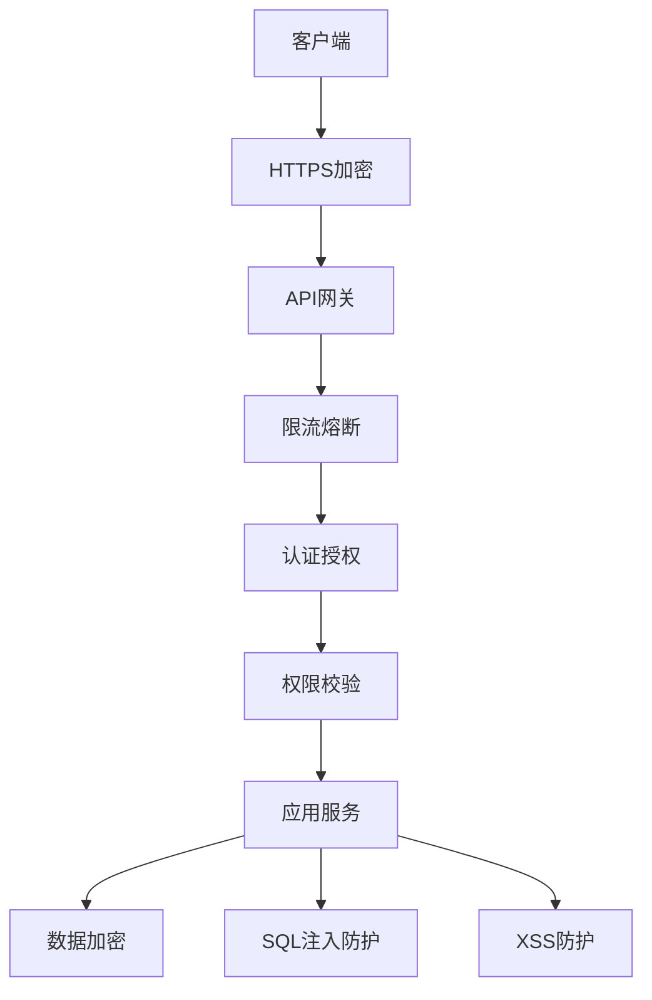
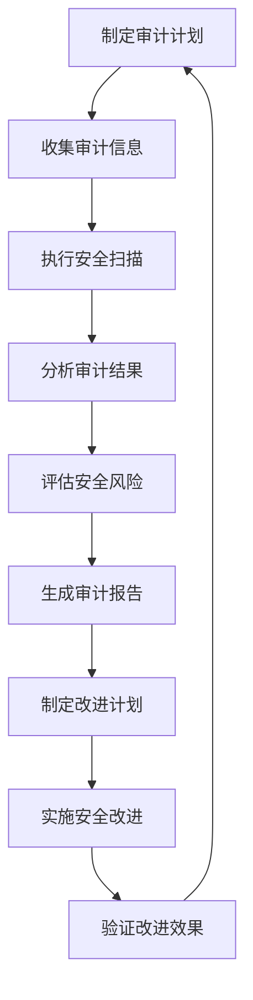

# 安全文档

## 📋 文档信息

- **项目名称**：企业级AI综合管理平台
- **文档版本**：v1.0
- **创建日期**：2026-01-13
- **文档类型**：安全文档

---

## 1. 安全架构设计

### 1.1 安全架构图



### 1.2 安全层次

| 层次 | 安全措施 |
|-----|---------|
| **传输层** | HTTPS/TLS 1.3 |
| **网关层** | 限流熔断、IP白名单 |
| **认证层** | JWT + API Key双认证 |
| **授权层** | RBAC + ABAC权限模型 |
| **应用层** | 参数验证、数据加密 |
| **数据层** | 敏感数据加密、SQL注入防护 |

---

## 2. 认证授权机制

### 2.1 JWT认证

```python
# auth/jwt_handler.py
from datetime import datetime, timedelta
from jose import JWTError, jwt
from passlib.context import CryptContext

pwd_context = CryptContext(schemes=["bcrypt"], deprecated="auto")

SECRET_KEY = "your-secret-key-here"
ALGORITHM = "HS256"
ACCESS_TOKEN_EXPIRE_MINUTES = 1440

def create_access_token(data: dict):
    """创建访问令牌"""
    to_encode = data.copy()
    expire = datetime.utcnow() + timedelta(minutes=ACCESS_TOKEN_EXPIRE_MINUTES)
    to_encode.update({"exp": expire})
    encoded_jwt = jwt.encode(to_encode, SECRET_KEY, algorithm=ALGORITHM)
    return encoded_jwt

def verify_token(token: str):
    """验证令牌"""
    try:
        payload = jwt.decode(token, SECRET_KEY, algorithms=[ALGORITHM])
        return payload
    except JWTError:
        return None

def get_password_hash(password: str):
    """获取密码哈希"""
    return pwd_context.hash(password)

def verify_password(plain_password: str, hashed_password: str):
    """验证密码"""
    return pwd_context.verify(plain_password, hashed_password)
```

### 2.2 API Key认证

```python
# auth/api_key_handler.py
import secrets
from typing import Optional
from sqlalchemy.orm import Session
from app.models.api_key import ApiKey

def generate_api_key(prefix: str = "agent") -> str:
    """生成API Key"""
    random_part = secrets.token_urlsafe(32)
    return f"{prefix}_{random_part}"

def verify_api_key(api_key: str, db: Session) -> Optional[dict]:
    """验证API Key"""
    key_obj = db.query(ApiKey).filter(
        ApiKey.key == api_key,
        ApiKey.is_active == True
    ).first()
    
    if not key_obj:
        return None
    
    if key_obj.is_expired():
        return None
    
    return {
        "id": key_obj.id,
        "user_id": key_obj.user_id,
        "scopes": key_obj.scopes
    }
```

---

## 3. 数据加密方案

### 3.1 敏感数据加密

```python
# utils/crypto.py
from cryptography.fernet import Fernet
from cryptography.hazmat.primitives import hashes
from cryptography.hazmat.primitives.kdf.pbkdf2 import PBKDF2HMAC
import base64

# 加密密钥
ENCRYPTION_KEY = b'your-encryption-key-here-32-bytes-long'

# 创建加密器
cipher_suite = Fernet(ENCRYPTION_KEY)

def encrypt_data(data: str) -> str:
    """加密数据"""
    encrypted = cipher_suite.encrypt(data.encode())
    return base64.urlsafe_b64encode(encrypted).decode()

def decrypt_data(encrypted_data: str) -> str:
    """解密数据"""
    encrypted = base64.urlsafe_b64decode(encrypted_data.encode())
    decrypted = cipher_suite.decrypt(encrypted)
    return decrypted.decode()

# 密码加密
def hash_password(password: str) -> str:
    """密码哈希"""
    import bcrypt
    return bcrypt.hashpw(password.encode(), bcrypt.gensalt()).decode()

def verify_password(plain: str, hashed: str) -> bool:
    """验证密码"""
    import bcrypt
    return bcrypt.checkpw(plain.encode(), hashed.encode())
```

### 3.2 传输加密

```python
# 配置HTTPS
from fastapi import FastAPI
from fastapi.middleware.httpsredirect import HTTPSRedirectMiddleware

app = FastAPI()

# 强制HTTPS
app.add_middleware(HTTPSRedirectMiddleware)

# 配置SSL/TLS
# 在生产环境配置有效的SSL证书
```

---

## 4. SQL注入防护

### 4.1 参数化查询

```python
# 错误示例（易受SQL注入）
def get_user_by_username(username: str):
    query = f"SELECT * FROM users WHERE username = '{username}'"
    # 如果username包含恶意SQL代码，会导致SQL注入

# 正确示例（参数化查询）
def get_user_by_username(username: str):
    from sqlalchemy import text
    query = text("SELECT * FROM users WHERE username = :username")
    result = db.execute(query, {"username": username})
    return result.fetchall()

# 使用ORM
def get_user_by_username(username: str):
    user = db.query(User).filter(User.username == username).first()
    return user
```

### 4.2 输入验证

```python
from pydantic import validator, BaseModel

class UserCreateRequest(BaseModel):
    username: str
    email: str
    password: str
    
    @validator('username')
    def validate_username(cls, v):
        if not v.isalnum():
            raise ValueError('用户名只能包含字母和数字')
        if len(v) < 3 or len(v) > 50:
            raise ValueError('用户名长度必须在3-50之间')
        return v
    
    @validator('email')
    def validate_email(cls, v):
        import re
        email_regex = r'^[a-zA-Z0-9._%+-]+@[a-zA-Z0-9.-]+\.[a-zA-Z]{2,}$'
        if not re.match(email_regex, v):
            raise ValueError('邮箱格式不正确')
        return v
    
    @validator('password')
    def validate_password(cls, v):
        if len(v) < 8:
            raise ValueError('密码长度不能少于8位')
        if not any(c.isupper() for c in v):
            raise ValueError('密码必须包含大写字母')
        if not any(c.islower() for c in v):
            raise ValueError('密码必须包含小写字母')
        if not any(c.isdigit() for c in v):
            raise ValueError('密码必须包含数字')
        return v
```

---

## 5. XSS防护

### 5.1 输出编码

```python
from html import escape

def render_user_comment(comment: str) -> str:
    """渲染用户评论，防止XSS攻击"""
    # 转义HTML特殊字符
    safe_comment = escape(comment)
    return safe_comment
```

### 5.2 CSP策略

```python
# 配置Content Security Policy
from fastapi.middleware.cors import CORSMiddleware
from fastapi.middleware.trustedhost import TrustedHostMiddleware

app = FastAPI()

# CSP头
@app.middleware("http")
async def add_security_headers(request, call_next):
    response = await call_next(request)
    response.headers["X-Content-Type-Options"] = "nosniff"
    response.headers["X-Frame-Options"] = "DENY"
    response.headers["X-XSS-Protection"] = "1; mode=block"
    response.headers["Content-Security-Policy"] = "default-src 'self'"
    return response
```

---

## 6. CSRF防护

### 6.1 CSRF Token

```python
from fastapi import Depends, HTTPException, Request
from starlette.middleware.base import BaseHTTPMiddleware
import secrets

class CSRFMiddleware(BaseHTTPMiddleware):
    async def dispatch(self, request, request.call_next):
        if request.method in ["POST", "PUT", "DELETE", "PATCH"]:
            csrf_token = request.cookies.get("csrf_token")
            if not csrf_token:
                raise HTTPException(status_code=403, detail="CSRF token missing")
            
            # 验证CSRF token
            if not secrets.compare_digest(
                csrf_token,
                request.headers.get("X-CSRF-Token", "")
            ):
                raise HTTPException(status_code=403, detail="Invalid CSRF token")
        
        response = await request.call_next(request)
        return response

app.add_middleware(CSRFMiddleware)
```

---

## 7. API安全规范

### 7.1 限流防护

```python
from slowapi import Limiter, _rate_for
from fastapi import Request, HTTPException
from fastapi.responses import JSONResponse

limiter = Limiter(key_func=_rate_for)

@app.get("/api/v1/users")
@limiter.limit("100/minute")
async def get_users(request: Request):
    """获取用户列表，限流：每分钟100次"""
    users = user_service.get_users()
    return JSONResponse(content=users)
```

### 7.2 请求大小限制

```python
from fastapi import FastAPI, HTTPException

app = FastAPI()

@app.middleware("http")
async def limit_request_size(request: Request, call_next):
    content_length = request.headers.get("content-length")
    if content_length and int(content_length) > 10 * 1024 * 1024:  # 10MB
        raise HTTPException(status_code=413, detail="请求体过大")
    return await call_next(request)
```

---

## 8. 安全审计日志

### 8.1 审计日志记录

```python
# utils/audit_logger.py
from loguru import logger
from datetime import datetime

class AuditLogger:
    @staticmethod
    def log_operation(
        user_id: str,
        tenant_id: str,
        operation: str,
        resource: str,
        result: str,
        details: dict = None
    ):
        """记录操作日志"""
        log_data = {
            "timestamp": datetime.now().isoformat(),
            "user_id": user_id,
            "tenant_id": tenant_id,
            "operation": operation,
            "resource": resource,
            "result": result,
            "details": details or {}
        }
        logger.info(f"AUDIT: {log_data}")
        
        # 保存到数据库
        # audit_log_service.create(log_data)
```

---

## 9. 安全审计流程

### 9.1 安全审计概述

**安全审计目标**：
- 发现系统安全漏洞
- 评估安全风险等级
- 提供安全改进建议
- 确保合规性要求

**安全审计原则**：
- ✅ 定期审计（每季度至少一次）
- ✅ 全面覆盖（网络、应用、数据、人员）
- ✅ 独立审计（由第三方或安全团队执行）
- ✅ 持续改进（根据审计结果不断优化）

### 9.2 安全审计流程



### 9.3 安全审计内容

#### 9.3.1 身份认证审计

**审计内容**：
- ✅ 密码策略（长度、复杂度、过期时间）
- ✅ 多因素认证（MFA）配置
- ✅ 会话管理（超时时间、并发会话）
- ✅ 密码重置流程
- ✅ 账户锁定策略

**审计检查清单**：
```python
# 审计脚本示例
def audit_authentication():
    """身份认证审计"""
    issues = []
    
    # 检查密码策略
    password_policy = get_password_policy()
    if password_policy['min_length'] < 8:
        issues.append("密码最小长度不足8位")
    if not password_policy['require_uppercase']:
        issues.append("密码未要求包含大写字母")
    if not password_policy['require_lowercase']:
        issues.append("密码未要求包含小写字母")
    if not password_policy['require_digit']:
        issues.append("密码未要求包含数字")
    if not password_policy['require_special_char']:
        issues.append("密码未要求包含特殊字符")
    
    # 检查MFA配置
    mfa_enabled = check_mfa_enabled()
    if not mfa_enabled:
        issues.append("未启用多因素认证")
    
    # 检查会话管理
    session_timeout = get_session_timeout()
    if session_timeout > 3600:  # 超过1小时
        issues.append(f"会话超时时间过长（{session_timeout}秒）")
    
    # 检查账户锁定策略
    lockout_policy = get_lockout_policy()
    if lockout_policy['max_attempts'] > 5:
        issues.append(f"最大尝试次数过多（{lockout_policy['max_attempts']}次）")
    
    return issues
```

#### 9.3.2 权限管理审计

**审计内容**：
- ✅ 角色权限配置
- ✅ 用户权限分配
- ✅ 权限最小化原则
- ✅ 权限变更记录
- ✅ 超级用户管理

**审计检查清单**：
```python
def audit_permissions():
    """权限管理审计"""
    issues = []
    
    # 检查角色权限
    roles = get_all_roles()
    for role in roles:
        if role['is_superuser']:
            issues.append(f"角色 {role['name']} 拥有超级用户权限")
        
        # 检查权限数量
        permission_count = len(role['permissions'])
        if permission_count > 50:
            issues.append(f"角色 {role['name']} 权限过多（{permission_count}个）")
    
    # 检查用户权限
    users = get_all_users()
    for user in users:
        # 检查用户角色数量
        role_count = len(user['roles'])
        if role_count > 3:
            issues.append(f"用户 {user['username']} 角色过多（{role_count}个）")
        
        # 检查直接权限
        direct_permissions = user.get('direct_permissions', [])
        if direct_permissions:
            issues.append(f"用户 {user['username']} 拥有直接权限")
    
    # 检查权限变更记录
    recent_changes = get_recent_permission_changes(days=7)
    if len(recent_changes) > 100:
        issues.append(f"近期权限变更过多（{len(recent_changes)}次）")
    
    return issues
```

#### 9.3.3 数据访问审计

**审计内容**：
- ✅ 数据访问权限
- ✅ 敏感数据加密
- ✅ 数据备份策略
- ✅ 数据传输加密
- ✅ 数据访问日志

**审计检查清单**：
```python
def audit_data_access():
    """数据访问审计"""
    issues = []
    
    # 检查敏感数据加密
    encrypted_fields = [
        'password',
        'email',
        'phone',
        'id_card',
        'bank_account'
    ]
    
    for field in encrypted_fields:
        is_encrypted = check_field_encryption(field)
        if not is_encrypted:
            issues.append(f"字段 {field} 未加密")
    
    # 检查数据传输加密
    https_enabled = check_https_enabled()
    if not https_enabled:
        issues.append("未启用HTTPS")
    
    # 检查数据备份
    backup_config = get_backup_config()
    if not backup_config['enabled']:
        issues.append("未启用数据备份")
    elif backup_config['frequency'] > 24:  # 超过24小时
        issues.append(f"备份频率过低（{backup_config['frequency']}小时）")
    
    # 检查数据访问日志
    audit_logging_enabled = check_audit_logging_enabled()
    if not audit_logging_enabled:
        issues.append("未启用数据访问日志")
    
    return issues
```

#### 9.3.4 操作日志审计

**审计内容**：
- ✅ 登录日志
- ✅ 操作日志
- ✅ 错误日志
- ✅ 审计日志
- ✅ 日志保留策略

**审计检查清单**：
```python
def audit_logs():
    """操作日志审计"""
    issues = []
    
    # 检查登录日志
    login_logs = get_recent_login_logs(days=7)
    failed_logins = [log for log in login_logs if log['status'] == 'failed']
    if len(failed_logins) > 100:
        issues.append(f"近期登录失败次数过多（{len(failed_logins)}次）")
    
    # 检查操作日志
    operation_logs = get_recent_operation_logs(days=7)
    critical_operations = [log for log in operation_logs if log['level'] == 'critical']
    if len(critical_operations) > 50:
        issues.append(f"近期关键操作过多（{len(critical_operations)}次）")
    
    # 检查错误日志
    error_logs = get_recent_error_logs(days=7)
    if len(error_logs) > 1000:
        issues.append(f"近期错误日志过多（{len(error_logs)}条）")
    
    # 检查日志保留策略
    log_retention = get_log_retention_policy()
    if log_retention['days'] < 90:
        issues.append(f"日志保留时间过短（{log_retention['days']}天）")
    
    return issues
```

### 9.4 安全审计工具

#### 9.4.1 OWASP ZAP（Web应用安全扫描）

**安装OWASP ZAP**：
```bash
# 下载ZAP
wget https://github.com/zaproxy/zaproxy/releases/download/v2.13.0/ZAP_2.13.0_Linux.tar.gz

# 解压
tar -xzf ZAP_2.13.0_Linux.tar.gz

# 启动ZAP
./ZAP_2.13.0/zap.sh
```

**自动化扫描脚本**：
```python
# security/owasp_zap_scan.py
from zapv2 import ZAPv2
import time

def zap_scan(target_url: str):
    """使用ZAP进行安全扫描"""
    zap = ZAPv2(proxies={'http': 'http://127.0.0.1:8080', 'https': 'http://127.0.0.1:8080'})
    
    # 访问目标URL
    zap.urlopen(target_url)
    
    # 爬取网站
    print("开始爬取网站...")
    zap.spider.scan(target_url)
    time.sleep(60)
    
    # 主动扫描
    print("开始主动扫描...")
    zap.ascan.scan(target_url)
    time.sleep(300)
    
    # 生成报告
    print("生成报告...")
    alerts = zap.core.alerts()
    
    # 分析结果
    high_risk = [alert for alert in alerts if alert['risk'] == 'High']
    medium_risk = [alert for alert in alerts if alert['risk'] == 'Medium']
    low_risk = [alert for alert in alerts if alert['risk'] == 'Low']
    
    return {
        'high_risk': high_risk,
        'medium_risk': medium_risk,
        'low_risk': low_risk
    }

# 使用示例
results = zap_scan('https://example.com')
print(f"高风险漏洞: {len(results['high_risk'])}")
print(f"中风险漏洞: {len(results['medium_risk'])}")
print(f"低风险漏洞: {len(results['low_risk'])}")
```

#### 9.4.2 Nessus（漏洞扫描）

**Nessus扫描配置**：
```python
# security/nessus_scan.py
import requests

def nessus_scan(target: str):
    """使用Nessus进行漏洞扫描"""
    # Nessus API配置
    nessus_url = 'https://nessus.example.com:8834'
    access_key = 'your-access-key'
    secret_key = 'your-secret-key'
    
    # 创建扫描
    scan_data = {
        'uuid': 'scan-template-uuid',
        'settings': {
            'name': f'Security Scan - {target}',
            'text_targets': target,
            'launch_now': True
        }
    }
    
    # 提交扫描
    response = requests.post(
        f'{nessus_url}/scans',
        json=scan_data,
        auth=(access_key, secret_key)
    )
    
    scan_id = response.json()['scan']['id']
    
    # 等待扫描完成
    while True:
        response = requests.get(
            f'{nessus_url}/scans/{scan_id}',
            auth=(access_key, secret_key)
        )
        status = response.json()['info']['status']
        
        if status == 'completed':
            break
        
        time.sleep(60)
    
    # 获取扫描结果
    response = requests.get(
        f'{nessus_url}/scans/{scan_id}/results',
        auth=(access_key, secret_key)
    )
    
    vulnerabilities = response.json()['vulnerabilities']
    
    # 分析结果
    critical = [v for v in vulnerabilities if v['severity'] == 4]
    high = [v for v in vulnerabilities if v['severity'] == 3]
    medium = [v for v in vulnerabilities if v['severity'] == 2]
    low = [v for v in vulnerabilities if v['severity'] == 1]
    
    return {
        'critical': critical,
        'high': high,
        'medium': medium,
        'low': low
    }
```

#### 9.4.3 SonarQube（代码安全审计）

**SonarQube扫描配置**：
```yaml
# sonar-project.properties
sonar.projectKey=mcp-platform
sonar.projectName=企业级AI综合管理平台
sonar.projectVersion=1.0

# 源代码路径
sonar.sources=app
sonar.tests=tests

# Python配置
sonar.python.coverage.reportPaths=coverage.xml
sonar.python.xunit.reportPath=test-results.xml

# 安全规则
sonar.security.hotspots.enabled=true
sonar.security.hotspots.rule.sqadmin_A1=true
sonar.security.hotspots.rule.sqadmin_A2=true
sonar.security.hotspots.rule.sqadmin_A3=true

# 质量门禁
sonar.qualitygate.wait=true
```

**自动化扫描脚本**：
```bash
#!/bin/bash

# sonar_scan.sh

# 运行测试
pytest tests/ --cov=app --cov-report=xml --cov-report=term

# 运行SonarQube扫描
sonar-scanner \
  -Dsonar.host.url=http://sonar.example.com:9000 \
  -Dsonar.login=$SONAR_TOKEN

# 检查质量门禁
sonar-qualitygate-check
```

### 9.5 安全审计报告

#### 9.5.1 审计报告模板

**报告结构**：
```markdown
# 安全审计报告

## 1. 审计概述

- **审计时间**：2024-01-15
- **审计人员**：安全团队
- **审计范围**：网络、应用、数据、人员
- **审计方法**：自动化扫描 + 人工审查

## 2. 审计发现

### 2.1 高风险问题

| 问题 | 描述 | 影响 | 建议 |
|-----|------|------|------|
| 密码策略不足 | 密码最小长度仅为6位 | 容易被暴力破解 | 提高到8位以上 |

### 2.2 中风险问题

| 问题 | 描述 | 影响 | 建议 |
|-----|------|------|------|
| 未启用MFA | 缺少多因素认证 | 账户容易被盗用 | 启用MFA |

### 2.3 低风险问题

| 问题 | 描述 | 影响 | 建议 |
|-----|------|------|------|
| 日志保留时间短 | 日志仅保留30天 | 无法追溯历史问题 | 延长到90天 |

## 3. 风险评估

| 风险等级 | 数量 | 占比 |
|---------|------|------|
| 高风险 | 3 | 10% |
| 中风险 | 10 | 33% |
| 低风险 | 17 | 57% |

## 4. 改进建议

### 4.1 高优先级（1-2周内完成）
1. 提高密码策略要求
2. 启用多因素认证
3. 修复SQL注入漏洞

### 4.2 中优先级（1个月内完成）
1. 定期更新依赖库
2. 加强日志审计
3. 实施渗透测试

### 4.3 低优先级（3个月内完成）
1. 延长日志保留时间
2. 优化权限管理
3. 加强安全培训

## 5. 审计结论

本次审计共发现30个安全问题，其中高风险3个，中风险10个，低风险17个。建议优先修复高风险和中风险问题，确保系统安全。

## 6. 附录

- 审计工具：OWASP ZAP、Nessus、SonarQube
- 审计时间：2024-01-15
- 审计人员：安全团队
```

#### 9.5.2 审计报告生成

**自动生成报告**：
```python
# security/generate_audit_report.py
from datetime import datetime
import markdown

def generate_audit_report(audit_results: dict):
    """生成安全审计报告"""
    report = f"""# 安全审计报告

## 1. 审计概述

- **审计时间**：{datetime.now().strftime('%Y-%m-%d')}
- **审计人员**：安全团队
- **审计范围**：网络、应用、数据、人员

## 2. 审计发现

### 2.1 高风险问题

| 问题 | 描述 | 影响 | 建议 |
|-----|------|------|------|
"""
    
    # 添加高风险问题
    for issue in audit_results['high_risk']:
        report += f"| {issue['name']} | {issue['description']} | {issue['impact']} | {issue['recommendation']} |\n"
    
    report += "\n### 2.2 中风险问题\n\n"
    report += "| 问题 | 描述 | 影响 | 建议 |\n"
    report += "|-----|------|------|------|\n"
    
    # 添加中风险问题
    for issue in audit_results['medium_risk']:
        report += f"| {issue['name']} | {issue['description']} | {issue['impact']} | {issue['recommendation']} |\n"
    
    report += "\n### 2.3 低风险问题\n\n"
    report += "| 问题 | 描述 | 影响 | 建议 |\n"
    report += "|-----|------|------|------|\n"
    
    # 添加低风险问题
    for issue in audit_results['low_risk']:
        report += f"| {issue['name']} | {issue['description']} | {issue['impact']} | {issue['recommendation']} |\n"
    
    # 转换为HTML
    html_report = markdown.markdown(report)
    
    return report

# 使用示例
audit_results = {
    'high_risk': [
        {
            'name': '密码策略不足',
            'description': '密码最小长度仅为6位',
            'impact': '容易被暴力破解',
            'recommendation': '提高到8位以上'
        }
    ],
    'medium_risk': [],
    'low_risk': []
}

report = generate_audit_report(audit_results)
print(report)
```

### 9.6 安全审计最佳实践

**审计执行最佳实践**：
- ✅ 定期审计（每季度至少一次）
- ✅ 全面覆盖（网络、应用、数据、人员）
- ✅ 独立审计（由第三方或安全团队执行）
- ✅ 持续改进（根据审计结果不断优化）

**审计工具使用最佳实践**：
- ✅ 使用多种工具交叉验证
- ✅ 定期更新工具版本
- ✅ 配置合理的扫描规则
- ✅ 分析扫描结果，避免误报

**审计报告管理最佳实践**：
- ✅ 及时生成审计报告
- ✅ 分发给相关人员
- ✅ 跟踪问题修复进度
- ✅ 定期回顾审计结果

---

## 🔗 相关文档

- [技术架构设计文档](./2-技术架构设计文档.md)
- [运维文档](./10-运维文档.md)
- [性能优化文档](./12-性能优化文档.md)

---

## 💡 注意事项

1. **密钥管理**：不要在代码中硬编码密钥，使用环境变量
2. **定期更新**：定期更新依赖库，修复安全漏洞
3. **安全审计**：定期进行安全审计和渗透测试
4. **权限最小化**：遵循最小权限原则
5. **安全培训**：定期进行安全培训和意识教育

---

**文档版本历史**：

| 版本 | 日期 | 作者 | 变更说明 |
|-----|------|------|---------|
| v1.0 | 2026-01-13 | AI助手 | 初始版本 |
| v1.1 | 2026-01-14 | AI助手 | 新增安全审计流程章节 |

---