# 技术架构设计文档

## 📋 文档信息

- **项目名称**：企业级AI综合管理平台
- **文档版本**：v1.0
- **创建日期**：2026-01-13
- **文档类型**：技术架构设计文档

---

## 1. 系统架构设计

### 1.1 整体架构

本系统采用**微服务架构**，将系统拆分为多个独立的服务，每个服务负责特定的业务功能。服务之间通过API进行通信，支持独立部署、独立扩展。

### 1.2 系统架构图

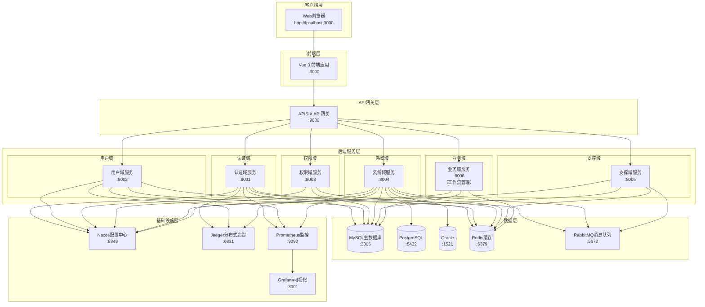

### 1.3 架构分层

| 层级 | 职责 | 技术选型 |
|-----|------|---------|
| **客户端层** | 用户交互界面 | Vue 3 + TypeScript + Element Plus |
| **网关层** | 统一入口、限流、路由 | APISIX + Sentinel |
| **应用层** | 业务逻辑处理 | FastAPI + Python 3.13 |
| **数据层** | 数据存储、缓存 | MySQL + PostgreSQL + Oracle + Redis |
| **基础设施层** | 配置、监控、追踪 | Nacos + Prometheus + Jaeger |

---

## 2. 微服务架构划分

### 2.1 微服务划分

本系统采用**前后端分离架构**，将系统拆分为以下服务：

| 类型 | 服务名称 | 职责 | 端口 | 数据库 |
|-----|---------|------|------|--------|
| **前端** | Vue 3前端应用 | 用户界面、交互逻辑 | 3000 | - |
| **后端** | 认证域服务 | JWT认证、API Key认证、权限校验、Token管理 | 8001 | MySQL |
| **后端** | 用户域服务 | 用户CRUD、部门管理、租户管理、用户与部门/角色关联 | 8002 | MySQL |
| **后端** | 权限域服务 | 角色管理、权限分配、菜单管理、动态菜单加载 | 8003 | MySQL |
| **后端** | 系统域服务 | MCP工具注册/调用、多数据源管理、字典管理、系统配置 | 8004 | MySQL + PostgreSQL + Oracle |
| **后端** | 支撑域服务 | 登录日志、操作日志、站内信、通知公告 | 8005 | MySQL |
| **后端** | 业务域服务 | 工作流管理（预置审批模板、可视化设计器、审批流程配置、流程监控） | 8006 | MySQL |

### 2.2 合并说明

**原始设计**：11个微服务
**优化后**：6个后端服务 + 1个前端应用

**合并策略**：
- 认证授权服务 → 认证域服务
- 用户管理 + 部门管理 + 多租户服务 → 用户域服务
- 角色权限 + 菜单管理服务 → 权限域服务
- MCP工具 + 多数据源 + 字典管理服务 → 系统域服务
- 日志审计 + 通知服务 → 支撑域服务
- 新增：业务域服务（工作流管理）

### 2.3 微服务架构图

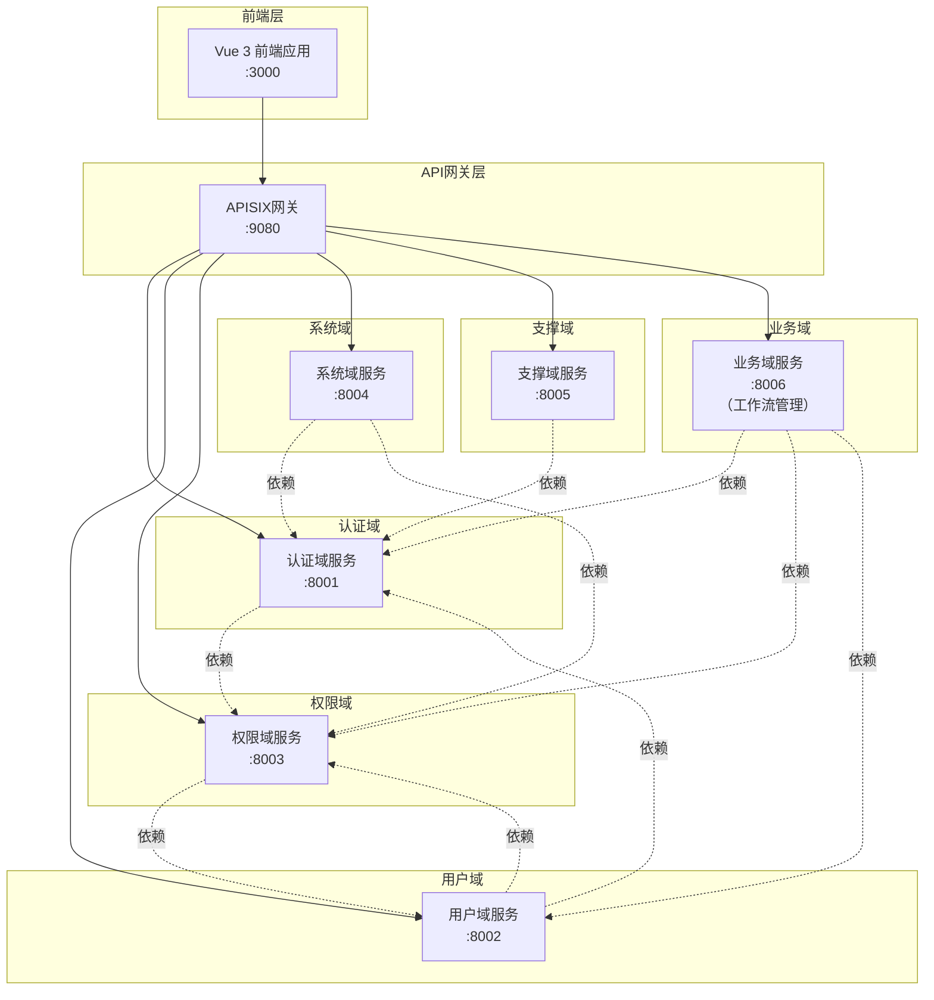
    APISIX --> Tenant
    APISIX --> Dept
    APISIX --> Role
    APISIX --> Menu
    APISIX --> MCP
    APISIX --> MultiDB
    APISIX --> Dict
    APISIX --> Log
    APISIX --> Notify
    
    Auth -.依赖.-> Role
    User -.依赖.-> Auth
    User -.依赖.-> Tenant
    User -.依赖.-> Dept
    User -.依赖.-> Role
    Tenant -.依赖.-> Auth
    Dept -.依赖.-> Tenant
    Role -.依赖.-> Menu
    Menu -.依赖.-> Role
    MCP -.依赖.-> Auth
    MCP -.依赖.-> Role
    MCP -.依赖.-> MultiDB
    MultiDB -.依赖.-> Auth
    Log -.依赖.-> Auth
    Notify -.依赖.-> Auth
```

### 2.3 服务间通信

#### 2.3.1 通信方式概述

| 通信方式 | 适用场景 | 技术选型 | 特点 |
|---------|---------|---------|------|
| **同步调用** | 实时查询、事务操作 | HTTP/REST + FastAPI | 实时性强、简单直接 |
| **异步调用** | 异步任务、消息通知 | RabbitMQ | 解耦、异步处理 |
| **事件驱动** | 事件发布订阅 | RabbitMQ | 松耦合、可扩展 |

#### 2.3.2 同步通信（HTTP/REST）

**通信流程**：
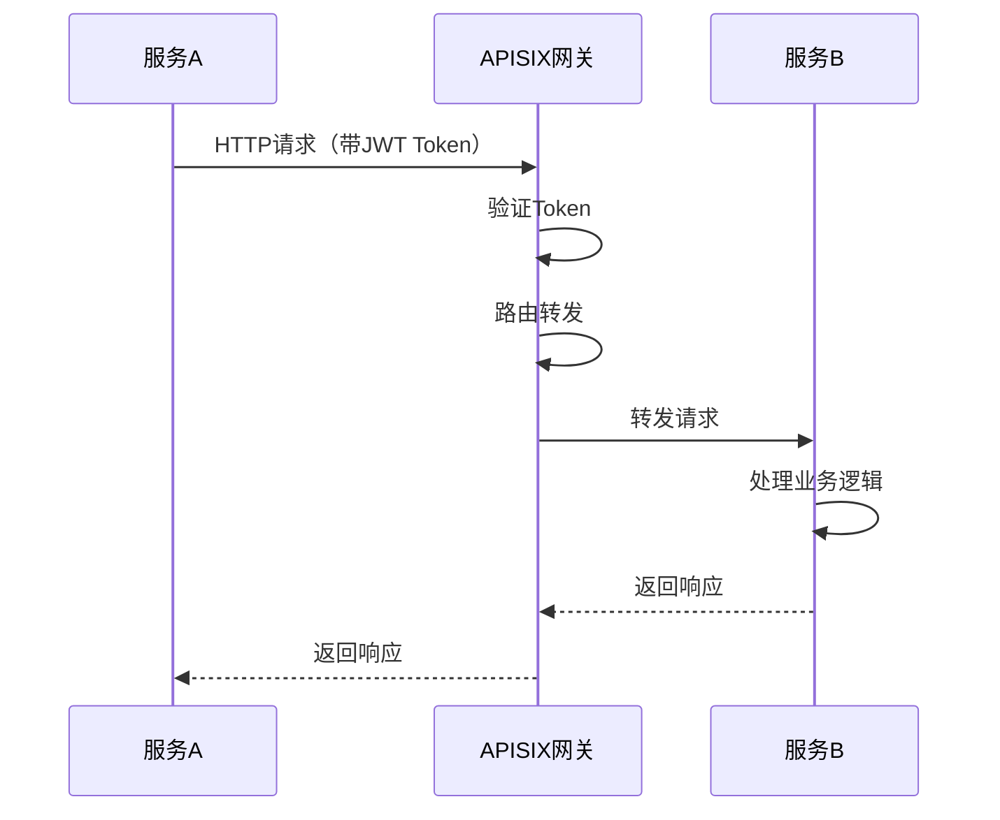

**使用场景**：
- 服务A需要实时查询服务B的数据
- 跨服务的事务操作
- 需要立即返回结果的场景

**实现方式**：
```python
# 服务A调用服务B的示例
import httpx

async def call_service_b(user_id: str):
    """调用服务B获取用户信息"""
    async with httpx.AsyncClient() as client:
        response = await client.get(
            f"http://apisix:9080/api/v1/users/{user_id}",
            headers={"Authorization": f"Bearer {token}"}
        )
        return response.json()
```

#### 2.3.3 异步通信（RabbitMQ）

**通信流程**：
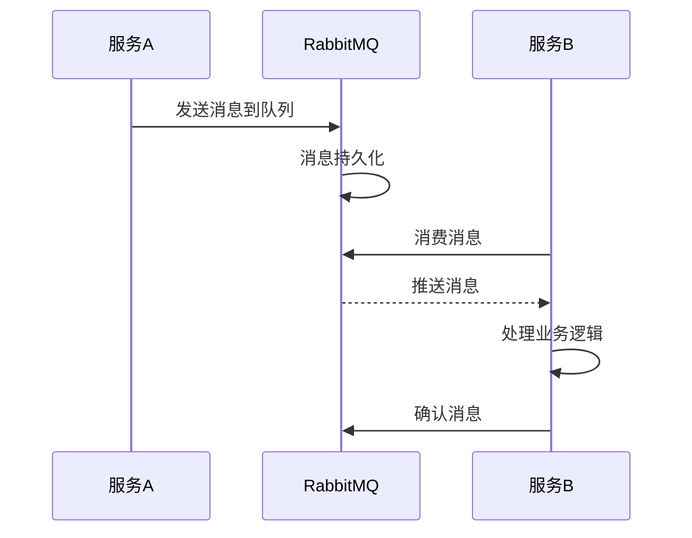

**使用场景**：
- 异步任务处理（如发送邮件、生成报表）
- 消息通知（如站内信、短信通知）
- 事件发布订阅（如用户注册后发送欢迎邮件）

**实现方式**：
```python
# 服务A发送消息
import pika

def send_notification_message(user_id: str, message: str):
    """发送通知消息"""
    connection = pika.BlockingConnection(pika.ConnectionParameters('rabbitmq'))
    channel = connection.channel()
    
    channel.queue_declare(queue='notifications', durable=True)
    
    channel.basic_publish(
        exchange='',
        routing_key='notifications',
        body=json.dumps({'user_id': user_id, 'message': message}),
        properties=pika.BasicProperties(delivery_mode=2)
    )
    
    connection.close()

# 服务B消费消息
def consume_notification_messages():
    """消费通知消息"""
    connection = pika.BlockingConnection(pika.ConnectionParameters('rabbitmq'))
    channel = connection.channel()
    
    channel.queue_declare(queue='notifications', durable=True)
    
    def callback(ch, method, properties, body):
        message = json.loads(body)
        # 处理消息
        send_notification(message['user_id'], message['message'])
        ch.basic_ack(delivery_tag=method.delivery_tag)
    
    channel.basic_consume(queue='notifications', on_message_callback=callback)
    channel.start_consuming()
```

#### 2.3.4 服务发现（Nacos）

**服务注册流程**：
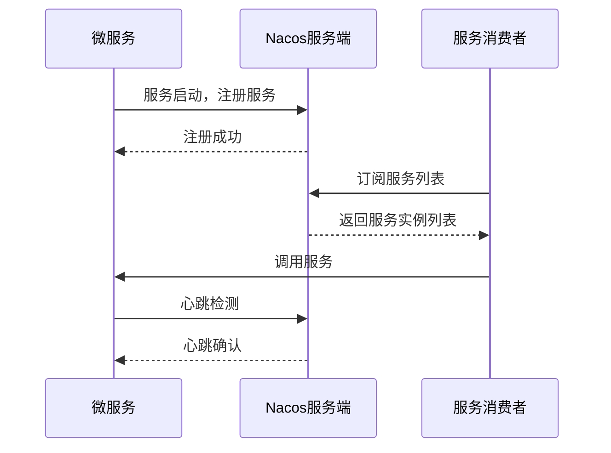

**使用场景**：
- 服务启动时自动注册到Nacos
- 服务消费者从Nacos获取服务实例列表
- 服务健康检查和故障转移

**实现方式**：
```python
# 服务注册
from nacos import NacosClient

nacos_client = NacosClient('nacos-server:8848')

def register_service(service_name: str, ip: str, port: int):
    """注册服务到Nacos"""
    nacos_client.add_naming_instance(
        service_name=service_name,
        ip=ip,
        port=port,
        cluster_name='DEFAULT',
        weight=1.0,
        ephemeral=True
    )

# 服务发现
def discover_service(service_name: str):
    """从Nacos获取服务实例"""
    instances = nacos_client.list_naming_instance(service_name)
    if instances['hosts']:
        # 负载均衡选择一个实例
        instance = random.choice(instances['hosts'])
        return f"http://{instance['ip']}:{instance['port']}"
    return None
```

#### 2.3.5 通信最佳实践

**同步通信最佳实践**：
- ✅ 使用HTTP/REST协议，通过APISIX网关路由
- ✅ 添加JWT Token进行认证
- ✅ 设置合理的超时时间（默认30秒）
- ✅ 实现重试机制（最多3次）
- ✅ 添加熔断降级策略

**异步通信最佳实践**：
- ✅ 使用RabbitMQ消息队列
- ✅ 消息持久化，防止丢失
- ✅ 手动确认消息，确保处理成功
- ✅ 实现死信队列，处理失败消息
- ✅ 监控队列积压情况

**服务发现最佳实践**：
- ✅ 服务启动时自动注册到Nacos
- ✅ 定期发送心跳（默认5秒）
- ✅ 实现健康检查
- ✅ 实现负载均衡策略
- ✅ 实现故障自动转移

### 2.4 分布式事务

#### 2.4.1 分布式事务概述

微服务架构下，跨服务的事务处理是一个重要挑战。本系统采用**Saga模式**作为分布式事务解决方案。

**为什么选择Saga？**
- ✅ 不需要额外部署专门的Saga服务器
- ✅ 只需要Python代码实现，易于理解和维护
- ✅ 项目已有RabbitMQ和MySQL，可以直接使用
- ✅ 支持长事务，适合复杂的业务流程
- ✅ 实现灵活，可以完全控制业务逻辑

#### 2.4.2 Saga模式（编排式）

**架构图**：
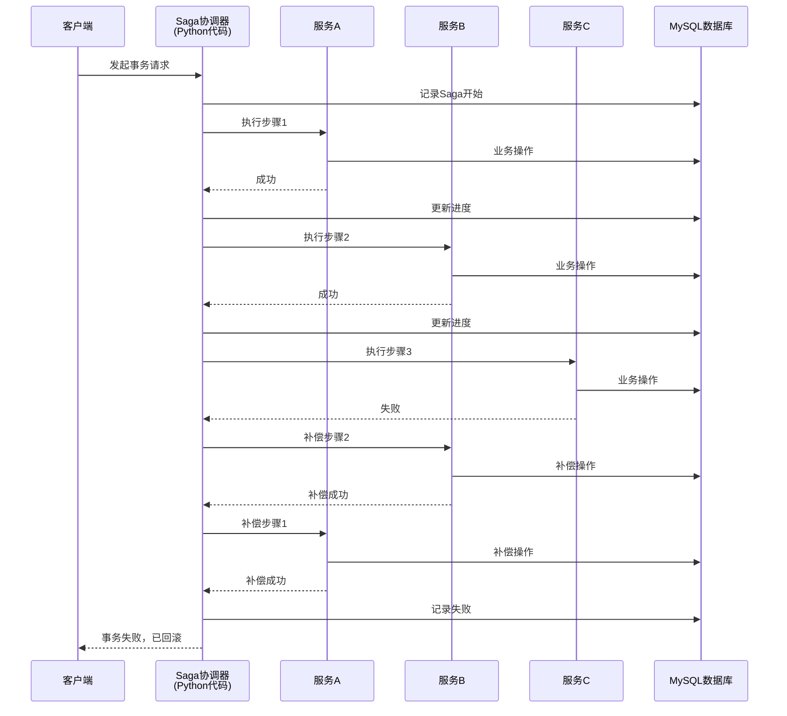

**实现方式**：

**1. Saga协调器类**：
```python
# app/services/saga.py
from typing import List, Callable, Any
from loguru import logger

class SagaOrchestrator:
    """Saga协调器 - 编排式实现"""
    
    def __init__(self, db_session):
        self.db = db_session
        self.steps: List[Callable] = []
        self.compensations: List[Callable] = []
    
    def add_step(self, action: Callable, compensation: Callable):
        """添加业务步骤和补偿操作
        
        Args:
            action: 业务操作函数
            compensation: 补偿操作函数
        """
        self.steps.append(action)
        self.compensations.append(compensation)
    
    async def execute(self, saga_id: str):
        """执行Saga事务
        
        Args:
            saga_id: Saga事务ID
            
        Returns:
            bool: 事务是否成功
            
        Raises:
            Exception: 事务执行失败时抛出异常
        """
        # 记录Saga开始
        await self.db.execute(
            "INSERT INTO saga_logs (id, status, steps_total, steps_completed, created_at) VALUES (?, ?, ?, ?, NOW())",
            (saga_id, 'running', len(self.steps), 0)
        )
        
        executed_steps: List[dict] = []
        
        try:
            # 正向执行所有步骤
            for i, step in enumerate(self.steps):
                logger.info(f"执行步骤 {i + 1}/{len(self.steps)}")
                
                result = await step()
                executed_steps.append({
                    'step_index': i,
                    'result': result
                })
                
                # 记录步骤完成
                await self.db.execute(
                    "UPDATE saga_logs SET steps_completed = ? WHERE id = ?",
                    (i + 1, saga_id)
                )
            
            # 标记成功
            await self.db.execute(
                "UPDATE saga_logs SET status = 'completed', completed_at = NOW() WHERE id = ?",
                (saga_id,)
            )
            
            logger.info(f"Saga事务 {saga_id} 执行成功")
            return True
            
        except Exception as e:
            logger.error(f"Saga事务 {saga_id} 执行失败: {str(e)}")
            
            # 执行补偿操作（反向执行）
            for i in range(len(executed_steps) - 1, -1, -1):
                try:
                    step_info = executed_steps[i]
                    logger.info(f"执行补偿步骤 {step_info['step_index'] + 1}")
                    
                    await self.compensations[i](step_info['result'])
                    
                except Exception as comp_error:
                    logger.error(f"补偿操作失败: {comp_error}")
                    # 补偿失败，记录但继续执行其他补偿
                    continue
            
            # 标记失败
            await self.db.execute(
                "UPDATE saga_logs SET status = 'failed', error = ?, completed_at = NOW() WHERE id = ?",
                (str(e), saga_id)
            )
            
            raise e
```

**2. 使用示例**：
```python
# app/services/user_workflow_service.py
from app.services.saga import SagaOrchestrator

async def create_user_with_workflow(user_data: dict):
    """创建用户并初始化工作流
    
    这是一个跨服务的事务，涉及用户域服务和业务域服务
    """
    saga_id = generate_uuid()
    saga = SagaOrchestrator(db_session)
    
    # 步骤1：创建用户（用户域服务）
    def create_user():
        return user_service.create(user_data)
    
    def compensate_create_user(user):
        return user_service.delete(user['id'])
    
    saga.add_step(create_user, compensate_create_user)
    
    # 步骤2：分配角色（权限域服务）
    def assign_role(user):
        return role_service.assign(user['id'], user['role_id'])
    
    def compensate_assign_role(user):
        return role_service.revoke(user['id'], user['role_id'])
    
    saga.add_step(assign_role, compensate_assign_role)
    
    # 步骤3：初始化工作流（业务域服务）
    def init_workflow(user):
        return workflow_service.init_default_workflow(user['id'])
    
    def compensate_init_workflow(user):
        return workflow_service.delete_user_workflows(user['id'])
    
    saga.add_step(init_workflow, compensate_init_workflow)
    
    # 执行Saga
    try:
        await saga.execute(saga_id)
        logger.info(f"用户创建和工作流初始化成功: {saga_id}")
        return True
    except Exception as e:
        logger.error(f"用户创建和工作流初始化失败: {e}")
        return False
```

**3. 数据库表设计**：
```sql
-- Saga日志表
CREATE TABLE saga_logs (
    id VARCHAR(50) PRIMARY KEY,
    status VARCHAR(20) NOT NULL COMMENT '状态（running/completed/failed）',
    steps_total INT NOT NULL COMMENT '总步骤数',
    steps_completed INT DEFAULT 0 COMMENT '已完成步骤数',
    error TEXT COMMENT '错误信息',
    created_at DATETIME DEFAULT CURRENT_TIMESTAMP,
    completed_at DATETIME,
    INDEX idx_status (status),
    INDEX idx_created_at (created_at)
);
```

#### 2.4.3 其他分布式事务方案

虽然本系统采用Saga模式，但也了解其他方案：

**1. TCC模式（Try-Confirm-Cancel）**：
- **特点**：三阶段提交，强一致性
- **优点**：一致性高
- **缺点**：实现复杂，每个服务需要实现三个接口
- **适用场景**：对一致性要求极高的场景

**2. 本地消息表**：
- **特点**：基于消息队列的最终一致性
- **优点**：实现简单
- **缺点**：只能保证最终一致性
- **适用场景**：异步场景，允许短暂不一致

#### 2.4.4 分布式事务最佳实践

**Saga模式最佳实践**：
- ✅ 每个业务步骤都要有对应的补偿操作
- ✅ 补偿操作要保证幂等性（多次执行结果相同）
- ✅ 记录Saga执行日志，便于问题排查
- ✅ 实现超时机制，防止长时间阻塞
- ✅ 实现重试机制，处理临时性故障
- ✅ 补偿失败时记录日志，人工介入处理

**事务设计原则**：
- ✅ 尽量减少跨服务事务，提高内聚性
- ✅ 长事务拆分为多个短事务
- ✅ 优先使用最终一致性，避免强一致性
- ✅ 合理使用补偿机制，保证数据一致性

---

## 2.5 企业级项目结构

### 2.5.1 整体目录结构

本系统采用**企业级FastAPI微服务框架**，每个微服务都遵循统一的分层架构，确保代码的可维护性、可扩展性和可测试性。

```
backend/
├── common/                          # 共享代码库（所有服务共用）
│   ├── cache/                       # 缓存模块
│   │   ├── local.py                 # 本地缓存实现
│   │   └── redis.py                 # Redis缓存实现
│   ├── config/                      # 配置模块
│   │   ├── constants.py             # 常量定义
│   │   └── settings.py              # 配置类
│   ├── database/                    # 数据库模块
│   │   ├── base.py                  # 基础模型类
│   │   ├── connection.py            # 多数据源管理器
│   │   ├── pandas_helper.py         # Pandas数据分析助手
│   │   ├── session.py               # 数据库会话管理
│   │   ├── transaction.py           # 跨数据源事务管理
│   │   └── models/                  # 共享数据模型
│   │       ├── permission.py        # 权限相关模型
│   │       ├── system.py            # 系统相关模型
│   │       ├── tenant.py            # 租户相关模型
│   │       ├── todo.py              # 待办任务模型
│   │       ├── user.py              # 用户相关模型
│   │       └── workflow.py          # 工作流相关模型
│   ├── decorators/                  # 装饰器
│   │   ├── cache.py                 # 缓存装饰器
│   │   └── permission.py            # 权限装饰器
│   ├── exceptions/                  # 异常类
│   │   └── base.py                  # 基础异常类
│   ├── middleware/                  # 中间件
│   │   ├── auth.py                  # 认证中间件
│   │   ├── exception.py             # 异常处理中间件
│   │   └── logging.py               # 日志中间件
│   ├── responses/                   # 响应模块
│   │   └── base.py                  # 统一响应格式
│   ├── security/                    # 安全模块
│   │   ├── api_key.py               # API Key管理
│   │   ├── jwt.py                   # JWT工具
│   │   └── password.py              # 密码加密
│   └── utils/                       # 工具模块
│       ├── datetime.py              # 日期时间工具
│       ├── helpers.py               # 辅助函数
│       └── validators.py            # 验证器
│
├── services/                        # 微服务目录
│   ├── auth-service/                # 认证域服务（8001）
│   │   ├── app/                     # 应用主目录
│   │   │   ├── api/                 # API路由层
│   │   │   │   └── v1/              # API版本1
│   │   │   │       └── auth.py      # 认证相关API
│   │   │   ├── core/                # 核心配置
│   │   │   │   ├── config.py        # 服务配置
│   │   │   │   ├── deps.py          # 依赖注入
│   │   │   │   └── security.py      # 安全配置
│   │   │   ├── models/              # 数据模型层（SQLAlchemy ORM）
│   │   │   │   ├── __init__.py
│   │   │   │   ├── user.py          # 用户模型
│   │   │   │   └── token.py         # Token模型
│   │   │   ├── repositories/        # 数据访问层
│   │   │   │   ├── __init__.py
│   │   │   │   ├── user_repository.py       # 用户数据访问
│   │   │   │   └── token_repository.py      # Token数据访问
│   │   │   ├── schemas/             # Pydantic模型（请求/响应验证）
│   │   │   │   ├── __init__.py
│   │   │   │   ├── auth.py          # 认证Schema
│   │   │   │   ├── user.py          # 用户Schema
│   │   │   │   └── token.py         # Token Schema
│   │   │   ├── services/            # 业务逻辑层
│   │   │   │   ├── __init__.py
│   │   │   │   ├── auth_service.py  # 认证服务
│   │   │   │   └── token_service.py # Token管理服务
│   │   │   └── main.py              # FastAPI应用入口
│   │   ├── alembic/                 # 数据库迁移
│   │   │   ├── env.py               # 迁移环境配置
│   │   │   ├── script.py.mako       # 迁移模板
│   │   │   └── versions/            # 迁移版本文件
│   │   ├── scripts/                 # 工具脚本
│   │   ├── tests/                   # 测试目录
│   │   │   ├── unit/                # 单元测试
│   │   │   └── integration/         # 集成测试
│   │   ├── .env.development         # 开发环境配置
│   │   ├── .env.production          # 生产环境配置
│   │   ├── docker-compose.yml       # Docker编排
│   │   ├── Dockerfile               # Docker镜像构建
│   │   ├── requirements.txt         # Python依赖
│   │   └── README.md                # 服务文档
│   │
│   ├── user-service/                # 用户域服务（8002）
│   │   ├── app/
│   │   │   ├── api/v1/              # API路由
│   │   │   │   ├── users.py         # 用户API
│   │   │   │   ├── departments.py   # 部门API
│   │   │   │   └── tenants.py       # 租户API
│   │   │   ├── core/                # 核心配置
│   │   │   ├── models/              # 数据模型
│   │   │   │   ├── user.py
│   │   │   │   ├── department.py
│   │   │   │   └── tenant.py
│   │   │   ├── repositories/        # 数据访问层
│   │   │   │   ├── user_repository.py
│   │   │   │   ├── department_repository.py
│   │   │   │   └── tenant_repository.py
│   │   │   ├── schemas/             # Pydantic模型
│   │   │   ├── services/            # 业务逻辑层
│   │   │   │   ├── user_service.py
│   │   │   │   ├── department_service.py
│   │   │   │   └── tenant_service.py
│   │   │   └── main.py
│   │   ├── alembic/
│   │   ├── tests/
│   │   └── ...（其他配置文件同auth-service）
│   │
│   ├── permission-service/          # 权限域服务（8003）
│   │   ├── app/
│   │   │   ├── api/v1/              # API路由
│   │   │   │   ├── roles.py         # 角色API
│   │   │   │   ├── permissions.py   # 权限API
│   │   │   │   └── menus.py         # 菜单API
│   │   │   ├── core/
│   │   │   ├── models/              # 数据模型
│   │   │   │   ├── role.py
│   │   │   │   ├── permission.py
│   │   │   │   └── menu.py
│   │   │   ├── repositories/        # 数据访问层
│   │   │   │   ├── role_repository.py
│   │   │   │   ├── permission_repository.py
│   │   │   │   └── menu_repository.py
│   │   │   ├── schemas/
│   │   │   ├── services/            # 业务逻辑层
│   │   │   │   ├── role_service.py
│   │   │   │   ├── permission_service.py
│   │   │   │   └── menu_service.py
│   │   │   └── main.py
│   │   ├── alembic/
│   │   ├── tests/
│   │   └── ...（其他配置文件同auth-service）
│   │
│   ├── system-service/              # 系统域服务（8004）
│   │   ├── app/
│   │   │   ├── api/v1/              # API路由
│   │   │   │   ├── mcp_tools.py     # MCP工具API
│   │   │   │   ├── datasources.py   # 数据源API
│   │   │   │   └── dicts.py         # 字典API
│   │   │   ├── core/
│   │   │   ├── models/              # 数据模型
│   │   │   │   ├── mcp_tool.py
│   │   │   │   ├── datasource.py
│   │   │   │   └── dict.py
│   │   │   ├── repositories/        # 数据访问层
│   │   │   │   ├── mcp_tool_repository.py
│   │   │   │   ├── datasource_repository.py
│   │   │   │   └── dict_repository.py
│   │   │   ├── schemas/
│   │   │   ├── services/            # 业务逻辑层
│   │   │   │   ├── mcp_tool_service.py
│   │   │   │   ├── datasource_service.py
│   │   │   │   └── dict_service.py
│   │   │   └── main.py
│   │   ├── alembic/
│   │   ├── tests/
│   │   └── ...（其他配置文件同auth-service）
│   │
│   ├── support-service/             # 支撑域服务（8005）
│   │   ├── app/
│   │   │   ├── api/v1/              # API路由
│   │   │   │   ├── logs.py          # 日志API
│   │   │   │   ├── notifications.py # 通知API
│   │   │   │   └── todos.py         # 待办任务API
│   │   │   ├── core/
│   │   │   ├── models/              # 数据模型
│   │   │   │   ├── log.py
│   │   │   │   ├── notification.py
│   │   │   │   └── todo.py
│   │   │   ├── repositories/        # 数据访问层
│   │   │   │   ├── log_repository.py
│   │   │   │   ├── notification_repository.py
│   │   │   │   └── todo_repository.py
│   │   │   ├── schemas/
│   │   │   ├── services/            # 业务逻辑层
│   │   │   │   ├── log_service.py
│   │   │   │   ├── notification_service.py
│   │   │   │   └── todo_service.py
│   │   │   └── main.py
│   │   ├── alembic/
│   │   ├── tests/
│   │   └── ...（其他配置文件同auth-service）
│   │
│   └── business-service/            # 业务域服务（8006）
│       ├── app/
│       │   ├── api/v1/              # API路由
│       │   │   ├── workflows.py             # 工作流API
│       │   │   ├── workflow_templates.py    # 工作流模板API
│       │   │   └── workflow_tasks.py        # 工作流任务API
│       │   ├── core/
│       │   ├── models/              # 数据模型
│       │   │   ├── workflow.py
│       │   │   ├── workflow_template.py
│       │   │   └── workflow_task.py
│       │   ├── repositories/        # 数据访问层
│       │   │   ├── workflow_repository.py
│       │   │   ├── workflow_template_repository.py
│       │   │   └── workflow_task_repository.py
│       │   ├── schemas/
│       │   ├── services/            # 业务逻辑层
│       │   │   ├── workflow_service.py
│       │   │   ├── workflow_template_service.py
│       │   │   └── workflow_task_service.py
│       │   └── main.py
│       ├── alembic/
│       ├── tests/
│       └── ...（其他配置文件同auth-service）
│
├── tests/                           # 集成测试
│   ├── test_backend_apis.py         # 后端API集成测试
│   ├── 测试计划.md                  # 测试计划文档
│   └── 测试报告.json                # 测试报告
│
├── scripts/                         # 工具脚本
│   ├── execute_init_db.py           # 数据库初始化脚本
│   ├── drop_tables.py               # 删除表脚本
│   ├── generate_enterprise_structure.py  # 企业级结构生成脚本
│   └── ...（其他脚本）
│
├── alembic.ini                      # Alembic全局配置
├── start_services.bat               # 启动所有服务
├── stop_services.bat                # 停止所有服务
├── run_tests.bat                    # 运行测试
└── __init__.py                      # 包初始化文件
```

### 2.5.2 分层架构说明

本系统采用**四层架构**，每层职责明确，遵循单一职责原则：

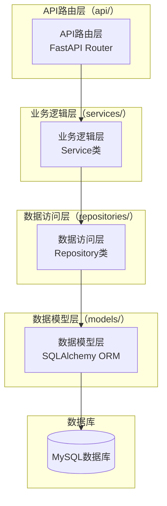

#### 2.5.2.1 API路由层（api/）

**职责**：
- 接收HTTP请求
- 参数验证（Pydantic Schema）
- 调用业务逻辑层
- 返回HTTP响应

**特点**：
- 使用FastAPI Router组织路由
- 使用Pydantic Schema进行请求/响应验证
- 使用依赖注入获取数据库会话
- 统一的响应格式

**示例代码**：
```python
# app/api/v1/users.py
from fastapi import APIRouter, Depends, HTTPException
from typing import List
from app.schemas.user import UserCreate, UserResponse
from app.services.user_service import UserService
from app.core.deps import get_db

router = APIRouter(prefix="/users", tags=["用户管理"])

@router.post("/", response_model=UserResponse, summary="创建用户")
async def create_user(
    user_data: UserCreate,
    db: Session = Depends(get_db)
):
    """创建新用户"""
    user_service = UserService(db)
    user = user_service.create(user_data)
    return user

@router.get("/{user_id}", response_model=UserResponse, summary="获取用户")
async def get_user(
    user_id: str,
    db: Session = Depends(get_db)
):
    """获取用户详情"""
    user_service = UserService(db)
    user = user_service.get_by_id(user_id)
    if not user:
        raise HTTPException(status_code=404, detail="用户不存在")
    return user
```

#### 2.5.2.2 业务逻辑层（services/）

**职责**：
- 实现业务逻辑
- 协调多个Repository
- 实现事务管理
- 业务规则验证

**特点**：
- 使用Service类封装业务逻辑
- 通过Repository访问数据
- 支持事务管理
- 可复用的业务逻辑

**示例代码**：
```python
# app/services/user_service.py
from typing import Optional, List
from app.repositories.user_repository import UserRepository
from app.repositories.department_repository import DepartmentRepository
from app.schemas.user import UserCreate

class UserService:
    """用户业务逻辑服务"""
    
    def __init__(self, db: Session):
        self.db = db
        self.user_repo = UserRepository(db)
        self.dept_repo = DepartmentRepository(db)
    
    def create(self, user_data: UserCreate) -> User:
        """创建用户
        
        业务逻辑：
        1. 验证部门是否存在
        2. 创建用户
        3. 分配默认角色
        """
        # 验证部门
        if user_data.department_id:
            dept = self.dept_repo.get_by_id(user_data.department_id)
            if not dept:
                raise ValueError("部门不存在")
        
        # 创建用户
        user = self.user_repo.create(user_data)
        
        # 分配默认角色（可选）
        # self.role_repo.assign_default_role(user.id)
        
        return user
    
    def get_by_id(self, user_id: str) -> Optional[User]:
        """根据ID获取用户"""
        return self.user_repo.get_by_id(user_id)
    
    def update(self, user_id: str, user_data: dict) -> Optional[User]:
        """更新用户"""
        return self.user_repo.update(user_id, user_data)
    
    def delete(self, user_id: str) -> bool:
        """删除用户"""
        return self.user_repo.delete(user_id)
```

#### 2.5.2.3 数据访问层（repositories/）

**职责**：
- 封装数据库操作
- 提供CRUD方法
- 实现查询逻辑
- 数据缓存（可选）

**特点**：
- 使用Repository模式
- 封装SQLAlchemy操作
- 提供统一的查询接口
- 支持复杂查询

**示例代码**：
```python
# app/repositories/user_repository.py
from typing import Optional, List
from sqlalchemy.orm import Session
from app.models.user import User

class UserRepository:
    """用户数据访问层"""
    
    def __init__(self, db: Session):
        self.db = db
    
    def get_by_id(self, user_id: str) -> Optional[User]:
        """根据ID获取用户"""
        return self.db.query(User).filter(User.id == user_id).first()
    
    def get_by_username(self, username: str) -> Optional[User]:
        """根据用户名获取用户"""
        return self.db.query(User).filter(User.username == username).first()
    
    def create(self, user_data: dict) -> User:
        """创建用户"""
        user = User(**user_data)
        self.db.add(user)
        self.db.commit()
        self.db.refresh(user)
        return user
    
    def update(self, user_id: str, user_data: dict) -> Optional[User]:
        """更新用户"""
        user = self.get_by_id(user_id)
        if not user:
            return None
        
        for key, value in user_data.items():
            if hasattr(user, key):
                setattr(user, key, value)
        
        self.db.commit()
        self.db.refresh(user)
        return user
    
    def delete(self, user_id: str) -> bool:
        """删除用户"""
        user = self.get_by_id(user_id)
        if not user:
            return False
        
        self.db.delete(user)
        self.db.commit()
        return True
    
    def list(self, skip: int = 0, limit: int = 100) -> List[User]:
        """获取用户列表"""
        return self.db.query(User).offset(skip).limit(limit).all()
```

#### 2.5.2.4 数据模型层（models/）

**职责**：
- 定义数据库表结构
- 实现ORM映射
- 定义表关系
- 数据验证

**特点**：
- 使用SQLAlchemy ORM
- 继承自BaseModel
- 定义表关系（一对多、多对多）
- 支持索引和约束

**示例代码**：
```python
# app/models/user.py
from sqlalchemy import Column, String, Boolean, DateTime, Text
from sqlalchemy.orm import relationship
from datetime import datetime
from common.database.base import BaseModel

class User(BaseModel):
    """用户模型"""
    
    __tablename__ = "users"
    
    # 基本信息
    tenant_id = Column(String(64), nullable=False, index=True, comment="租户ID")
    username = Column(String(50), nullable=False, unique=True, index=True, comment="用户名")
    email = Column(String(100), nullable=False, index=True, comment="邮箱")
    password_hash = Column(String(255), nullable=False, comment="密码哈希")
    
    # 用户信息
    full_name = Column(String(100), nullable=True, comment="全名")
    phone = Column(String(20), nullable=True, comment="手机号")
    avatar = Column(String(255), nullable=True, comment="头像URL")
    
    # 状态信息
    status = Column(String(20), nullable=False, default="active", comment="状态（active/disabled）")
    is_superuser = Column(Boolean, default=False, comment="是否超级管理员")
    
    # 部门和岗位
    department_id = Column(String(64), nullable=True, comment="部门ID")
    position_id = Column(String(64), nullable=True, comment="岗位ID")
    
    # 扩展信息
    bio = Column(Text, nullable=True, comment="个人简介")
    preferences = Column(Text, nullable=True, comment="用户偏好设置（JSON）")
    
    # 关系
    tokens = relationship("Token", back_populates="user", cascade="all, delete-orphan")
    roles = relationship("Role", secondary="user_roles", back_populates="users")
    
    def __repr__(self):
        return f"<User(id={self.id}, username={self.username}, email={self.email})>"
```

### 2.5.3 分层架构的优势

**可维护性**：
- ✅ 每层职责明确，代码结构清晰
- ✅ 修改某层不影响其他层
- ✅ 便于单元测试和集成测试

**可扩展性**：
- ✅ 新增功能只需扩展对应层
- ✅ 可以轻松替换某层实现
- ✅ 支持水平扩展

**可复用性**：
- ✅ Service层可以被多个API复用
- ✅ Repository层可以被多个Service复用
- ✅ Model层可以被多个Repository复用

**团队协作**：
- ✅ 不同开发者可以专注于不同层
- ✅ 减少代码冲突
- ✅ 提高开发效率

### 2.5.4 最佳实践

**API路由层最佳实践**：
- ✅ 只负责接收请求和返回响应
- ✅ 不包含业务逻辑
- ✅ 使用Pydantic Schema验证参数
- ✅ 统一的异常处理

**业务逻辑层最佳实践**：
- ✅ 封装业务逻辑
- ✅ 实现事务管理
- ✅ 协调多个Repository
- ✅ 业务规则验证

**数据访问层最佳实践**：
- ✅ 只负责数据库操作
- ✅ 不包含业务逻辑
- ✅ 提供CRUD方法
- ✅ 支持复杂查询

**数据模型层最佳实践**：
- ✅ 只定义表结构
- ✅ 定义表关系
- ✅ 添加索引和约束
- ✅ 不包含业务逻辑

---

## 3. 技术栈选型说明

### 3.1 后端技术栈

| 技术组件 | 选型 | 版本 | 选型理由 |
|---------|------|------|---------|
| **Web框架** | FastAPI | 0.104+ | 高性能异步、自动文档、类型提示 |
| **ORM** | SQLAlchemy | 2.0+ | 功能强大、多数据库支持、异步支持 |
| **鉴权** | PyJWT + python-jose | 2.8+ | 轻量级、灵活、支持多种算法 |
| **配置中心** | Nacos | 2.2+ | 功能完整、支持动态配置、服务发现 |
| **消息队列** | RabbitMQ | 3.12+ | 功能强大、可靠性高 |
| **缓存** | Redis | 7.0+ | 功能强大、性能高 |
| **API网关** | APISIX | 3.5+ | 高性能、云原生、动态路由 |
| **限流熔断** | Sentinel | 1.8+ | 功能强大、可视化界面 |
| **分布式追踪** | Jaeger | 1.50+ | 功能强大、可视化界面 |
| **监控** | Prometheus + Grafana | 2.45+ / 10.0+ | 功能强大、可视化好 |
| **日志** | loguru | 0.7+ | 简单易用、功能强大 |
| **数据库迁移** | Alembic | 1.12+ | SQLAlchemy官方工具 |
| **容器化** | Docker | 24.0+ | 轻量级、易用 |
| **CI/CD** | GitHub Actions | - | 易用、免费、集成度高 |

### 3.2 前端技术栈

| 技术组件 | 选型 | 版本 | 选型理由 |
|---------|------|------|---------|
| **框架** | Vue | 3.3+ | 渐进式框架、生态成熟 |
| **语言** | TypeScript | 5.0+ | 类型安全、开发体验好 |
| **构建工具** | Vite | 5.0+ | 快速、现代化 |
| **路由** | Vue Router | 4.2+ | 官方路由、功能完善 |
| **状态管理** | Pinia | 2.1+ | 官方状态管理、简单易用 |
| **UI组件库** | Element Plus | 2.4+ | 功能完善、设计美观 |
| **HTTP客户端** | Axios | 1.6+ | 功能强大、易用 |
| **代码规范** | ESLint + Prettier | 最新 | 代码质量保证 |

### 3.3 数据库技术栈

| 数据库 | 版本 | 用途 | 选型理由 |
|-------|------|------|---------|
| **MySQL** | 8.0+ | 主数据库 | 成熟稳定、性能好、生态完善 |
| **PostgreSQL** | 15+ | 可选数据库 | 功能强大、支持复杂查询 |
| **Oracle** | 19c+ | 可选数据库 | 企业级、功能强大 |

---

## 4. 模块划分与职责

### 4.1 认证域服务模块

**职责**：
- 用户认证（JWT、API Key）
- 权限校验（RBAC + ABAC）
- Token管理（生成、刷新、吊销）
- 会话管理
- 单点登录（可选）

**核心功能**：
- 用户登录/登出
- Token生成与验证
- 权限校验装饰器
- API Key管理
- 单点登录集成

### 4.2 用户域服务模块

**职责**：
- 用户CRUD操作
- 部门管理（5级部门树）
- 租户管理（SaaS多租户）
- 用户与部门/角色关联
- 岗位管理

**核心功能**：
- 用户创建/修改/删除
- 用户查询（分页、搜索）
- 用户状态管理（启用/禁用）
- 部门树结构管理
- 部门编码自动生成
- 租户管理
- 租户套餐配置
- 资源配额管理
- 岗位管理

### 4.3 权限域服务模块

**职责**：
- 角色管理
- 权限管理
- 菜单管理
- 数据范围权限
- 动态权限控制
- 权限缓存

**核心功能**：
- 角色创建/修改/删除
- 权限分配（菜单、操作、数据）
- 权限继承链
- 菜单树结构管理
- 菜单权限绑定
- 动态菜单加载
- 数据范围权限配置
- 权限缓存管理

### 4.4 系统域服务模块

**职责**：
- MCP工具注册与管理
- MCP工具调用与监控
- 多数据源配置与管理
- 跨数据库查询
- 字典管理
- 系统配置管理
- 错误码管理

**核心功能**：
- MCP工具注册（API端点 → MCP工具）
- MCP工具调用（权限校验、超时控制、重试机制）
- MCP工具监控（调用日志、成功率、响应时间）
- MCP工具权限控制
- 多数据源配置（MySQL、PostgreSQL、Oracle）
- 跨数据库查询
- 数据源健康检查
- 字典CRUD操作
- 字典分组管理
- 系统配置管理
- 错误码管理

### 4.5 支撑域服务模块

**职责**：
- 登录日志记录
- 操作日志记录
- 站内信管理
- 通知公告管理
- 敏感词管理
- 地区管理
- 待办任务管理（个人待办、每日计划、任务提醒）

**核心功能**：
- 登录日志记录
- 操作日志记录
- 日志查询（分页、搜索）
- 日志分包（按日期/大小）
- 站内信创建/发送
- 通知公告发布
- 消息队列集成（RabbitMQ）
- 异步发送
- 敏感词管理
- 地区管理（省市区）
- 个人待办任务（创建、编辑、删除、标记完成、优先级、截止时间、标签、附件）
- 每日计划（创建、查询、完成、统计、历史记录）
- 待办任务列表（分页、搜索、筛选、排序）
- 任务提醒（到期提醒、超时提醒、每日计划提醒、通知推送）

### 4.6 业务域服务模块

**职责**：
- 业务逻辑管理
- 工作流管理（审批流程、可视化设计器、审批任务管理）
- 预留业务功能扩展
- 支持业务插件化

**核心功能**：
- **工作流管理**：
  - 预置审批模板（人事审批、权限审批、财务审批、IT审批）
  - 可视化设计器（拖拽式节点编辑、流程图展示、节点配置、连接线配置）
  - 审批流程配置（单人审批、多人审批、条件分支、并行节点、审批操作）
  - 审批任务管理（待办、已办、抄送、任务详情、任务处理、审批评论）
  - 流程监控（实时监控、节点进度高亮、执行日志、异常处理、历史记录）
  - 首页看板集成（工作流统计、待办审批任务）
- **预留业务功能**：
  - 订单管理（预留）
  - 商品管理（预留）
  - 报表统计（预留）
  - 其他业务功能（预留）

---

## 5. 数据流向设计

### 5.1 用户登录流程

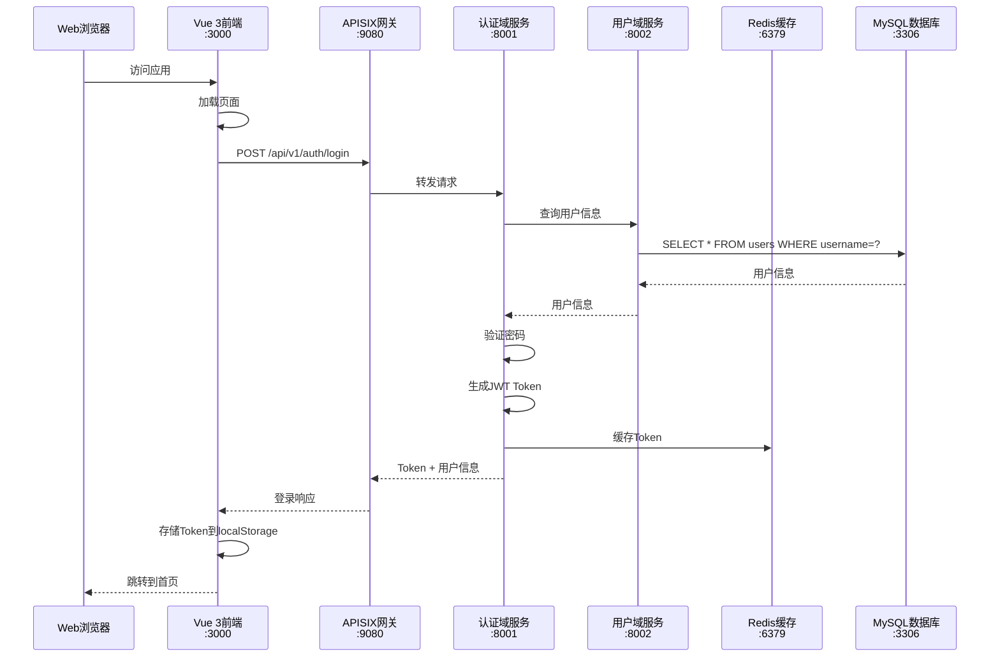

### 5.2 MCP工具调用流程

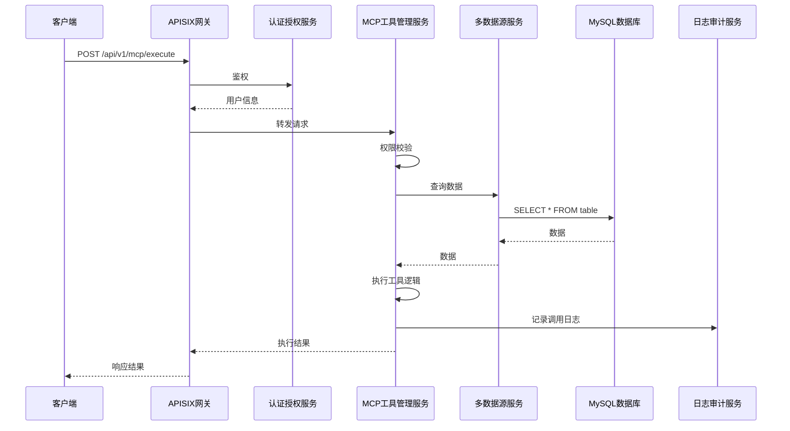

### 5.3 跨数据源查询流程

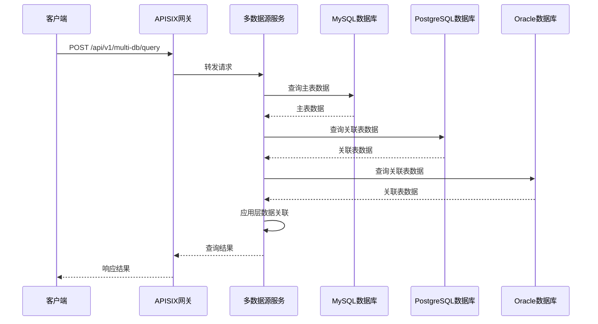

### 5.4 待办任务管理流程

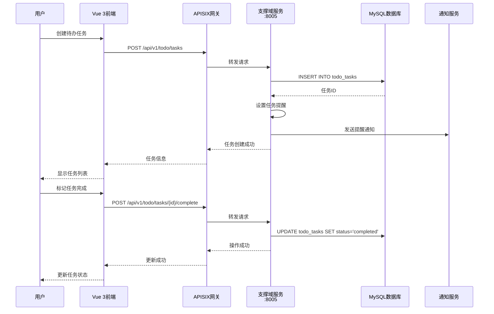

### 5.5 工作流审批流程

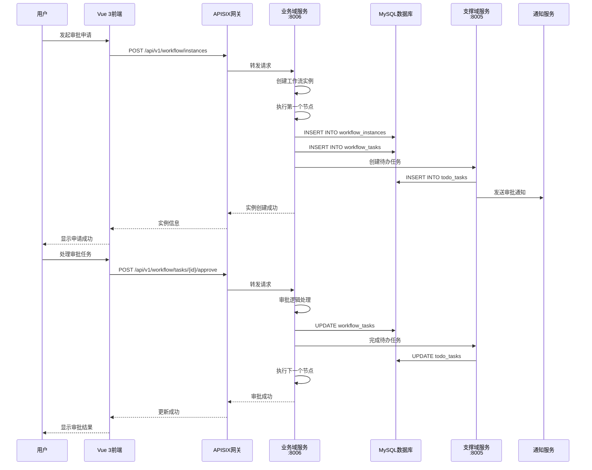

---

## 6. 部署架构设计

### 6.1 部署架构图

```mermaid
graph TB
    subgraph "负载均衡层"
        LB[负载均衡器<br/>Nginx/ALB]
    end
    
    subgraph "前端层"
        Vue1[Vue 3前端1<br/>:3000]
        Vue2[Vue 3前端2<br/>:3000]
    end
    
    subgraph "网关层"
        APISIX1[APISIX网关1<br/>:9080]
        APISIX2[APISIX网关2<br/>:9080]
    end
    
    subgraph "后端服务层"
        subgraph "认证域"
            Auth1[认证域服务1<br/>:8001]
            Auth2[认证域服务2<br/>:8001]
        end
        
        subgraph "用户域"
            User1[用户域服务1<br/>:8002]
            User2[用户域服务2<br/>:8002]
        end
        
        subgraph "权限域"
            Permission1[权限域服务1<br/>:8003]
            Permission2[权限域服务2<br/>:8003]
        end
        
        subgraph "系统域"
            System1[系统域服务1<br/>:8004]
            System2[系统域服务2<br/>:8004]
        end
        
        subgraph "支撑域"
            Support1[支撑域服务1<br/>:8005]
            Support2[支撑域服务2<br/>:8005]
        end
        
        subgraph "业务域"
            Business1[业务域服务1<br/>:8006]
            Business2[业务域服务2<br/>:8006]
        end
    end
    
    subgraph "数据层"
        MySQL[(MySQL主从<br/>:3306)]
        PostgreSQL[(PostgreSQL<br/>:5432)]
        Oracle[(Oracle<br/>:1521)]
        Redis[(Redis集群<br/>:6379)]
        RabbitMQ[RabbitMQ集群<br/>:5672]
    end
    
    subgraph "基础设施层"
        Nacos[Nacos集群<br/>:8848]
        Prometheus[Prometheus<br/>:9090]
        Grafana[Grafana<br/>:3001]
        Jaeger[Jaeger<br/>:6831]
    end
    
    LB --> Vue1
    LB --> Vue2
    
    Vue1 --> APISIX1
    Vue2 --> APISIX2
    
    APISIX1 --> Auth1
    APISIX1 --> Auth2
    APISIX1 --> User1
    APISIX1 --> User2
    APISIX1 --> Permission1
    APISIX1 --> Permission2
    APISIX1 --> System1
    APISIX1 --> System2
    APISIX1 --> Support1
    APISIX1 --> Support2
    APISIX1 --> Business1
    APISIX1 --> Business2
    
    APISIX2 --> Auth1
    APISIX2 --> Auth2
    APISIX2 --> User1
    APISIX2 --> User2
    APISIX2 --> Permission1
    APISIX2 --> Permission2
    APISIX2 --> System1
    APISIX2 --> System2
    APISIX2 --> Support1
    APISIX2 --> Support2
    APISIX2 --> Business1
    APISIX2 --> Business2
    
    Auth1 --> MySQL
    Auth2 --> MySQL
    User1 --> MySQL
    User2 --> MySQL
    Permission1 --> MySQL
    Permission2 --> MySQL
    System1 --> MySQL
    System2 --> MySQL
    Support1 --> MySQL
    Support2 --> MySQL
    Business1 --> MySQL
    Business2 --> MySQL
    
    System1 --> PostgreSQL
    System2 --> PostgreSQL
    System1 --> Oracle
    System2 --> Oracle
    
    Auth1 --> Redis
    Auth2 --> Redis
    User1 --> Redis
    User2 --> Redis
    Permission1 --> Redis
    Permission2 --> Redis
    System1 --> Redis
    System2 --> Redis
    Support1 --> Redis
    Support2 --> Redis
    Business1 --> Redis
    Business2 --> Redis
    
    System1 --> RabbitMQ
    System2 --> RabbitMQ
    Support1 --> RabbitMQ
    Support2 --> RabbitMQ
    
    Auth1 --> Nacos
    Auth2 --> Nacos
    User1 --> Nacos
    User2 --> Nacos
    Permission1 --> Nacos
    Permission2 --> Nacos
    System1 --> Nacos
    System2 --> Nacos
    Support1 --> Nacos
    Support2 --> Nacos
    Business1 --> Nacos
    Business2 --> Nacos
    
    Auth1 --> Prometheus
    User1 --> Prometheus
    System1 --> Prometheus
    
    Prometheus --> Grafana
    
    Auth1 --> Jaeger
    User1 --> Jaeger
    System1 --> Jaeger
```

### 6.2 部署方案

#### 6.2.1 开发环境部署

**部署方式**：单机部署
**部署组件**：
- MySQL（单实例）
- Redis（单实例）
- 所有微服务（单实例）
- 无负载均衡、无集群

#### 6.2.2 测试环境部署

**部署方式**：容器化部署
**部署组件**：
- MySQL（主从）
- Redis（单实例）
- RabbitMQ（单实例）
- Nacos（单实例）
- 所有微服务（多实例）
- APISIX（单实例）

#### 6.2.3 生产环境部署

**部署方式**：Kubernetes集群部署
**部署组件**：
- MySQL（主从 + 读写分离）
- Redis（集群）
- RabbitMQ（集群）
- Nacos（集群）
- 所有微服务（多实例 + 自动扩缩容）
- APISIX（多实例 + 负载均衡）
- Prometheus + Grafana（监控）
- Jaeger（分布式追踪）
- Nginx/ALB（负载均衡）

### 6.3 容器编排图

```mermaid
graph TB
    subgraph "Kubernetes集群"
        subgraph "Namespace: mcp-platform"
            subgraph "Deployment: apisix"
                APISIX[APISIX Pod]
            end
            
            subgraph "Deployment: auth-service"
                Auth1[Auth Pod 1]
                Auth2[Auth Pod 2]
            end
            
            subgraph "Deployment: user-service"
                User1[User Pod 1]
                User2[User Pod 2]
            end
            
            subgraph "Deployment: mcp-service"
                MCP1[MCP Pod 1]
                MCP2[MCP Pod 2]
            end
            
            subgraph "Service"
                SvcAuth[auth-service]
                SvcUser[user-service]
                SvcMCP[mcp-service]
            end
            
            subgraph "Ingress"
                Ingress[Ingress Controller]
            end
        end
        
        subgraph "Namespace: monitoring"
            Prometheus[Prometheus]
            Grafana[Grafana]
            Jaeger[Jaeger]
        end
        
        subgraph "Namespace: infrastructure"
            MySQL[(MySQL StatefulSet)]
            Redis[(Redis StatefulSet)]
            RabbitMQ[RabbitMQ StatefulSet]
            Nacos[Nacos StatefulSet]
        end
    end
    
    Ingress --> SvcAuth
    Ingress --> SvcUser
    Ingress --> SvcMCP
    
    SvcAuth --> Auth1
    SvcAuth --> Auth2
    
    SvcUser --> User1
    SvcUser --> User2
    
    SvcMCP --> MCP1
    SvcMCP --> MCP2
    
    Auth1 --> MySQL
    Auth2 --> MySQL
    User1 --> MySQL
    User2 --> MySQL
    MCP1 --> MySQL
    MCP2 --> MySQL
    
    Auth1 --> Redis
    Auth2 --> Redis
    User1 --> Redis
    User2 --> Redis
    MCP1 --> Redis
    MCP2 --> Redis
    
    MCP1 --> RabbitMQ
    MCP2 --> RabbitMQ
    
    Auth1 --> Nacos
    Auth2 --> Nacos
    User1 --> Nacos
    User2 --> Nacos
    MCP1 --> Nacos
    MCP2 --> Nacos
```

---

## 7. 技术架构优势

### 7.1 可扩展性

- ✅ **水平扩展**：微服务可以独立扩展，根据负载动态调整实例数量
- ✅ **垂直扩展**：可以增加单个实例的资源（CPU、内存）
- ✅ **功能扩展**：新增功能只需添加新的微服务，不影响现有服务

### 7.2 可维护性

- ✅ **模块化**：每个微服务职责单一，便于理解和维护
- ✅ **独立部署**：微服务可以独立部署、独立升级
- ✅ **故障隔离**：单个微服务故障不会影响整个系统

### 7.3 高可用性

- ✅ **集群部署**：关键服务部署多个实例，避免单点故障
- ✅ **负载均衡**：通过负载均衡分发请求，提高系统可用性
- ✅ **健康检查**：定期检查服务健康状态，自动剔除不健康实例

### 7.4 性能优化

- ✅ **缓存**：使用Redis缓存热点数据，减少数据库压力
- ✅ **异步处理**：使用消息队列处理异步任务，提高响应速度
- ✅ **连接池**：使用数据库连接池，提高数据库访问效率

### 7.5 安全性

- ✅ **认证授权**：统一的认证授权机制，细粒度的权限控制
- ✅ **数据加密**：敏感数据加密存储，传输层使用HTTPS
- ✅ **审计日志**：完整的审计日志，便于追踪和审计

---

## 🔗 相关文档

- [数据库设计文档](./3-数据库设计文档.md)
- [API接口设计文档](./4-API接口设计文档.md)
- [前端架构设计文档](./5-前端架构设计文档.md)
- [部署文档](./8-部署文档.md)
- [外部软件服务需求清单](./0-外部软件服务需求清单.md)

---

## 💡 注意事项

1. **服务拆分**：微服务拆分要合理，避免过度拆分或拆分不足
2. **服务通信**：尽量使用同步调用，异步调用仅用于非实时场景
3. **数据一致性**：跨服务事务使用最终一致性，避免分布式事务
4. **监控告警**：完善的监控告警体系，及时发现和处理问题
5. **文档更新**：架构变更时及时更新文档，保持文档与代码同步

---

**文档版本历史**：

| 版本 | 日期 | 作者 | 变更说明 |
|-----|------|------|---------|
| v1.0 | 2026-01-13 | AI助手 | 初始版本 |

---

**下一步**：开始生成[数据库设计文档](./3-数据库设计文档.md)