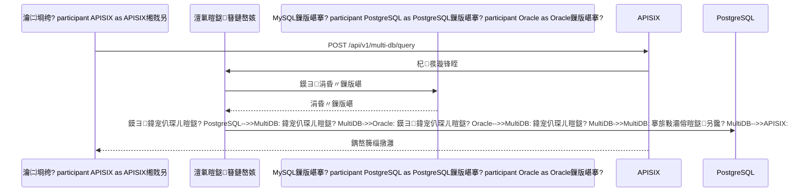

# 鎶€鏈灦鏋勮璁℃枃妗?
## 馃搵 鏂囨。淇℃伅

- **椤圭洰鍚嶇О**锛氫紒涓氱骇AI缁煎悎绠＄悊骞冲彴
- **鏂囨。鐗堟湰**锛歷1.0
- **鍒涘缓鏃ユ湡**锛?026-01-13
- **鏈€鍚庢洿鏂?*锛?026-01-16
- **鏂囨。绫诲瀷**锛氭妧鏈灦鏋勮璁℃枃妗?- **褰撳墠鐘舵€?*锛氬悗绔笟鍔″姛鑳藉紑鍙戝畬鎴愶紙100%锛夛紝鍑嗗寮€濮嬫祴璇曞拰鍓嶇寮€鍙?
---

## 1. 绯荤粺鏋舵瀯璁捐

### 1.1 鏁翠綋鏋舵瀯

鏈郴缁熼噰鐢?*寰湇鍔℃灦鏋?*锛屽皢绯荤粺鎷嗗垎涓哄涓嫭绔嬬殑鏈嶅姟锛屾瘡涓湇鍔¤礋璐ｇ壒瀹氱殑涓氬姟鍔熻兘銆傛湇鍔′箣闂撮€氳繃API杩涜閫氫俊锛屾敮鎸佺嫭绔嬮儴缃层€佺嫭绔嬫墿灞曘€?
### 1.2 绯荤粺鏋舵瀯鍥?
```mermaid
graph TB
    subgraph "瀹㈡埛绔眰"
        Browser[Web娴忚鍣?br/>http://localhost:3000]
    end
    
    subgraph "鍓嶇灞?
        VueApp[Vue 3 鍓嶇搴旂敤<br/>:3000]
    end
    
    subgraph "API缃戝叧灞?
        APISIX[APISIX API缃戝叧<br/>:9080]
    end
    
    subgraph "鍚庣鏈嶅姟灞?
        subgraph "璁よ瘉鍩?
            Auth[璁よ瘉鍩熸湇鍔?br/>:28001]
        end
        
        subgraph "鐢ㄦ埛鍩?
            User[鐢ㄦ埛鍩熸湇鍔?br/>:28002]
        end
        
        subgraph "鏉冮檺鍩?
            Permission[鏉冮檺鍩熸湇鍔?br/>:28003]
        end
        
        subgraph "绯荤粺鍩?
            System[绯荤粺鍩熸湇鍔?br/>:28004]
        end
        
        subgraph "鏀拺鍩?
            Support[鏀拺鍩熸湇鍔?br/>:28005]
        end
        
        subgraph "涓氬姟鍩?
            Business[涓氬姟鍩熸湇鍔?br/>:28006<br/>锛堝伐浣滄祦绠＄悊锛塢
        end
    end
    
    subgraph "鏁版嵁灞?
        MySQL[(MySQL涓绘暟鎹簱<br/>:3306)]
        PostgreSQL[(PostgreSQL<br/>:5432)]
        Oracle[(Oracle<br/>:1521)]
        Redis[(Redis缂撳瓨<br/>:6379)]
        RabbitMQ[RabbitMQ娑堟伅闃熷垪<br/>:5672]
    end
    
    subgraph "鍩虹璁炬柦灞?
        Nacos[Nacos閰嶇疆涓績<br/>:8848]
        Jaeger[Jaeger鍒嗗竷寮忚拷韪?br/>:6831]
        Prometheus[Prometheus鐩戞帶<br/>:9090]
        Grafana[Grafana鍙鍖?br/>:3001]
    end
    
    Browser --> VueApp
    VueApp --> APISIX
    
    APISIX --> Auth
    APISIX --> User
    APISIX --> Permission
    APISIX --> System
    APISIX --> Support
    APISIX --> Business
    
    Auth --> MySQL
    User --> MySQL
    Permission --> MySQL
    System --> MySQL
    Support --> MySQL
    Business --> MySQL
    
    System --> PostgreSQL
    System --> Oracle
    
    Auth --> Redis
    User --> Redis
    Permission --> Redis
    System --> Redis
    Support --> Redis
    Business --> Redis
    
    Auth --> RabbitMQ
    System --> RabbitMQ
    Support --> RabbitMQ
    
    Auth --> Nacos
    User --> Nacos
    Permission --> Nacos
    System --> Nacos
    Support --> Nacos
    Business --> Nacos
    
    Auth --> Jaeger
    User --> Jaeger
    System --> Jaeger
    
    Auth --> Prometheus
    User --> Prometheus
    System --> Prometheus
    
    Prometheus --> Grafana
```

### 1.3 鏋舵瀯鍒嗗眰

| 灞傜骇 | 鑱岃矗 | 鎶€鏈€夊瀷 |
|-----|------|---------|
| **瀹㈡埛绔眰** | 鐢ㄦ埛浜や簰鐣岄潰 | Vue 3 + TypeScript + Element Plus |
| **缃戝叧灞?* | 缁熶竴鍏ュ彛銆侀檺娴併€佽矾鐢?| APISIX + Sentinel |
| **搴旂敤灞?* | 涓氬姟閫昏緫澶勭悊 | FastAPI + Python 3.13 |
| **鏁版嵁灞?* | 鏁版嵁瀛樺偍銆佺紦瀛?| MySQL + PostgreSQL + Oracle + Redis |
| **鍩虹璁炬柦灞?* | 閰嶇疆銆佺洃鎺с€佽拷韪?| Nacos + Prometheus + Jaeger |

---

## 2. 寰湇鍔℃灦鏋勫垝鍒?
### 2.1 寰湇鍔″垝鍒?
鏈郴缁熼噰鐢?*鍓嶅悗绔垎绂绘灦鏋?*锛屽皢绯荤粺鎷嗗垎涓轰互涓嬫湇鍔★細

| 绫诲瀷 | 鏈嶅姟鍚嶇О | 鑱岃矗 | 绔彛 | 鏁版嵁搴?|
|-----|---------|------|------|--------|
| **鍓嶇** | Vue 3鍓嶇搴旂敤 | 鐢ㄦ埛鐣岄潰銆佷氦浜掗€昏緫 | 3000 | - |
| **鍚庣** | 璁よ瘉鍩熸湇鍔?| JWT璁よ瘉銆丄PI Key璁よ瘉銆佹潈闄愭牎楠屻€乀oken绠＄悊 | 8001 | MySQL |
| **鍚庣** | 鐢ㄦ埛鍩熸湇鍔?| 鐢ㄦ埛CRUD銆侀儴闂ㄧ鐞嗐€佺鎴风鐞嗐€佺敤鎴蜂笌閮ㄩ棬/瑙掕壊鍏宠仈 | 8002 | MySQL |
| **鍚庣** | 鏉冮檺鍩熸湇鍔?| 瑙掕壊绠＄悊銆佹潈闄愬垎閰嶃€佽彍鍗曠鐞嗐€佸姩鎬佽彍鍗曞姞杞?| 8003 | MySQL |
| **鍚庣** | 绯荤粺鍩熸湇鍔?| MCP宸ュ叿娉ㄥ唽/璋冪敤銆佸鏁版嵁婧愮鐞嗐€佸瓧鍏哥鐞嗐€佺郴缁熼厤缃?| 8004 | MySQL + PostgreSQL + Oracle |
| **鍚庣** | 鏀拺鍩熸湇鍔?| 鐧诲綍鏃ュ織銆佹搷浣滄棩蹇椼€佺珯鍐呬俊銆侀€氱煡鍏憡 | 8005 | MySQL |
| **鍚庣** | 涓氬姟鍩熸湇鍔?| 宸ヤ綔娴佺鐞嗭紙棰勭疆瀹℃壒妯℃澘銆佸彲瑙嗗寲璁捐鍣ㄣ€佸鎵规祦绋嬮厤缃€佹祦绋嬬洃鎺э級 | 8006 | MySQL |

### 2.2 鍚堝苟璇存槑

**鍘熷璁捐**锛?1涓井鏈嶅姟
**浼樺寲鍚?*锛?涓悗绔湇鍔?+ 1涓墠绔簲鐢?
**鍚堝苟绛栫暐**锛?- 璁よ瘉鎺堟潈鏈嶅姟 鈫?璁よ瘉鍩熸湇鍔?- 鐢ㄦ埛绠＄悊 + 閮ㄩ棬绠＄悊 + 澶氱鎴锋湇鍔?鈫?鐢ㄦ埛鍩熸湇鍔?- 瑙掕壊鏉冮檺 + 鑿滃崟绠＄悊鏈嶅姟 鈫?鏉冮檺鍩熸湇鍔?- MCP宸ュ叿 + 澶氭暟鎹簮 + 瀛楀吀绠＄悊鏈嶅姟 鈫?绯荤粺鍩熸湇鍔?- 鏃ュ織瀹¤ + 閫氱煡鏈嶅姟 鈫?鏀拺鍩熸湇鍔?- 鏂板锛氫笟鍔″煙鏈嶅姟锛堝伐浣滄祦绠＄悊锛?
### 2.3 寰湇鍔℃灦鏋勫浘

```mermaid
graph TB
    subgraph "鍓嶇灞?
        VueApp[Vue 3 鍓嶇搴旂敤<br/>:3000]
    end
    
    subgraph "API缃戝叧灞?
        APISIX[APISIX缃戝叧<br/>:9080]
    end
    
    subgraph "璁よ瘉鍩?
        Auth[璁よ瘉鍩熸湇鍔?br/>:28001]
    end
    
    subgraph "鐢ㄦ埛鍩?
        User[鐢ㄦ埛鍩熸湇鍔?br/>:28002]
    end
    
    subgraph "鏉冮檺鍩?
        Permission[鏉冮檺鍩熸湇鍔?br/>:28003]
    end
    
    subgraph "绯荤粺鍩?
        System[绯荤粺鍩熸湇鍔?br/>:28004]
    end
    
    subgraph "鏀拺鍩?
        Support[鏀拺鍩熸湇鍔?br/>:28005]
    end
    
    subgraph "涓氬姟鍩?
        Business[涓氬姟鍩熸湇鍔?br/>:28006<br/>锛堝伐浣滄祦绠＄悊锛塢
    end
    
    VueApp --> APISIX
    
    APISIX --> Auth
    APISIX --> User
    APISIX --> Permission
    APISIX --> System
    APISIX --> Support
    APISIX --> Business
    
    Auth -.渚濊禆.-> Permission
    User -.渚濊禆.-> Auth
    User -.渚濊禆.-> Permission
    Permission -.渚濊禆.-> User
    System -.渚濊禆.-> Auth
    System -.渚濊禆.-> Permission
    Support -.渚濊禆.-> Auth
    Business -.渚濊禆.-> Auth
    Business -.渚濊禆.-> Permission
    Business -.渚濊禆.-> User
```
    APISIX --> Tenant
    APISIX --> Dept
    APISIX --> Role
    APISIX --> Menu
    APISIX --> MCP
    APISIX --> MultiDB
    APISIX --> Dict
    APISIX --> Log
    APISIX --> Notify
    
    Auth -.渚濊禆.-> Role
    User -.渚濊禆.-> Auth
    User -.渚濊禆.-> Tenant
    User -.渚濊禆.-> Dept
    User -.渚濊禆.-> Role
    Tenant -.渚濊禆.-> Auth
    Dept -.渚濊禆.-> Tenant
    Role -.渚濊禆.-> Menu
    Menu -.渚濊禆.-> Role
    MCP -.渚濊禆.-> Auth
    MCP -.渚濊禆.-> Role
    MCP -.渚濊禆.-> MultiDB
    MultiDB -.渚濊禆.-> Auth
    Log -.渚濊禆.-> Auth
    Notify -.渚濊禆.-> Auth
```

### 2.3 鏈嶅姟闂撮€氫俊

#### 2.3.1 閫氫俊鏂瑰紡姒傝堪

| 閫氫俊鏂瑰紡 | 閫傜敤鍦烘櫙 | 鎶€鏈€夊瀷 | 鐗圭偣 |
|---------|---------|---------|------|
| **鍚屾璋冪敤** | 瀹炴椂鏌ヨ銆佷簨鍔℃搷浣?| HTTP/REST + FastAPI | 瀹炴椂鎬у己銆佺畝鍗曠洿鎺?|
| **寮傛璋冪敤** | 寮傛浠诲姟銆佹秷鎭€氱煡 | RabbitMQ | 瑙ｈ€︺€佸紓姝ュ鐞?|
| **浜嬩欢椹卞姩** | 浜嬩欢鍙戝竷璁㈤槄 | RabbitMQ | 鏉捐€﹀悎銆佸彲鎵╁睍 |

#### 2.3.2 鍚屾閫氫俊锛圚TTP/REST锛?
**閫氫俊娴佺▼**锛?```mermaid
sequenceDiagram
    participant ServiceA as 鏈嶅姟A
    participant APISIX as APISIX缃戝叧
    participant ServiceB as 鏈嶅姟B
    
    ServiceA->>APISIX: HTTP璇锋眰锛堝甫JWT Token锛?    APISIX->>APISIX: 楠岃瘉Token
    APISIX->>APISIX: 璺敱杞彂
    APISIX->>ServiceB: 杞彂璇锋眰
    ServiceB->>ServiceB: 澶勭悊涓氬姟閫昏緫
    ServiceB-->>APISIX: 杩斿洖鍝嶅簲
    APISIX-->>ServiceA: 杩斿洖鍝嶅簲
```

**浣跨敤鍦烘櫙**锛?- 鏈嶅姟A闇€瑕佸疄鏃舵煡璇㈡湇鍔鐨勬暟鎹?- 璺ㄦ湇鍔＄殑浜嬪姟鎿嶄綔
- 闇€瑕佺珛鍗宠繑鍥炵粨鏋滅殑鍦烘櫙

**瀹炵幇鏂瑰紡**锛?```python
# 鏈嶅姟A璋冪敤鏈嶅姟B鐨勭ず渚?import httpx

async def call_service_b(user_id: str):
    """璋冪敤鏈嶅姟B鑾峰彇鐢ㄦ埛淇℃伅"""
    async with httpx.AsyncClient() as client:
        response = await client.get(
            f"http://apisix:9080/api/v1/users/{user_id}",
            headers={"Authorization": f"Bearer {token}"}
        )
        return response.json()
```

#### 2.3.3 寮傛閫氫俊锛圧abbitMQ锛?
**閫氫俊娴佺▼**锛?```mermaid
sequenceDiagram
    participant ServiceA as 鏈嶅姟A
    participant RabbitMQ as RabbitMQ
    participant ServiceB as 鏈嶅姟B
    
    ServiceA->>RabbitMQ: 鍙戦€佹秷鎭埌闃熷垪
    RabbitMQ->>RabbitMQ: 娑堟伅鎸佷箙鍖?    ServiceB->>RabbitMQ: 娑堣垂娑堟伅
    RabbitMQ-->>ServiceB: 鎺ㄩ€佹秷鎭?    ServiceB->>ServiceB: 澶勭悊涓氬姟閫昏緫
    ServiceB->>RabbitMQ: 纭娑堟伅
```

**浣跨敤鍦烘櫙**锛?- 寮傛浠诲姟澶勭悊锛堝鍙戦€侀偖浠躲€佺敓鎴愭姤琛級
- 娑堟伅閫氱煡锛堝绔欏唴淇°€佺煭淇￠€氱煡锛?- 浜嬩欢鍙戝竷璁㈤槄锛堝鐢ㄦ埛娉ㄥ唽鍚庡彂閫佹杩庨偖浠讹級

**瀹炵幇鏂瑰紡**锛?```python
# 鏈嶅姟A鍙戦€佹秷鎭?import pika

def send_notification_message(user_id: str, message: str):
    """鍙戦€侀€氱煡娑堟伅"""
    connection = pika.BlockingConnection(pika.ConnectionParameters('rabbitmq'))
    channel = connection.channel()
    
    channel.queue_declare(queue='notifications', durable=True)
    
    channel.basic_publish(
        exchange='',
        routing_key='notifications',
        body=json.dumps({'user_id': user_id, 'message': message}),
        properties=pika.BasicProperties(delivery_mode=2)
    )
    
    connection.close()

# 鏈嶅姟B娑堣垂娑堟伅
def consume_notification_messages():
    """娑堣垂閫氱煡娑堟伅"""
    connection = pika.BlockingConnection(pika.ConnectionParameters('rabbitmq'))
    channel = connection.channel()
    
    channel.queue_declare(queue='notifications', durable=True)
    
    def callback(ch, method, properties, body):
        message = json.loads(body)
        # 澶勭悊娑堟伅
        send_notification(message['user_id'], message['message'])
        ch.basic_ack(delivery_tag=method.delivery_tag)
    
    channel.basic_consume(queue='notifications', on_message_callback=callback)
    channel.start_consuming()
```

#### 2.3.4 鏈嶅姟鍙戠幇锛圢acos锛?
**鏈嶅姟娉ㄥ唽娴佺▼**锛?```mermaid
sequenceDiagram
    participant Service as 寰湇鍔?    participant Nacos as Nacos鏈嶅姟绔?    participant Client as 鏈嶅姟娑堣垂鑰?    
    Service->>Nacos: 鏈嶅姟鍚姩锛屾敞鍐屾湇鍔?    Nacos-->>Service: 娉ㄥ唽鎴愬姛
    Client->>Nacos: 璁㈤槄鏈嶅姟鍒楄〃
    Nacos-->>Client: 杩斿洖鏈嶅姟瀹炰緥鍒楄〃
    Client->>Service: 璋冪敤鏈嶅姟
    Service->>Nacos: 蹇冭烦妫€娴?    Nacos-->>Service: 蹇冭烦纭
```

**浣跨敤鍦烘櫙**锛?- 鏈嶅姟鍚姩鏃惰嚜鍔ㄦ敞鍐屽埌Nacos
- 鏈嶅姟娑堣垂鑰呬粠Nacos鑾峰彇鏈嶅姟瀹炰緥鍒楄〃
- 鏈嶅姟鍋ュ悍妫€鏌ュ拰鏁呴殰杞Щ

**瀹炵幇鏂瑰紡**锛?```python
# 鏈嶅姟娉ㄥ唽
from nacos import NacosClient

nacos_client = NacosClient('nacos-server:8848')

def register_service(service_name: str, ip: str, port: int):
    """娉ㄥ唽鏈嶅姟鍒癗acos"""
    nacos_client.add_naming_instance(
        service_name=service_name,
        ip=ip,
        port=port,
        cluster_name='DEFAULT',
        weight=1.0,
        ephemeral=True
    )

# 鏈嶅姟鍙戠幇
def discover_service(service_name: str):
    """浠嶯acos鑾峰彇鏈嶅姟瀹炰緥"""
    instances = nacos_client.list_naming_instance(service_name)
    if instances['hosts']:
        # 璐熻浇鍧囪　閫夋嫨涓€涓疄渚?        instance = random.choice(instances['hosts'])
        return f"http://{instance['ip']}:{instance['port']}"
    return None
```

#### 2.3.5 閫氫俊鏈€浣冲疄璺?
**鍚屾閫氫俊鏈€浣冲疄璺?*锛?- 鉁?浣跨敤HTTP/REST鍗忚锛岄€氳繃APISIX缃戝叧璺敱
- 鉁?娣诲姞JWT Token杩涜璁よ瘉
- 鉁?璁剧疆鍚堢悊鐨勮秴鏃舵椂闂达紙榛樿30绉掞級
- 鉁?瀹炵幇閲嶈瘯鏈哄埗锛堟渶澶?娆★級
- 鉁?娣诲姞鐔旀柇闄嶇骇绛栫暐

**寮傛閫氫俊鏈€浣冲疄璺?*锛?- 鉁?浣跨敤RabbitMQ娑堟伅闃熷垪
- 鉁?娑堟伅鎸佷箙鍖栵紝闃叉涓㈠け
- 鉁?鎵嬪姩纭娑堟伅锛岀‘淇濆鐞嗘垚鍔?- 鉁?瀹炵幇姝讳俊闃熷垪锛屽鐞嗗け璐ユ秷鎭?- 鉁?鐩戞帶闃熷垪绉帇鎯呭喌

**鏈嶅姟鍙戠幇鏈€浣冲疄璺?*锛?- 鉁?鏈嶅姟鍚姩鏃惰嚜鍔ㄦ敞鍐屽埌Nacos
- 鉁?瀹氭湡鍙戦€佸績璺筹紙榛樿5绉掞級
- 鉁?瀹炵幇鍋ュ悍妫€鏌?- 鉁?瀹炵幇璐熻浇鍧囪　绛栫暐
- 鉁?瀹炵幇鏁呴殰鑷姩杞Щ

### 2.4 鍒嗗竷寮忎簨鍔?
#### 2.4.1 鍒嗗竷寮忎簨鍔℃杩?
寰湇鍔℃灦鏋勪笅锛岃法鏈嶅姟鐨勪簨鍔″鐞嗘槸涓€涓噸瑕佹寫鎴樸€傛湰绯荤粺閲囩敤**Saga妯″紡**浣滀负鍒嗗竷寮忎簨鍔¤В鍐虫柟妗堛€?
**涓轰粈涔堥€夋嫨Saga锛?*
- 鉁?涓嶉渶瑕侀澶栭儴缃蹭笓闂ㄧ殑Saga鏈嶅姟鍣?- 鉁?鍙渶瑕丳ython浠ｇ爜瀹炵幇锛屾槗浜庣悊瑙ｅ拰缁存姢
- 鉁?椤圭洰宸叉湁RabbitMQ鍜孧ySQL锛屽彲浠ョ洿鎺ヤ娇鐢?- 鉁?鏀寔闀夸簨鍔★紝閫傚悎澶嶆潅鐨勪笟鍔℃祦绋?- 鉁?瀹炵幇鐏垫椿锛屽彲浠ュ畬鍏ㄦ帶鍒朵笟鍔￠€昏緫

#### 2.4.2 Saga妯″紡锛堢紪鎺掑紡锛?
**鏋舵瀯鍥?*锛?```mermaid
sequenceDiagram
    participant Client as 瀹㈡埛绔?    participant Saga as Saga鍗忚皟鍣?br/>(Python浠ｇ爜)
    participant ServiceA as 鏈嶅姟A
    participant ServiceB as 鏈嶅姟B
    participant ServiceC as 鏈嶅姟C
    participant DB as MySQL鏁版嵁搴?    
    Client->>Saga: 鍙戣捣浜嬪姟璇锋眰
    Saga->>DB: 璁板綍Saga寮€濮?    Saga->>ServiceA: 鎵ц姝ラ1
    ServiceA->>DB: 涓氬姟鎿嶄綔
    ServiceA-->>Saga: 鎴愬姛
    Saga->>DB: 鏇存柊杩涘害
    Saga->>ServiceB: 鎵ц姝ラ2
    ServiceB->>DB: 涓氬姟鎿嶄綔
    ServiceB-->>Saga: 鎴愬姛
    Saga->>DB: 鏇存柊杩涘害
    Saga->>ServiceC: 鎵ц姝ラ3
    ServiceC->>DB: 涓氬姟鎿嶄綔
    ServiceC-->>Saga: 澶辫触
    Saga->>ServiceB: 琛ュ伩姝ラ2
    ServiceB->>DB: 琛ュ伩鎿嶄綔
    ServiceB-->>Saga: 琛ュ伩鎴愬姛
    Saga->>ServiceA: 琛ュ伩姝ラ1
    ServiceA->>DB: 琛ュ伩鎿嶄綔
    ServiceA-->>Saga: 琛ュ伩鎴愬姛
    Saga->>DB: 璁板綍澶辫触
    Saga-->>Client: 浜嬪姟澶辫触锛屽凡鍥炴粴
```

**瀹炵幇鏂瑰紡**锛?
**1. Saga鍗忚皟鍣ㄧ被**锛?```python
# app/services/saga.py
from typing import List, Callable, Any
from loguru import logger

class SagaOrchestrator:
    """Saga鍗忚皟鍣?- 缂栨帓寮忓疄鐜?""
    
    def __init__(self, db_session):
        self.db = db_session
        self.steps: List[Callable] = []
        self.compensations: List[Callable] = []
    
    def add_step(self, action: Callable, compensation: Callable):
        """娣诲姞涓氬姟姝ラ鍜岃ˉ鍋挎搷浣?        
        Args:
            action: 涓氬姟鎿嶄綔鍑芥暟
            compensation: 琛ュ伩鎿嶄綔鍑芥暟
        """
        self.steps.append(action)
        self.compensations.append(compensation)
    
    async def execute(self, saga_id: str):
        """鎵цSaga浜嬪姟
        
        Args:
            saga_id: Saga浜嬪姟ID
            
        Returns:
            bool: 浜嬪姟鏄惁鎴愬姛
            
        Raises:
            Exception: 浜嬪姟鎵ц澶辫触鏃舵姏鍑哄紓甯?        """
        # 璁板綍Saga寮€濮?        await self.db.execute(
            "INSERT INTO saga_logs (id, status, steps_total, steps_completed, created_at) VALUES (?, ?, ?, ?, NOW())",
            (saga_id, 'running', len(self.steps), 0)
        )
        
        executed_steps: List[dict] = []
        
        try:
            # 姝ｅ悜鎵ц鎵€鏈夋楠?            for i, step in enumerate(self.steps):
                logger.info(f"鎵ц姝ラ {i + 1}/{len(self.steps)}")
                
                result = await step()
                executed_steps.append({
                    'step_index': i,
                    'result': result
                })
                
                # 璁板綍姝ラ瀹屾垚
                await self.db.execute(
                    "UPDATE saga_logs SET steps_completed = ? WHERE id = ?",
                    (i + 1, saga_id)
                )
            
            # 鏍囪鎴愬姛
            await self.db.execute(
                "UPDATE saga_logs SET status = 'completed', completed_at = NOW() WHERE id = ?",
                (saga_id,)
            )
            
            logger.info(f"Saga浜嬪姟 {saga_id} 鎵ц鎴愬姛")
            return True
            
        except Exception as e:
            logger.error(f"Saga浜嬪姟 {saga_id} 鎵ц澶辫触: {str(e)}")
            
            # 鎵ц琛ュ伩鎿嶄綔锛堝弽鍚戞墽琛岋級
            for i in range(len(executed_steps) - 1, -1, -1):
                try:
                    step_info = executed_steps[i]
                    logger.info(f"鎵ц琛ュ伩姝ラ {step_info['step_index'] + 1}")
                    
                    await self.compensations[i](step_info['result'])
                    
                except Exception as comp_error:
                    logger.error(f"琛ュ伩鎿嶄綔澶辫触: {comp_error}")
                    # 琛ュ伩澶辫触锛岃褰曚絾缁х画鎵ц鍏朵粬琛ュ伩
                    continue
            
            # 鏍囪澶辫触
            await self.db.execute(
                "UPDATE saga_logs SET status = 'failed', error = ?, completed_at = NOW() WHERE id = ?",
                (str(e), saga_id)
            )
            
            raise e
```

**2. 浣跨敤绀轰緥**锛?```python
# app/services/user_workflow_service.py
from app.services.saga import SagaOrchestrator

async def create_user_with_workflow(user_data: dict):
    """鍒涘缓鐢ㄦ埛骞跺垵濮嬪寲宸ヤ綔娴?    
    杩欐槸涓€涓法鏈嶅姟鐨勪簨鍔★紝娑夊強鐢ㄦ埛鍩熸湇鍔″拰涓氬姟鍩熸湇鍔?    """
    saga_id = generate_uuid()
    saga = SagaOrchestrator(db_session)
    
    # 姝ラ1锛氬垱寤虹敤鎴凤紙鐢ㄦ埛鍩熸湇鍔★級
    def create_user():
        return user_service.create(user_data)
    
    def compensate_create_user(user):
        return user_service.delete(user['id'])
    
    saga.add_step(create_user, compensate_create_user)
    
    # 姝ラ2锛氬垎閰嶈鑹诧紙鏉冮檺鍩熸湇鍔★級
    def assign_role(user):
        return role_service.assign(user['id'], user['role_id'])
    
    def compensate_assign_role(user):
        return role_service.revoke(user['id'], user['role_id'])
    
    saga.add_step(assign_role, compensate_assign_role)
    
    # 姝ラ3锛氬垵濮嬪寲宸ヤ綔娴侊紙涓氬姟鍩熸湇鍔★級
    def init_workflow(user):
        return workflow_service.init_default_workflow(user['id'])
    
    def compensate_init_workflow(user):
        return workflow_service.delete_user_workflows(user['id'])
    
    saga.add_step(init_workflow, compensate_init_workflow)
    
    # 鎵цSaga
    try:
        await saga.execute(saga_id)
        logger.info(f"鐢ㄦ埛鍒涘缓鍜屽伐浣滄祦鍒濆鍖栨垚鍔? {saga_id}")
        return True
    except Exception as e:
        logger.error(f"鐢ㄦ埛鍒涘缓鍜屽伐浣滄祦鍒濆鍖栧け璐? {e}")
        return False
```

**3. 鏁版嵁搴撹〃璁捐**锛?```sql
-- Saga鏃ュ織琛?CREATE TABLE saga_logs (
    id VARCHAR(50) PRIMARY KEY,
    status VARCHAR(20) NOT NULL COMMENT '鐘舵€侊紙running/completed/failed锛?,
    steps_total INT NOT NULL COMMENT '鎬绘楠ゆ暟',
    steps_completed INT DEFAULT 0 COMMENT '宸插畬鎴愭楠ゆ暟',
    error TEXT COMMENT '閿欒淇℃伅',
    created_at DATETIME DEFAULT CURRENT_TIMESTAMP,
    completed_at DATETIME,
    INDEX idx_status (status),
    INDEX idx_created_at (created_at)
);
```

#### 2.4.3 鍏朵粬鍒嗗竷寮忎簨鍔℃柟妗?
铏界劧鏈郴缁熼噰鐢⊿aga妯″紡锛屼絾涔熶簡瑙ｅ叾浠栨柟妗堬細

**1. TCC妯″紡锛圱ry-Confirm-Cancel锛?*锛?- **鐗圭偣**锛氫笁闃舵鎻愪氦锛屽己涓€鑷存€?- **浼樼偣**锛氫竴鑷存€ч珮
- **缂虹偣**锛氬疄鐜板鏉傦紝姣忎釜鏈嶅姟闇€瑕佸疄鐜颁笁涓帴鍙?- **閫傜敤鍦烘櫙**锛氬涓€鑷存€ц姹傛瀬楂樼殑鍦烘櫙

**2. 鏈湴娑堟伅琛?*锛?- **鐗圭偣**锛氬熀浜庢秷鎭槦鍒楃殑鏈€缁堜竴鑷存€?- **浼樼偣**锛氬疄鐜扮畝鍗?- **缂虹偣**锛氬彧鑳戒繚璇佹渶缁堜竴鑷存€?- **閫傜敤鍦烘櫙**锛氬紓姝ュ満鏅紝鍏佽鐭殏涓嶄竴鑷?
#### 2.4.4 鍒嗗竷寮忎簨鍔℃渶浣冲疄璺?
**Saga妯″紡鏈€浣冲疄璺?*锛?- 鉁?姣忎釜涓氬姟姝ラ閮借鏈夊搴旂殑琛ュ伩鎿嶄綔
- 鉁?琛ュ伩鎿嶄綔瑕佷繚璇佸箓绛夋€э紙澶氭鎵ц缁撴灉鐩稿悓锛?- 鉁?璁板綍Saga鎵ц鏃ュ織锛屼究浜庨棶棰樻帓鏌?- 鉁?瀹炵幇瓒呮椂鏈哄埗锛岄槻姝㈤暱鏃堕棿闃诲
- 鉁?瀹炵幇閲嶈瘯鏈哄埗锛屽鐞嗕复鏃舵€ф晠闅?- 鉁?琛ュ伩澶辫触鏃惰褰曟棩蹇楋紝浜哄伐浠嬪叆澶勭悊

**浜嬪姟璁捐鍘熷垯**锛?- 鉁?灏介噺鍑忓皯璺ㄦ湇鍔′簨鍔★紝鎻愰珮鍐呰仛鎬?- 鉁?闀夸簨鍔℃媶鍒嗕负澶氫釜鐭簨鍔?- 鉁?浼樺厛浣跨敤鏈€缁堜竴鑷存€э紝閬垮厤寮轰竴鑷存€?- 鉁?鍚堢悊浣跨敤琛ュ伩鏈哄埗锛屼繚璇佹暟鎹竴鑷存€?
---

## 2.5 浼佷笟绾ч」鐩粨鏋?
### 2.5.1 鏁翠綋鐩綍缁撴瀯

鏈郴缁熼噰鐢?*浼佷笟绾astAPI寰湇鍔℃鏋?*锛屾瘡涓井鏈嶅姟閮介伒寰粺涓€鐨勫垎灞傛灦鏋勶紝纭繚浠ｇ爜鐨勫彲缁存姢鎬с€佸彲鎵╁睍鎬у拰鍙祴璇曟€с€?
```
backend/
鈹溾攢鈹€ common/                          # 鍏变韩浠ｇ爜搴擄紙鎵€鏈夋湇鍔″叡鐢級
鈹?  鈹溾攢鈹€ cache/                       # 缂撳瓨妯″潡
鈹?  鈹?  鈹溾攢鈹€ local.py                 # 鏈湴缂撳瓨瀹炵幇
鈹?  鈹?  鈹斺攢鈹€ redis.py                 # Redis缂撳瓨瀹炵幇
鈹?  鈹溾攢鈹€ config/                      # 閰嶇疆妯″潡
鈹?  鈹?  鈹溾攢鈹€ constants.py             # 甯搁噺瀹氫箟
鈹?  鈹?  鈹斺攢鈹€ settings.py              # 閰嶇疆绫?鈹?  鈹溾攢鈹€ database/                    # 鏁版嵁搴撴ā鍧?鈹?  鈹?  鈹溾攢鈹€ base.py                  # 鍩虹妯″瀷绫?鈹?  鈹?  鈹溾攢鈹€ connection.py            # 澶氭暟鎹簮绠＄悊鍣?鈹?  鈹?  鈹溾攢鈹€ pandas_helper.py         # Pandas鏁版嵁鍒嗘瀽鍔╂墜
鈹?  鈹?  鈹溾攢鈹€ session.py               # 鏁版嵁搴撲細璇濈鐞?鈹?  鈹?  鈹溾攢鈹€ transaction.py           # 璺ㄦ暟鎹簮浜嬪姟绠＄悊
鈹?  鈹?  鈹斺攢鈹€ models/                  # 鍏变韩鏁版嵁妯″瀷
鈹?  鈹?      鈹溾攢鈹€ permission.py        # 鏉冮檺鐩稿叧妯″瀷
鈹?  鈹?      鈹溾攢鈹€ system.py            # 绯荤粺鐩稿叧妯″瀷
鈹?  鈹?      鈹溾攢鈹€ tenant.py            # 绉熸埛鐩稿叧妯″瀷
鈹?  鈹?      鈹溾攢鈹€ todo.py              # 寰呭姙浠诲姟妯″瀷
鈹?  鈹?      鈹溾攢鈹€ user.py              # 鐢ㄦ埛鐩稿叧妯″瀷
鈹?  鈹?      鈹斺攢鈹€ workflow.py          # 宸ヤ綔娴佺浉鍏虫ā鍨?鈹?  鈹溾攢鈹€ decorators/                  # 瑁呴グ鍣?鈹?  鈹?  鈹溾攢鈹€ cache.py                 # 缂撳瓨瑁呴グ鍣?鈹?  鈹?  鈹斺攢鈹€ permission.py            # 鏉冮檺瑁呴グ鍣?鈹?  鈹溾攢鈹€ exceptions/                  # 寮傚父绫?鈹?  鈹?  鈹斺攢鈹€ base.py                  # 鍩虹寮傚父绫?鈹?  鈹溾攢鈹€ middleware/                  # 涓棿浠?鈹?  鈹?  鈹溾攢鈹€ auth.py                  # 璁よ瘉涓棿浠?鈹?  鈹?  鈹溾攢鈹€ exception.py             # 寮傚父澶勭悊涓棿浠?鈹?  鈹?  鈹斺攢鈹€ logging.py               # 鏃ュ織涓棿浠?鈹?  鈹溾攢鈹€ responses/                   # 鍝嶅簲妯″潡
鈹?  鈹?  鈹斺攢鈹€ base.py                  # 缁熶竴鍝嶅簲鏍煎紡
鈹?  鈹溾攢鈹€ security/                    # 瀹夊叏妯″潡
鈹?  鈹?  鈹溾攢鈹€ api_key.py               # API Key绠＄悊
鈹?  鈹?  鈹溾攢鈹€ jwt.py                   # JWT宸ュ叿
鈹?  鈹?  鈹斺攢鈹€ password.py              # 瀵嗙爜鍔犲瘑
鈹?  鈹斺攢鈹€ utils/                       # 宸ュ叿妯″潡
鈹?      鈹溾攢鈹€ datetime.py              # 鏃ユ湡鏃堕棿宸ュ叿
鈹?      鈹溾攢鈹€ helpers.py               # 杈呭姪鍑芥暟
鈹?      鈹斺攢鈹€ validators.py            # 楠岃瘉鍣?鈹?鈹溾攢鈹€ services/                        # 寰湇鍔＄洰褰?鈹?  鈹溾攢鈹€ auth-service/                # 璁よ瘉鍩熸湇鍔★紙8001锛?鈹?  鈹?  鈹溾攢鈹€ app/                     # 搴旂敤涓荤洰褰?鈹?  鈹?  鈹?  鈹溾攢鈹€ api/                 # API璺敱灞?鈹?  鈹?  鈹?  鈹?  鈹斺攢鈹€ v1/              # API鐗堟湰1
鈹?  鈹?  鈹?  鈹?      鈹斺攢鈹€ auth.py      # 璁よ瘉鐩稿叧API
鈹?  鈹?  鈹?  鈹溾攢鈹€ core/                # 鏍稿績閰嶇疆
鈹?  鈹?  鈹?  鈹?  鈹溾攢鈹€ config.py        # 鏈嶅姟閰嶇疆
鈹?  鈹?  鈹?  鈹?  鈹溾攢鈹€ deps.py          # 渚濊禆娉ㄥ叆
鈹?  鈹?  鈹?  鈹?  鈹斺攢鈹€ security.py      # 瀹夊叏閰嶇疆
鈹?  鈹?  鈹?  鈹溾攢鈹€ models/              # 鏁版嵁妯″瀷灞傦紙SQLAlchemy ORM锛?鈹?  鈹?  鈹?  鈹?  鈹溾攢鈹€ __init__.py
鈹?  鈹?  鈹?  鈹?  鈹溾攢鈹€ user.py          # 鐢ㄦ埛妯″瀷
鈹?  鈹?  鈹?  鈹?  鈹斺攢鈹€ token.py         # Token妯″瀷
鈹?  鈹?  鈹?  鈹溾攢鈹€ repositories/        # 鏁版嵁璁块棶灞?鈹?  鈹?  鈹?  鈹?  鈹溾攢鈹€ __init__.py
鈹?  鈹?  鈹?  鈹?  鈹溾攢鈹€ user_repository.py       # 鐢ㄦ埛鏁版嵁璁块棶
鈹?  鈹?  鈹?  鈹?  鈹斺攢鈹€ token_repository.py      # Token鏁版嵁璁块棶
鈹?  鈹?  鈹?  鈹溾攢鈹€ schemas/             # Pydantic妯″瀷锛堣姹?鍝嶅簲楠岃瘉锛?鈹?  鈹?  鈹?  鈹?  鈹溾攢鈹€ __init__.py
鈹?  鈹?  鈹?  鈹?  鈹溾攢鈹€ auth.py          # 璁よ瘉Schema
鈹?  鈹?  鈹?  鈹?  鈹溾攢鈹€ user.py          # 鐢ㄦ埛Schema
鈹?  鈹?  鈹?  鈹?  鈹斺攢鈹€ token.py         # Token Schema
鈹?  鈹?  鈹?  鈹溾攢鈹€ services/            # 涓氬姟閫昏緫灞?鈹?  鈹?  鈹?  鈹?  鈹溾攢鈹€ __init__.py
鈹?  鈹?  鈹?  鈹?  鈹溾攢鈹€ auth_service.py  # 璁よ瘉鏈嶅姟
鈹?  鈹?  鈹?  鈹?  鈹斺攢鈹€ token_service.py # Token绠＄悊鏈嶅姟
鈹?  鈹?  鈹?  鈹斺攢鈹€ main.py              # FastAPI搴旂敤鍏ュ彛
鈹?  鈹?  鈹溾攢鈹€ alembic/                 # 鏁版嵁搴撹縼绉?鈹?  鈹?  鈹?  鈹溾攢鈹€ env.py               # 杩佺Щ鐜閰嶇疆
鈹?  鈹?  鈹?  鈹溾攢鈹€ script.py.mako       # 杩佺Щ妯℃澘
鈹?  鈹?  鈹?  鈹斺攢鈹€ versions/            # 杩佺Щ鐗堟湰鏂囦欢
鈹?  鈹?  鈹溾攢鈹€ scripts/                 # 宸ュ叿鑴氭湰
鈹?  鈹?  鈹溾攢鈹€ tests/                   # 娴嬭瘯鐩綍
鈹?  鈹?  鈹?  鈹溾攢鈹€ unit/                # 鍗曞厓娴嬭瘯
鈹?  鈹?  鈹?  鈹斺攢鈹€ integration/         # 闆嗘垚娴嬭瘯
鈹?  鈹?  鈹溾攢鈹€ .env.development         # 寮€鍙戠幆澧冮厤缃?鈹?  鈹?  鈹溾攢鈹€ .env.production          # 鐢熶骇鐜閰嶇疆
鈹?  鈹?  鈹溾攢鈹€ docker-compose.yml       # Docker缂栨帓
鈹?  鈹?  鈹溾攢鈹€ Dockerfile               # Docker闀滃儚鏋勫缓
鈹?  鈹?  鈹溾攢鈹€ requirements.txt         # Python渚濊禆
鈹?  鈹?  鈹斺攢鈹€ README.md                # 鏈嶅姟鏂囨。
鈹?  鈹?鈹?  鈹溾攢鈹€ user-service/                # 鐢ㄦ埛鍩熸湇鍔★紙8002锛?鈹?  鈹?  鈹溾攢鈹€ app/
鈹?  鈹?  鈹?  鈹溾攢鈹€ api/v1/              # API璺敱
鈹?  鈹?  鈹?  鈹?  鈹溾攢鈹€ users.py         # 鐢ㄦ埛API
鈹?  鈹?  鈹?  鈹?  鈹溾攢鈹€ departments.py   # 閮ㄩ棬API
鈹?  鈹?  鈹?  鈹?  鈹斺攢鈹€ tenants.py       # 绉熸埛API
鈹?  鈹?  鈹?  鈹溾攢鈹€ core/                # 鏍稿績閰嶇疆
鈹?  鈹?  鈹?  鈹溾攢鈹€ models/              # 鏁版嵁妯″瀷
鈹?  鈹?  鈹?  鈹?  鈹溾攢鈹€ user.py
鈹?  鈹?  鈹?  鈹?  鈹溾攢鈹€ department.py
鈹?  鈹?  鈹?  鈹?  鈹斺攢鈹€ tenant.py
鈹?  鈹?  鈹?  鈹溾攢鈹€ repositories/        # 鏁版嵁璁块棶灞?鈹?  鈹?  鈹?  鈹?  鈹溾攢鈹€ user_repository.py
鈹?  鈹?  鈹?  鈹?  鈹溾攢鈹€ department_repository.py
鈹?  鈹?  鈹?  鈹?  鈹斺攢鈹€ tenant_repository.py
鈹?  鈹?  鈹?  鈹溾攢鈹€ schemas/             # Pydantic妯″瀷
鈹?  鈹?  鈹?  鈹溾攢鈹€ services/            # 涓氬姟閫昏緫灞?鈹?  鈹?  鈹?  鈹?  鈹溾攢鈹€ user_service.py
鈹?  鈹?  鈹?  鈹?  鈹溾攢鈹€ department_service.py
鈹?  鈹?  鈹?  鈹?  鈹斺攢鈹€ tenant_service.py
鈹?  鈹?  鈹?  鈹斺攢鈹€ main.py
鈹?  鈹?  鈹溾攢鈹€ alembic/
鈹?  鈹?  鈹溾攢鈹€ tests/
鈹?  鈹?  鈹斺攢鈹€ ...锛堝叾浠栭厤缃枃浠跺悓auth-service锛?鈹?  鈹?鈹?  鈹溾攢鈹€ permission-service/          # 鏉冮檺鍩熸湇鍔★紙8003锛?鈹?  鈹?  鈹溾攢鈹€ app/
鈹?  鈹?  鈹?  鈹溾攢鈹€ api/v1/              # API璺敱
鈹?  鈹?  鈹?  鈹?  鈹溾攢鈹€ roles.py         # 瑙掕壊API
鈹?  鈹?  鈹?  鈹?  鈹溾攢鈹€ permissions.py   # 鏉冮檺API
鈹?  鈹?  鈹?  鈹?  鈹斺攢鈹€ menus.py         # 鑿滃崟API
鈹?  鈹?  鈹?  鈹溾攢鈹€ core/
鈹?  鈹?  鈹?  鈹溾攢鈹€ models/              # 鏁版嵁妯″瀷
鈹?  鈹?  鈹?  鈹?  鈹溾攢鈹€ role.py
鈹?  鈹?  鈹?  鈹?  鈹溾攢鈹€ permission.py
鈹?  鈹?  鈹?  鈹?  鈹斺攢鈹€ menu.py
鈹?  鈹?  鈹?  鈹溾攢鈹€ repositories/        # 鏁版嵁璁块棶灞?鈹?  鈹?  鈹?  鈹?  鈹溾攢鈹€ role_repository.py
鈹?  鈹?  鈹?  鈹?  鈹溾攢鈹€ permission_repository.py
鈹?  鈹?  鈹?  鈹?  鈹斺攢鈹€ menu_repository.py
鈹?  鈹?  鈹?  鈹溾攢鈹€ schemas/
鈹?  鈹?  鈹?  鈹溾攢鈹€ services/            # 涓氬姟閫昏緫灞?鈹?  鈹?  鈹?  鈹?  鈹溾攢鈹€ role_service.py
鈹?  鈹?  鈹?  鈹?  鈹溾攢鈹€ permission_service.py
鈹?  鈹?  鈹?  鈹?  鈹斺攢鈹€ menu_service.py
鈹?  鈹?  鈹?  鈹斺攢鈹€ main.py
鈹?  鈹?  鈹溾攢鈹€ alembic/
鈹?  鈹?  鈹溾攢鈹€ tests/
鈹?  鈹?  鈹斺攢鈹€ ...锛堝叾浠栭厤缃枃浠跺悓auth-service锛?鈹?  鈹?鈹?  鈹溾攢鈹€ system-service/              # 绯荤粺鍩熸湇鍔★紙8004锛?鈹?  鈹?  鈹溾攢鈹€ app/
鈹?  鈹?  鈹?  鈹溾攢鈹€ api/v1/              # API璺敱
鈹?  鈹?  鈹?  鈹?  鈹溾攢鈹€ mcp_tools.py     # MCP宸ュ叿API
鈹?  鈹?  鈹?  鈹?  鈹溾攢鈹€ datasources.py   # 鏁版嵁婧怉PI
鈹?  鈹?  鈹?  鈹?  鈹斺攢鈹€ dicts.py         # 瀛楀吀API
鈹?  鈹?  鈹?  鈹溾攢鈹€ core/
鈹?  鈹?  鈹?  鈹溾攢鈹€ models/              # 鏁版嵁妯″瀷
鈹?  鈹?  鈹?  鈹?  鈹溾攢鈹€ mcp_tool.py
鈹?  鈹?  鈹?  鈹?  鈹溾攢鈹€ datasource.py
鈹?  鈹?  鈹?  鈹?  鈹斺攢鈹€ dict.py
鈹?  鈹?  鈹?  鈹溾攢鈹€ repositories/        # 鏁版嵁璁块棶灞?鈹?  鈹?  鈹?  鈹?  鈹溾攢鈹€ mcp_tool_repository.py
鈹?  鈹?  鈹?  鈹?  鈹溾攢鈹€ datasource_repository.py
鈹?  鈹?  鈹?  鈹?  鈹斺攢鈹€ dict_repository.py
鈹?  鈹?  鈹?  鈹溾攢鈹€ schemas/
鈹?  鈹?  鈹?  鈹溾攢鈹€ services/            # 涓氬姟閫昏緫灞?鈹?  鈹?  鈹?  鈹?  鈹溾攢鈹€ mcp_tool_service.py
鈹?  鈹?  鈹?  鈹?  鈹溾攢鈹€ datasource_service.py
鈹?  鈹?  鈹?  鈹?  鈹斺攢鈹€ dict_service.py
鈹?  鈹?  鈹?  鈹斺攢鈹€ main.py
鈹?  鈹?  鈹溾攢鈹€ alembic/
鈹?  鈹?  鈹溾攢鈹€ tests/
鈹?  鈹?  鈹斺攢鈹€ ...锛堝叾浠栭厤缃枃浠跺悓auth-service锛?鈹?  鈹?鈹?  鈹溾攢鈹€ support-service/             # 鏀拺鍩熸湇鍔★紙8005锛?鈹?  鈹?  鈹溾攢鈹€ app/
鈹?  鈹?  鈹?  鈹溾攢鈹€ api/v1/              # API璺敱
鈹?  鈹?  鈹?  鈹?  鈹溾攢鈹€ logs.py          # 鏃ュ織API
鈹?  鈹?  鈹?  鈹?  鈹溾攢鈹€ notifications.py # 閫氱煡API
鈹?  鈹?  鈹?  鈹?  鈹斺攢鈹€ todos.py         # 寰呭姙浠诲姟API
鈹?  鈹?  鈹?  鈹溾攢鈹€ core/
鈹?  鈹?  鈹?  鈹溾攢鈹€ models/              # 鏁版嵁妯″瀷
鈹?  鈹?  鈹?  鈹?  鈹溾攢鈹€ log.py
鈹?  鈹?  鈹?  鈹?  鈹溾攢鈹€ notification.py
鈹?  鈹?  鈹?  鈹?  鈹斺攢鈹€ todo.py
鈹?  鈹?  鈹?  鈹溾攢鈹€ repositories/        # 鏁版嵁璁块棶灞?鈹?  鈹?  鈹?  鈹?  鈹溾攢鈹€ log_repository.py
鈹?  鈹?  鈹?  鈹?  鈹溾攢鈹€ notification_repository.py
鈹?  鈹?  鈹?  鈹?  鈹斺攢鈹€ todo_repository.py
鈹?  鈹?  鈹?  鈹溾攢鈹€ schemas/
鈹?  鈹?  鈹?  鈹溾攢鈹€ services/            # 涓氬姟閫昏緫灞?鈹?  鈹?  鈹?  鈹?  鈹溾攢鈹€ log_service.py
鈹?  鈹?  鈹?  鈹?  鈹溾攢鈹€ notification_service.py
鈹?  鈹?  鈹?  鈹?  鈹斺攢鈹€ todo_service.py
鈹?  鈹?  鈹?  鈹斺攢鈹€ main.py
鈹?  鈹?  鈹溾攢鈹€ alembic/
鈹?  鈹?  鈹溾攢鈹€ tests/
鈹?  鈹?  鈹斺攢鈹€ ...锛堝叾浠栭厤缃枃浠跺悓auth-service锛?鈹?  鈹?鈹?  鈹斺攢鈹€ business-service/            # 涓氬姟鍩熸湇鍔★紙8006锛?鈹?      鈹溾攢鈹€ app/
鈹?      鈹?  鈹溾攢鈹€ api/v1/              # API璺敱
鈹?      鈹?  鈹?  鈹溾攢鈹€ workflows.py             # 宸ヤ綔娴丄PI
鈹?      鈹?  鈹?  鈹溾攢鈹€ workflow_templates.py    # 宸ヤ綔娴佹ā鏉緼PI
鈹?      鈹?  鈹?  鈹斺攢鈹€ workflow_tasks.py        # 宸ヤ綔娴佷换鍔PI
鈹?      鈹?  鈹溾攢鈹€ core/
鈹?      鈹?  鈹溾攢鈹€ models/              # 鏁版嵁妯″瀷
鈹?      鈹?  鈹?  鈹溾攢鈹€ workflow.py
鈹?      鈹?  鈹?  鈹溾攢鈹€ workflow_template.py
鈹?      鈹?  鈹?  鈹斺攢鈹€ workflow_task.py
鈹?      鈹?  鈹溾攢鈹€ repositories/        # 鏁版嵁璁块棶灞?鈹?      鈹?  鈹?  鈹溾攢鈹€ workflow_repository.py
鈹?      鈹?  鈹?  鈹溾攢鈹€ workflow_template_repository.py
鈹?      鈹?  鈹?  鈹斺攢鈹€ workflow_task_repository.py
鈹?      鈹?  鈹溾攢鈹€ schemas/
鈹?      鈹?  鈹溾攢鈹€ services/            # 涓氬姟閫昏緫灞?鈹?      鈹?  鈹?  鈹溾攢鈹€ workflow_service.py
鈹?      鈹?  鈹?  鈹溾攢鈹€ workflow_template_service.py
鈹?      鈹?  鈹?  鈹斺攢鈹€ workflow_task_service.py
鈹?      鈹?  鈹斺攢鈹€ main.py
鈹?      鈹溾攢鈹€ alembic/
鈹?      鈹溾攢鈹€ tests/
鈹?      鈹斺攢鈹€ ...锛堝叾浠栭厤缃枃浠跺悓auth-service锛?鈹?鈹溾攢鈹€ tests/                           # 闆嗘垚娴嬭瘯
鈹?  鈹溾攢鈹€ test_backend_apis.py         # 鍚庣API闆嗘垚娴嬭瘯
鈹?  鈹溾攢鈹€ 娴嬭瘯璁″垝.md                  # 娴嬭瘯璁″垝鏂囨。
鈹?  鈹斺攢鈹€ 娴嬭瘯鎶ュ憡.json                # 娴嬭瘯鎶ュ憡
鈹?鈹溾攢鈹€ scripts/                         # 宸ュ叿鑴氭湰
鈹?  鈹溾攢鈹€ execute_init_db.py           # 鏁版嵁搴撳垵濮嬪寲鑴氭湰
鈹?  鈹溾攢鈹€ drop_tables.py               # 鍒犻櫎琛ㄨ剼鏈?鈹?  鈹溾攢鈹€ generate_enterprise_structure.py  # 浼佷笟绾х粨鏋勭敓鎴愯剼鏈?鈹?  鈹斺攢鈹€ ...锛堝叾浠栬剼鏈級
鈹?鈹溾攢鈹€ alembic.ini                      # Alembic鍏ㄥ眬閰嶇疆
鈹溾攢鈹€ start_services.bat               # 鍚姩鎵€鏈夋湇鍔?鈹溾攢鈹€ stop_services.bat                # 鍋滄鎵€鏈夋湇鍔?鈹溾攢鈹€ run_tests.bat                    # 杩愯娴嬭瘯
鈹斺攢鈹€ __init__.py                      # 鍖呭垵濮嬪寲鏂囦欢
```

### 2.5.2 鍒嗗眰鏋舵瀯璇存槑

鏈郴缁熼噰鐢?*鍥涘眰鏋舵瀯**锛屾瘡灞傝亴璐ｆ槑纭紝閬靛惊鍗曚竴鑱岃矗鍘熷垯锛?
```mermaid
graph TB
    subgraph "API璺敱灞傦紙api/锛?
        API[API璺敱灞?br/>FastAPI Router]
    end
    
    subgraph "涓氬姟閫昏緫灞傦紙services/锛?
        Service[涓氬姟閫昏緫灞?br/>Service绫籡
    end
    
    subgraph "鏁版嵁璁块棶灞傦紙repositories/锛?
        Repository[鏁版嵁璁块棶灞?br/>Repository绫籡
    end
    
    subgraph "鏁版嵁妯″瀷灞傦紙models/锛?
        Model[鏁版嵁妯″瀷灞?br/>SQLAlchemy ORM]
    end
    
    subgraph "鏁版嵁搴?
        DB[(MySQL鏁版嵁搴?]
    end
    
    API --> Service
    Service --> Repository
    Repository --> Model
    Model --> DB
```

#### 2.5.2.1 API璺敱灞傦紙api/锛?
**鑱岃矗**锛?- 鎺ユ敹HTTP璇锋眰
- 鍙傛暟楠岃瘉锛圥ydantic Schema锛?- 璋冪敤涓氬姟閫昏緫灞?- 杩斿洖HTTP鍝嶅簲

**鐗圭偣**锛?- 浣跨敤FastAPI Router缁勭粐璺敱
- 浣跨敤Pydantic Schema杩涜璇锋眰/鍝嶅簲楠岃瘉
- 浣跨敤渚濊禆娉ㄥ叆鑾峰彇鏁版嵁搴撲細璇?- 缁熶竴鐨勫搷搴旀牸寮?
**绀轰緥浠ｇ爜**锛?```python
# app/api/v1/users.py
from fastapi import APIRouter, Depends, HTTPException
from typing import List
from app.schemas.user import UserCreate, UserResponse
from app.services.user_service import UserService
from app.core.deps import get_db

router = APIRouter(prefix="/users", tags=["鐢ㄦ埛绠＄悊"])

@router.post("/", response_model=UserResponse, summary="鍒涘缓鐢ㄦ埛")
async def create_user(
    user_data: UserCreate,
    db: Session = Depends(get_db)
):
    """鍒涘缓鏂扮敤鎴?""
    user_service = UserService(db)
    user = user_service.create(user_data)
    return user

@router.get("/{user_id}", response_model=UserResponse, summary="鑾峰彇鐢ㄦ埛")
async def get_user(
    user_id: str,
    db: Session = Depends(get_db)
):
    """鑾峰彇鐢ㄦ埛璇︽儏"""
    user_service = UserService(db)
    user = user_service.get_by_id(user_id)
    if not user:
        raise HTTPException(status_code=404, detail="鐢ㄦ埛涓嶅瓨鍦?)
    return user
```

#### 2.5.2.2 涓氬姟閫昏緫灞傦紙services/锛?
**鑱岃矗**锛?- 瀹炵幇涓氬姟閫昏緫
- 鍗忚皟澶氫釜Repository
- 瀹炵幇浜嬪姟绠＄悊
- 涓氬姟瑙勫垯楠岃瘉

**鐗圭偣**锛?- 浣跨敤Service绫诲皝瑁呬笟鍔￠€昏緫
- 閫氳繃Repository璁块棶鏁版嵁
- 鏀寔浜嬪姟绠＄悊
- 鍙鐢ㄧ殑涓氬姟閫昏緫

**绀轰緥浠ｇ爜**锛?```python
# app/services/user_service.py
from typing import Optional, List
from app.repositories.user_repository import UserRepository
from app.repositories.department_repository import DepartmentRepository
from app.schemas.user import UserCreate

class UserService:
    """鐢ㄦ埛涓氬姟閫昏緫鏈嶅姟"""
    
    def __init__(self, db: Session):
        self.db = db
        self.user_repo = UserRepository(db)
        self.dept_repo = DepartmentRepository(db)
    
    def create(self, user_data: UserCreate) -> User:
        """鍒涘缓鐢ㄦ埛
        
        涓氬姟閫昏緫锛?        1. 楠岃瘉閮ㄩ棬鏄惁瀛樺湪
        2. 鍒涘缓鐢ㄦ埛
        3. 鍒嗛厤榛樿瑙掕壊
        """
        # 楠岃瘉閮ㄩ棬
        if user_data.department_id:
            dept = self.dept_repo.get_by_id(user_data.department_id)
            if not dept:
                raise ValueError("閮ㄩ棬涓嶅瓨鍦?)
        
        # 鍒涘缓鐢ㄦ埛
        user = self.user_repo.create(user_data)
        
        # 鍒嗛厤榛樿瑙掕壊锛堝彲閫夛級
        # self.role_repo.assign_default_role(user.id)
        
        return user
    
    def get_by_id(self, user_id: str) -> Optional[User]:
        """鏍规嵁ID鑾峰彇鐢ㄦ埛"""
        return self.user_repo.get_by_id(user_id)
    
    def update(self, user_id: str, user_data: dict) -> Optional[User]:
        """鏇存柊鐢ㄦ埛"""
        return self.user_repo.update(user_id, user_data)
    
    def delete(self, user_id: str) -> bool:
        """鍒犻櫎鐢ㄦ埛"""
        return self.user_repo.delete(user_id)
```

#### 2.5.2.3 鏁版嵁璁块棶灞傦紙repositories/锛?
**鑱岃矗**锛?- 灏佽鏁版嵁搴撴搷浣?- 鎻愪緵CRUD鏂规硶
- 瀹炵幇鏌ヨ閫昏緫
- 鏁版嵁缂撳瓨锛堝彲閫夛級

**鐗圭偣**锛?- 浣跨敤Repository妯″紡
- 灏佽SQLAlchemy鎿嶄綔
- 鎻愪緵缁熶竴鐨勬煡璇㈡帴鍙?- 鏀寔澶嶆潅鏌ヨ

**绀轰緥浠ｇ爜**锛?```python
# app/repositories/user_repository.py
from typing import Optional, List
from sqlalchemy.orm import Session
from app.models.user import User

class UserRepository:
    """鐢ㄦ埛鏁版嵁璁块棶灞?""
    
    def __init__(self, db: Session):
        self.db = db
    
    def get_by_id(self, user_id: str) -> Optional[User]:
        """鏍规嵁ID鑾峰彇鐢ㄦ埛"""
        return self.db.query(User).filter(User.id == user_id).first()
    
    def get_by_username(self, username: str) -> Optional[User]:
        """鏍规嵁鐢ㄦ埛鍚嶈幏鍙栫敤鎴?""
        return self.db.query(User).filter(User.username == username).first()
    
    def create(self, user_data: dict) -> User:
        """鍒涘缓鐢ㄦ埛"""
        user = User(**user_data)
        self.db.add(user)
        self.db.commit()
        self.db.refresh(user)
        return user
    
    def update(self, user_id: str, user_data: dict) -> Optional[User]:
        """鏇存柊鐢ㄦ埛"""
        user = self.get_by_id(user_id)
        if not user:
            return None
        
        for key, value in user_data.items():
            if hasattr(user, key):
                setattr(user, key, value)
        
        self.db.commit()
        self.db.refresh(user)
        return user
    
    def delete(self, user_id: str) -> bool:
        """鍒犻櫎鐢ㄦ埛"""
        user = self.get_by_id(user_id)
        if not user:
            return False
        
        self.db.delete(user)
        self.db.commit()
        return True
    
    def list(self, skip: int = 0, limit: int = 100) -> List[User]:
        """鑾峰彇鐢ㄦ埛鍒楄〃"""
        return self.db.query(User).offset(skip).limit(limit).all()
```

#### 2.5.2.4 鏁版嵁妯″瀷灞傦紙models/锛?
**鑱岃矗**锛?- 瀹氫箟鏁版嵁搴撹〃缁撴瀯
- 瀹炵幇ORM鏄犲皠
- 瀹氫箟琛ㄥ叧绯?- 鏁版嵁楠岃瘉

**鐗圭偣**锛?- 浣跨敤SQLAlchemy ORM
- 缁ф壙鑷狟aseModel
- 瀹氫箟琛ㄥ叧绯伙紙涓€瀵瑰銆佸瀵瑰锛?- 鏀寔绱㈠紩鍜岀害鏉?
**Mixin缁ф壙鍏崇郴**锛?
鏈」鐩娇鐢∕ixin绫绘ā寮忎负鏁版嵁妯″瀷鎻愪緵閫氱敤鐨勫璁″瓧娈点€佹椂闂存埑瀛楁鍜岃蒋鍒犻櫎鍔熻兘銆傛暟鎹ā鍨嬫牴鎹笟鍔＄壒鎬х户鎵夸笉鍚岀殑Mixin绫伙細

| Mixin绫?| 鎻愪緵瀛楁 | 閫傜敤鍦烘櫙 | 绀轰緥妯″瀷 |
|---------|---------|---------|---------|
| FullModelMixin | created_at, updated_at, is_deleted, deleted_at, created_by, updated_by, deleted_by | 鏍稿績涓氬姟瀹炰綋 | User, Role, Department, Tenant, MCPTool |
| TimestampMixin | created_at, updated_at | 閰嶇疆绫诲疄浣?| Dict, DictItem, Menu, Permission |
| CreatedAtMixin | created_at | 鏃ュ織绫诲疄浣?| LoginLog, OperationLog, WorkflowLog |

**绀轰緥浠ｇ爜**锛?```python
# app/models/user.py
from sqlalchemy import Column, String, Boolean, Text
from sqlalchemy.orm import relationship
from common.database.base import BaseModel, FullModelMixin

class User(BaseModel, FullModelMixin):
    """鐢ㄦ埛妯″瀷
    
    缁ф壙FullModelMixin锛屾彁渚涗互涓嬪瓧娈碉細
    - created_at: 鍒涘缓鏃堕棿
    - updated_at: 鏇存柊鏃堕棿
    - is_deleted: 鏄惁鍒犻櫎
    - deleted_at: 鍒犻櫎鏃堕棿
    - created_by: 鍒涘缓浜?    - updated_by: 鏇存柊浜?    - deleted_by: 鍒犻櫎浜?    """
    
    __tablename__ = "users"
    
    # 鍩烘湰淇℃伅
    tenant_id = Column(String(64), nullable=False, index=True, comment="绉熸埛ID")
    username = Column(String(50), nullable=False, unique=True, index=True, comment="鐢ㄦ埛鍚?)
    email = Column(String(100), nullable=False, index=True, comment="閭")
    password_hash = Column(String(255), nullable=False, comment="瀵嗙爜鍝堝笇")
    
    # 鐢ㄦ埛淇℃伅
    full_name = Column(String(100), nullable=True, comment="鍏ㄥ悕")
    phone = Column(String(20), nullable=True, comment="鎵嬫満鍙?)
    avatar = Column(String(255), nullable=True, comment="澶村儚URL")
    
    # 鐘舵€佷俊鎭?    status = Column(String(20), nullable=False, default="active", comment="鐘舵€侊紙active/disabled锛?)
    is_superuser = Column(Boolean, default=False, comment="鏄惁瓒呯骇绠＄悊鍛?)
    
    # 閮ㄩ棬鍜屽矖浣?    department_id = Column(String(64), nullable=True, comment="閮ㄩ棬ID")
    position_id = Column(String(64), nullable=True, comment="宀椾綅ID")
    
    # 鎵╁睍淇℃伅
    bio = Column(Text, nullable=True, comment="涓汉绠€浠?)
    preferences = Column(Text, nullable=True, comment="鐢ㄦ埛鍋忓ソ璁剧疆锛圝SON锛?)
    
    # 鍏崇郴
    tokens = relationship("Token", back_populates="user", cascade="all, delete-orphan")
    roles = relationship("Role", secondary="user_roles", back_populates="users")
    
    def __repr__(self):
        return f"<User(id={self.id}, username={self.username}, email={self.email})>"
```

### 2.5.3 鍒嗗眰鏋舵瀯鐨勪紭鍔?
**鍙淮鎶ゆ€?*锛?- 鉁?姣忓眰鑱岃矗鏄庣‘锛屼唬鐮佺粨鏋勬竻鏅?- 鉁?淇敼鏌愬眰涓嶅奖鍝嶅叾浠栧眰
- 鉁?渚夸簬鍗曞厓娴嬭瘯鍜岄泦鎴愭祴璇?
**鍙墿灞曟€?*锛?- 鉁?鏂板鍔熻兘鍙渶鎵╁睍瀵瑰簲灞?- 鉁?鍙互杞绘澗鏇挎崲鏌愬眰瀹炵幇
- 鉁?鏀寔姘村钩鎵╁睍

**鍙鐢ㄦ€?*锛?- 鉁?Service灞傚彲浠ヨ澶氫釜API澶嶇敤
- 鉁?Repository灞傚彲浠ヨ澶氫釜Service澶嶇敤
- 鉁?Model灞傚彲浠ヨ澶氫釜Repository澶嶇敤

**鍥㈤槦鍗忎綔**锛?- 鉁?涓嶅悓寮€鍙戣€呭彲浠ヤ笓娉ㄤ簬涓嶅悓灞?- 鉁?鍑忓皯浠ｇ爜鍐茬獊
- 鉁?鎻愰珮寮€鍙戞晥鐜?
### 2.5.4 鏈€浣冲疄璺?
**API璺敱灞傛渶浣冲疄璺?*锛?- 鉁?鍙礋璐ｆ帴鏀惰姹傚拰杩斿洖鍝嶅簲
- 鉁?涓嶅寘鍚笟鍔￠€昏緫
- 鉁?浣跨敤Pydantic Schema楠岃瘉鍙傛暟
- 鉁?缁熶竴鐨勫紓甯稿鐞?
**涓氬姟閫昏緫灞傛渶浣冲疄璺?*锛?- 鉁?灏佽涓氬姟閫昏緫
- 鉁?瀹炵幇浜嬪姟绠＄悊
- 鉁?鍗忚皟澶氫釜Repository
- 鉁?涓氬姟瑙勫垯楠岃瘉

**鏁版嵁璁块棶灞傛渶浣冲疄璺?*锛?- 鉁?鍙礋璐ｆ暟鎹簱鎿嶄綔
- 鉁?涓嶅寘鍚笟鍔￠€昏緫
- 鉁?鎻愪緵CRUD鏂规硶
- 鉁?鏀寔澶嶆潅鏌ヨ

**鏁版嵁妯″瀷灞傛渶浣冲疄璺?*锛?- 鉁?鍙畾涔夎〃缁撴瀯
- 鉁?瀹氫箟琛ㄥ叧绯?- 鉁?娣诲姞绱㈠紩鍜岀害鏉?- 鉁?涓嶅寘鍚笟鍔￠€昏緫

---

## 3. 鎶€鏈爤閫夊瀷璇存槑

### 3.1 鍚庣鎶€鏈爤

| 鎶€鏈粍浠?| 閫夊瀷 | 鐗堟湰 | 閫夊瀷鐞嗙敱 |
|---------|------|------|---------|
| **Web妗嗘灦** | FastAPI | 0.104+ | 楂樻€ц兘寮傛銆佽嚜鍔ㄦ枃妗ｃ€佺被鍨嬫彁绀?|
| **ORM** | SQLAlchemy | 2.0+ | 鍔熻兘寮哄ぇ銆佸鏁版嵁搴撴敮鎸併€佸紓姝ユ敮鎸?|
| **閴存潈** | PyJWT + python-jose | 2.8+ | 杞婚噺绾с€佺伒娲汇€佹敮鎸佸绉嶇畻娉?|
| **閰嶇疆涓績** | Nacos | 2.2+ | 鍔熻兘瀹屾暣銆佹敮鎸佸姩鎬侀厤缃€佹湇鍔″彂鐜?|
| **娑堟伅闃熷垪** | RabbitMQ | 3.12+ | 鍔熻兘寮哄ぇ銆佸彲闈犳€ч珮 |
| **缂撳瓨** | Redis | 7.0+ | 鍔熻兘寮哄ぇ銆佹€ц兘楂?|
| **API缃戝叧** | APISIX | 3.5+ | 楂樻€ц兘銆佷簯鍘熺敓銆佸姩鎬佽矾鐢?|
| **闄愭祦鐔旀柇** | Sentinel | 1.8+ | 鍔熻兘寮哄ぇ銆佸彲瑙嗗寲鐣岄潰 |
| **鍒嗗竷寮忚拷韪?* | Jaeger | 1.50+ | 鍔熻兘寮哄ぇ銆佸彲瑙嗗寲鐣岄潰 |
| **鐩戞帶** | Prometheus + Grafana | 2.45+ / 10.0+ | 鍔熻兘寮哄ぇ銆佸彲瑙嗗寲濂?|
| **鏃ュ織** | loguru | 0.7+ | 绠€鍗曟槗鐢ㄣ€佸姛鑳藉己澶?|
| **鏁版嵁搴撹縼绉?* | Alembic | 1.12+ | SQLAlchemy瀹樻柟宸ュ叿 |
| **瀹瑰櫒鍖?* | Docker | 24.0+ | 杞婚噺绾с€佹槗鐢?|
| **CI/CD** | GitHub Actions | - | 鏄撶敤銆佸厤璐广€侀泦鎴愬害楂?|

### 3.2 鍓嶇鎶€鏈爤

| 鎶€鏈粍浠?| 閫夊瀷 | 鐗堟湰 | 閫夊瀷鐞嗙敱 |
|---------|------|------|---------|
| **妗嗘灦** | Vue | 3.3+ | 娓愯繘寮忔鏋躲€佺敓鎬佹垚鐔?|
| **璇█** | TypeScript | 5.0+ | 绫诲瀷瀹夊叏銆佸紑鍙戜綋楠屽ソ |
| **鏋勫缓宸ュ叿** | Vite | 5.0+ | 蹇€熴€佺幇浠ｅ寲 |
| **璺敱** | Vue Router | 4.2+ | 瀹樻柟璺敱銆佸姛鑳藉畬鍠?|
| **鐘舵€佺鐞?* | Pinia | 2.1+ | 瀹樻柟鐘舵€佺鐞嗐€佺畝鍗曟槗鐢?|
| **UI缁勪欢搴?* | Element Plus | 2.4+ | 鍔熻兘瀹屽杽銆佽璁＄編瑙?|
| **HTTP瀹㈡埛绔?* | Axios | 1.6+ | 鍔熻兘寮哄ぇ銆佹槗鐢?|
| **浠ｇ爜瑙勮寖** | ESLint + Prettier | 鏈€鏂?| 浠ｇ爜璐ㄩ噺淇濊瘉 |

### 3.3 鏁版嵁搴撴妧鏈爤

| 鏁版嵁搴?| 鐗堟湰 | 鐢ㄩ€?| 閫夊瀷鐞嗙敱 |
|-------|------|------|---------|
| **MySQL** | 8.0+ | 涓绘暟鎹簱 | 鎴愮啛绋冲畾銆佹€ц兘濂姐€佺敓鎬佸畬鍠?|
| **PostgreSQL** | 15+ | 鍙€夋暟鎹簱 | 鍔熻兘寮哄ぇ銆佹敮鎸佸鏉傛煡璇?|
| **Oracle** | 19c+ | 鍙€夋暟鎹簱 | 浼佷笟绾с€佸姛鑳藉己澶?|

---

## 4. 妯″潡鍒掑垎涓庤亴璐?
### 4.1 璁よ瘉鍩熸湇鍔℃ā鍧?
**鑱岃矗**锛?- 鐢ㄦ埛璁よ瘉锛圝WT銆丄PI Key锛?- 鏉冮檺鏍￠獙锛圧BAC + ABAC锛?- Token绠＄悊锛堢敓鎴愩€佸埛鏂般€佸悐閿€锛?- 浼氳瘽绠＄悊
- 鍗曠偣鐧诲綍锛堝彲閫夛級

**鏍稿績鍔熻兘**锛?- 鐢ㄦ埛鐧诲綍/鐧诲嚭
- Token鐢熸垚涓庨獙璇?- 鏉冮檺鏍￠獙瑁呴グ鍣?- API Key绠＄悊
- 鍗曠偣鐧诲綍闆嗘垚

### 4.2 鐢ㄦ埛鍩熸湇鍔℃ā鍧?
**鑱岃矗**锛?- 鐢ㄦ埛CRUD鎿嶄綔
- 閮ㄩ棬绠＄悊锛?绾ч儴闂ㄦ爲锛?- 绉熸埛绠＄悊锛圫aaS澶氱鎴凤級
- 鐢ㄦ埛涓庨儴闂?瑙掕壊鍏宠仈
- 宀椾綅绠＄悊

**鏍稿績鍔熻兘**锛?- 鐢ㄦ埛鍒涘缓/淇敼/鍒犻櫎
- 鐢ㄦ埛鏌ヨ锛堝垎椤点€佹悳绱級
- 鐢ㄦ埛鐘舵€佺鐞嗭紙鍚敤/绂佺敤锛?- 閮ㄩ棬鏍戠粨鏋勭鐞?- 閮ㄩ棬缂栫爜鑷姩鐢熸垚
- 绉熸埛绠＄悊
- 绉熸埛濂楅閰嶇疆
- 璧勬簮閰嶉绠＄悊
- 宀椾綅绠＄悊

### 4.3 鏉冮檺鍩熸湇鍔℃ā鍧?
**鑱岃矗**锛?- 瑙掕壊绠＄悊
- 鏉冮檺绠＄悊
- 鑿滃崟绠＄悊
- 鏁版嵁鑼冨洿鏉冮檺
- 鍔ㄦ€佹潈闄愭帶鍒?- 鏉冮檺缂撳瓨

**鏍稿績鍔熻兘**锛?- 瑙掕壊鍒涘缓/淇敼/鍒犻櫎
- 鏉冮檺鍒嗛厤锛堣彍鍗曘€佹搷浣溿€佹暟鎹級
- 鏉冮檺缁ф壙閾?- 鑿滃崟鏍戠粨鏋勭鐞?- 鑿滃崟鏉冮檺缁戝畾
- 鍔ㄦ€佽彍鍗曞姞杞?- 鏁版嵁鑼冨洿鏉冮檺閰嶇疆
- 鏉冮檺缂撳瓨绠＄悊

### 4.4 绯荤粺鍩熸湇鍔℃ā鍧?
**鑱岃矗**锛?- MCP宸ュ叿娉ㄥ唽涓庣鐞?- MCP宸ュ叿璋冪敤涓庣洃鎺?- 澶氭暟鎹簮閰嶇疆涓庣鐞?- 璺ㄦ暟鎹簱鏌ヨ
- 瀛楀吀绠＄悊
- 绯荤粺閰嶇疆绠＄悊
- 閿欒鐮佺鐞?
**鏍稿績鍔熻兘**锛?- MCP宸ュ叿娉ㄥ唽锛圓PI绔偣 鈫?MCP宸ュ叿锛?- MCP宸ュ叿璋冪敤锛堟潈闄愭牎楠屻€佽秴鏃舵帶鍒躲€侀噸璇曟満鍒讹級
- MCP宸ュ叿鐩戞帶锛堣皟鐢ㄦ棩蹇椼€佹垚鍔熺巼銆佸搷搴旀椂闂达級
- MCP宸ュ叿鏉冮檺鎺у埗
- 澶氭暟鎹簮閰嶇疆锛圡ySQL銆丳ostgreSQL銆丱racle锛?- 璺ㄦ暟鎹簱鏌ヨ
- 鏁版嵁婧愬仴搴锋鏌?- 瀛楀吀CRUD鎿嶄綔
- 瀛楀吀鍒嗙粍绠＄悊
- 绯荤粺閰嶇疆绠＄悊
- 閿欒鐮佺鐞?
### 4.5 鏀拺鍩熸湇鍔℃ā鍧?
**鑱岃矗**锛?- 鐧诲綍鏃ュ織璁板綍
- 鎿嶄綔鏃ュ織璁板綍
- 绔欏唴淇＄鐞?- 閫氱煡鍏憡绠＄悊
- 鏁忔劅璇嶇鐞?- 鍦板尯绠＄悊
- 寰呭姙浠诲姟绠＄悊锛堜釜浜哄緟鍔炪€佹瘡鏃ヨ鍒掋€佷换鍔℃彁閱掞級

**鏍稿績鍔熻兘**锛?- 鐧诲綍鏃ュ織璁板綍
- 鎿嶄綔鏃ュ織璁板綍
- 鏃ュ織鏌ヨ锛堝垎椤点€佹悳绱級
- 鏃ュ織鍒嗗寘锛堟寜鏃ユ湡/澶у皬锛?- 绔欏唴淇″垱寤?鍙戦€?- 閫氱煡鍏憡鍙戝竷
- 娑堟伅闃熷垪闆嗘垚锛圧abbitMQ锛?- 寮傛鍙戦€?- 鏁忔劅璇嶇鐞?- 鍦板尯绠＄悊锛堢渷甯傚尯锛?- 涓汉寰呭姙浠诲姟锛堝垱寤恒€佺紪杈戙€佸垹闄ゃ€佹爣璁板畬鎴愩€佷紭鍏堢骇銆佹埅姝㈡椂闂淬€佹爣绛俱€侀檮浠讹級
- 姣忔棩璁″垝锛堝垱寤恒€佹煡璇€佸畬鎴愩€佺粺璁°€佸巻鍙茶褰曪級
- 寰呭姙浠诲姟鍒楄〃锛堝垎椤点€佹悳绱€佺瓫閫夈€佹帓搴忥級
- 浠诲姟鎻愰啋锛堝埌鏈熸彁閱掋€佽秴鏃舵彁閱掋€佹瘡鏃ヨ鍒掓彁閱掋€侀€氱煡鎺ㄩ€侊級

### 4.6 涓氬姟鍩熸湇鍔℃ā鍧?
**鑱岃矗**锛?- 涓氬姟閫昏緫绠＄悊
- 宸ヤ綔娴佺鐞嗭紙瀹℃壒娴佺▼銆佸彲瑙嗗寲璁捐鍣ㄣ€佸鎵逛换鍔＄鐞嗭級
- 棰勭暀涓氬姟鍔熻兘鎵╁睍
- 鏀寔涓氬姟鎻掍欢鍖?
**鏍稿績鍔熻兘**锛?- **宸ヤ綔娴佺鐞?*锛?  - 棰勭疆瀹℃壒妯℃澘锛堜汉浜嬪鎵广€佹潈闄愬鎵广€佽储鍔″鎵广€両T瀹℃壒锛?  - 鍙鍖栬璁″櫒锛堟嫋鎷藉紡鑺傜偣缂栬緫銆佹祦绋嬪浘灞曠ず銆佽妭鐐归厤缃€佽繛鎺ョ嚎閰嶇疆锛?  - 瀹℃壒娴佺▼閰嶇疆锛堝崟浜哄鎵广€佸浜哄鎵广€佹潯浠跺垎鏀€佸苟琛岃妭鐐广€佸鎵规搷浣滐級
  - 瀹℃壒浠诲姟绠＄悊锛堝緟鍔炪€佸凡鍔炪€佹妱閫併€佷换鍔¤鎯呫€佷换鍔″鐞嗐€佸鎵硅瘎璁猴級
  - 娴佺▼鐩戞帶锛堝疄鏃剁洃鎺с€佽妭鐐硅繘搴﹂珮浜€佹墽琛屾棩蹇椼€佸紓甯稿鐞嗐€佸巻鍙茶褰曪級
  - 棣栭〉鐪嬫澘闆嗘垚锛堝伐浣滄祦缁熻銆佸緟鍔炲鎵逛换鍔★級
- **棰勭暀涓氬姟鍔熻兘**锛?  - 璁㈠崟绠＄悊锛堥鐣欙級
  - 鍟嗗搧绠＄悊锛堥鐣欙級
  - 鎶ヨ〃缁熻锛堥鐣欙級
  - 鍏朵粬涓氬姟鍔熻兘锛堥鐣欙級

---

## 5. 鏁版嵁娴佸悜璁捐

### 5.1 鐢ㄦ埛鐧诲綍娴佺▼

```mermaid
sequenceDiagram
    participant Browser as Web娴忚鍣?    participant Vue as Vue 3鍓嶇<br/>:3000
    participant APISIX as APISIX缃戝叧<br/>:9080
    participant Auth as 璁よ瘉鍩熸湇鍔?br/>:28001
    participant User as 鐢ㄦ埛鍩熸湇鍔?br/>:28002
    participant Redis as Redis缂撳瓨<br/>:6379
    participant MySQL as MySQL鏁版嵁搴?br/>:3306
    
    Browser->>Vue: 璁块棶搴旂敤
    Vue->>Vue: 鍔犺浇椤甸潰
    Vue->>APISIX: POST /api/v1/auth/login
    APISIX->>Auth: 杞彂璇锋眰
    Auth->>User: 鏌ヨ鐢ㄦ埛淇℃伅
    User->>MySQL: SELECT * FROM users WHERE username=?
    MySQL-->>User: 鐢ㄦ埛淇℃伅
    User-->>Auth: 鐢ㄦ埛淇℃伅
    Auth->>Auth: 楠岃瘉瀵嗙爜
    Auth->>Auth: 鐢熸垚JWT Token
    Auth->>Redis: 缂撳瓨Token
    Auth-->>APISIX: Token + 鐢ㄦ埛淇℃伅
    APISIX-->>Vue: 鐧诲綍鍝嶅簲
    Vue->>Vue: 瀛樺偍Token鍒發ocalStorage
    Vue-->>Browser: 璺宠浆鍒伴椤?```

### 5.2 MCP宸ュ叿璋冪敤娴佺▼

```mermaid
sequenceDiagram
    participant Client as 瀹㈡埛绔?    participant APISIX as APISIX缃戝叧
    participant Auth as 璁よ瘉鎺堟潈鏈嶅姟
    participant MCP as MCP宸ュ叿绠＄悊鏈嶅姟
    participant MultiDB as 澶氭暟鎹簮鏈嶅姟
    participant MySQL as MySQL鏁版嵁搴?    participant Log as 鏃ュ織瀹¤鏈嶅姟
    
    Client->>APISIX: POST /api/v1/mcp/execute
    APISIX->>Auth: 閴存潈
    Auth-->>APISIX: 鐢ㄦ埛淇℃伅
    APISIX->>MCP: 杞彂璇锋眰
    MCP->>MCP: 鏉冮檺鏍￠獙
    MCP->>MultiDB: 鏌ヨ鏁版嵁
    MultiDB->>MySQL: SELECT * FROM table
    MySQL-->>MultiDB: 鏁版嵁
    MultiDB-->>MCP: 鏁版嵁
    MCP->>MCP: 鎵ц宸ュ叿閫昏緫
    MCP->>Log: 璁板綍璋冪敤鏃ュ織
    MCP-->>APISIX: 鎵ц缁撴灉
    APISIX-->>Client: 鍝嶅簲缁撴灉
```

### 5.3 璺ㄦ暟鎹簮鏌ヨ娴佺▼



### 5.4 寰呭姙浠诲姟绠＄悊娴佺▼

```mermaid
sequenceDiagram
    participant User as 鐢ㄦ埛
    participant Vue as Vue 3鍓嶇
    participant APISIX as APISIX缃戝叧
    participant Support as 鏀拺鍩熸湇鍔?br/>:28005
    participant MySQL as MySQL鏁版嵁搴?    participant Notify as 閫氱煡鏈嶅姟
    
    User->>Vue: 鍒涘缓寰呭姙浠诲姟
    Vue->>APISIX: POST /api/v1/todo/tasks
    APISIX->>Support: 杞彂璇锋眰
    Support->>MySQL: INSERT INTO todo_tasks
    MySQL-->>Support: 浠诲姟ID
    Support->>Support: 璁剧疆浠诲姟鎻愰啋
    Support->>Notify: 鍙戦€佹彁閱掗€氱煡
    Support-->>APISIX: 浠诲姟鍒涘缓鎴愬姛
    APISIX-->>Vue: 浠诲姟淇℃伅
    Vue-->>User: 鏄剧ず浠诲姟鍒楄〃
    
    User->>Vue: 鏍囪浠诲姟瀹屾垚
    Vue->>APISIX: POST /api/v1/todo/tasks/{id}/complete
    APISIX->>Support: 杞彂璇锋眰
    Support->>MySQL: UPDATE todo_tasks SET status='completed'
    Support-->>APISIX: 鎿嶄綔鎴愬姛
    APISIX-->>Vue: 鏇存柊鎴愬姛
    Vue-->>User: 鏇存柊浠诲姟鐘舵€?```

### 5.5 宸ヤ綔娴佸鎵规祦绋?
```mermaid
sequenceDiagram
    participant User as 鐢ㄦ埛
    participant Vue as Vue 3鍓嶇
    participant APISIX as APISIX缃戝叧
    participant Business as 涓氬姟鍩熸湇鍔?br/>:28006
    participant MySQL as MySQL鏁版嵁搴?    participant Support as 鏀拺鍩熸湇鍔?br/>:28005
    participant Notify as 閫氱煡鏈嶅姟
    
    User->>Vue: 鍙戣捣瀹℃壒鐢宠
    Vue->>APISIX: POST /api/v1/workflow/instances
    APISIX->>Business: 杞彂璇锋眰
    Business->>Business: 鍒涘缓宸ヤ綔娴佸疄渚?    Business->>Business: 鎵ц绗竴涓妭鐐?    Business->>MySQL: INSERT INTO workflow_instances
    Business->>MySQL: INSERT INTO workflow_tasks
    Business->>Support: 鍒涘缓寰呭姙浠诲姟
    Support->>MySQL: INSERT INTO todo_tasks
    Support->>Notify: 鍙戦€佸鎵归€氱煡
    Business-->>APISIX: 瀹炰緥鍒涘缓鎴愬姛
    APISIX-->>Vue: 瀹炰緥淇℃伅
    Vue-->>User: 鏄剧ず鐢宠鎴愬姛
    
    User->>Vue: 澶勭悊瀹℃壒浠诲姟
    Vue->>APISIX: POST /api/v1/workflow/tasks/{id}/approve
    APISIX->>Business: 杞彂璇锋眰
    Business->>Business: 瀹℃壒閫昏緫澶勭悊
    Business->>MySQL: UPDATE workflow_tasks
    Business->>Support: 瀹屾垚寰呭姙浠诲姟
    Support->>MySQL: UPDATE todo_tasks
    Business->>Business: 鎵ц涓嬩竴涓妭鐐?    Business-->>APISIX: 瀹℃壒鎴愬姛
    APISIX-->>Vue: 鏇存柊鎴愬姛
    Vue-->>User: 鏄剧ず瀹℃壒缁撴灉
```

---

## 6. 閮ㄧ讲鏋舵瀯璁捐

### 6.1 閮ㄧ讲鏋舵瀯鍥?
```mermaid
graph TB
    subgraph "璐熻浇鍧囪　灞?
        LB[璐熻浇鍧囪　鍣?br/>Nginx/ALB]
    end
    
    subgraph "鍓嶇灞?
        Vue1[Vue 3鍓嶇1<br/>:3000]
        Vue2[Vue 3鍓嶇2<br/>:3000]
    end
    
    subgraph "缃戝叧灞?
        APISIX1[APISIX缃戝叧1<br/>:9080]
        APISIX2[APISIX缃戝叧2<br/>:9080]
    end
    
    subgraph "鍚庣鏈嶅姟灞?
        subgraph "璁よ瘉鍩?
            Auth1[璁よ瘉鍩熸湇鍔?<br/>:28001]
            Auth2[璁よ瘉鍩熸湇鍔?<br/>:28001]
        end
        
        subgraph "鐢ㄦ埛鍩?
            User1[鐢ㄦ埛鍩熸湇鍔?<br/>:28002]
            User2[鐢ㄦ埛鍩熸湇鍔?<br/>:28002]
        end
        
        subgraph "鏉冮檺鍩?
            Permission1[鏉冮檺鍩熸湇鍔?<br/>:28003]
            Permission2[鏉冮檺鍩熸湇鍔?<br/>:28003]
        end
        
        subgraph "绯荤粺鍩?
            System1[绯荤粺鍩熸湇鍔?<br/>:28004]
            System2[绯荤粺鍩熸湇鍔?<br/>:28004]
        end
        
        subgraph "鏀拺鍩?
            Support1[鏀拺鍩熸湇鍔?<br/>:28005]
            Support2[鏀拺鍩熸湇鍔?<br/>:28005]
        end
        
        subgraph "涓氬姟鍩?
            Business1[涓氬姟鍩熸湇鍔?<br/>:28006]
            Business2[涓氬姟鍩熸湇鍔?<br/>:28006]
        end
    end
    
    subgraph "鏁版嵁灞?
        MySQL[(MySQL涓讳粠<br/>:3306)]
        PostgreSQL[(PostgreSQL<br/>:5432)]
        Oracle[(Oracle<br/>:1521)]
        Redis[(Redis闆嗙兢<br/>:6379)]
        RabbitMQ[RabbitMQ闆嗙兢<br/>:5672]
    end
    
    subgraph "鍩虹璁炬柦灞?
        Nacos[Nacos闆嗙兢<br/>:8848]
        Prometheus[Prometheus<br/>:9090]
        Grafana[Grafana<br/>:3001]
        Jaeger[Jaeger<br/>:6831]
    end
    
    LB --> Vue1
    LB --> Vue2
    
    Vue1 --> APISIX1
    Vue2 --> APISIX2
    
    APISIX1 --> Auth1
    APISIX1 --> Auth2
    APISIX1 --> User1
    APISIX1 --> User2
    APISIX1 --> Permission1
    APISIX1 --> Permission2
    APISIX1 --> System1
    APISIX1 --> System2
    APISIX1 --> Support1
    APISIX1 --> Support2
    APISIX1 --> Business1
    APISIX1 --> Business2
    
    APISIX2 --> Auth1
    APISIX2 --> Auth2
    APISIX2 --> User1
    APISIX2 --> User2
    APISIX2 --> Permission1
    APISIX2 --> Permission2
    APISIX2 --> System1
    APISIX2 --> System2
    APISIX2 --> Support1
    APISIX2 --> Support2
    APISIX2 --> Business1
    APISIX2 --> Business2
    
    Auth1 --> MySQL
    Auth2 --> MySQL
    User1 --> MySQL
    User2 --> MySQL
    Permission1 --> MySQL
    Permission2 --> MySQL
    System1 --> MySQL
    System2 --> MySQL
    Support1 --> MySQL
    Support2 --> MySQL
    Business1 --> MySQL
    Business2 --> MySQL
    
    System1 --> PostgreSQL
    System2 --> PostgreSQL
    System1 --> Oracle
    System2 --> Oracle
    
    Auth1 --> Redis
    Auth2 --> Redis
    User1 --> Redis
    User2 --> Redis
    Permission1 --> Redis
    Permission2 --> Redis
    System1 --> Redis
    System2 --> Redis
    Support1 --> Redis
    Support2 --> Redis
    Business1 --> Redis
    Business2 --> Redis
    
    System1 --> RabbitMQ
    System2 --> RabbitMQ
    Support1 --> RabbitMQ
    Support2 --> RabbitMQ
    
    Auth1 --> Nacos
    Auth2 --> Nacos
    User1 --> Nacos
    User2 --> Nacos
    Permission1 --> Nacos
    Permission2 --> Nacos
    System1 --> Nacos
    System2 --> Nacos
    Support1 --> Nacos
    Support2 --> Nacos
    Business1 --> Nacos
    Business2 --> Nacos
    
    Auth1 --> Prometheus
    User1 --> Prometheus
    System1 --> Prometheus
    
    Prometheus --> Grafana
    
    Auth1 --> Jaeger
    User1 --> Jaeger
    System1 --> Jaeger
```

### 6.2 閮ㄧ讲鏂规

#### 6.2.1 寮€鍙戠幆澧冮儴缃?
**閮ㄧ讲鏂瑰紡**锛氬崟鏈洪儴缃?**閮ㄧ讲缁勪欢**锛?- MySQL锛堝崟瀹炰緥锛?- Redis锛堝崟瀹炰緥锛?- 鎵€鏈夊井鏈嶅姟锛堝崟瀹炰緥锛?- 鏃犺礋杞藉潎琛°€佹棤闆嗙兢

#### 6.2.2 娴嬭瘯鐜閮ㄧ讲

**閮ㄧ讲鏂瑰紡**锛氬鍣ㄥ寲閮ㄧ讲
**閮ㄧ讲缁勪欢**锛?- MySQL锛堜富浠庯級
- Redis锛堝崟瀹炰緥锛?- RabbitMQ锛堝崟瀹炰緥锛?- Nacos锛堝崟瀹炰緥锛?- 鎵€鏈夊井鏈嶅姟锛堝瀹炰緥锛?- APISIX锛堝崟瀹炰緥锛?
#### 6.2.3 鐢熶骇鐜閮ㄧ讲

**閮ㄧ讲鏂瑰紡**锛欿ubernetes闆嗙兢閮ㄧ讲
**閮ㄧ讲缁勪欢**锛?- MySQL锛堜富浠?+ 璇诲啓鍒嗙锛?- Redis锛堥泦缇わ級
- RabbitMQ锛堥泦缇わ級
- Nacos锛堥泦缇わ級
- 鎵€鏈夊井鏈嶅姟锛堝瀹炰緥 + 鑷姩鎵╃缉瀹癸級
- APISIX锛堝瀹炰緥 + 璐熻浇鍧囪　锛?- Prometheus + Grafana锛堢洃鎺э級
- Jaeger锛堝垎甯冨紡杩借釜锛?- Nginx/ALB锛堣礋杞藉潎琛★級

### 6.3 瀹瑰櫒缂栨帓鍥?
```mermaid
graph TB
    subgraph "Kubernetes闆嗙兢"
        subgraph "Namespace: mcp-platform"
            subgraph "Deployment: apisix"
                APISIX[APISIX Pod]
            end
            
            subgraph "Deployment: auth-service"
                Auth1[Auth Pod 1]
                Auth2[Auth Pod 2]
            end
            
            subgraph "Deployment: user-service"
                User1[User Pod 1]
                User2[User Pod 2]
            end
            
            subgraph "Deployment: mcp-service"
                MCP1[MCP Pod 1]
                MCP2[MCP Pod 2]
            end
            
            subgraph "Service"
                SvcAuth[auth-service]
                SvcUser[user-service]
                SvcMCP[mcp-service]
            end
            
            subgraph "Ingress"
                Ingress[Ingress Controller]
            end
        end
        
        subgraph "Namespace: monitoring"
            Prometheus[Prometheus]
            Grafana[Grafana]
            Jaeger[Jaeger]
        end
        
        subgraph "Namespace: infrastructure"
            MySQL[(MySQL StatefulSet)]
            Redis[(Redis StatefulSet)]
            RabbitMQ[RabbitMQ StatefulSet]
            Nacos[Nacos StatefulSet]
        end
    end
    
    Ingress --> SvcAuth
    Ingress --> SvcUser
    Ingress --> SvcMCP
    
    SvcAuth --> Auth1
    SvcAuth --> Auth2
    
    SvcUser --> User1
    SvcUser --> User2
    
    SvcMCP --> MCP1
    SvcMCP --> MCP2
    
    Auth1 --> MySQL
    Auth2 --> MySQL
    User1 --> MySQL
    User2 --> MySQL
    MCP1 --> MySQL
    MCP2 --> MySQL
    
    Auth1 --> Redis
    Auth2 --> Redis
    User1 --> Redis
    User2 --> Redis
    MCP1 --> Redis
    MCP2 --> Redis
    
    MCP1 --> RabbitMQ
    MCP2 --> RabbitMQ
    
    Auth1 --> Nacos
    Auth2 --> Nacos
    User1 --> Nacos
    User2 --> Nacos
    MCP1 --> Nacos
    MCP2 --> Nacos
```

---

## 7. 鎶€鏈灦鏋勪紭鍔?
### 7.1 鍙墿灞曟€?
- 鉁?**姘村钩鎵╁睍**锛氬井鏈嶅姟鍙互鐙珛鎵╁睍锛屾牴鎹礋杞藉姩鎬佽皟鏁村疄渚嬫暟閲?- 鉁?**鍨傜洿鎵╁睍**锛氬彲浠ュ鍔犲崟涓疄渚嬬殑璧勬簮锛圕PU銆佸唴瀛橈級
- 鉁?**鍔熻兘鎵╁睍**锛氭柊澧炲姛鑳藉彧闇€娣诲姞鏂扮殑寰湇鍔★紝涓嶅奖鍝嶇幇鏈夋湇鍔?
### 7.2 鍙淮鎶ゆ€?
- 鉁?**妯″潡鍖?*锛氭瘡涓井鏈嶅姟鑱岃矗鍗曚竴锛屼究浜庣悊瑙ｅ拰缁存姢
- 鉁?**鐙珛閮ㄧ讲**锛氬井鏈嶅姟鍙互鐙珛閮ㄧ讲銆佺嫭绔嬪崌绾?- 鉁?**鏁呴殰闅旂**锛氬崟涓井鏈嶅姟鏁呴殰涓嶄細褰卞搷鏁翠釜绯荤粺

### 7.3 楂樺彲鐢ㄦ€?
- 鉁?**闆嗙兢閮ㄧ讲**锛氬叧閿湇鍔￠儴缃插涓疄渚嬶紝閬垮厤鍗曠偣鏁呴殰
- 鉁?**璐熻浇鍧囪　**锛氶€氳繃璐熻浇鍧囪　鍒嗗彂璇锋眰锛屾彁楂樼郴缁熷彲鐢ㄦ€?- 鉁?**鍋ュ悍妫€鏌?*锛氬畾鏈熸鏌ユ湇鍔″仴搴风姸鎬侊紝鑷姩鍓旈櫎涓嶅仴搴峰疄渚?
### 7.4 鎬ц兘浼樺寲

- 鉁?**缂撳瓨**锛氫娇鐢≧edis缂撳瓨鐑偣鏁版嵁锛屽噺灏戞暟鎹簱鍘嬪姏
- 鉁?**寮傛澶勭悊**锛氫娇鐢ㄦ秷鎭槦鍒楀鐞嗗紓姝ヤ换鍔★紝鎻愰珮鍝嶅簲閫熷害
- 鉁?**杩炴帴姹?*锛氫娇鐢ㄦ暟鎹簱杩炴帴姹狅紝鎻愰珮鏁版嵁搴撹闂晥鐜?
### 7.5 瀹夊叏鎬?
- 鉁?**璁よ瘉鎺堟潈**锛氱粺涓€鐨勮璇佹巿鏉冩満鍒讹紝缁嗙矑搴︾殑鏉冮檺鎺у埗
- 鉁?**鏁版嵁鍔犲瘑**锛氭晱鎰熸暟鎹姞瀵嗗瓨鍌紝浼犺緭灞備娇鐢℉TTPS
- 鉁?**瀹¤鏃ュ織**锛氬畬鏁寸殑瀹¤鏃ュ織锛屼究浜庤拷韪拰瀹¤

---

## 馃敆 鐩稿叧鏂囨。

- [鏁版嵁搴撹璁℃枃妗(./3-鏁版嵁搴撹璁℃枃妗?md)
- [API鎺ュ彛璁捐鏂囨。](./4-API鎺ュ彛璁捐鏂囨。.md)
- [鍓嶇鏋舵瀯璁捐鏂囨。](./5-鍓嶇鏋舵瀯璁捐鏂囨。.md)
- [閮ㄧ讲鏂囨。](./8-閮ㄧ讲鏂囨。.md)
- [澶栭儴杞欢鏈嶅姟闇€姹傛竻鍗昡(./0-澶栭儴杞欢鏈嶅姟闇€姹傛竻鍗?md)

---

## 馃挕 娉ㄦ剰浜嬮」

1. **鏈嶅姟鎷嗗垎**锛氬井鏈嶅姟鎷嗗垎瑕佸悎鐞嗭紝閬垮厤杩囧害鎷嗗垎鎴栨媶鍒嗕笉瓒?2. **鏈嶅姟閫氫俊**锛氬敖閲忎娇鐢ㄥ悓姝ヨ皟鐢紝寮傛璋冪敤浠呯敤浜庨潪瀹炴椂鍦烘櫙
3. **鏁版嵁涓€鑷存€?*锛氳法鏈嶅姟浜嬪姟浣跨敤鏈€缁堜竴鑷存€э紝閬垮厤鍒嗗竷寮忎簨鍔?4. **鐩戞帶鍛婅**锛氬畬鍠勭殑鐩戞帶鍛婅浣撶郴锛屽強鏃跺彂鐜板拰澶勭悊闂
5. **鏂囨。鏇存柊**锛氭灦鏋勫彉鏇存椂鍙婃椂鏇存柊鏂囨。锛屼繚鎸佹枃妗ｄ笌浠ｇ爜鍚屾

---

**鏂囨。鐗堟湰鍘嗗彶**锛?
| 鐗堟湰 | 鏃ユ湡 | 浣滆€?| 鍙樻洿璇存槑 |
|-----|------|------|---------|
| v1.0 | 2026-01-13 | AI鍔╂墜 | 鍒濆鐗堟湰 |

---

**涓嬩竴姝?*锛氬紑濮嬬敓鎴怺鏁版嵁搴撹璁℃枃妗(./3-鏁版嵁搴撹璁℃枃妗?md)
