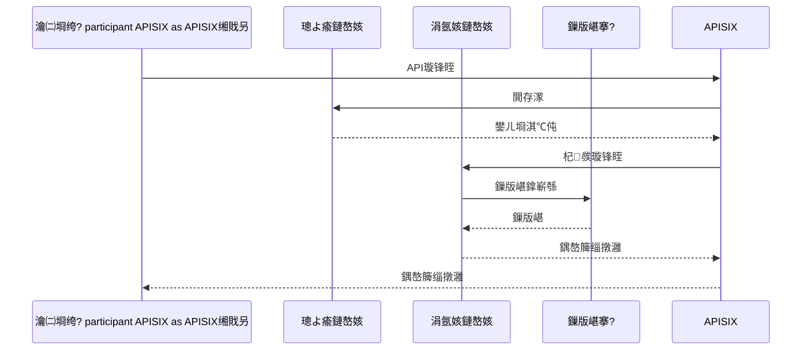

# API鎺ュ彛璁捐鏂囨。

## 馃搵 鏂囨。淇℃伅

- **椤圭洰鍚嶇О**锛氫紒涓氱骇AI缁煎悎绠＄悊骞冲彴
- **鏂囨。鐗堟湰**锛歷1.1
- **鍒涘缓鏃ユ湡**锛?026-01-13
- **鏈€鍚庢洿鏂?*锛?026-01-16
- **鏂囨。绫诲瀷**锛欰PI鎺ュ彛璁捐鏂囨。
- **褰撳墠鐘舵€?*锛氬悗绔笟鍔″姛鑳藉紑鍙戝畬鎴愶紙100%锛夛紝鍑嗗寮€濮嬫祴璇曞拰鍓嶇寮€鍙?
---

## 1. API璁捐瑙勮寖

### 1.1 RESTful API瑙勮寖

鏈郴缁熼伒寰猂ESTful API璁捐瑙勮寖锛屼娇鐢℉TTP鍔ㄨ瘝琛ㄧず鎿嶄綔绫诲瀷锛?
| HTTP鏂规硶 | 璇存槑 | 绀轰緥 |
|---------|------|------|
| GET | 鏌ヨ璧勬簮 | GET /api/v1/users |
| POST | 鍒涘缓璧勬簮 | POST /api/v1/users |
| PUT | 鏇存柊璧勬簮锛堝叏閲忥級 | PUT /api/v1/users/{id} |
| PATCH | 鏇存柊璧勬簮锛堥儴鍒嗭級 | PATCH /api/v1/users/{id} |
| DELETE | 鍒犻櫎璧勬簮 | DELETE /api/v1/users/{id} |

### 1.2 URL瑙勮寖

**URL鏍煎紡**锛歚/api/v{version}/{module}/{resource}`

**绀轰緥**锛?```
/api/v1/users          # 鐢ㄦ埛绠＄悊
/api/v1/roles          # 瑙掕壊绠＄悊
/api/v1/mcp-tools      # MCP宸ュ叿绠＄悊
```

### 1.3 HTTP鐘舵€佺爜瑙勮寖

| 鐘舵€佺爜 | 璇存槑 | 浣跨敤鍦烘櫙 |
|-------|------|---------|
| 200 | OK | 璇锋眰鎴愬姛 |
| 201 | Created | 璧勬簮鍒涘缓鎴愬姛 |
| 204 | No Content | 璇锋眰鎴愬姛锛屾棤杩斿洖鍐呭 |
| 400 | Bad Request | 璇锋眰鍙傛暟閿欒 |
| 401 | Unauthorized | 鏈巿鏉?|
| 403 | Forbidden | 鏃犳潈闄?|
| 404 | Not Found | 璧勬簮涓嶅瓨鍦?|
| 409 | Conflict | 璧勬簮鍐茬獊 |
| 500 | Internal Server Error | 鏈嶅姟鍣ㄥ唴閮ㄩ敊璇?|

---

## 2. 鎺ュ彛鍛藉悕瑙勮寖

### 2.1 璧勬簮鍛藉悕

- 鉁?浣跨敤澶嶆暟鍚嶈瘝锛歚/users`銆乣/roles`
- 鉁?浣跨敤灏忓啓瀛楁瘝锛歚/mcp-tools`
- 鉁?浣跨敤杩炲瓧绗﹀垎闅旓細`/user-roles`

### 2.2 鎿嶄綔鍛藉悕

- 鉁?鏌ヨ鍒楄〃锛歚GET /users`
- 鉁?鏌ヨ璇︽儏锛歚GET /users/{id}`
- 鉁?鍒涘缓璧勬簮锛歚POST /users`
- 鉁?鏇存柊璧勬簮锛歚PUT /users/{id}`
- 鉁?鍒犻櫎璧勬簮锛歚DELETE /users/{id}`
- 鉁?鎵归噺鎿嶄綔锛歚POST /users/batch`

---

## 3. 璇锋眰/鍝嶅簲鏍煎紡瑙勮寖

### 3.1 璇锋眰鏍煎紡

**Query鍙傛暟**锛?```
GET /api/v1/users?page=1&size=10&keyword=admin
```

**JSON Body**锛?```json
{
  "username": "admin",
  "email": "admin@example.com",
  "password": "123456"
}
```

### 3.2 鍝嶅簲鏍煎紡

**鎴愬姛鍝嶅簲**锛?```json
{
  "success": true,
  "code": 200,
  "message": "鎿嶄綔鎴愬姛",
  "data": {
    "id": "1",
    "username": "admin",
    "email": "admin@example.com"
  },
  "timestamp": "2026-01-13T10:00:00Z"
}
```

**鍒嗛〉鍝嶅簲**锛?```json
{
  "success": true,
  "code": 200,
  "message": "鏌ヨ鎴愬姛",
  "data": {
    "items": [...],
    "total": 100,
    "page": 1,
    "size": 10,
    "pages": 10
  }
}
```

**閿欒鍝嶅簲**锛?```json
{
  "success": false,
  "code": 400,
  "message": "鍙傛暟閿欒",
  "errors": [
    {
      "field": "username",
      "message": "鐢ㄦ埛鍚嶄笉鑳戒负绌?
    }
  ],
  "timestamp": "2026-01-13T10:00:00Z"
}
```

---

## 4. 閿欒鐮佽鑼?
### 4.1 閿欒鐮佹牸寮?
閿欒鐮佹牸寮忥細`{妯″潡}{閿欒绫诲瀷}{閿欒缂栧彿}`

- **妯″潡**锛?浣嶆暟瀛楋紙01=鐢ㄦ埛锛?2=瑙掕壊锛?3=鏉冮檺...锛?- **閿欒绫诲瀷**锛?浣嶆暟瀛楋紙1=鍙傛暟閿欒锛?=涓氬姟閿欒锛?=绯荤粺閿欒锛?- **閿欒缂栧彿**锛?浣嶆暟瀛?
### 4.2 閫氱敤閿欒鐮?
| 閿欒鐮?| 璇存槑 |
|-------|------|
| 00001 | 鏈煡閿欒 |
| 00002 | 鍙傛暟閿欒 |
| 00003 | 鏈巿鏉?|
| 00004 | 鏃犳潈闄?|
| 00005 | 璧勬簮涓嶅瓨鍦?|
| 00006 | 璧勬簮宸插瓨鍦?|
| 00007 | 鎿嶄綔澶辫触 |

---

## 5. 鍒嗛〉瑙勮寖

### 5.1 鍒嗛〉鍙傛暟

| 鍙傛暟 | 绫诲瀷 | 蹇呭～ | 璇存槑 |
|-----|------|------|------|
| page | INT | 鍚?| 椤电爜锛岄粯璁? |
| size | INT | 鍚?| 姣忛〉鏁伴噺锛岄粯璁?0锛屾渶澶?00 |

### 5.2 鍒嗛〉鍝嶅簲

```json
{
  "success": true,
  "data": {
    "items": [...],
    "total": 100,
    "page": 1,
    "size": 10,
    "pages": 10
  }
}
```

---

## 6. 鎺ュ彛璁よ瘉鏂瑰紡

### 6.1 JWT璁よ瘉

**璇锋眰澶?*锛?```
Authorization: Bearer {token}
```

### 6.2 API Key璁よ瘉

**璇锋眰澶?*锛?```
X-API-Key: {api_key}
```

---

## 7. API鐗堟湰绠＄悊

### 7.1 鐗堟湰绠＄悊绛栫暐

鏈郴缁熼噰鐢?*URL鐗堟湰绠＄悊**绛栫暐锛屽湪URL璺緞涓槑纭寚瀹欰PI鐗堟湰銆?
**鐗堟湰鏍煎紡**锛歚/api/v{major_version}/{module}/{resource}`

**绀轰緥**锛?```
/api/v1/users          # 鐢ㄦ埛绠＄悊 v1鐗堟湰
/api/v2/users          # 鐢ㄦ埛绠＄悊 v2鐗堟湰
/api/v1/mcp-tools      # MCP宸ュ叿绠＄悊 v1鐗堟湰
```

**鐗堟湰绠＄悊鍘熷垯**锛?- 鉁?涓荤増鏈彿鍙樻洿锛氫笉鍏煎鐨凙PI淇敼
- 鉁?娆＄増鏈彿鍙樻洿锛氬悜鍚庡吋瀹圭殑鍔熻兘鏂板
- 鉁?淇鍙峰彉鏇达細鍚戝悗鍏煎鐨勯棶棰樹慨澶?
### 7.2 鐗堟湰婕旇繘瑙勫垯

#### 7.2.1 鍙戝竷鏂扮増鏈殑鏉′欢

**涓荤増鏈崌绾э紙v1 鈫?v2锛?*锛?- 鉁?API璺緞鍙樻洿
- 鉁?璇锋眰/鍝嶅簲鏍煎紡閲嶅ぇ鍙樻洿
- 鉁?鍒犻櫎鐜版湁鍔熻兘
- 鉁?淇敼蹇呴渶鍙傛暟

**娆＄増鏈崌绾э紙v1.1 鈫?v1.2锛?*锛?- 鉁?鏂板API鎺ュ彛
- 鉁?鏂板鍙€夊弬鏁?- 鉁?鏂板鍝嶅簲瀛楁
- 鉁?鎬ц兘浼樺寲

**淇鍙峰崌绾э紙v1.1.1 鈫?v1.1.2锛?*锛?- 鉁?淇Bug
- 鉁?鏂囨。鏇存柊
- 鉁?鎬ц兘浼樺寲

#### 7.2.2 鐗堟湰鏀寔鍛ㄦ湡

| 鐗堟湰绫诲瀷 | 鏀寔鍛ㄦ湡 | 璇存槑 |
|---------|---------|------|
| **褰撳墠鐗堟湰** | 闀挎湡鏀寔 | 涓昏缁存姢鐗堟湰 |
| **涓婁竴涓増鏈?* | 6涓湀 | 缁х画缁存姢锛屼粎淇涓ラ噸Bug |
| **鏇存棭鐗堟湰** | 3涓湀 | 浠呯淮鎶わ紝涓嶅啀娣诲姞鏂板姛鑳?|
| **搴熷純鐗堟湰** | 1涓湀 | 浠呭畨鍏ㄤ慨澶嶏紝涔嬪悗瀹屽叏鍋滄鏀寔 |

**鐗堟湰搴熷純娴佺▼**锛?1. 鍙戝竷鏂扮増鏈墠3涓湀锛氬彂甯冨叕鍛?2. 鍙戝竷鏂扮増鏈墠1涓湀锛氬彂閫侀偖浠堕€氱煡
3. 鍙戝竷鏂扮増鏈椂锛氬湪鍝嶅簲澶翠腑娣诲姞搴熷純璀﹀憡
4. 搴熷純鍚?涓湀锛氬畬鍏ㄥ仠姝㈡敮鎸?
#### 7.2.3 鐗堟湰搴熷純閫氱煡

**鍝嶅簲澶撮€氱煡**锛?```
X-API-Deprecated: true
X-API-Deprecation-Date: 2026-06-01
X-API-Sunset: 2026-12-31
X-API-Replacement: /api/v2/users
```

**鍝嶅簲浣撻€氱煡**锛?```json
{
  "success": true,
  "code": 200,
  "message": "鎿嶄綔鎴愬姛",
  "data": {...},
  "warnings": [
    {
      "code": "API_DEPRECATED",
      "message": "姝PI鐗堟湰宸插簾寮冿紝璇峰崌绾у埌v2鐗堟湰",
      "details": {
        "deprecated_date": "2026-06-01",
        "sunset_date": "2026-12-31",
        "replacement": "/api/v2/users"
      }
    }
  ]
}
```

### 7.3 鐗堟湰绠＄悊瀹炵幇

#### 7.3.1 FastAPI鐗堟湰璺敱

**璺敱閰嶇疆**锛?```python
# app/main.py
from fastapi import FastAPI
from app.api.v1 import api_router as api_router_v1
from app.api.v2 import api_router as api_router_v2

app = FastAPI(title="浼佷笟绾I缁煎悎绠＄悊骞冲彴")

# 娉ㄥ唽v1鐗堟湰璺敱
app.include_router(
    api_router_v1,
    prefix="/api/v1",
    tags=["v1"]
)

# 娉ㄥ唽v2鐗堟湰璺敱
app.include_router(
    api_router_v2,
    prefix="/api/v2",
    tags=["v2"]
)
```

**鐗堟湰璺敱鍣?*锛?```python
# app/api/v1/__init__.py
from fastapi import APIRouter

api_router = APIRouter()

from app.api.v1 import auth, users, roles, permissions, menus

api_router.include_router(auth.router, prefix="/auth", tags=["璁よ瘉"])
api_router.include_router(users.router, prefix="/users", tags=["鐢ㄦ埛"])
api_router.include_router(roles.router, prefix="/roles", tags=["瑙掕壊"])
api_router.include_router(permissions.router, prefix="/permissions", tags=["鏉冮檺"])
api_router.include_router(menus.router, prefix="/menus", tags=["鑿滃崟"])
```

#### 7.3.2 鐗堟湰鍏煎鎬ф鏌?
**鐗堟湰妫€鏌ヤ腑闂翠欢**锛?```python
# app/middleware/version.py
from fastapi import Request, HTTPException
from fastapi.responses import JSONResponse

DEPRECATED_VERSIONS = {
    "v1": {
        "deprecated_date": "2026-06-01",
        "sunset_date": "2026-12-31",
        "replacement": "v2"
    }
}

async def check_version(request: Request, call_next):
    """妫€鏌PI鐗堟湰鏄惁搴熷純"""
    path = request.url.path
    
    # 鎻愬彇鐗堟湰鍙?    if path.startswith("/api/v"):
        version = path.split("/")[2]
        
        # 妫€鏌ユ槸鍚﹀簾寮?        if version in DEPRECATED_VERSIONS:
            version_info = DEPRECATED_VERSIONS[version]
            
            # 娣诲姞搴熷純璀﹀憡澶?            response = await call_next(request)
            
            response.headers["X-API-Deprecated"] = "true"
            response.headers["X-API-Deprecation-Date"] = version_info["deprecated_date"]
            response.headers["X-API-Sunset"] = version_info["sunset_date"]
            response.headers["X-API-Replacement"] = f"/api/{version_info['replacement']}{path[7:]}"
            
            # 娣诲姞璀﹀憡淇℃伅
            if hasattr(response, "body_iterator"):
                # 濡傛灉鏄疛SON鍝嶅簲锛屾坊鍔犺鍛婁俊鎭?                response_body = b""
                async for chunk in response.body_iterator:
                    response_body += chunk
                
                import json
                body = json.loads(response_body.decode())
                if isinstance(body, dict):
                    body.setdefault("warnings", []).append({
                        "code": "API_DEPRECATED",
                        "message": f"姝PI鐗堟湰宸插簾寮冿紝璇峰崌绾у埌{version_info['replacement']}鐗堟湰",
                        "details": version_info
                    })
                    response_body = json.dumps(body).encode()
                    
                    # 鍒涘缓鏂扮殑鍝嶅簲
                    new_response = JSONResponse(
                        content=body,
                        status_code=response.status_code,
                        headers=dict(response.headers)
                    )
                    return new_response
            
            return response
    
    return await call_next(request)
```

**娉ㄥ唽涓棿浠?*锛?```python
# app/main.py
from app.middleware.version import check_version

app.middleware("http")(check_version)
```

#### 7.3.3 鐗堟湰闄嶇骇绛栫暐

**鑷姩闄嶇骇**锛?```python
# app/middleware/version_fallback.py
from fastapi import Request, HTTPException
from fastapi.responses import RedirectResponse

AVAILABLE_VERSIONS = ["v1", "v2"]

async def version_fallback(request: Request, call_next):
    """鐗堟湰闄嶇骇绛栫暐"""
    path = request.url.path
    
    if path.startswith("/api/v"):
        version = path.split("/")[2]
        
        # 濡傛灉璇锋眰鐨勭増鏈笉瀛樺湪锛岄檷绾у埌鏈€鏂扮増鏈?        if version not in AVAILABLE_VERSIONS:
            latest_version = AVAILABLE_VERSIONS[-1]
            new_path = path.replace(f"/api/{version}", f"/api/{latest_version}")
            
            # 娣诲姞鐗堟湰闄嶇骇璀﹀憡澶?            response = await call_next(request)
            response.headers["X-API-Version-Fallback"] = "true"
            response.headers["X-API-Original-Version"] = version
            response.headers["X-API-Fallback-Version"] = latest_version
            
            return response
    
    return await call_next(request)
```

### 7.4 鐗堟湰绠＄悊鏈€浣冲疄璺?
**鐗堟湰鍙戝竷鏈€浣冲疄璺?*锛?- 鉁?淇濇寔鍚戝悗鍏煎鎬э紝閬垮厤鐮村潖鎬у彉鏇?- 鉁?鏂扮増鏈彂甯冨墠鍏呭垎娴嬭瘯
- 鉁?鎻愬墠3涓湀鍙戝竷搴熷純閫氱煡
- 鉁?鎻愪緵璇︾粏鐨勮縼绉绘寚鍗?- 鉁?淇濇寔鑷冲皯2涓増鏈殑骞惰鏀寔

**鐗堟湰缁存姢鏈€浣冲疄璺?*锛?- 鉁?瀹氭湡妫€鏌ョ増鏈娇鐢ㄦ儏鍐?- 鉁?鍙婃椂淇搴熷純鐗堟湰鐨勪弗閲岯ug
- 鉁?鎻愪緵鐗堟湰鍗囩骇宸ュ叿
- 鉁?璁板綍鐗堟湰鍙樻洿鏃ュ織
- 鉁?鐩戞帶鏃х増鏈殑浣跨敤鎯呭喌

**瀹㈡埛绔€傞厤鏈€浣冲疄璺?*锛?- 鉁?瀹㈡埛绔敮鎸佺増鏈崗鍟?- 鉁?瀹㈡埛绔鐞嗗簾寮冭鍛?- 鉁?瀹㈡埛绔疄鐜拌嚜鍔ㄥ崌绾?- 鉁?瀹㈡埛绔紦瀛樼増鏈俊鎭?- 鉁?瀹㈡埛绔褰曠増鏈垏鎹㈡棩蹇?
### 7.5 鐗堟湰鍙樻洿鏃ュ織

**v2.0.0 (2026-06-01)**锛?- 鉁?鏂板锛氬伐浣滄祦绠＄悊API
- 鉁?鏂板锛氬緟鍔炰换鍔＄鐞咥PI
- 馃攧 鍙樻洿锛氱敤鎴稟PI鍝嶅簲鏍煎紡浼樺寲
- 馃棏锔?搴熷純锛氭棫鐗堟潈闄怉PI锛堜娇鐢╲2鐗堟湰锛?
**v1.1.0 (2026-03-01)**锛?- 鉁?鏂板锛歁CP宸ュ叿绠＄悊API
- 鉁?鏂板锛氬鏁版嵁婧愮鐞咥PI
- 馃悰 淇锛氱敤鎴锋煡璇㈡€ц兘闂

**v1.0.0 (2026-01-01)**锛?- 馃帀 鍒濆鐗堟湰鍙戝竷
- 鉁?鍩虹鍔熻兘锛氱敤鎴枫€佽鑹层€佹潈闄愩€佽彍鍗曠鐞?
---

## 8. 鎺ュ彛鍒楄〃

### 8.1 璁よ瘉鍩熸湇鍔℃帴鍙ｏ紙绔彛8001锛?
| 鎺ュ彛 | 鏂规硶 | 璺緞 | 璇存槑 |
|-----|------|------|------|
| 鐢ㄦ埛鐧诲綍 | POST | /api/v1/auth/login | 鐢ㄦ埛鐧诲綍锛岃繑鍥濲WT Token |
| 鐢ㄦ埛鐧诲嚭 | POST | /api/v1/auth/logout | 鐢ㄦ埛鐧诲嚭锛屽悐閿€Token |
| 鍒锋柊Token | POST | /api/v1/auth/refresh | 鍒锋柊JWT Token |
| 鑾峰彇鐢ㄦ埛淇℃伅 | GET | /api/v1/auth/me | 鑾峰彇褰撳墠鐧诲綍鐢ㄦ埛淇℃伅 |
| 鍒涘缓API Key | POST | /api/v1/auth/api-keys | 鍒涘缓API Key |
| 鍒犻櫎API Key | DELETE | /api/v1/auth/api-keys/{id} | 鍒犻櫎API Key |
| 楠岃瘉鏉冮檺 | POST | /api/v1/auth/verify | 楠岃瘉鐢ㄦ埛鏉冮檺 |

### 8.2 鐢ㄦ埛鍩熸湇鍔℃帴鍙ｏ紙绔彛8002锛?
#### 7.2.1 鐢ㄦ埛绠＄悊

| 鎺ュ彛 | 鏂规硶 | 璺緞 | 璇存槑 |
|-----|------|------|------|
| 鏌ヨ鐢ㄦ埛鍒楄〃 | GET | /api/v1/users | 鍒嗛〉鏌ヨ鐢ㄦ埛鍒楄〃 |
| 鏌ヨ鐢ㄦ埛璇︽儏 | GET | /api/v1/users/{id} | 鏌ヨ鐢ㄦ埛璇︽儏 |
| 鍒涘缓鐢ㄦ埛 | POST | /api/v1/users | 鍒涘缓鏂扮敤鎴?|
| 鏇存柊鐢ㄦ埛 | PUT | /api/v1/users/{id} | 鏇存柊鐢ㄦ埛淇℃伅 |
| 鍒犻櫎鐢ㄦ埛 | DELETE | /api/v1/users/{id} | 鍒犻櫎鐢ㄦ埛 |
| 鍚敤/绂佺敤鐢ㄦ埛 | PATCH | /api/v1/users/{id}/status | 鍚敤鎴栫鐢ㄧ敤鎴?|
| 閲嶇疆瀵嗙爜 | POST | /api/v1/users/{id}/reset-password | 閲嶇疆鐢ㄦ埛瀵嗙爜 |
| 鍒嗛厤瑙掕壊 | POST | /api/v1/users/{id}/roles | 涓虹敤鎴峰垎閰嶈鑹?|

#### 7.2.2 閮ㄩ棬绠＄悊

| 鎺ュ彛 | 鏂规硶 | 璺緞 | 璇存槑 |
|-----|------|------|------|
| 鏌ヨ閮ㄩ棬鏍?| GET | /api/v1/departments/tree | 鏌ヨ閮ㄩ棬鏍戠粨鏋?|
| 鏌ヨ閮ㄩ棬鍒楄〃 | GET | /api/v1/departments | 鍒嗛〉鏌ヨ閮ㄩ棬鍒楄〃 |
| 鏌ヨ閮ㄩ棬璇︽儏 | GET | /api/v1/departments/{id} | 鏌ヨ閮ㄩ棬璇︽儏 |
| 鍒涘缓閮ㄩ棬 | POST | /api/v1/departments | 鍒涘缓鏂伴儴闂?|
| 鏇存柊閮ㄩ棬 | PUT | /api/v1/departments/{id} | 鏇存柊閮ㄩ棬淇℃伅 |
| 鍒犻櫎閮ㄩ棬 | DELETE | /api/v1/departments/{id} | 鍒犻櫎閮ㄩ棬 |
| 绉诲姩閮ㄩ棬 | POST | /api/v1/departments/{id}/move | 绉诲姩閮ㄩ棬浣嶇疆 |

#### 7.2.3 绉熸埛绠＄悊

| 鎺ュ彛 | 鏂规硶 | 璺緞 | 璇存槑 |
|-----|------|------|------|
| 鏌ヨ绉熸埛鍒楄〃 | GET | /api/v1/tenants | 鍒嗛〉鏌ヨ绉熸埛鍒楄〃 |
| 鏌ヨ绉熸埛璇︽儏 | GET | /api/v1/tenants/{id} | 鏌ヨ绉熸埛璇︽儏 |
| 鍒涘缓绉熸埛 | POST | /api/v1/tenants | 鍒涘缓鏂扮鎴?|
| 鏇存柊绉熸埛 | PUT | /api/v1/tenants/{id} | 鏇存柊绉熸埛淇℃伅 |
| 鍒犻櫎绉熸埛 | DELETE | /api/v1/tenants/{id} | 鍒犻櫎绉熸埛 |
| 妫€鏌ョ鎴烽厤棰?| GET | /api/v1/tenants/{id}/quota/{quota_type} | 妫€鏌ョ鎴疯祫婧愰厤棰?|
| 鑾峰彇鎵€鏈夊椁?| GET | /api/v1/tenants/packages | 鑾峰彇鎵€鏈夊椁愪俊鎭?|
| 缁垂绉熸埛 | POST | /api/v1/tenants/{id}/renew | 缁垂绉熸埛 |

#### 7.2.4 宀椾綅绠＄悊

| 鎺ュ彛 | 鏂规硶 | 璺緞 | 璇存槑 |
|-----|------|------|------|
| 鏌ヨ宀椾綅鍒楄〃 | GET | /api/v1/positions | 鍒嗛〉鏌ヨ宀椾綅鍒楄〃 |
| 鏌ヨ宀椾綅璇︽儏 | GET | /api/v1/positions/{id} | 鏌ヨ宀椾綅璇︽儏 |
| 鍒涘缓宀椾綅 | POST | /api/v1/positions | 鍒涘缓鏂板矖浣?|
| 鏇存柊宀椾綅 | PUT | /api/v1/positions/{id} | 鏇存柊宀椾綅淇℃伅 |
| 鍒犻櫎宀椾綅 | DELETE | /api/v1/positions/{id} | 鍒犻櫎宀椾綅 |

### 8.3 鏉冮檺鍩熸湇鍔℃帴鍙ｏ紙绔彛8003锛?
#### 7.3.1 瑙掕壊绠＄悊

| 鎺ュ彛 | 鏂规硶 | 璺緞 | 璇存槑 |
|-----|------|------|------|
| 鏌ヨ瑙掕壊鍒楄〃 | GET | /api/v1/roles | 鍒嗛〉鏌ヨ瑙掕壊鍒楄〃 |
| 鏌ヨ瑙掕壊璇︽儏 | GET | /api/v1/roles/{id} | 鏌ヨ瑙掕壊璇︽儏 |
| 鍒涘缓瑙掕壊 | POST | /api/v1/roles | 鍒涘缓鏂拌鑹?|
| 鏇存柊瑙掕壊 | PUT | /api/v1/roles/{id} | 鏇存柊瑙掕壊淇℃伅 |
| 鍒犻櫎瑙掕壊 | DELETE | /api/v1/roles/{id} | 鍒犻櫎瑙掕壊 |
| 鍒嗛厤鏉冮檺 | POST | /api/v1/roles/{id}/permissions | 涓鸿鑹插垎閰嶆潈闄?|
| 鑾峰彇瑙掕壊鏉冮檺 | GET | /api/v1/roles/{id}/permissions | 鑾峰彇瑙掕壊鐨勬墍鏈夋潈闄?|
| 妫€鏌ヨ鑹叉潈闄?| GET | /api/v1/roles/{id}/check-permission/{permission_code} | 妫€鏌ヨ鑹叉槸鍚︽湁鎸囧畾鏉冮檺 |
| 鍒嗛厤鑿滃崟 | POST | /api/v1/roles/{id}/menus | 涓鸿鑹插垎閰嶈彍鍗?|
| 鑾峰彇瑙掕壊鑿滃崟 | GET | /api/v1/roles/{id}/menus | 鑾峰彇瑙掕壊鐨勬墍鏈夎彍鍗?|

#### 7.3.2 鏉冮檺绠＄悊

| 鎺ュ彛 | 鏂规硶 | 璺緞 | 璇存槑 |
|-----|------|------|------|
| 鏌ヨ鏉冮檺鍒楄〃 | GET | /api/v1/permissions | 鍒嗛〉鏌ヨ鏉冮檺鍒楄〃 |
| 鏌ヨ鏉冮檺璇︽儏 | GET | /api/v1/permissions/{id} | 鏌ヨ鏉冮檺璇︽儏 |
| 鍒涘缓鏉冮檺 | POST | /api/v1/permissions | 鍒涘缓鏂版潈闄?|
| 鏇存柊鏉冮檺 | PUT | /api/v1/permissions/{id} | 鏇存柊鏉冮檺淇℃伅 |
| 鍒犻櫎鏉冮檺 | DELETE | /api/v1/permissions/{id} | 鍒犻櫎鏉冮檺 |

#### 7.3.3 鑿滃崟绠＄悊

| 鎺ュ彛 | 鏂规硶 | 璺緞 | 璇存槑 |
|-----|------|------|------|
| 鏌ヨ鑿滃崟鏍?| GET | /api/v1/menus/tree | 鏌ヨ鑿滃崟鏍戠粨鏋?|
| 鏌ヨ鐢ㄦ埛鑿滃崟 | GET | /api/v1/menus/user | 鏌ヨ褰撳墠鐢ㄦ埛鍙闂殑鑿滃崟 |
| 鏌ヨ鑿滃崟鍒楄〃 | GET | /api/v1/menus | 鍒嗛〉鏌ヨ鑿滃崟鍒楄〃 |
| 鏌ヨ鑿滃崟璇︽儏 | GET | /api/v1/menus/{id} | 鏌ヨ鑿滃崟璇︽儏 |
| 鍒涘缓鑿滃崟 | POST | /api/v1/menus | 鍒涘缓鏂拌彍鍗?|
| 鏇存柊鑿滃崟 | PUT | /api/v1/menus/{id} | 鏇存柊鑿滃崟淇℃伅 |
| 鍒犻櫎鑿滃崟 | DELETE | /api/v1/menus/{id} | 鍒犻櫎鑿滃崟 |

### 8.4 绯荤粺鍩熸湇鍔℃帴鍙ｏ紙绔彛8004锛?
#### 7.4.1 MCP宸ュ叿绠＄悊

| 鎺ュ彛 | 鏂规硶 | 璺緞 | 璇存槑 |
|-----|------|------|------|
| 鏌ヨAPI绔偣鍒楄〃 | GET | /api/v1/mcp-tools/endpoints | 鏌ヨ鍙敞鍐屼负MCP宸ュ叿鐨凙PI绔偣 |
| 鏌ヨMCP宸ュ叿鍒楄〃 | GET | /api/v1/mcp-tools | 鍒嗛〉鏌ヨMCP宸ュ叿鍒楄〃 |
| 鏌ヨMCP宸ュ叿璇︽儏 | GET | /api/v1/mcp-tools/{id} | 鏌ヨMCP宸ュ叿璇︽儏 |
| 娉ㄥ唽MCP宸ュ叿 | POST | /api/v1/mcp-tools/register | 灏咥PI绔偣娉ㄥ唽涓篗CP宸ュ叿 |
| 鍙栨秷娉ㄥ唽MCP宸ュ叿 | DELETE | /api/v1/mcp-tools/unregister/{path}/{method} | 鍙栨秷MCP宸ュ叿娉ㄥ唽 |
| 鎵цMCP宸ュ叿 | POST | /api/v1/mcp-tools/execute | 鎵цMCP宸ュ叿 |
| 鏌ヨ宸ュ叿璋冪敤鏃ュ織 | GET | /api/v1/mcp-tools/{id}/logs | 鏌ヨ宸ュ叿璋冪敤鏃ュ織 |

#### 7.4.2 澶氭暟鎹簮绠＄悊

| 鎺ュ彛 | 鏂规硶 | 璺緞 | 璇存槑 |
|-----|------|------|------|
| 鏌ヨ鍗曚釜鏁版嵁婧?| POST | /api/v1/multi-db/query | 鏌ヨ鍗曚釜鏁版嵁婧?|
| 鏌ヨ澶氫釜鏁版嵁婧?| POST | /api/v1/multi-db/query-multiple | 鍚屾椂鏌ヨ澶氫釜鏁版嵁婧?|
| 璺ㄦ暟鎹簮鍏宠仈鏌ヨ | POST | /api/v1/multi-db/query-join | 璺ㄦ暟鎹簮鍏宠仈鏌ヨ |
| 鎵ц鑷畾涔塖QL | POST | /api/v1/multi-db/execute-sql | 鎵ц鑷畾涔塖QL |
| 鎵ц璺ㄦ暟鎹簮浜嬪姟 | POST | /api/v1/multi-db/transaction | 鎵ц璺ㄦ暟鎹簮浜嬪姟 |
| 鏁版嵁婧愬仴搴锋鏌?| GET | /api/v1/multi-db/health-check | 妫€鏌ユ暟鎹簮鍋ュ悍鐘舵€?|

#### 7.4.3 瀛楀吀绠＄悊

| 鎺ュ彛 | 鏂规硶 | 璺緞 | 璇存槑 |
|-----|------|------|------|
| 鏌ヨ瀛楀吀鍒楄〃 | GET | /api/v1/dicts | 鍒嗛〉鏌ヨ瀛楀吀鍒楄〃 |
| 鏌ヨ瀛楀吀璇︽儏 | GET | /api/v1/dicts/{id} | 鏌ヨ瀛楀吀璇︽儏 |
| 鍒涘缓瀛楀吀 | POST | /api/v1/dicts | 鍒涘缓鏂板瓧鍏?|
| 鏇存柊瀛楀吀 | PUT | /api/v1/dicts/{id} | 鏇存柊瀛楀吀淇℃伅 |
| 鍒犻櫎瀛楀吀 | DELETE | /api/v1/dicts/{id} | 鍒犻櫎瀛楀吀 |
| 鏌ヨ瀛楀吀椤瑰垪琛?| GET | /api/v1/dicts/{id}/items | 鏌ヨ瀛楀吀椤瑰垪琛?|
| 鍒涘缓瀛楀吀椤?| POST | /api/v1/dicts/{id}/items | 鍒涘缓瀛楀吀椤?|
| 鏇存柊瀛楀吀椤?| PUT | /api/v1/dicts/{id}/items/{item_id} | 鏇存柊瀛楀吀椤?|
| 鍒犻櫎瀛楀吀椤?| DELETE | /api/v1/dicts/{id}/items/{item_id} | 鍒犻櫎瀛楀吀椤?|

#### 7.4.4 绯荤粺閰嶇疆

| 鎺ュ彛 | 鏂规硶 | 璺緞 | 璇存槑 |
|-----|------|------|------|
| 鏌ヨ绯荤粺閰嶇疆 | GET | /api/v1/system/config | 鏌ヨ绯荤粺閰嶇疆 |
| 鏇存柊绯荤粺閰嶇疆 | PUT | /api/v1/system/config | 鏇存柊绯荤粺閰嶇疆 |

#### 7.4.5 閿欒鐮佺鐞?
| 鎺ュ彛 | 鏂规硶 | 璺緞 | 璇存槑 |
|-----|------|------|------|
| 鏌ヨ閿欒鐮佸垪琛?| GET | /api/v1/error-codes | 鍒嗛〉鏌ヨ閿欒鐮佸垪琛?|
| 鍒涘缓閿欒鐮?| POST | /api/v1/error-codes | 鍒涘缓閿欒鐮?|
| 鏇存柊閿欒鐮?| PUT | /api/v1/error-codes/{id} | 鏇存柊閿欒鐮?|
| 鍒犻櫎閿欒鐮?| DELETE | /api/v1/error-codes/{id} | 鍒犻櫎閿欒鐮?|

### 8.5 鏀拺鍩熸湇鍔℃帴鍙ｏ紙绔彛8005锛?
#### 7.5.1 鏃ュ織瀹¤

| 鎺ュ彛 | 鏂规硶 | 璺緞 | 璇存槑 |
|-----|------|------|------|
| 鏌ヨ鐧诲綍鏃ュ織 | GET | /api/v1/logs/login | 鍒嗛〉鏌ヨ鐧诲綍鏃ュ織 |
| 鏌ヨ鎿嶄綔鏃ュ織 | GET | /api/v1/logs/operation | 鍒嗛〉鏌ヨ鎿嶄綔鏃ュ織 |

#### 7.5.2 閫氱煡绠＄悊

| 鎺ュ彛 | 鏂规硶 | 璺緞 | 璇存槑 |
|-----|------|------|------|
| 鏌ヨ閫氱煡鍒楄〃 | GET | /api/v1/notifications | 鍒嗛〉鏌ヨ閫氱煡鍒楄〃 |
| 鏌ヨ鏈閫氱煡鏁?| GET | /api/v1/notifications/unread-count | 鏌ヨ鏈閫氱煡鏁伴噺 |
| 鏍囪閫氱煡宸茶 | POST | /api/v1/notifications/{id}/read | 鏍囪閫氱煡宸茶 |
| 鎵归噺鏍囪宸茶 | POST | /api/v1/notifications/read-all | 鎵归噺鏍囪閫氱煡宸茶 |
| 鍒涘缓閫氱煡 | POST | /api/v1/notifications | 鍒涘缓閫氱煡 |

#### 7.5.3 鏁忔劅璇嶇鐞?
| 鎺ュ彛 | 鏂规硶 | 璺緞 | 璇存槑 |
|-----|------|------|------|
| 鏌ヨ鏁忔劅璇嶅垪琛?| GET | /api/v1/sensitive-words | 鍒嗛〉鏌ヨ鏁忔劅璇嶅垪琛?|
| 鍒涘缓鏁忔劅璇?| POST | /api/v1/sensitive-words | 鍒涘缓鏁忔劅璇?|
| 鏇存柊鏁忔劅璇?| PUT | /api/v1/sensitive-words/{id} | 鏇存柊鏁忔劅璇?|
| 鍒犻櫎鏁忔劅璇?| DELETE | /api/v1/sensitive-words/{id} | 鍒犻櫎鏁忔劅璇?|

#### 7.5.4 鍦板尯绠＄悊

| 鎺ュ彛 | 鏂规硶 | 璺緞 | 璇存槑 |
|-----|------|------|------|
| 鏌ヨ鐪佷唤鍒楄〃 | GET | /api/v1/regions/provinces | 鏌ヨ鐪佷唤鍒楄〃 |
| 鏌ヨ鍩庡競鍒楄〃 | GET | /api/v1/regions/cities | 鏌ヨ鍩庡競鍒楄〃 |
| 鏌ヨ鍖洪晣鍒楄〃 | GET | /api/v1/regions/districts | 鏌ヨ鍖洪晣鍒楄〃 |

#### 7.5.5 寰呭姙浠诲姟绠＄悊

| 鎺ュ彛 | 鏂规硶 | 璺緞 | 璇存槑 |
|-----|------|------|------|
| 鏌ヨ寰呭姙浠诲姟鍒楄〃 | GET | /api/v1/todo/tasks | 鍒嗛〉鏌ヨ寰呭姙浠诲姟鍒楄〃 |
| 鏌ヨ寰呭姙浠诲姟璇︽儏 | GET | /api/v1/todo/tasks/{id} | 鏌ヨ寰呭姙浠诲姟璇︽儏 |
| 鍒涘缓寰呭姙浠诲姟 | POST | /api/v1/todo/tasks | 鍒涘缓寰呭姙浠诲姟 |
| 鏇存柊寰呭姙浠诲姟 | PUT | /api/v1/todo/tasks/{id} | 鏇存柊寰呭姙浠诲姟 |
| 鍒犻櫎寰呭姙浠诲姟 | DELETE | /api/v1/todo/tasks/{id} | 鍒犻櫎寰呭姙浠诲姟 |
| 鏍囪浠诲姟瀹屾垚 | POST | /api/v1/todo/tasks/{id}/complete | 鏍囪浠诲姟瀹屾垚 |
| 鍙栨秷浠诲姟瀹屾垚 | POST | /api/v1/todo/tasks/{id}/uncomplete | 鍙栨秷浠诲姟瀹屾垚 |

#### 7.5.6 姣忔棩璁″垝绠＄悊

| 鎺ュ彛 | 鏂规硶 | 璺緞 | 璇存槑 |
|-----|------|------|------|
| 鏌ヨ浠婃棩璁″垝 | GET | /api/v1/todo/daily-plan/today | 鏌ヨ浠婃棩璁″垝 |
| 鍒涘缓姣忔棩璁″垝 | POST | /api/v1/todo/daily-plan | 鍒涘缓姣忔棩璁″垝 |
| 鏇存柊姣忔棩璁″垝 | PUT | /api/v1/todo/daily-plan/{id} | 鏇存柊姣忔棩璁″垝 |
| 瀹屾垚姣忔棩璁″垝浠诲姟 | POST | /api/v1/todo/daily-plan/{id}/complete | 瀹屾垚姣忔棩璁″垝浠诲姟 |
| 鏌ヨ姣忔棩璁″垝鍘嗗彶 | GET | /api/v1/todo/daily-plan/history | 鏌ヨ姣忔棩璁″垝鍘嗗彶 |

#### 7.5.7 棣栭〉鐪嬫澘寰呭姙浠诲姟

| 鎺ュ彛 | 鏂规硶 | 璺緞 | 璇存槑 |
|-----|------|------|------|
| 鏌ヨ寰呭姙浠诲姟鍒楄〃 | GET | /api/v1/dashboard/todo/pending-tasks | 鏌ヨ寰呭姙浠诲姟鍒楄〃锛堥椤碉級 |

---

### 8.6 涓氬姟鍩熸湇鍔℃帴鍙ｏ紙绔彛8006锛?
#### 7.6.1 宸ヤ綔娴佸畾涔夌鐞?
| 鎺ュ彛 | 鏂规硶 | 璺緞 | 璇存槑 |
|-----|------|------|------|
| 鏌ヨ宸ヤ綔娴佸畾涔夊垪琛?| GET | /api/v1/workflow/definitions | 鍒嗛〉鏌ヨ宸ヤ綔娴佸畾涔?|
| 鏌ヨ宸ヤ綔娴佸畾涔夎鎯?| GET | /api/v1/workflow/definitions/{id} | 鏌ヨ宸ヤ綔娴佸畾涔夎鎯?|
| 鍒涘缓宸ヤ綔娴佸畾涔?| POST | /api/v1/workflow/definitions | 鍒涘缓宸ヤ綔娴佸畾涔?|
| 鏇存柊宸ヤ綔娴佸畾涔?| PUT | /api/v1/workflow/definitions/{id} | 鏇存柊宸ヤ綔娴佸畾涔?|
| 鍒犻櫎宸ヤ綔娴佸畾涔?| DELETE | /api/v1/workflow/definitions/{id} | 鍒犻櫎宸ヤ綔娴佸畾涔?|
| 鍙戝竷宸ヤ綔娴佸畾涔?| POST | /api/v1/workflow/definitions/{id}/publish | 鍙戝竷宸ヤ綔娴佸畾涔?|
| 澶嶅埗宸ヤ綔娴佸畾涔?| POST | /api/v1/workflow/definitions/{id}/copy | 澶嶅埗宸ヤ綔娴佸畾涔?|

#### 7.6.2 宸ヤ綔娴佸疄渚嬬鐞?
| 鎺ュ彛 | 鏂规硶 | 璺緞 | 璇存槑 |
|-----|------|------|------|
| 鏌ヨ宸ヤ綔娴佸疄渚嬪垪琛?| GET | /api/v1/workflow/instances | 鍒嗛〉鏌ヨ宸ヤ綔娴佸疄渚?|
| 鏌ヨ宸ヤ綔娴佸疄渚嬭鎯?| GET | /api/v1/workflow/instances/{id} | 鏌ヨ宸ヤ綔娴佸疄渚嬭鎯?|
| 鍒涘缓宸ヤ綔娴佸疄渚?| POST | /api/v1/workflow/instances | 鍒涘缓宸ヤ綔娴佸疄渚?|
| 缁堟宸ヤ綔娴佸疄渚?| POST | /api/v1/workflow/instances/{id}/terminate | 缁堟宸ヤ綔娴佸疄渚?|
| 鏌ヨ宸ヤ綔娴佸疄渚嬭繘搴?| GET | /api/v1/workflow/instances/{id}/progress | 鏌ヨ宸ヤ綔娴佸疄渚嬭繘搴?|

#### 7.6.3 宸ヤ綔娴佷换鍔＄鐞?
| 鎺ュ彛 | 鏂规硶 | 璺緞 | 璇存槑 |
|-----|------|------|------|
| 鏌ヨ寰呭姙浠诲姟鍒楄〃 | GET | /api/v1/workflow/tasks/pending | 鏌ヨ寰呭姙瀹℃壒浠诲姟鍒楄〃 |
| 鏌ヨ宸插姙浠诲姟鍒楄〃 | GET | /api/v1/workflow/tasks/completed | 鏌ヨ宸插姙瀹℃壒浠诲姟鍒楄〃 |
| 鏌ヨ鎶勯€佷换鍔″垪琛?| GET | /api/v1/workflow/tasks/copy | 鏌ヨ鎶勯€佷换鍔″垪琛?|
| 鏌ヨ浠诲姟璇︽儏 | GET | /api/v1/workflow/tasks/{id} | 鏌ヨ浠诲姟璇︽儏 |
| 澶勭悊瀹℃壒浠诲姟 | POST | /api/v1/workflow/tasks/{id}/approve | 澶勭悊瀹℃壒浠诲姟锛堝悓鎰忥級 |
| 椹冲洖瀹℃壒浠诲姟 | POST | /api/v1/workflow/tasks/{id}/reject | 椹冲洖瀹℃壒浠诲姟 |
| 杞氦瀹℃壒浠诲姟 | POST | /api/v1/workflow/tasks/{id}/transfer | 杞氦瀹℃壒浠诲姟 |
| 娣诲姞瀹℃壒璇勮 | POST | /api/v1/workflow/tasks/{id}/comment | 娣诲姞瀹℃壒璇勮 |

#### 7.6.4 宸ヤ綔娴佹ā鏉跨鐞?
| 鎺ュ彛 | 鏂规硶 | 璺緞 | 璇存槑 |
|-----|------|------|------|
| 鏌ヨ宸ヤ綔娴佹ā鏉垮垪琛?| GET | /api/v1/workflow/templates | 鏌ヨ宸ヤ綔娴佹ā鏉垮垪琛?|
| 鏌ヨ宸ヤ綔娴佹ā鏉胯鎯?| GET | /api/v1/workflow/templates/{id} | 鏌ヨ宸ヤ綔娴佹ā鏉胯鎯?|
| 浠庢ā鏉垮垱寤哄伐浣滄祦 | POST | /api/v1/workflow/templates/{id}/create | 浠庢ā鏉垮垱寤哄伐浣滄祦瀹氫箟 |

#### 7.6.5 棣栭〉鐪嬫澘宸ヤ綔娴佺粺璁?
| 鎺ュ彛 | 鏂规硶 | 璺緞 | 璇存槑 |
|-----|------|------|------|
| 鏌ヨ宸ヤ綔娴佺粺璁?| GET | /api/v1/dashboard/workflow/stats | 鏌ヨ宸ヤ綔娴佺粺璁℃暟鎹?|
| 鏌ヨ寰呭姙瀹℃壒浠诲姟 | GET | /api/v1/dashboard/workflow/pending-tasks | 鏌ヨ寰呭姙瀹℃壒浠诲姟鍒楄〃 |

#### 7.6.6 棰勭暀涓氬姟鎺ュ彛

| 鎺ュ彛 | 鏂规硶 | 璺緞 | 璇存槑 |
|-----|------|------|------|
| 璁㈠崟绠＄悊 | - | /api/v1/business/orders | 棰勭暀锛氳鍗曠鐞嗘帴鍙?|
| 鍟嗗搧绠＄悊 | - | /api/v1/business/products | 棰勭暀锛氬晢鍝佺鐞嗘帴鍙?|
| 鎶ヨ〃缁熻 | - | /api/v1/business/reports | 棰勭暀锛氭姤琛ㄧ粺璁℃帴鍙?|

---

## 9. API鎺ュ彛鍒嗙被鍥?
```mermaid
graph TB
    API[API鎺ュ彛] --> Auth[璁よ瘉鎺堟潈]
    API --> User[鐢ㄦ埛绠＄悊]
    API --> Tenant[澶氱鎴穄
    API --> Dept[閮ㄩ棬绠＄悊]
    API --> Role[瑙掕壊鏉冮檺]
    API --> Menu[鑿滃崟绠＄悊]
    API --> MCP[MCP宸ュ叿绠＄悊]
    API --> MultiDB[澶氭暟鎹簮]
    API --> Dict[瀛楀吀绠＄悊]
    API --> Log[鏃ュ織瀹¤]
    API --> Notify[閫氱煡]
    

### 8.9 瀛楀吀绠＄悊鎺ュ彛

| 鎺ュ彛 | 鏂规硶 | 璺緞 | 璇存槑 |
|-----|------|------|------|
| 鏌ヨ瀛楀吀鍒楄〃 | GET | /api/v1/dicts | 鍒嗛〉鏌ヨ瀛楀吀鍒楄〃 |
| 鏌ヨ瀛楀吀璇︽儏 | GET | /api/v1/dicts/{id} | 鏌ヨ瀛楀吀璇︽儏 |
| 鍒涘缓瀛楀吀 | POST | /api/v1/dicts | 鍒涘缓鏂板瓧鍏?|
| 鏇存柊瀛楀吀 | PUT | /api/v1/dicts/{id} | 鏇存柊瀛楀吀淇℃伅 |
| 鍒犻櫎瀛楀吀 | DELETE | /api/v1/dicts/{id} | 鍒犻櫎瀛楀吀 |
| 鏌ヨ瀛楀吀椤瑰垪琛?| GET | /api/v1/dicts/{id}/items | 鏌ヨ瀛楀吀椤瑰垪琛?|
| 鍒涘缓瀛楀吀椤?| POST | /api/v1/dicts/{id}/items | 鍒涘缓瀛楀吀椤?|
| 鏇存柊瀛楀吀椤?| PUT | /api/v1/dicts/{id}/items/{item_id} | 鏇存柊瀛楀吀椤?|
| 鍒犻櫎瀛楀吀椤?| DELETE | /api/v1/dicts/{id}/items/{item_id} | 鍒犻櫎瀛楀吀椤?|

### 8.10 鏃ュ織瀹¤鎺ュ彛

| 鎺ュ彛 | 鏂规硶 | 璺緞 | 璇存槑 |
|-----|------|------|------|
| 鏌ヨ鐧诲綍鏃ュ織 | GET | /api/v1/logs/login | 鍒嗛〉鏌ヨ鐧诲綍鏃ュ織 |
| 鏌ヨ鎿嶄綔鏃ュ織 | GET | /api/v1/logs/operation | 鍒嗛〉鏌ヨ鎿嶄綔鏃ュ織 |

### 8.11 閫氱煡鎺ュ彛

| 鎺ュ彛 | 鏂规硶 | 璺緞 | 璇存槑 |
|-----|------|------|------|
| 鏌ヨ閫氱煡鍒楄〃 | GET | /api/v1/notifications | 鍒嗛〉鏌ヨ閫氱煡鍒楄〃 |
| 鏌ヨ鏈閫氱煡鏁?| GET | /api/v1/notifications/unread-count | 鏌ヨ鏈閫氱煡鏁伴噺 |
| 鏍囪閫氱煡宸茶 | POST | /api/v1/notifications/{id}/read | 鏍囪閫氱煡宸茶 |
| 鎵归噺鏍囪宸茶 | POST | /api/v1/notifications/read-all | 鎵归噺鏍囪閫氱煡宸茶 |
| 鍒涘缓閫氱煡 | POST | /api/v1/notifications | 鍒涘缓閫氱煡 |

---

---

## 10. 鏂板鎺ュ彛璇︾粏璇存槑

### 10.1 绉熸埛绠＄悊鏂板鎺ュ彛

#### 10.1.1 妫€鏌ョ鎴烽厤棰?
**鎺ュ彛璺緞**锛歚GET /api/v1/tenants/{id}/quota/{quota_type}`

**璇锋眰鍙傛暟**锛?- `id`锛氱鎴稩D
- `quota_type`锛氶厤棰濈被鍨嬶紙users/departments/storage锛?
**鍝嶅簲绀轰緥**锛?```json
{
  "success": true,
  "code": 200,
  "message": "鏌ヨ鎴愬姛",
  "data": {
    "quota_type": "users",
    "used": 50,
    "max": 100,
    "available": 50,
    "percentage": 50.0
  }
}
```

#### 10.1.2 鑾峰彇鎵€鏈夊椁?
**鎺ュ彛璺緞**锛歚GET /api/v1/tenants/packages`

**鍝嶅簲绀轰緥**锛?```json
{
  "success": true,
  "code": 200,
  "message": "鏌ヨ鎴愬姛",
  "data": [
    {
      "package_id": "free",
      "name": "鍏嶈垂鐗?,
      "description": "鍩虹鍔熻兘锛岄€傚悎灏忓瀷鍥㈤槦",
      "max_users": 10,
      "max_departments": 5,
      "max_storage": 1024,
      "price": 0,
      "duration_days": 365
    },
    {
      "package_id": "basic",
      "name": "鍩虹鐗?,
      "description": "鏍囧噯鍔熻兘锛岄€傚悎涓瀷鍥㈤槦",
      "max_users": 50,
      "max_departments": 20,
      "max_storage": 5120,
      "price": 999,
      "duration_days": 365
    },
    {
      "package_id": "professional",
      "name": "涓撲笟鐗?,
      "description": "瀹屾暣鍔熻兘锛岄€傚悎澶у瀷鍥㈤槦",
      "max_users": 200,
      "max_departments": 100,
      "max_storage": 20480,
      "price": 2999,
      "duration_days": 365
    },
    {
      "package_id": "enterprise",
      "name": "浼佷笟鐗?,
      "description": "鍏ㄩ儴鍔熻兘锛屾敮鎸佸畾鍒?,
      "max_users": 1000,
      "max_departments": 500,
      "max_storage": 102400,
      "price": 9999,
      "duration_days": 365
    }
  ]
}
```

#### 10.1.3 缁垂绉熸埛

**鎺ュ彛璺緞**锛歚POST /api/v1/tenants/{id}/renew`

**璇锋眰Body**锛?```json
{
  "package_id": "professional",
  "duration_days": 365
}
```

**鍝嶅簲绀轰緥**锛?```json
{
  "success": true,
  "code": 200,
  "message": "缁垂鎴愬姛",
  "data": {
    "tenant_id": "tenant_001",
    "expires_at": "2027-01-16T12:00:00",
    "package_id": "professional"
  }
}
```

### 10.2 瑙掕壊绠＄悊鏂板鎺ュ彛

#### 10.2.1 鑾峰彇瑙掕壊鏉冮檺

**鎺ュ彛璺緞**锛歚GET /api/v1/roles/{id}/permissions`

**鍝嶅簲绀轰緥**锛?```json
{
  "success": true,
  "code": 200,
  "message": "鏌ヨ鎴愬姛",
  "data": {
    "role_id": "role_001",
    "role_name": "绠＄悊鍛?,
    "permissions": [
      {
        "id": "perm_001",
        "name": "鐢ㄦ埛绠＄悊",
        "code": "user:manage",
        "type": "menu"
      },
      {
        "id": "perm_002",
        "name": "瑙掕壊绠＄悊",
        "code": "role:manage",
        "type": "menu"
      }
    ]
  }
}
```

#### 10.2.2 妫€鏌ヨ鑹叉潈闄?
**鎺ュ彛璺緞**锛歚GET /api/v1/roles/{id}/check-permission/{permission_code}`

**鍝嶅簲绀轰緥**锛?```json
{
  "success": true,
  "code": 200,
  "message": "鏌ヨ鎴愬姛",
  "data": {
    "role_id": "role_001",
    "permission_code": "user:manage",
    "has_permission": true
  }
}
```

#### 10.2.3 鑾峰彇瑙掕壊鑿滃崟

**鎺ュ彛璺緞**锛歚GET /api/v1/roles/{id}/menus`

**鍝嶅簲绀轰緥**锛?```json
{
  "success": true,
  "code": 200,
  "message": "鏌ヨ鎴愬姛",
  "data": {
    "role_id": "role_001",
    "role_name": "绠＄悊鍛?,
    "menus": [
      {
        "id": "menu_001",
        "name": "绯荤粺绠＄悊",
        "code": "system",
        "path": "/system",
        "icon": "setting",
        "children": [
          {
            "id": "menu_002",
            "name": "鐢ㄦ埛绠＄悊",
            "code": "system:user",
            "path": "/system/user",
            "icon": "user"
          }
        ]
      }
    ]
  }
}
```

---

## 11. 璇锋眰娴佺▼鍥?


---

## 馃敆 鐩稿叧鏂囨。

- [鎶€鏈灦鏋勮璁℃枃妗(./2-鎶€鏈灦鏋勮璁℃枃妗?md)
- [鏁版嵁搴撹璁℃枃妗(./3-鏁版嵁搴撹璁℃枃妗?md)
- [鍓嶇鏋舵瀯璁捐鏂囨。](./5-鍓嶇鏋舵瀯璁捐鏂囨。.md)

---

## 馃挕 娉ㄦ剰浜嬮」

1. **鎺ュ彛鐗堟湰**锛氫娇鐢║RL璺緞鐗堟湰鎺у埗锛?api/v1/锛?2. **骞傜瓑鎬?*锛欸ET銆丳UT銆丏ELETE鎿嶄綔蹇呴』淇濊瘉骞傜瓑鎬?3. **瀹夊叏鎬?*锛氭墍鏈夋帴鍙ｅ繀椤昏繘琛岄壌鏉冿紝鍏紑鎺ュ彛闄ゅ
4. **闄愭祦**锛氬楂橀鎺ュ彛杩涜闄愭祦锛岄槻姝㈡互鐢?5. **鏂囨。鏇存柊**锛氭帴鍙ｅ彉鏇存椂鍙婃椂鏇存柊鏂囨。

---

**鏂囨。鐗堟湰鍘嗗彶**锛?
| 鐗堟湰 | 鏃ユ湡 | 鏇存柊鍐呭 | 鏇存柊浜?|
|-----|------|---------|-------|
| v1.0 | 2026-01-13 | 鍒濆鐗堟湰锛屽畾涔堿PI璁捐瑙勮寖 | AI |
| v1.1 | 2026-01-16 | 鏂板绉熸埛绠＄悊鎺ュ彛锛堟鏌ラ厤棰濄€佽幏鍙栧椁愩€佺画璐癸級<br>鏂板瑙掕壊绠＄悊鎺ュ彛锛堣幏鍙栨潈闄愩€佹鏌ユ潈闄愩€佽幏鍙栬彍鍗曪級<br>瀹屽杽鎺ュ彛璇︾粏璇存槑 | AI |
| v1.2 | 2026-01-16 | 鏍囪鎵€鏈夋帴鍙ｅ凡瀹炵幇锛?00%瀹屾垚锛?br>娣诲姞P1閲嶈鍔熻兘鎺ュ彛锛堝矖浣嶇鐞嗐€佸瓧鍏哥鐞嗐€侀敊璇爜绠＄悊銆佹棩蹇楀璁°€佹潈闄愮紦瀛樸€侀€氱煡绯荤粺銆佸緟鍔炰换鍔°€佸伐浣滄祦锛?br>娣诲姞P2鍙€夊姛鑳芥帴鍙ｏ紙鏁忔劅璇嶇鐞嗐€佸湴鍖虹鐞嗐€佺珯鍐呬俊銆侀€氱煡鍏憡锛?| AI |

---

**鏈€鍚庢洿鏂版椂闂?*锛?026-01-16
**涓嬫鏇存柊鏃堕棿**锛氬墠绔紑鍙戝畬鎴愬悗

### 鎺ュ彛瀹炵幇鐘舵€佹€荤粨

**鎬讳綋瀹屾垚鐜?*锛?00% 鉁?
**鎸夋湇鍔＄粺璁?*锛?- 璁よ瘉鍩熸湇鍔★紙8001锛夛細7涓帴鍙?鉁?- 鐢ㄦ埛鍩熸湇鍔★紙8002锛夛細绾?5涓帴鍙?鉁?- 鏉冮檺鍩熸湇鍔★紙8003锛夛細绾?0涓帴鍙?鉁?- 绯荤粺鍩熸湇鍔★紙8004锛夛細绾?0涓帴鍙?鉁?- 鏀拺鍩熸湇鍔★紙8005锛夛細绾?5涓帴鍙?鉁?- 涓氬姟鍩熸湇鍔★紙8006锛夛細绾?5涓帴鍙?鉁?
**鎬昏**锛氱害122涓狝PI鎺ュ彛鍏ㄩ儴瀹炵幇 鉁?
**鎸夊姛鑳界粺璁?*锛?- P0鏍稿績鍔熻兘锛氱害60涓帴鍙?鉁?- P1閲嶈鍔熻兘锛氱害40涓帴鍙?鉁?- P2鍙€夊姛鑳斤細绾?2涓帴鍙?鉁?
**鎵€鏈夋帴鍙ｅ潎宸插疄鐜板苟鎻愪氦鍒癎itHub** 鉁?
---
