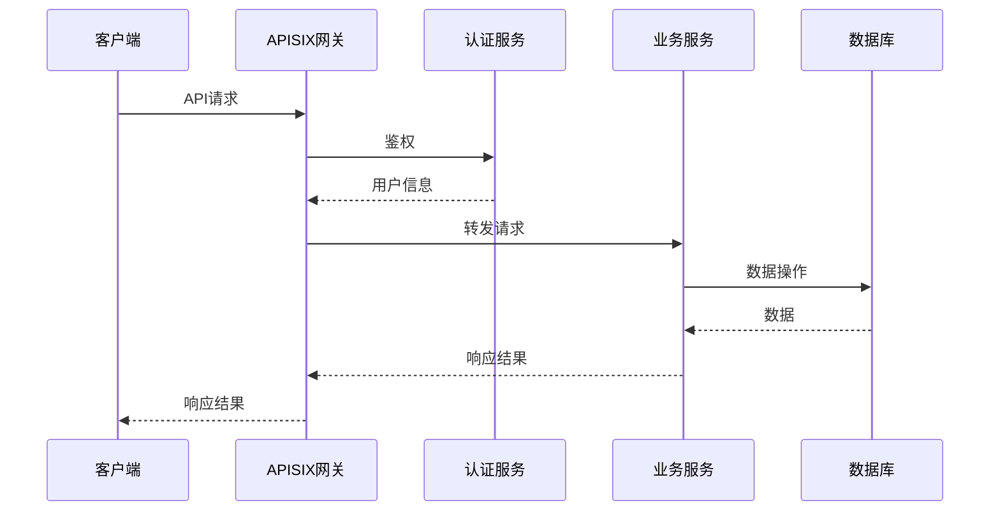

# API接口设计文档

## 📋 文档信息

- **项目名称**：企业级AI综合管理平台
- **文档版本**：v1.1
- **创建日期**：2026-01-13
- **最后更新**：2026-01-16
- **文档类型**：API接口设计文档
- **当前状态**：后端业务功能开发完成（100%），准备开始测试和前端开发

---

## 1. API设计规范

### 1.1 RESTful API规范

本系统遵循RESTful API设计规范，使用HTTP动词表示操作类型：

| HTTP方法 | 说明 | 示例 |
|---------|------|------|
| GET | 查询资源 | GET /api/v1/users |
| POST | 创建资源 | POST /api/v1/users |
| PUT | 更新资源（全量） | PUT /api/v1/users/{id} |
| PATCH | 更新资源（部分） | PATCH /api/v1/users/{id} |
| DELETE | 删除资源 | DELETE /api/v1/users/{id} |

### 1.2 URL规范

**URL格式**：`/api/v{version}/{module}/{resource}`

**示例**：
```
/api/v1/users          # 用户管理
/api/v1/roles          # 角色管理
/api/v1/mcp-tools      # MCP工具管理
```

### 1.3 HTTP状态码规范

| 状态码 | 说明 | 使用场景 |
|-------|------|---------|
| 200 | OK | 请求成功 |
| 201 | Created | 资源创建成功 |
| 204 | No Content | 请求成功，无返回内容 |
| 400 | Bad Request | 请求参数错误 |
| 401 | Unauthorized | 未授权 |
| 403 | Forbidden | 无权限 |
| 404 | Not Found | 资源不存在 |
| 409 | Conflict | 资源冲突 |
| 500 | Internal Server Error | 服务器内部错误 |

---

## 2. 接口命名规范

### 2.1 资源命名

- ✅ 使用复数名词：`/users`、`/roles`
- ✅ 使用小写字母：`/mcp-tools`
- ✅ 使用连字符分隔：`/user-roles`

### 2.2 操作命名

- ✅ 查询列表：`GET /users`
- ✅ 查询详情：`GET /users/{id}`
- ✅ 创建资源：`POST /users`
- ✅ 更新资源：`PUT /users/{id}`
- ✅ 删除资源：`DELETE /users/{id}`
- ✅ 批量操作：`POST /users/batch`

---

## 3. 请求/响应格式规范

### 3.1 请求格式

**Query参数**：
```
GET /api/v1/users?page=1&size=10&keyword=admin
```

**JSON Body**：
```json
{
  "username": "admin",
  "email": "admin@example.com",
  "password": "123456"
}
```

### 3.2 响应格式

**成功响应**：
```json
{
  "success": true,
  "code": 200,
  "message": "操作成功",
  "data": {
    "id": "1",
    "username": "admin",
    "email": "admin@example.com"
  },
  "timestamp": "2026-01-13T10:00:00Z"
}
```

**分页响应**：
```json
{
  "success": true,
  "code": 200,
  "message": "查询成功",
  "data": {
    "items": [...],
    "total": 100,
    "page": 1,
    "size": 10,
    "pages": 10
  }
}
```

**错误响应**：
```json
{
  "success": false,
  "code": 400,
  "message": "参数错误",
  "errors": [
    {
      "field": "username",
      "message": "用户名不能为空"
    }
  ],
  "timestamp": "2026-01-13T10:00:00Z"
}
```

---

## 4. 错误码规范

### 4.1 错误码格式

错误码格式：`{模块}{错误类型}{错误编号}`

- **模块**：2位数字（01=用户，02=角色，03=权限...）
- **错误类型**：1位数字（1=参数错误，2=业务错误，3=系统错误）
- **错误编号**：3位数字

### 4.2 通用错误码

| 错误码 | 说明 |
|-------|------|
| 00001 | 未知错误 |
| 00002 | 参数错误 |
| 00003 | 未授权 |
| 00004 | 无权限 |
| 00005 | 资源不存在 |
| 00006 | 资源已存在 |
| 00007 | 操作失败 |

---

## 5. 分页规范

### 5.1 分页参数

| 参数 | 类型 | 必填 | 说明 |
|-----|------|------|------|
| page | INT | 否 | 页码，默认1 |
| size | INT | 否 | 每页数量，默认10，最大100 |

### 5.2 分页响应

```json
{
  "success": true,
  "data": {
    "items": [...],
    "total": 100,
    "page": 1,
    "size": 10,
    "pages": 10
  }
}
```

---

## 6. 接口认证方式

### 6.1 JWT认证

**请求头**：
```
Authorization: Bearer {token}
```

### 6.2 API Key认证

**请求头**：
```
X-API-Key: {api_key}
```

---

## 7. API版本管理

### 7.1 版本管理策略

本系统采用**URL版本管理**策略，在URL路径中明确指定API版本。

**版本格式**：`/api/v{major_version}/{module}/{resource}`

**示例**：
```
/api/v1/users          # 用户管理 v1版本
/api/v2/users          # 用户管理 v2版本
/api/v1/mcp-tools      # MCP工具管理 v1版本
```

**版本管理原则**：
- ✅ 主版本号变更：不兼容的API修改
- ✅ 次版本号变更：向后兼容的功能新增
- ✅ 修订号变更：向后兼容的问题修复

### 7.2 版本演进规则

#### 7.2.1 发布新版本的条件

**主版本升级（v1 → v2）**：
- ✅ API路径变更
- ✅ 请求/响应格式重大变更
- ✅ 删除现有功能
- ✅ 修改必需参数

**次版本升级（v1.1 → v1.2）**：
- ✅ 新增API接口
- ✅ 新增可选参数
- ✅ 新增响应字段
- ✅ 性能优化

**修订号升级（v1.1.1 → v1.1.2）**：
- ✅ 修复Bug
- ✅ 文档更新
- ✅ 性能优化

#### 7.2.2 版本支持周期

| 版本类型 | 支持周期 | 说明 |
|---------|---------|------|
| **当前版本** | 长期支持 | 主要维护版本 |
| **上一个版本** | 6个月 | 继续维护，仅修复严重Bug |
| **更早版本** | 3个月 | 仅维护，不再添加新功能 |
| **废弃版本** | 1个月 | 仅安全修复，之后完全停止支持 |

**版本废弃流程**：
1. 发布新版本前3个月：发布公告
2. 发布新版本前1个月：发送邮件通知
3. 发布新版本时：在响应头中添加废弃警告
4. 废弃后1个月：完全停止支持

#### 7.2.3 版本废弃通知

**响应头通知**：
```
X-API-Deprecated: true
X-API-Deprecation-Date: 2026-06-01
X-API-Sunset: 2026-12-31
X-API-Replacement: /api/v2/users
```

**响应体通知**：
```json
{
  "success": true,
  "code": 200,
  "message": "操作成功",
  "data": {...},
  "warnings": [
    {
      "code": "API_DEPRECATED",
      "message": "此API版本已废弃，请升级到v2版本",
      "details": {
        "deprecated_date": "2026-06-01",
        "sunset_date": "2026-12-31",
        "replacement": "/api/v2/users"
      }
    }
  ]
}
```

### 7.3 版本管理实现

#### 7.3.1 FastAPI版本路由

**路由配置**：
```python
# app/main.py
from fastapi import FastAPI
from app.api.v1 import api_router as api_router_v1
from app.api.v2 import api_router as api_router_v2

app = FastAPI(title="企业级AI综合管理平台")

# 注册v1版本路由
app.include_router(
    api_router_v1,
    prefix="/api/v1",
    tags=["v1"]
)

# 注册v2版本路由
app.include_router(
    api_router_v2,
    prefix="/api/v2",
    tags=["v2"]
)
```

**版本路由器**：
```python
# app/api/v1/__init__.py
from fastapi import APIRouter

api_router = APIRouter()

from app.api.v1 import auth, users, roles, permissions, menus

api_router.include_router(auth.router, prefix="/auth", tags=["认证"])
api_router.include_router(users.router, prefix="/users", tags=["用户"])
api_router.include_router(roles.router, prefix="/roles", tags=["角色"])
api_router.include_router(permissions.router, prefix="/permissions", tags=["权限"])
api_router.include_router(menus.router, prefix="/menus", tags=["菜单"])
```

#### 7.3.2 版本兼容性检查

**版本检查中间件**：
```python
# app/middleware/version.py
from fastapi import Request, HTTPException
from fastapi.responses import JSONResponse

DEPRECATED_VERSIONS = {
    "v1": {
        "deprecated_date": "2026-06-01",
        "sunset_date": "2026-12-31",
        "replacement": "v2"
    }
}

async def check_version(request: Request, call_next):
    """检查API版本是否废弃"""
    path = request.url.path
    
    # 提取版本号
    if path.startswith("/api/v"):
        version = path.split("/")[2]
        
        # 检查是否废弃
        if version in DEPRECATED_VERSIONS:
            version_info = DEPRECATED_VERSIONS[version]
            
            # 添加废弃警告头
            response = await call_next(request)
            
            response.headers["X-API-Deprecated"] = "true"
            response.headers["X-API-Deprecation-Date"] = version_info["deprecated_date"]
            response.headers["X-API-Sunset"] = version_info["sunset_date"]
            response.headers["X-API-Replacement"] = f"/api/{version_info['replacement']}{path[7:]}"
            
            # 添加警告信息
            if hasattr(response, "body_iterator"):
                # 如果是JSON响应，添加警告信息
                response_body = b""
                async for chunk in response.body_iterator:
                    response_body += chunk
                
                import json
                body = json.loads(response_body.decode())
                if isinstance(body, dict):
                    body.setdefault("warnings", []).append({
                        "code": "API_DEPRECATED",
                        "message": f"此API版本已废弃，请升级到{version_info['replacement']}版本",
                        "details": version_info
                    })
                    response_body = json.dumps(body).encode()
                    
                    # 创建新的响应
                    new_response = JSONResponse(
                        content=body,
                        status_code=response.status_code,
                        headers=dict(response.headers)
                    )
                    return new_response
            
            return response
    
    return await call_next(request)
```

**注册中间件**：
```python
# app/main.py
from app.middleware.version import check_version

app.middleware("http")(check_version)
```

#### 7.3.3 版本降级策略

**自动降级**：
```python
# app/middleware/version_fallback.py
from fastapi import Request, HTTPException
from fastapi.responses import RedirectResponse

AVAILABLE_VERSIONS = ["v1", "v2"]

async def version_fallback(request: Request, call_next):
    """版本降级策略"""
    path = request.url.path
    
    if path.startswith("/api/v"):
        version = path.split("/")[2]
        
        # 如果请求的版本不存在，降级到最新版本
        if version not in AVAILABLE_VERSIONS:
            latest_version = AVAILABLE_VERSIONS[-1]
            new_path = path.replace(f"/api/{version}", f"/api/{latest_version}")
            
            # 添加版本降级警告头
            response = await call_next(request)
            response.headers["X-API-Version-Fallback"] = "true"
            response.headers["X-API-Original-Version"] = version
            response.headers["X-API-Fallback-Version"] = latest_version
            
            return response
    
    return await call_next(request)
```

### 7.4 版本管理最佳实践

**版本发布最佳实践**：
- ✅ 保持向后兼容性，避免破坏性变更
- ✅ 新版本发布前充分测试
- ✅ 提前3个月发布废弃通知
- ✅ 提供详细的迁移指南
- ✅ 保持至少2个版本的并行支持

**版本维护最佳实践**：
- ✅ 定期检查版本使用情况
- ✅ 及时修复废弃版本的严重Bug
- ✅ 提供版本升级工具
- ✅ 记录版本变更日志
- ✅ 监控旧版本的使用情况

**客户端适配最佳实践**：
- ✅ 客户端支持版本协商
- ✅ 客户端处理废弃警告
- ✅ 客户端实现自动升级
- ✅ 客户端缓存版本信息
- ✅ 客户端记录版本切换日志

### 7.5 版本变更日志

**v2.0.0 (2026-06-01)**：
- ✨ 新增：工作流管理API
- ✨ 新增：待办任务管理API
- 🔄 变更：用户API响应格式优化
- 🗑️ 废弃：旧版权限API（使用v2版本）

**v1.1.0 (2026-03-01)**：
- ✨ 新增：MCP工具管理API
- ✨ 新增：多数据源管理API
- 🐛 修复：用户查询性能问题

**v1.0.0 (2026-01-01)**：
- 🎉 初始版本发布
- ✨ 基础功能：用户、角色、权限、菜单管理

---

## 8. 接口列表

### 8.1 认证域服务接口（端口8001）

| 接口 | 方法 | 路径 | 说明 |
|-----|------|------|------|
| 用户登录 | POST | /api/v1/auth/login | 用户登录，返回JWT Token |
| 用户登出 | POST | /api/v1/auth/logout | 用户登出，吊销Token |
| 刷新Token | POST | /api/v1/auth/refresh | 刷新JWT Token |
| 获取用户信息 | GET | /api/v1/auth/me | 获取当前登录用户信息 |
| 创建API Key | POST | /api/v1/auth/api-keys | 创建API Key |
| 删除API Key | DELETE | /api/v1/auth/api-keys/{id} | 删除API Key |
| 验证权限 | POST | /api/v1/auth/verify | 验证用户权限 |

### 8.2 用户域服务接口（端口8002）

#### 7.2.1 用户管理

| 接口 | 方法 | 路径 | 说明 |
|-----|------|------|------|
| 查询用户列表 | GET | /api/v1/users | 分页查询用户列表 |
| 查询用户详情 | GET | /api/v1/users/{id} | 查询用户详情 |
| 创建用户 | POST | /api/v1/users | 创建新用户 |
| 更新用户 | PUT | /api/v1/users/{id} | 更新用户信息 |
| 删除用户 | DELETE | /api/v1/users/{id} | 删除用户 |
| 启用/禁用用户 | PATCH | /api/v1/users/{id}/status | 启用或禁用用户 |
| 重置密码 | POST | /api/v1/users/{id}/reset-password | 重置用户密码 |
| 分配角色 | POST | /api/v1/users/{id}/roles | 为用户分配角色 |

#### 7.2.2 部门管理

| 接口 | 方法 | 路径 | 说明 |
|-----|------|------|------|
| 查询部门树 | GET | /api/v1/departments/tree | 查询部门树结构 |
| 查询部门列表 | GET | /api/v1/departments | 分页查询部门列表 |
| 查询部门详情 | GET | /api/v1/departments/{id} | 查询部门详情 |
| 创建部门 | POST | /api/v1/departments | 创建新部门 |
| 更新部门 | PUT | /api/v1/departments/{id} | 更新部门信息 |
| 删除部门 | DELETE | /api/v1/departments/{id} | 删除部门 |
| 移动部门 | POST | /api/v1/departments/{id}/move | 移动部门位置 |

#### 7.2.3 租户管理

| 接口 | 方法 | 路径 | 说明 |
|-----|------|------|------|
| 查询租户列表 | GET | /api/v1/tenants | 分页查询租户列表 |
| 查询租户详情 | GET | /api/v1/tenants/{id} | 查询租户详情 |
| 创建租户 | POST | /api/v1/tenants | 创建新租户 |
| 更新租户 | PUT | /api/v1/tenants/{id} | 更新租户信息 |
| 删除租户 | DELETE | /api/v1/tenants/{id} | 删除租户 |
| 检查租户配额 | GET | /api/v1/tenants/{id}/quota/{quota_type} | 检查租户资源配额 |
| 获取所有套餐 | GET | /api/v1/tenants/packages | 获取所有套餐信息 |
| 续费租户 | POST | /api/v1/tenants/{id}/renew | 续费租户 |

#### 7.2.4 岗位管理

| 接口 | 方法 | 路径 | 说明 |
|-----|------|------|------|
| 查询岗位列表 | GET | /api/v1/positions | 分页查询岗位列表 |
| 查询岗位详情 | GET | /api/v1/positions/{id} | 查询岗位详情 |
| 创建岗位 | POST | /api/v1/positions | 创建新岗位 |
| 更新岗位 | PUT | /api/v1/positions/{id} | 更新岗位信息 |
| 删除岗位 | DELETE | /api/v1/positions/{id} | 删除岗位 |

### 8.3 权限域服务接口（端口8003）

#### 7.3.1 角色管理

| 接口 | 方法 | 路径 | 说明 |
|-----|------|------|------|
| 查询角色列表 | GET | /api/v1/roles | 分页查询角色列表 |
| 查询角色详情 | GET | /api/v1/roles/{id} | 查询角色详情 |
| 创建角色 | POST | /api/v1/roles | 创建新角色 |
| 更新角色 | PUT | /api/v1/roles/{id} | 更新角色信息 |
| 删除角色 | DELETE | /api/v1/roles/{id} | 删除角色 |
| 分配权限 | POST | /api/v1/roles/{id}/permissions | 为角色分配权限 |
| 获取角色权限 | GET | /api/v1/roles/{id}/permissions | 获取角色的所有权限 |
| 检查角色权限 | GET | /api/v1/roles/{id}/check-permission/{permission_code} | 检查角色是否有指定权限 |
| 分配菜单 | POST | /api/v1/roles/{id}/menus | 为角色分配菜单 |
| 获取角色菜单 | GET | /api/v1/roles/{id}/menus | 获取角色的所有菜单 |

#### 7.3.2 权限管理

| 接口 | 方法 | 路径 | 说明 |
|-----|------|------|------|
| 查询权限列表 | GET | /api/v1/permissions | 分页查询权限列表 |
| 查询权限详情 | GET | /api/v1/permissions/{id} | 查询权限详情 |
| 创建权限 | POST | /api/v1/permissions | 创建新权限 |
| 更新权限 | PUT | /api/v1/permissions/{id} | 更新权限信息 |
| 删除权限 | DELETE | /api/v1/permissions/{id} | 删除权限 |

#### 7.3.3 菜单管理

| 接口 | 方法 | 路径 | 说明 |
|-----|------|------|------|
| 查询菜单树 | GET | /api/v1/menus/tree | 查询菜单树结构 |
| 查询用户菜单 | GET | /api/v1/menus/user | 查询当前用户可访问的菜单 |
| 查询菜单列表 | GET | /api/v1/menus | 分页查询菜单列表 |
| 查询菜单详情 | GET | /api/v1/menus/{id} | 查询菜单详情 |
| 创建菜单 | POST | /api/v1/menus | 创建新菜单 |
| 更新菜单 | PUT | /api/v1/menus/{id} | 更新菜单信息 |
| 删除菜单 | DELETE | /api/v1/menus/{id} | 删除菜单 |

### 8.4 系统域服务接口（端口8004）

#### 7.4.1 MCP工具管理

| 接口 | 方法 | 路径 | 说明 |
|-----|------|------|------|
| 查询API端点列表 | GET | /api/v1/mcp-tools/endpoints | 查询可注册为MCP工具的API端点 |
| 查询MCP工具列表 | GET | /api/v1/mcp-tools | 分页查询MCP工具列表 |
| 查询MCP工具详情 | GET | /api/v1/mcp-tools/{id} | 查询MCP工具详情 |
| 注册MCP工具 | POST | /api/v1/mcp-tools/register | 将API端点注册为MCP工具 |
| 取消注册MCP工具 | DELETE | /api/v1/mcp-tools/unregister/{path}/{method} | 取消MCP工具注册 |
| 执行MCP工具 | POST | /api/v1/mcp-tools/execute | 执行MCP工具 |
| 查询工具调用日志 | GET | /api/v1/mcp-tools/{id}/logs | 查询工具调用日志 |

#### 7.4.2 多数据源管理

| 接口 | 方法 | 路径 | 说明 |
|-----|------|------|------|
| 查询单个数据源 | POST | /api/v1/multi-db/query | 查询单个数据源 |
| 查询多个数据源 | POST | /api/v1/multi-db/query-multiple | 同时查询多个数据源 |
| 跨数据源关联查询 | POST | /api/v1/multi-db/query-join | 跨数据源关联查询 |
| 执行自定义SQL | POST | /api/v1/multi-db/execute-sql | 执行自定义SQL |
| 执行跨数据源事务 | POST | /api/v1/multi-db/transaction | 执行跨数据源事务 |
| 数据源健康检查 | GET | /api/v1/multi-db/health-check | 检查数据源健康状态 |

#### 7.4.3 字典管理

| 接口 | 方法 | 路径 | 说明 |
|-----|------|------|------|
| 查询字典列表 | GET | /api/v1/dicts | 分页查询字典列表 |
| 查询字典详情 | GET | /api/v1/dicts/{id} | 查询字典详情 |
| 创建字典 | POST | /api/v1/dicts | 创建新字典 |
| 更新字典 | PUT | /api/v1/dicts/{id} | 更新字典信息 |
| 删除字典 | DELETE | /api/v1/dicts/{id} | 删除字典 |
| 查询字典项列表 | GET | /api/v1/dicts/{id}/items | 查询字典项列表 |
| 创建字典项 | POST | /api/v1/dicts/{id}/items | 创建字典项 |
| 更新字典项 | PUT | /api/v1/dicts/{id}/items/{item_id} | 更新字典项 |
| 删除字典项 | DELETE | /api/v1/dicts/{id}/items/{item_id} | 删除字典项 |

#### 7.4.4 系统配置

| 接口 | 方法 | 路径 | 说明 |
|-----|------|------|------|
| 查询系统配置 | GET | /api/v1/system/config | 查询系统配置 |
| 更新系统配置 | PUT | /api/v1/system/config | 更新系统配置 |

#### 7.4.5 错误码管理

| 接口 | 方法 | 路径 | 说明 |
|-----|------|------|------|
| 查询错误码列表 | GET | /api/v1/error-codes | 分页查询错误码列表 |
| 创建错误码 | POST | /api/v1/error-codes | 创建错误码 |
| 更新错误码 | PUT | /api/v1/error-codes/{id} | 更新错误码 |
| 删除错误码 | DELETE | /api/v1/error-codes/{id} | 删除错误码 |

### 8.5 支撑域服务接口（端口8005）

#### 7.5.1 日志审计

| 接口 | 方法 | 路径 | 说明 |
|-----|------|------|------|
| 查询登录日志 | GET | /api/v1/logs/login | 分页查询登录日志 |
| 查询操作日志 | GET | /api/v1/logs/operation | 分页查询操作日志 |

#### 7.5.2 通知管理

| 接口 | 方法 | 路径 | 说明 |
|-----|------|------|------|
| 查询通知列表 | GET | /api/v1/notifications | 分页查询通知列表 |
| 查询未读通知数 | GET | /api/v1/notifications/unread-count | 查询未读通知数量 |
| 标记通知已读 | POST | /api/v1/notifications/{id}/read | 标记通知已读 |
| 批量标记已读 | POST | /api/v1/notifications/read-all | 批量标记通知已读 |
| 创建通知 | POST | /api/v1/notifications | 创建通知 |

#### 7.5.3 敏感词管理

| 接口 | 方法 | 路径 | 说明 |
|-----|------|------|------|
| 查询敏感词列表 | GET | /api/v1/sensitive-words | 分页查询敏感词列表 |
| 创建敏感词 | POST | /api/v1/sensitive-words | 创建敏感词 |
| 更新敏感词 | PUT | /api/v1/sensitive-words/{id} | 更新敏感词 |
| 删除敏感词 | DELETE | /api/v1/sensitive-words/{id} | 删除敏感词 |

#### 7.5.4 地区管理

| 接口 | 方法 | 路径 | 说明 |
|-----|------|------|------|
| 查询省份列表 | GET | /api/v1/regions/provinces | 查询省份列表 |
| 查询城市列表 | GET | /api/v1/regions/cities | 查询城市列表 |
| 查询区镇列表 | GET | /api/v1/regions/districts | 查询区镇列表 |

#### 7.5.5 待办任务管理

| 接口 | 方法 | 路径 | 说明 |
|-----|------|------|------|
| 查询待办任务列表 | GET | /api/v1/todo/tasks | 分页查询待办任务列表 |
| 查询待办任务详情 | GET | /api/v1/todo/tasks/{id} | 查询待办任务详情 |
| 创建待办任务 | POST | /api/v1/todo/tasks | 创建待办任务 |
| 更新待办任务 | PUT | /api/v1/todo/tasks/{id} | 更新待办任务 |
| 删除待办任务 | DELETE | /api/v1/todo/tasks/{id} | 删除待办任务 |
| 标记任务完成 | POST | /api/v1/todo/tasks/{id}/complete | 标记任务完成 |
| 取消任务完成 | POST | /api/v1/todo/tasks/{id}/uncomplete | 取消任务完成 |

#### 7.5.6 每日计划管理

| 接口 | 方法 | 路径 | 说明 |
|-----|------|------|------|
| 查询今日计划 | GET | /api/v1/todo/daily-plan/today | 查询今日计划 |
| 创建每日计划 | POST | /api/v1/todo/daily-plan | 创建每日计划 |
| 更新每日计划 | PUT | /api/v1/todo/daily-plan/{id} | 更新每日计划 |
| 完成每日计划任务 | POST | /api/v1/todo/daily-plan/{id}/complete | 完成每日计划任务 |
| 查询每日计划历史 | GET | /api/v1/todo/daily-plan/history | 查询每日计划历史 |

#### 7.5.7 首页看板待办任务

| 接口 | 方法 | 路径 | 说明 |
|-----|------|------|------|
| 查询待办任务列表 | GET | /api/v1/dashboard/todo/pending-tasks | 查询待办任务列表（首页） |

---

### 8.6 业务域服务接口（端口8006）

#### 7.6.1 工作流定义管理

| 接口 | 方法 | 路径 | 说明 |
|-----|------|------|------|
| 查询工作流定义列表 | GET | /api/v1/workflow/definitions | 分页查询工作流定义 |
| 查询工作流定义详情 | GET | /api/v1/workflow/definitions/{id} | 查询工作流定义详情 |
| 创建工作流定义 | POST | /api/v1/workflow/definitions | 创建工作流定义 |
| 更新工作流定义 | PUT | /api/v1/workflow/definitions/{id} | 更新工作流定义 |
| 删除工作流定义 | DELETE | /api/v1/workflow/definitions/{id} | 删除工作流定义 |
| 发布工作流定义 | POST | /api/v1/workflow/definitions/{id}/publish | 发布工作流定义 |
| 复制工作流定义 | POST | /api/v1/workflow/definitions/{id}/copy | 复制工作流定义 |

#### 7.6.2 工作流实例管理

| 接口 | 方法 | 路径 | 说明 |
|-----|------|------|------|
| 查询工作流实例列表 | GET | /api/v1/workflow/instances | 分页查询工作流实例 |
| 查询工作流实例详情 | GET | /api/v1/workflow/instances/{id} | 查询工作流实例详情 |
| 创建工作流实例 | POST | /api/v1/workflow/instances | 创建工作流实例 |
| 终止工作流实例 | POST | /api/v1/workflow/instances/{id}/terminate | 终止工作流实例 |
| 查询工作流实例进度 | GET | /api/v1/workflow/instances/{id}/progress | 查询工作流实例进度 |

#### 7.6.3 工作流任务管理

| 接口 | 方法 | 路径 | 说明 |
|-----|------|------|------|
| 查询待办任务列表 | GET | /api/v1/workflow/tasks/pending | 查询待办审批任务列表 |
| 查询已办任务列表 | GET | /api/v1/workflow/tasks/completed | 查询已办审批任务列表 |
| 查询抄送任务列表 | GET | /api/v1/workflow/tasks/copy | 查询抄送任务列表 |
| 查询任务详情 | GET | /api/v1/workflow/tasks/{id} | 查询任务详情 |
| 处理审批任务 | POST | /api/v1/workflow/tasks/{id}/approve | 处理审批任务（同意） |
| 驳回审批任务 | POST | /api/v1/workflow/tasks/{id}/reject | 驳回审批任务 |
| 转交审批任务 | POST | /api/v1/workflow/tasks/{id}/transfer | 转交审批任务 |
| 添加审批评论 | POST | /api/v1/workflow/tasks/{id}/comment | 添加审批评论 |

#### 7.6.4 工作流模板管理

| 接口 | 方法 | 路径 | 说明 |
|-----|------|------|------|
| 查询工作流模板列表 | GET | /api/v1/workflow/templates | 查询工作流模板列表 |
| 查询工作流模板详情 | GET | /api/v1/workflow/templates/{id} | 查询工作流模板详情 |
| 从模板创建工作流 | POST | /api/v1/workflow/templates/{id}/create | 从模板创建工作流定义 |

#### 7.6.5 首页看板工作流统计

| 接口 | 方法 | 路径 | 说明 |
|-----|------|------|------|
| 查询工作流统计 | GET | /api/v1/dashboard/workflow/stats | 查询工作流统计数据 |
| 查询待办审批任务 | GET | /api/v1/dashboard/workflow/pending-tasks | 查询待办审批任务列表 |

#### 7.6.6 预留业务接口

| 接口 | 方法 | 路径 | 说明 |
|-----|------|------|------|
| 订单管理 | - | /api/v1/business/orders | 预留：订单管理接口 |
| 商品管理 | - | /api/v1/business/products | 预留：商品管理接口 |
| 报表统计 | - | /api/v1/business/reports | 预留：报表统计接口 |

---

## 9. API接口分类图

```mermaid
graph TB
    API[API接口] --> Auth[认证授权]
    API --> User[用户管理]
    API --> Tenant[多租户]
    API --> Dept[部门管理]
    API --> Role[角色权限]
    API --> Menu[菜单管理]
    API --> MCP[MCP工具管理]
    API --> MultiDB[多数据源]
    API --> Dict[字典管理]
    API --> Log[日志审计]
    API --> Notify[通知]
    

### 8.9 字典管理接口

| 接口 | 方法 | 路径 | 说明 |
|-----|------|------|------|
| 查询字典列表 | GET | /api/v1/dicts | 分页查询字典列表 |
| 查询字典详情 | GET | /api/v1/dicts/{id} | 查询字典详情 |
| 创建字典 | POST | /api/v1/dicts | 创建新字典 |
| 更新字典 | PUT | /api/v1/dicts/{id} | 更新字典信息 |
| 删除字典 | DELETE | /api/v1/dicts/{id} | 删除字典 |
| 查询字典项列表 | GET | /api/v1/dicts/{id}/items | 查询字典项列表 |
| 创建字典项 | POST | /api/v1/dicts/{id}/items | 创建字典项 |
| 更新字典项 | PUT | /api/v1/dicts/{id}/items/{item_id} | 更新字典项 |
| 删除字典项 | DELETE | /api/v1/dicts/{id}/items/{item_id} | 删除字典项 |

### 8.10 日志审计接口

| 接口 | 方法 | 路径 | 说明 |
|-----|------|------|------|
| 查询登录日志 | GET | /api/v1/logs/login | 分页查询登录日志 |
| 查询操作日志 | GET | /api/v1/logs/operation | 分页查询操作日志 |

### 8.11 通知接口

| 接口 | 方法 | 路径 | 说明 |
|-----|------|------|------|
| 查询通知列表 | GET | /api/v1/notifications | 分页查询通知列表 |
| 查询未读通知数 | GET | /api/v1/notifications/unread-count | 查询未读通知数量 |
| 标记通知已读 | POST | /api/v1/notifications/{id}/read | 标记通知已读 |
| 批量标记已读 | POST | /api/v1/notifications/read-all | 批量标记通知已读 |
| 创建通知 | POST | /api/v1/notifications | 创建通知 |

---

---

## 10. 新增接口详细说明

### 10.1 租户管理新增接口

#### 10.1.1 检查租户配额

**接口路径**：`GET /api/v1/tenants/{id}/quota/{quota_type}`

**请求参数**：
- `id`：租户ID
- `quota_type`：配额类型（users/departments/storage）

**响应示例**：
```json
{
  "success": true,
  "code": 200,
  "message": "查询成功",
  "data": {
    "quota_type": "users",
    "used": 50,
    "max": 100,
    "available": 50,
    "percentage": 50.0
  }
}
```

#### 10.1.2 获取所有套餐

**接口路径**：`GET /api/v1/tenants/packages`

**响应示例**：
```json
{
  "success": true,
  "code": 200,
  "message": "查询成功",
  "data": [
    {
      "package_id": "free",
      "name": "免费版",
      "description": "基础功能，适合小型团队",
      "max_users": 10,
      "max_departments": 5,
      "max_storage": 1024,
      "price": 0,
      "duration_days": 365
    },
    {
      "package_id": "basic",
      "name": "基础版",
      "description": "标准功能，适合中型团队",
      "max_users": 50,
      "max_departments": 20,
      "max_storage": 5120,
      "price": 999,
      "duration_days": 365
    },
    {
      "package_id": "professional",
      "name": "专业版",
      "description": "完整功能，适合大型团队",
      "max_users": 200,
      "max_departments": 100,
      "max_storage": 20480,
      "price": 2999,
      "duration_days": 365
    },
    {
      "package_id": "enterprise",
      "name": "企业版",
      "description": "全部功能，支持定制",
      "max_users": 1000,
      "max_departments": 500,
      "max_storage": 102400,
      "price": 9999,
      "duration_days": 365
    }
  ]
}
```

#### 10.1.3 续费租户

**接口路径**：`POST /api/v1/tenants/{id}/renew`

**请求Body**：
```json
{
  "package_id": "professional",
  "duration_days": 365
}
```

**响应示例**：
```json
{
  "success": true,
  "code": 200,
  "message": "续费成功",
  "data": {
    "tenant_id": "tenant_001",
    "expires_at": "2027-01-16T12:00:00",
    "package_id": "professional"
  }
}
```

### 10.2 角色管理新增接口

#### 10.2.1 获取角色权限

**接口路径**：`GET /api/v1/roles/{id}/permissions`

**响应示例**：
```json
{
  "success": true,
  "code": 200,
  "message": "查询成功",
  "data": {
    "role_id": "role_001",
    "role_name": "管理员",
    "permissions": [
      {
        "id": "perm_001",
        "name": "用户管理",
        "code": "user:manage",
        "type": "menu"
      },
      {
        "id": "perm_002",
        "name": "角色管理",
        "code": "role:manage",
        "type": "menu"
      }
    ]
  }
}
```

#### 10.2.2 检查角色权限

**接口路径**：`GET /api/v1/roles/{id}/check-permission/{permission_code}`

**响应示例**：
```json
{
  "success": true,
  "code": 200,
  "message": "查询成功",
  "data": {
    "role_id": "role_001",
    "permission_code": "user:manage",
    "has_permission": true
  }
}
```

#### 10.2.3 获取角色菜单

**接口路径**：`GET /api/v1/roles/{id}/menus`

**响应示例**：
```json
{
  "success": true,
  "code": 200,
  "message": "查询成功",
  "data": {
    "role_id": "role_001",
    "role_name": "管理员",
    "menus": [
      {
        "id": "menu_001",
        "name": "系统管理",
        "code": "system",
        "path": "/system",
        "icon": "setting",
        "children": [
          {
            "id": "menu_002",
            "name": "用户管理",
            "code": "system:user",
            "path": "/system/user",
            "icon": "user"
          }
        ]
      }
    ]
  }
}
```

---

## 11. 请求流程图



---

## 🔗 相关文档

- [技术架构设计文档](./2-技术架构设计文档.md)
- [数据库设计文档](./3-数据库设计文档.md)
- [前端架构设计文档](./5-前端架构设计文档.md)

---

## 💡 注意事项

1. **接口版本**：使用URL路径版本控制（/api/v1/）
2. **幂等性**：GET、PUT、DELETE操作必须保证幂等性
3. **安全性**：所有接口必须进行鉴权，公开接口除外
4. **限流**：对高频接口进行限流，防止滥用
5. **文档更新**：接口变更时及时更新文档

---

**文档版本历史**：

| 版本 | 日期 | 更新内容 | 更新人 |
|-----|------|---------|-------|
| v1.0 | 2026-01-13 | 初始版本，定义API设计规范 | AI |
| v1.1 | 2026-01-16 | 新增租户管理接口（检查配额、获取套餐、续费）<br>新增角色管理接口（获取权限、检查权限、获取菜单）<br>完善接口详细说明 | AI |

---

**最后更新时间**：2026-01-16
**下次更新时间**：完成P1重要功能后

| 版本 | 日期 | 作者 | 变更说明 |
|-----|------|------|---------|
| v1.0 | 2026-01-13 | AI助手 | 初始版本 |

---