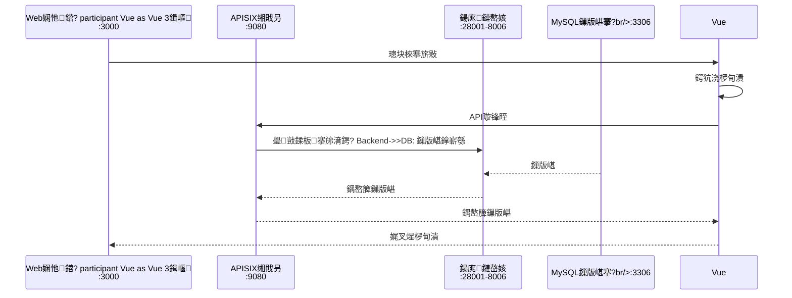

# 鍓嶇鏋舵瀯璁捐鏂囨。

## 馃搵 鏂囨。淇℃伅

- **椤圭洰鍚嶇О**锛氫紒涓氱骇AI缁煎悎绠＄悊骞冲彴
- **鏂囨。鐗堟湰**锛歷1.0
- **鍒涘缓鏃ユ湡**锛?026-01-13
- **鏈€鍚庢洿鏂?*锛?026-01-16
- **鏂囨。绫诲瀷**锛氬墠绔灦鏋勮璁℃枃妗?- **褰撳墠鐘舵€?*锛氬悗绔笟鍔″姛鑳藉紑鍙戝畬鎴愶紙100%锛夛紝鍑嗗寮€濮嬫祴璇曞拰鍓嶇寮€鍙?
---

## 0. 鍓嶅悗绔垎绂绘灦鏋勮鏄?
### 0.1 鏋舵瀯姒傝堪

鏈郴缁熼噰鐢?*鍓嶅悗绔垎绂绘灦鏋?*锛屽墠绔拰鍚庣瀹屽叏鐙珛寮€鍙戝拰閮ㄧ讲锛?
| 绫诲瀷 | 搴旂敤 | 鎶€鏈爤 | 绔彛 | 鑱岃矗 |
|-----|------|--------|------|------|
| **鍓嶇** | Vue 3鍓嶇搴旂敤 | Vue 3 + TypeScript + Element Plus | 3000 | 鐢ㄦ埛鐣岄潰銆佷氦浜掗€昏緫 |
| **鍚庣** | 6涓井鏈嶅姟 | FastAPI + Python 3.13 | 8001-8006 | 涓氬姟閫昏緫澶勭悊銆佹暟鎹瓨鍌?|

### 0.2 鍓嶅悗绔氦浜掓祦绋?


### 0.3 鍓嶇绔彛閰嶇疆

| 鐜 | 绔彛 | 璇存槑 |
|-----|------|------|
| **寮€鍙戠幆澧?* | 3000 | Vite寮€鍙戞湇鍔″櫒 |
| **鐢熶骇鐜** | 3000 | Nginx闈欐€佽祫婧愭湇鍔?|

### 0.4 鍚庣鏈嶅姟绔彛

| 鏈嶅姟 | 绔彛 | 璇存槑 |
|-----|------|------|
| 璁よ瘉鍩熸湇鍔?| 8001 | 璁よ瘉鎺堟潈 |
| 鐢ㄦ埛鍩熸湇鍔?| 8002 | 鐢ㄦ埛銆侀儴闂ㄣ€佺鎴风鐞?|
| 鏉冮檺鍩熸湇鍔?| 8003 | 瑙掕壊銆佹潈闄愩€佽彍鍗曠鐞?|
| 绯荤粺鍩熸湇鍔?| 8004 | MCP宸ュ叿銆佸鏁版嵁婧愩€佸瓧鍏哥鐞?|
| 鏀拺鍩熸湇鍔?| 8005 | 鏃ュ織銆侀€氱煡绠＄悊 |
| 涓氬姟鍩熸湇鍔?| 8006 | 宸ヤ綔娴佺鐞?|

### 0.5 API缃戝叧閰嶇疆

鍓嶇閫氳繃APISIX缃戝叧璁块棶鍚庣鏈嶅姟锛岀綉鍏崇粺涓€澶勭悊锛?- 璺敱杞彂
- 闄愭祦鐔旀柇
- 璁よ瘉閴存潈
- 鏃ュ織璁板綍

**寮€鍙戠幆澧冮厤缃?*锛?```bash
VITE_API_BASE_URL=http://localhost:9080/api/v1
```

**鐢熶骇鐜閰嶇疆**锛?```bash
VITE_API_BASE_URL=https://api.example.com/api/v1
```

---

## 1. Vue鎶€鏈爤璇存槑

### 1.1 鎶€鏈€夊瀷

| 鎶€鏈粍浠?| 閫夊瀷 | 鐗堟湰 | 閫夊瀷鐞嗙敱 |
|---------|------|------|---------|
| **妗嗘灦** | Vue | 3.3+ | 娓愯繘寮忔鏋躲€佺敓鎬佹垚鐔熴€佹€ц兘浼樼 |
| **璇█** | TypeScript | 5.0+ | 绫诲瀷瀹夊叏銆佸紑鍙戜綋楠屽ソ銆佸噺灏戦敊璇?|
| **鏋勫缓宸ュ叿** | Vite | 5.0+ | 蹇€熴€佺幇浠ｅ寲銆佹敮鎸佺儹鏇存柊 |
| **璺敱** | Vue Router | 4.2+ | 瀹樻柟璺敱銆佸姛鑳藉畬鍠勩€佹敮鎸佸姩鎬佽矾鐢?|
| **鐘舵€佺鐞?* | Pinia | 2.1+ | 瀹樻柟鐘舵€佺鐞嗐€佺畝鍗曟槗鐢ㄣ€佹敮鎸乀ypeScript |
| **UI缁勪欢搴?* | Element Plus | 2.4+ | 鍔熻兘瀹屽杽銆佽璁＄編瑙傘€乀ypeScript鏀寔 |
| **HTTP瀹㈡埛绔?* | Axios | 1.6+ | 鍔熻兘寮哄ぇ銆佹槗鐢ㄣ€佹敮鎸佹嫤鎴櫒 |
| **浠ｇ爜瑙勮寖** | ESLint + Prettier | 鏈€鏂?| 浠ｇ爜璐ㄩ噺淇濊瘉銆佹牸寮忕粺涓€ |
| **CSS棰勫鐞?* | SCSS | 鏈€鏂?| 鍔熻兘寮哄ぇ銆佹敮鎸佸彉閲忋€佸祵濂?|

---

## 2. 鍓嶇鏋舵瀯璁捐

### 2.1 鏁翠綋鏋舵瀯

```mermaid
graph TB
    subgraph "瑙嗗浘灞?
        Pages[椤甸潰缁勪欢]
        Components[涓氬姟缁勪欢]
    end
    
    subgraph "缁勪欢灞?
        Layout[甯冨眬缁勪欢]
        Common[鍏叡缁勪欢]
    end
    
    subgraph "閫昏緫灞?
        Composables[缁勫悎寮忓嚱鏁癩
        Hooks[鑷畾涔塇ooks]
        Directives[鑷畾涔夋寚浠
    end
    
    subgraph "鐘舵€佸眰"
        Pinia[Pinia鐘舵€佺鐞哴
        LocalStorage[鏈湴瀛樺偍]
    end
    
    subgraph "鏁版嵁灞?
        API[API鎺ュ彛]
        Utils[宸ュ叿鍑芥暟]
        Request[Axios璇锋眰]
    end
    
    subgraph "璺敱灞?
        Router[Vue Router]
        Guards[璺敱瀹堝崼]
    end
    
    Pages --> Components
    Components --> Layout
    Components --> Common
    Pages --> Composables
    Pages --> Hooks
    Pages --> Pinia
    Pinia --> LocalStorage
    Pages --> API
    API --> Request
    API --> Utils
    Pages --> Router
    Router --> Guards
    Guards --> Pinia
```

---

## 3. 缁勪欢璁捐瑙勮寖

### 3.1 缁勪欢鍒嗙被

#### 3.1.1 甯冨眬缁勪欢锛坙ayouts/锛?
- **DefaultLayout**锛氶粯璁ゅ竷灞€锛堜晶杈规爮銆侀《閮ㄥ鑸€佸唴瀹瑰尯锛?- **BlankLayout**锛氱┖鐧藉竷灞€锛堢櫥褰曢〉銆侀敊璇〉锛?
#### 3.1.2 鍏叡缁勪欢锛坈omponents/common/锛?
- **Table**锛氶€氱敤琛ㄦ牸缁勪欢
- **Form**锛氶€氱敤琛ㄥ崟缁勪欢
- **Dialog**锛氶€氱敤瀵硅瘽妗嗙粍浠?- **Upload**锛氶€氱敤涓婁紶缁勪欢
- **Tree**锛氶€氱敤鏍戝舰缁勪欢

#### 3.1.3 涓氬姟缁勪欢锛坈omponents/business/锛?
- **UserSelect**锛氱敤鎴烽€夋嫨鍣?- **DeptTree**锛氶儴闂ㄦ爲閫夋嫨鍣?- **RoleSelect**锛氳鑹查€夋嫨鍣?- **MenuTree**锛氳彍鍗曟爲閫夋嫨鍣?
---

## 4. 鐘舵€佺鐞嗭紙Pinia锛?
### 4.1 Store缁撴瀯

```typescript
// stores/user.ts
export const useUserStore = defineStore('user', () => {
  // State
  const token = ref<string>('')
  const userInfo = ref<UserInfo | null>(null)
  
  // Getters
  const isLoggedIn = computed(() => !!token.value)
  const username = computed(() => userInfo.value?.username || '')
  
  // Actions
  async function login(credentials: LoginRequest) {
    // 鐧诲綍閫昏緫
  }
  
  async function logout() {
    // 鐧诲嚭閫昏緫
  }
  
  return {
    token,
    userInfo,
    isLoggedIn,
    username,
    login,
    logout
  }
})
```

### 4.2 Store鍒楄〃

| Store | 鑱岃矗 |
|-------|------|
| **user** | 鐢ㄦ埛淇℃伅銆佺櫥褰曠姸鎬?|
| **permission** | 鏉冮檺銆佽彍鍗曘€佽鑹?|
| **app** | 搴旂敤閰嶇疆銆佷富棰樸€佽瑷€ |
| **dict** | 瀛楀吀鏁版嵁缂撳瓨 |

---

## 5. 璺敱璁捐锛圴ue Router锛?
### 5.1 璺敱閰嶇疆

```typescript
// router/index.ts
const routes: RouteRecordRaw[] = [
  {
    path: '/login',
    name: 'Login',
    component: () => import('@/views/auth/Login.vue'),
    meta: { title: '鐧诲綍', requiresAuth: false }
  },
  {
    path: '/',
    component: DefaultLayout,
    meta: { requiresAuth: true },
    children: [
      {
        path: 'dashboard',
        name: 'Dashboard',
        component: () => import('@/views/dashboard/Index.vue'),
        meta: { title: '浠〃鐩?, icon: 'dashboard' }
      },
      {
        path: 'system',
        name: 'System',
        redirect: '/system/user',
        meta: { title: '绯荤粺绠＄悊', icon: 'setting' },
        children: [
          {
            path: 'user',
            name: 'User',
            component: () => import('@/views/system/User.vue'),
            meta: { title: '鐢ㄦ埛绠＄悊', permission: 'user:read' }
          }
        ]
      }
    ]
  }
]
```

### 5.2 璺敱瀹堝崼

```typescript
// router/guards.ts
router.beforeEach(async (to, from, next) => {
  const userStore = useUserStore()
  const permissionStore = usePermissionStore()
  
  // 妫€鏌ユ槸鍚﹂渶瑕佺櫥褰?  if (to.meta.requiresAuth !== false && !userStore.isLoggedIn) {
    return next({ name: 'Login', query: { redirect: to.fullPath } })
  }
  
  // 妫€鏌ユ潈闄?  if (to.meta.permission && !permissionStore.hasPermission(to.meta.permission)) {
    return next({ name: 'Forbidden' })
  }
  
  next()
})
```

---

## 6. UI缁勪欢搴撻€夊瀷锛圗lement Plus锛?
### 6.1 涓轰粈涔堥€夋嫨Element Plus

- 鉁?Vue 3瀹樻柟鎺ㄨ崘
- 鉁?TypeScript鏀寔瀹屽杽
- 鉁?缁勪欢涓板瘜锛屽姛鑳藉畬鍠?- 鉁?璁捐缇庤锛屾槗浜庡畾鍒?- 鉁?鏂囨。瀹屽杽锛岀ぞ鍖烘椿璺?
### 6.2 甯哥敤缁勪欢

| 缁勪欢 | 鐢ㄩ€?|
|-----|------|
| **el-table** | 琛ㄦ牸灞曠ず |
| **el-form** | 琛ㄥ崟鎻愪氦 |
| **el-dialog** | 瀵硅瘽妗?|
| **el-tree** | 鏍戝舰缁撴瀯 |
| **el-select** | 涓嬫媺閫夋嫨 |
| **el-date-picker** | 鏃ユ湡閫夋嫨 |
| **el-upload** | 鏂囦欢涓婁紶 |

---

## 7. 鍓嶅悗绔氦浜掕鑼?
### 7.1 API鎺ュ彛灏佽

```typescript
// utils/request.ts
import axios from 'axios'
import { ElMessage } from 'element-plus'
import { useUserStore } from '@/stores/user'

const request = axios.create({
  baseURL: import.meta.env.VITE_API_BASE_URL,
  timeout: 30000
})

// 璇锋眰鎷︽埅鍣?request.interceptors.request.use(
  (config) => {
    const userStore = useUserStore()
    if (userStore.token) {
      config.headers.Authorization = `Bearer ${userStore.token}`
    }
    return config
  },
  (error) => {
    return Promise.reject(error)
  }
)

// 鍝嶅簲鎷︽埅鍣?request.interceptors.response.use(
  (response) => {
    const { success, data, message } = response.data
    if (success) {
      return data
    } else {
      ElMessage.error(message || '璇锋眰澶辫触')
      return Promise.reject(new Error(message))
    }
  },
  (error) => {
    if (error.response?.status === 401) {
      // 璺宠浆鍒扮櫥褰曢〉
    }
    ElMessage.error(error.message || '缃戠粶閿欒')
    return Promise.reject(error)
  }
)

export default request
```

---

## 8. 鎬ц兘浼樺寲绛栫暐

### 8.1 璺敱鎳掑姞杞?
```typescript
const routes = [
  {
    path: '/dashboard',
    component: () => import('@/views/dashboard/Index.vue')
  }
]
```

### 8.2 缁勪欢鎳掑姞杞?
```typescript
const AsyncComponent = defineAsyncComponent(() => import('./HeavyComponent.vue'))
```

### 8.3 鎵撳寘浼樺寲

```typescript
// vite.config.ts
export default defineConfig({
  build: {
    rollupOptions: {
      output: {
        manualChunks: {
          'element-plus': ['element-plus'],
          'vue-vendor': ['vue', 'vue-router', 'pinia']
        }
      }
    }
  }
})
```

---

## 9. 鍓嶇鏋舵瀯鍥?
```mermaid
graph TB
    subgraph "搴旂敤鍏ュ彛"
        Main[main.ts]
        App[App.vue]
    end
    
    subgraph "璺敱灞?
        Router[Router]
        Routes[Routes閰嶇疆]
        Guards[璺敱瀹堝崼]
    end
    
    subgraph "瑙嗗浘灞?
        Views[椤甸潰缁勪欢]
        Pages[涓氬姟椤甸潰]
    end
    
    subgraph "缁勪欢灞?
        Layouts[甯冨眬缁勪欢]
        Components[鍏叡缁勪欢]
        Business[涓氬姟缁勪欢]
    end
    
    subgraph "閫昏緫灞?
        Composables[缁勫悎寮忓嚱鏁癩
        Hooks[鑷畾涔塇ooks]
        Directives[鑷畾涔夋寚浠
    end
    
    subgraph "鐘舵€佸眰"
        Stores[Pinia Stores]
        UserStore[鐢ㄦ埛Store]
        PermissionStore[鏉冮檺Store]
        AppStore[搴旂敤Store]
    end
    
    subgraph "鏁版嵁灞?
        API[API鎺ュ彛]
        Request[Axios灏佽]
        Utils[宸ュ叿鍑芥暟]
    end
    
    subgraph "UI灞?
        ElementPlus[Element Plus]
        Icons[鍥炬爣搴揮
        Styles[鏍峰紡]
    end
    
    Main --> App
    App --> Router
    Router --> Routes
    Router --> Guards
    Routes --> Views
    Views --> Pages
    Pages --> Layouts
    Pages --> Components
    Pages --> Business
    Pages --> Composables
    Pages --> Hooks
    Pages --> Directives
    Pages --> Stores
    Stores --> UserStore
    Stores --> PermissionStore
    Stores --> AppStore
    Pages --> API
    API --> Request
    API --> Utils
    Components --> ElementPlus
    Components --> Icons
    Components --> Styles
```

---

## 10. 缁勪欢灞傛鍥?
```mermaid
graph TB
    subgraph "椤甸潰缁勪欢"
        Dashboard[浠〃鐩榏
        UserManagement[鐢ㄦ埛绠＄悊]
        RoleManagement[瑙掕壊绠＄悊]
        MCPToolManagement[MCP宸ュ叿绠＄悊]
    end
    
    subgraph "甯冨眬缁勪欢"
        DefaultLayout[榛樿甯冨眬]
        BlankLayout[绌虹櫧甯冨眬]
    end
    
    subgraph "鍏叡缁勪欢"
        Table[閫氱敤琛ㄦ牸]
        Form[閫氱敤琛ㄥ崟]
        Dialog[閫氱敤瀵硅瘽妗哴
        Upload[閫氱敤涓婁紶]
    end
    
    subgraph "涓氬姟缁勪欢"
        UserTable[鐢ㄦ埛琛ㄦ牸]
        UserForm[鐢ㄦ埛琛ㄥ崟]
        DeptTree[閮ㄩ棬鏍慮
        RoleSelect[瑙掕壊閫夋嫨鍣╙
        MCPToolCard[MCP宸ュ叿鍗＄墖]
    end
    
    Dashboard --> DefaultLayout
    UserManagement --> DefaultLayout
    RoleManagement --> DefaultLayout
    MCPToolManagement --> DefaultLayout
    
    UserManagement --> UserTable
    UserManagement --> UserForm
    UserManagement --> Dialog
    
    UserTable --> Table
    UserForm --> Form
    UserForm --> Dialog
    UserForm --> Upload
    
    UserForm --> DeptTree
    UserForm --> RoleSelect
    
    MCPToolManagement --> MCPToolCard
    MCPToolCard --> Table
```

---

## 11. 鐘舵€佺鐞嗗浘

```mermaid
graph TB
    subgraph "Pinia鐘舵€佺鐞?
        UserStore[鐢ㄦ埛Store]
        PermissionStore[鏉冮檺Store]
        AppStore[搴旂敤Store]
        DictStore[瀛楀吀Store]
        TodoStore[寰呭姙浠诲姟Store]
        WorkflowStore[宸ヤ綔娴丼tore]
    end
    
    subgraph "鐢ㄦ埛Store"
        UserInfo[鐢ㄦ埛淇℃伅]
        Token[Token]
        Permissions[鏉冮檺鍒楄〃]
        Roles[瑙掕壊鍒楄〃]
    end
    
    subgraph "鏉冮檺Store"
        Menus[鑿滃崟鍒楄〃]
        Routes[璺敱鍒楄〃]
        Scopes[鏉冮檺Scopes]
    end
    
    subgraph "搴旂敤Store"
        Theme[涓婚]
        Language[璇█]
        Sidebar[渚ц竟鏍廬
    end
    
    subgraph "瀛楀吀Store"
        DictData[瀛楀吀鏁版嵁]
        DictCache[瀛楀吀缂撳瓨]
    end
    
    subgraph "寰呭姙浠诲姟Store"
        TodoTasks[寰呭姙浠诲姟鍒楄〃]
        DailyPlan[姣忔棩璁″垝]
        TaskFilters[浠诲姟绛涢€夋潯浠禲
    end
    
    subgraph "宸ヤ綔娴丼tore"
        WorkflowDefinitions[宸ヤ綔娴佸畾涔塢
        WorkflowInstances[宸ヤ綔娴佸疄渚媇
        PendingTasks[寰呭姙瀹℃壒浠诲姟]
        WorkflowTemplates[宸ヤ綔娴佹ā鏉縘
    end
    
    UserStore --> UserInfo
    UserStore --> Token
    UserStore --> Permissions
    UserStore --> Roles
    
    PermissionStore --> Menus
    PermissionStore --> Routes
    PermissionStore --> Scopes
    
    AppStore --> Theme
    AppStore --> Language
    AppStore --> Sidebar
    
    DictStore --> DictData
    DictStore --> DictCache
    
    TodoStore --> TodoTasks
    TodoStore --> DailyPlan
    TodoStore --> TaskFilters
    
    WorkflowStore --> WorkflowDefinitions
    WorkflowStore --> WorkflowInstances
    WorkflowStore --> PendingTasks
    WorkflowStore --> WorkflowTemplates
```
    PermissionStore --> Routes
    PermissionStore --> Scopes
    
    AppStore --> Theme
    AppStore --> Language
    AppStore --> Sidebar
    
    DictStore --> DictData
    DictStore --> DictCache
```

---

## 馃敆 鐩稿叧鏂囨。

- [鎶€鏈灦鏋勮璁℃枃妗(./2-鎶€鏈灦鏋勮璁℃枃妗?md)
- [API鎺ュ彛璁捐鏂囨。](./4-API鎺ュ彛璁捐鏂囨。.md)
- [寮€鍙戣鑼冩枃妗(./6-寮€鍙戣鑼冩枃妗?md)

---

## 馃挕 娉ㄦ剰浜嬮」

1. **TypeScript**锛氫弗鏍间娇鐢═ypeScript锛岄伩鍏嶄娇鐢╝ny
2. **缁勪欢澶嶇敤**锛氭彁鍙栧叕鍏辩粍浠讹紝鎻愰珮澶嶇敤鎬?3. **鎬ц兘浼樺寲**锛氫娇鐢ㄦ噿鍔犺浇銆佹寜闇€鍔犺浇銆佺紦瀛樹紭鍖?4. **浠ｇ爜瑙勮寖**锛氶伒寰狤SLint鍜孭rettier瑙勮寖
5. **鏂囨。娉ㄩ噴**锛氫负缁勪欢銆佸嚱鏁般€佹帴鍙ｆ坊鍔犳敞閲?
---

**鏂囨。鐗堟湰鍘嗗彶**锛?
| 鐗堟湰 | 鏃ユ湡 | 浣滆€?| 鍙樻洿璇存槑 |
|-----|------|------|---------|
| v1.0 | 2026-01-13 | AI鍔╂墜 | 鍒濆鐗堟湰 |

---
