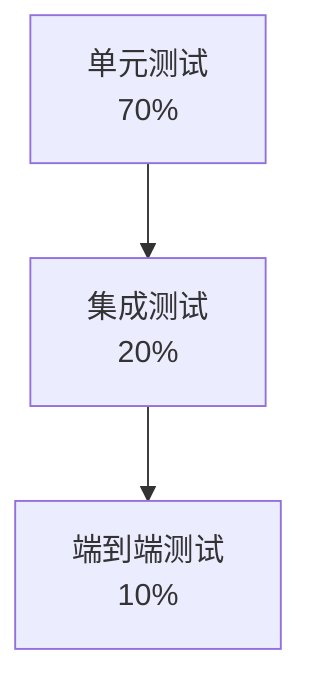
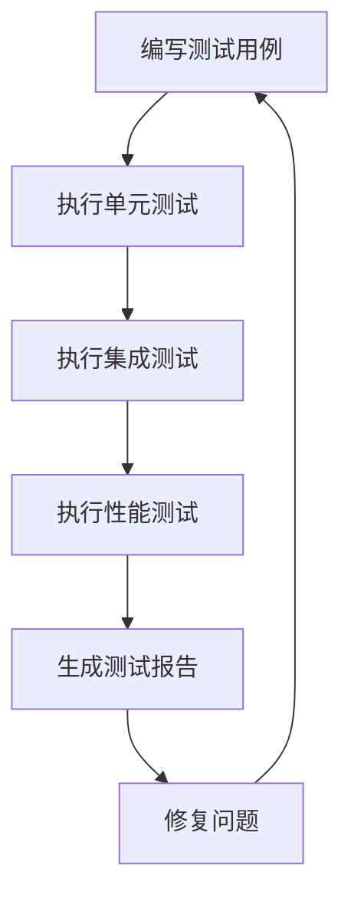
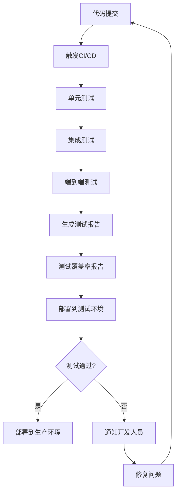
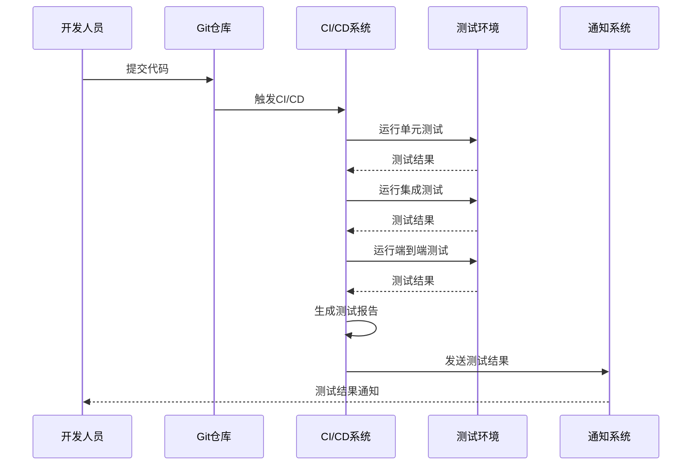

# 测试文档

## 📋 文档信息

- **项目名称**：企业级AI综合管理平台
- **文档版本**：v1.0
- **创建日期**：2026-01-13
- **最后更新**：2026-01-16
- **文档类型**：测试文档
- **当前状态**：后端业务功能开发完成（100%），准备开始测试和前端开发

---

## 1. 测试策略

### 1.1 测试金字塔



### 1.2 测试类型

| 测试类型 | 覆盖率 | 负责人 | 工具 |
|---------|--------|--------|------|
| **单元测试** | >80% | 开发人员 | pytest |
| **集成测试** | >60% | 测试人员 | pytest |
| **性能测试** | - | 测试人员 | JMeter |
| **安全测试** | - | 安全专家 | OWASP ZAP |

---

## 2. 单元测试规范

### 2.1 Python单元测试

```python
# tests/test_user_service.py
import pytest
from app.services.user_service import UserService
from app.models.user import User

def test_create_user():
    """测试创建用户"""
    user_service = UserService()
    user_data = {
        "username": "test_user",
        "email": "test@example.com",
        "password": "password123"
    }
    user = user_service.create_user(user_data)
    assert user.id is not None
    assert user.username == "test_user"

def test_get_user_by_id():
    """测试根据ID获取用户"""
    user_service = UserService()
    user = user_service.get_user_by_id("1")
    assert user is not None
    assert user.id == "1"

def test_update_user():
    """测试更新用户"""
    user_service = UserService()
    update_data = {"email": "newemail@example.com"}
    user = user_service.update_user("1", update_data)
    assert user.email == "newemail@example.com"

def test_delete_user():
    """测试删除用户"""
    user_service = UserService()
    result = user_service.delete_user("1")
    assert result is True
```

### 2.2 TypeScript单元测试

```typescript
// tests/userStore.spec.ts
import { setActivePinia, createPinia } from 'pinia'
import { describe, it, expect, beforeEach } from 'vitest'
import { useUserStore } from '@/stores/user'

describe('User Store', () => {
  beforeEach(() => {
    setActivePinia(createPinia())
  })

  it('should set user info', () => {
    const userStore = useUserStore()
    userStore.setUserInfo({
      id: '1',
      username: 'admin',
      email: 'admin@example.com'
    })
    expect(userStore.userInfo).toBeDefined()
    expect(userStore.userInfo?.username).toBe('admin')
  })

  it('should clear user info', () => {
    const userStore = useUserStore()
    userStore.clearUserInfo()
    expect(userStore.userInfo).toBeNull()
  })
})
```

---

## 3. 集成测试规范

### 3.1 API集成测试

```python
# tests/test_api/test_user_api.py
import pytest
from httpx import AsyncClient
from main import app

@pytest.mark.asyncio
async def test_create_user_api():
    """测试创建用户API"""
    async with AsyncClient(app=app, base_url="http://test") as ac:
        response = await ac.post(
            "/api/v1/users",
            json={
                "username": "test_user",
                "email": "test@example.com",
                "password": "password123"
            }
        )
        assert response.status_code == 201
        data = response.json()
        assert data["success"] is True
        assert data["data"]["username"] == "test_user"

@pytest.mark.asyncio
async def test_get_user_list_api():
    """测试获取用户列表API"""
    async with AsyncClient(app=app, base_url="http://test") as ac:
        response = await ac.get("/api/v1/users?page=1&size=10")
        assert response.status_code == 200
        data = response.json()
        assert data["success"] is True
        assert "items" in data["data"]
        assert "total" in data["data"]
```

---

## 4. 性能测试规范

### 4.1 性能测试指标

| 指标 | 目标值 | 测试工具 |
|-----|--------|---------|
| **响应时间** | < 200ms (95%) | JMeter |
| **吞吐量** | > 1000 TPS | JMeter |
| **并发用户** | > 1000 | JMeter |
| **可用性** | > 99.9% | JMeter |

### 4.2 JMeter测试计划

```xml
<?xml version="1.0" encoding="UTF-8"?>
<jmeterTestPlan version="1.2" properties="5.0">
  <hashTree>
    <TestPlan guiclass="TestPlan" testclass="TestPlan" testname="性能测试计划">
      <elementProp name="TestPlan.comments" elementType="string"/>
      <stringProp name="TestPlan.user_define_classpath"/>
      <boolProp name="TestPlan.functional_mode" value="false"/>
      <boolProp name="TestPlan.serialize_threadgroups" value="false"/>
      <elementProp name="TestPlan.user_defined_variables" elementType="Arguments">
        <collectionProp name="Arguments.arguments">
          <elementProp name="BASE_URL" elementType="Argument">
            <stringProp name="Argument.value">http://localhost:8000</stringProp>
          </elementProp>
        </collectionProp>
      </elementProp>
      <ThreadGroup guiclass="ThreadGroup" testclass="ThreadGroup" testname="用户查询接口">
        <stringProp name="ThreadGroup.num_threads">100</stringProp>
        <stringProp name="ThreadGroup.ramp_time">10</stringProp>
        <stringProp name="ThreadGroup.duration">60</stringProp>
        <boolProp name="ThreadGroup.scheduler">true</boolProp>
        <elementProp name="ThreadGroup.main_controller" elementType="ThreadGroup"/>
        <LoopController guiclass="LoopController" testclass="LoopController" testname="循环控制器"/>
        <HTTPSamplerProxy guiclass="HTTPSamplerProxy" testclass="HTTPSamplerProxy" testname="HTTP请求">
          <stringProp name="HTTPSampler.domain">localhost</stringProp>
          <stringProp name="HTTPSampler.port">8000</stringProp>
          <stringProp name="HTTPSampler.path">/api/v1/users</stringProp>
          <stringProp name="HTTPSampler.method">GET</stringProp>
        </HTTPSamplerProxy>
      </ThreadGroup>
    </TestPlan>
  </hashTree>
</jmeterTestPlan>
```

---

## 5. 测试流程图



---

## 6. 自动化测试流程

### 6.1 自动化测试架构



### 6.2 CI/CD集成

#### 6.2.1 GitHub Actions配置

**工作流文件（.github/workflows/test.yml）**：
```yaml
name: 自动化测试

on:
  push:
    branches: [ main, develop ]
  pull_request:
    branches: [ main, develop ]
  schedule:
    # 每天凌晨2点执行定时测试
    - cron: '0 2 * * *'

jobs:
  test:
    runs-on: ubuntu-latest
    
    strategy:
      matrix:
        python-version: [3.11, 3.12, 3.13]
        node-version: [18, 20]
    
    services:
      mysql:
        image: mysql:8.0
        env:
          MYSQL_ROOT_PASSWORD: 12345678
          MYSQL_DATABASE: mcp_platform_test
        ports:
          - 3306:3306
        options: >-
          --health-cmd="mysqladmin ping"
          --health-interval=10s
          --health-timeout=5s
          --health-retries=3
      
      redis:
        image: redis:7.0
        ports:
          - 6379:6379
        options: >-
          --health-cmd="redis-cli ping"
          --health-interval=10s
          --health-timeout=5s
          --health-retries=3
    
    steps:
    - name: 检出代码
      uses: actions/checkout@v3
    
    - name: 设置Python环境
      uses: actions/setup-python@v4
      with:
        python-version: ${{ matrix.python-version }}
    
    - name: 设置Node.js环境
      uses: actions/setup-node@v3
      with:
        node-version: ${{ matrix.node-version }}
    
    - name: 安装Python依赖
      run: |
        python -m pip install --upgrade pip
        pip install -r requirements.txt
        pip install pytest pytest-cov pytest-asyncio pytest-mock
    
    - name: 安装Node.js依赖
      run: |
        npm install
        npm install -g vitest @vitest/coverage-v8
    
    - name: 运行Python单元测试
      run: |
        pytest tests/unit/ --cov=app --cov-report=xml --cov-report=html --cov-report=term
    
    - name: 运行Python集成测试
      run: |
        pytest tests/integration/ --cov=app --cov-append --cov-report=xml --cov-report=html
    
    - name: 运行前端单元测试
      run: |
        npm run test:unit
    
    - name: 运行前端集成测试
      run: |
        npm run test:integration
    
    - name: 生成测试覆盖率报告
      run: |
        coverage report
        coverage html
    
    - name: 上传测试覆盖率报告
      uses: codecov/codecov-action@v3
      with:
        files: ./coverage.xml,./coverage/lcov.info
        flags: unittests
        name: codecov-umbrella
    
    - name: 上传测试报告
      uses: actions/upload-artifact@v3
      if: always()
      with:
        name: test-reports
        path: |
          htmlcov/
          coverage/
          test-results/
    
    - name: 发送测试结果通知
      if: failure()
      uses: 8398a7/action-slack@v3
      with:
        status: ${{ job.status }}
        text: '测试失败，请检查测试报告'
        webhook_url: ${{ secrets.SLACK_WEBHOOK }}
```

#### 6.2.2 测试报告生成

**Pytest配置（pytest.ini）**：
```ini
[pytest]
testpaths = tests
python_files = test_*.py
python_classes = Test*
python_functions = test_*
addopts = 
    --verbose
    --strict-markers
    --tb=short
    --cov=app
    --cov-report=html
    --cov-report=xml
    --cov-report=term-missing
    --cov-fail-under=80

markers =
    unit: 单元测试
    integration: 集成测试
    e2e: 端到端测试
    slow: 慢速测试
    api: API测试
    db: 数据库测试
```

**Vitest配置（vitest.config.ts）**：
```typescript
import { defineConfig } from 'vitest/config'

export default defineConfig({
  test: {
    globals: true,
    environment: 'jsdom',
    coverage: {
      provider: 'v8',
      reporter: ['text', 'json', 'html', 'lcov'],
      include: ['src/**/*.{ts,tsx,vue}'],
      exclude: [
        'node_modules/',
        'src/main.ts',
        'src/**/*.d.ts',
        'src/**/*.spec.ts',
        'src/**/*.test.ts',
      ],
      statements: 80,
      branches: 80,
      functions: 80,
      lines: 80,
    },
  },
})
```

### 6.3 自动化测试流程

#### 6.3.1 代码提交触发

**触发条件**：
- 推送到main或develop分支
- 创建或更新Pull Request
- 推送标签

**执行流程**：


**测试脚本（run_tests.sh）**：
```bash
#!/bin/bash

# 自动化测试脚本

echo "开始执行自动化测试..."

# 1. 单元测试
echo "执行单元测试..."
pytest tests/unit/ -v --cov=app --cov-report=html --cov-report=xml
if [ $? -ne 0 ]; then
    echo "单元测试失败"
    exit 1
fi

# 2. 集成测试
echo "执行集成测试..."
pytest tests/integration/ -v --cov=app --cov-append --cov-report=html --cov-report=xml
if [ $? -ne 0 ]; then
    echo "集成测试失败"
    exit 1
fi

# 3. 端到端测试
echo "执行端到端测试..."
pytest tests/e2e/ -v --cov=app --cov-append --cov-report=html --cov-report=xml
if [ $? -ne 0 ]; then
    echo "端到端测试失败"
    exit 1
fi

# 4. 测试覆盖率
echo "生成测试覆盖率报告..."
coverage report --fail-under=80
if [ $? -ne 0 ]; then
    echo "测试覆盖率不足80%"
    exit 1
fi

echo "所有测试通过！"
exit 0
```

#### 6.3.2 定时触发

**定时任务配置**：
```yaml
# .github/workflows/scheduled-test.yml
name: 定时测试

on:
  schedule:
    # 每天凌晨2点执行
    - cron: '0 2 * * *'
  workflow_dispatch:  # 允许手动触发

jobs:
  scheduled-test:
    runs-on: ubuntu-latest
    steps:
    - name: 检出代码
      uses: actions/checkout@v3
    
    - name: 设置Python环境
      uses: actions/setup-python@v4
      with:
        python-version: '3.13'
    
    - name: 安装依赖
      run: |
        pip install -r requirements.txt
    
    - name: 运行完整测试套件
      run: |
        pytest tests/ -v --cov=app --cov-report=html --cov-report=xml
    
    - name: 上传测试报告
      uses: actions/upload-artifact@v3
      with:
        name: scheduled-test-reports
        path: htmlcov/
```

#### 6.3.3 手动触发

**手动触发配置**：
```yaml
# .github/workflows/manual-test.yml
name: 手动测试

on:
  workflow_dispatch:
    inputs:
      test_type:
        description: '测试类型'
        required: true
        type: choice
        options:
          - unit
          - integration
          - e2e
          - all
      environment:
        description: '测试环境'
        required: true
        type: choice
        options:
          - dev
          - staging
          - prod

jobs:
  manual-test:
    runs-on: ubuntu-latest
    steps:
    - name: 检出代码
      uses: actions/checkout@v3
    
    - name: 设置Python环境
      uses: actions/setup-python@v4
      with:
        python-version: '3.13'
    
    - name: 安装依赖
      run: |
        pip install -r requirements.txt
    
    - name: 运行测试
      run: |
        if [ "${{ github.event.inputs.test_type }}" = "unit" ]; then
          pytest tests/unit/ -v
        elif [ "${{ github.event.inputs.test_type }}" = "integration" ]; then
          pytest tests/integration/ -v
        elif [ "${{ github.event.inputs.test_type }}" = "e2e" ]; then
          pytest tests/e2e/ -v
        else
          pytest tests/ -v
        fi
```

### 6.4 测试报告

#### 6.4.1 测试结果报告

**HTML测试报告（pytest-html）**：
```python
# conftest.py
import pytest
from pytest_html import extras

@pytest.fixture(scope="session", autouse=True)
def setup_html_report(request):
    """设置HTML测试报告"""
    request.config._metadata['Project Name'] = '企业级AI综合管理平台'
    request.config._metadata['Tester'] = 'AI助手'
    request.config._metadata['Test Environment'] = 'Staging'
```

**配置pytest-html**：
```ini
[pytest]
addopts = 
    --html=test-report.html
    --self-contained-html
```

#### 6.4.2 测试覆盖率报告

**覆盖率报告示例**：
```python
# 生成覆盖率报告
coverage report --omit='*/tests/*,*/venv/*'

# 详细覆盖率报告
coverage report -m --omit='*/tests/*,*/venv/*'

# HTML覆盖率报告
coverage html --omit='*/tests/*,*/venv/*'
```

**覆盖率报告内容**：
```
Name                              Stmts   Miss  Cover   Missing
-----------------------------------------------------------------------
app/__init__.py                       0      0   100%
app/main.py                          45      5    89%   23-27
app/models/user.py                   32      3    91%   45-47
app/services/user_service.py         78     12    85%   123-130, 145-150
app/api/user_api.py                  56      8    86%   67-70, 89-92
-----------------------------------------------------------------------
TOTAL                              211     28    87%
```

#### 6.4.3 测试趋势分析

**测试趋势报告（Allure）**：
```python
# conftest.py
import allure

@pytest.hookimpl(tryfirst=True, hookwrapper=True)
def pytest_runtest_makereport(item, call):
    """生成Allure测试报告"""
    outcome = yield
    report = outcome.get_result()
    
    if report.when == 'call':
        # 添加测试步骤
        with allure.step('执行测试'):
            allure.attach(
                str(report.outcome),
                name='测试结果',
                attachment_type=allure.attachment_type.TEXT
            )
```

**配置Allure**：
```yaml
# .github/workflows/test.yml
- name: 生成Allure报告
  run: |
    pytest tests/ --alluredir=allure-results
  
- name: 上传Allure报告
  uses: actions/upload-artifact@v3
  with:
    name: allure-report
    path: allure-results/

- name: 发布Allure报告
  uses: simple-elf/allure-report-action@master
  with:
    github_token: ${{ secrets.GITHUB_TOKEN }}
    allure_history: allure-history
    allure_results: allure-results
```

### 6.5 自动化测试最佳实践

**测试编写最佳实践**：
- ✅ 测试用例独立，不依赖执行顺序
- ✅ 测试数据独立，使用测试数据库
- ✅ 测试清理，测试完成后清理数据
- ✅ 测试命名清晰，描述测试目的
- ✅ 测试覆盖全面，覆盖正常和异常情况

**CI/CD最佳实践**：
- ✅ 快速反馈，测试失败立即通知
- ✅ 并行执行，提高测试效率
- ✅ 缓存依赖，减少构建时间
- ✅ 测试报告，详细记录测试结果
- ✅ 测试覆盖率，确保代码质量

**测试维护最佳实践**：
- ✅ 定期更新测试用例
- ✅ 删除过时的测试用例
- ✅ 优化慢速测试
- ✅ 监控测试趋势
- ✅ 持续改进测试流程

---

## 8. 测试覆盖率要求

| 模块 | 覆盖率要求 |
|-----|-----------|
| **用户模块** | >85% |
| **权限模块** | >85% |
| **MCP工具模块** | >85% |
| **多数据源模块** | >80% |
| **整体** | >80% |

---

## 🔗 相关文档

- [开发规范文档](./6-开发规范文档.md)
- [部署文档](./8-部署文档.md)
- [API接口设计文档](./4-API接口设计文档.md)

---

## 💡 注意事项

1. **测试独立**：测试环境与开发环境隔离
2. **测试数据**：使用测试数据，避免影响生产数据
3. **测试清理**：测试完成后清理测试数据
4. **测试文档**：及时更新测试文档
5. **自动化测试**：集成到CI/CD流程

---

**文档版本历史**：

| 版本 | 日期 | 作者 | 变更说明 |
|-----|------|------|---------|
| v1.0 | 2026-01-13 | AI助手 | 初始版本 |

---