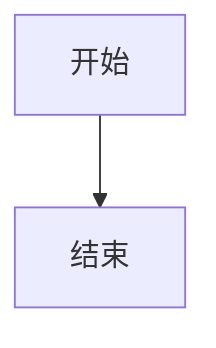

# 项目全流程文档生成提示词

## 📋 项目背景

**项目名称**：企业级AI综合管理平台
**项目目标**：构建一个安全、灵活、可扩展的综合管理平台，整合MCP（Model Context Protocol）工具调用网关及多MCP工具管理能力，实现细粒度权限控制、多租户隔离、动态配置管理，并提供完整的RBAC权限管理体系。

**技术栈**：
- 后端：FastAPI + SQLAlchemy 2.0 + PyJWT
- 前端：Vue 3 + TypeScript + Vite + Pinia + Element Plus
- 数据库：MySQL（主）+ PostgreSQL（可选）+ Oracle（可选）
- 缓存：Redis（可选，默认本地缓存）
- 配置中心：Nacos（可选，默认本地配置）
- 消息队列：RabbitMQ（可选，默认同步执行）
- API网关：APISIX（可选）
- 限流熔断：Sentinel（可选）
- 分布式追踪：Jaeger（可选）
- 监控：Prometheus + Grafana（可选）
- 容器化：Docker
- CI/CD：GitHub Actions

---

## 🎯 任务目标

生成12个项目全流程文档，每个文档需要包含相应的图表（架构图、流程图、ER图等，使用Mermaid语法）。

---

## 📝 文档清单（按顺序生成）

### 1. 1-项目启动文档.md
**内容要求**：
- 项目背景与目标
- 需求分析（功能需求、非功能需求）
- 项目范围与边界
- 团队规划（角色分工、时间规划）
- 风险评估
- 里程碑规划
- **图表**：项目甘特图、项目组织架构图

---

### 2. 2-技术架构设计文档.md
**内容要求**：
- 系统架构设计
- 微服务架构划分
- 技术栈选型说明
- 模块划分与职责
- 数据流向设计
- 部署架构设计
- **图表**：系统架构图、微服务架构图、数据流向图、部署架构图

---

### 3. 3-数据库设计文档.md
**内容要求**：
- 数据库选型说明
- ER图设计
- 表结构设计（包含字段说明、索引、约束）
- 多数据源设计
- 数据库迁移策略
- 性能优化建议
- **图表**：ER图、表关系图

---

### 4. 4-API接口设计文档.md
**内容要求**：
- API设计规范
- 接口命名规范
- 请求/响应格式规范
- 错误码规范
- 分页规范
- 接口列表（按模块分类）
- 接口认证方式
- **图表**：API接口分类图、请求流程图

---

### 5. 5-前端架构设计文档.md
**内容要求**：
- Vue技术栈说明
- 前端架构设计
- 组件设计规范
- 状态管理（Pinia）
- 路由设计（Vue Router）
- UI组件库选型（Element Plus）
- 前后端交互规范
- 性能优化策略
- **图表**：前端架构图、组件层次图、状态管理图

---

### 6. 6-开发规范文档.md
**内容要求**：
- 代码规范（Python、TypeScript）
- 命名规范（变量、函数、类、文件）
- 注释规范
- Git提交规范
- 分支管理策略
- 代码审查规范
- 文档编写规范

---

### 7. 7-环境配置文档.md
**内容要求**：
- 开发环境配置
- 测试环境配置
- 生产环境配置
- 环境变量配置说明
- 配置文件说明
- 外部服务配置（MySQL、Redis、Nacos、RabbitMQ等）
- 配置降级方案说明

---

### 8. 8-部署文档.md
**内容要求**：
- Docker部署方案
- Kubernetes部署方案（可选）
- 部署流程说明
- 部署脚本示例
- 回滚策略
- 健康检查配置
- 日志收集配置
- **图表**：部署流程图、容器编排图

---

### 9. 9-测试文档.md
**内容要求**：
- 测试策略
- 单元测试规范
- 集成测试规范
- 性能测试规范
- 测试用例设计
- 测试覆盖率要求
- 测试报告模板
- **图表**：测试流程图、测试金字塔图

---

### 10. 10-运维文档.md
**内容要求**：
- 系统监控方案
- 日志管理方案
- 告警配置
- 故障处理流程
- 备份恢复策略
- 性能调优指南
- 日常巡检清单
- **图表**：监控架构图、故障处理流程图

---

### 11. 11-安全文档.md
**内容要求**：
- 安全架构设计
- 认证授权机制
- 数据加密方案
- SQL注入防护
- XSS防护
- CSRF防护
- API安全规范
- 安全审计日志
- **图表**：安全架构图、认证流程图

---

### 12. 12-性能优化文档.md
**内容要求**：
- 性能优化策略
- 数据库优化方案
- 缓存优化方案
- 接口优化方案
- 前端性能优化
- 性能测试方案
- 性能监控指标
- 性能优化案例
- **图表**：性能优化流程图、性能指标图

---

## 🔧 外部服务配置说明

### 核心必须服务（必须部署）
1. **MySQL** - 主数据库
2. **Git** - 版本控制
3. **Docker** - 容器化

### 核心可选服务（有降级方案）
1. **Nacos** - 配置中心（降级：使用本地`.env`配置文件）
2. **RabbitMQ** - 消息队列（降级：同步执行）
3. **APISIX** - API网关（降级：直连后端服务）
4. **Sentinel** - 限流熔断（降级：无限流保护）
5. **Jaeger** - 分布式追踪（降级：使用本地日志）
6. **Prometheus** - 监控（降级：无监控数据）
7. **Grafana** - 可视化（降级：无可视化）
8. **Redis** - 缓存（降级：本地内存缓存）
9. **GitHub Actions** - CI/CD（降级：手动部署）

### 完全可选服务（不影响核心功能）
1. **PostgreSQL** - 多数据源支持
2. **Oracle** - 多数据源支持
3. **SQLite** - 开发环境备用
4. **Kubernetes** - 生产环境容器编排

---

## 📊 核心功能模块

### P0（必须实现）
1. 认证授权（JWT + API Key）
2. 用户管理
3. 基础权限（RBAC）
4. MCP工具注册与调用
5. 多租户隔离
6. 多数据源管理

### P1（重要）
1. 部门管理
2. 角色管理
3. 菜单管理
4. 数据范围权限
5. 日志审计
6. 权限缓存

### P2（可选）
1. 岗位管理
2. 字典管理
3. 错误码管理
4. 敏感词管理
5. 地区管理
6. 站内信
7. 通知公告

### P3（后期迭代）
1. 工作流待办
2. 文件管理
3. Nacos配置中心
4. 监控告警

---

## 🎨 图表要求

所有文档必须包含相应的图表，使用Mermaid语法：

### 常用图表类型
1. **流程图**（flowchart）：展示业务流程、部署流程
2. **序列图**（sequenceDiagram）：展示交互流程
3. **类图**（classDiagram）：展示类结构、数据模型
4. **组件图**（componentDiagram）：展示系统组件
5. **部署图**（deploymentDiagram）：展示部署架构
6. **状态图**（stateDiagram）：展示状态流转
7. **ER图**（erDiagram）：展示数据库关系
8. **甘特图**（gantt）：展示时间规划

---

## 📝 文档格式要求

### Markdown格式
- 使用标准Markdown语法
- 使用Mermaid语法绘制图表
- 使用代码块展示代码示例
- 使用表格展示配置信息
- 使用引用块注意事项

### 文档结构
```markdown
# 文档标题

## 📋 说明
- 文档说明

## 1. 章节1
### 1.1 子章节
- 内容

## 2. 章节2
### 2.1 子章节
- 内容

## 📊 图表


## 🔗 相关文档
- [相关文档](./xxx.md)

## 💡 注意事项
- 注意事项
```

---

## 🎯 执行步骤

1. 确认技术栈和功能模块
2. 确认外部服务配置
3. 按顺序生成12个文档
4. 每个文档包含相应图表
5. 确保文档格式统一
6. 确保文档内容完整

---

## ⚠️ 注意事项

1. **图表必须使用Mermaid语法**
2. **文档必须包含相关链接**
3. **文档必须包含注意事项**
4. **文档必须包含代码示例**
5. **文档必须包含配置说明**
6. **文档必须包含最佳实践**

---

## 📚 参考文档

- [0-外部软件服务需求清单.md](./0-外部软件服务需求清单.md)
- [技术栈确定清单.md](./技术栈确定清单.md)
- [优化方案-企业级AI综合管理平台.md](./优化方案-企业级AI综合管理平台.md)
- [企业级AI综合管理平台 - 系统设计与实现提示词.md](./企业级AI综合管理平台 - 系统设计与实现提示词.md)

---

## ✅ 完成标准

1. 12个文档全部生成
2. 每个文档包含相应图表
3. 文档格式统一规范
4. 文档内容完整准确
5. 文档之间相互关联
6. 文档包含最佳实践

---

**请按照以上要求生成12个项目全流程文档。**